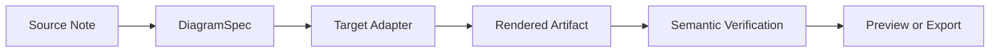
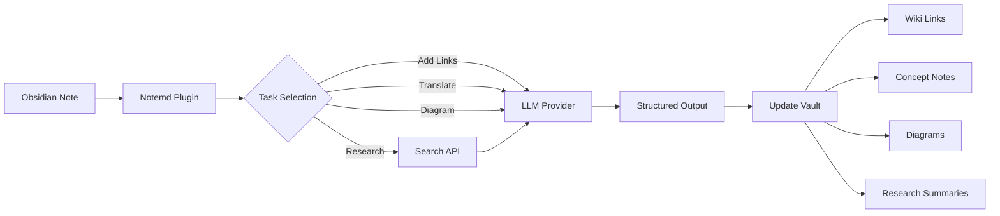

import TLDR from '@site/src/components/TLDR';

# مقدمه‌ای بر Notemd

<TLDR>
**Notemd** (Note + EMD — Enhanced Markdown Documents) یک پلاگین متن‌باز برای Obsidian است که خواندن با استفاده از LLM را به دانش پایدار تبدیل می‌کند. برخلاف هوش مصنوعی مبتنی بر چت که بینش‌ها پس از جلسه از بین می‌روند، Notemd نتایج را **مستقیماً در خزانه شما** به صورت لینک‌های ویکی، یادداشت‌های مفهومی، خلاصه‌های تحقیقاتی، ترجمه‌ها، فرآیندهای کاری و نمودارها ثبت می‌کند. این ابزار برای پژوهشگران، دانشجویان و کارکنان دانش که می‌خواهند خواندن، تحقیق و توضیحات بصری آن‌ها در یک گراف دانش ساختاریافته و در حال توسعه جمع‌آوری شود، ساخته شده است.
</TLDR>

## Notemd چیست؟

Notemd **۳۰ مدل زبان بزرگ و بیشتر** (OpenAI, Anthropic, Google, DeepSeek, Qwen, Ollama و غیره) را در فرآیند کاری Obsidian شما یکپارچه می‌کند تا استخراج دانش، سازماندهی، ترجمه، تحقیق و تولید نمودارها را خودکار کند.

### تفاوت کلیدی: دانش گذرا در مقابل دانش پایدار

| جنبه | هوش مصنوعی مبتنی بر چت (ChatGPT و غیره) | Notemd |
|--------|-------------------------------|--------|
| **محل نگهداری نتایج** | تاریخچه چت (از بین می‌رود) | خزانه Obsidian شما (پایدار می‌ماند) |
| **فرمت** | پاسخ‌های متن ساده | فایل‌های ساختاریافته: `[[wiki-links]]`، یادداشت‌های مفهومی، نمودارها |
| **ارزش بلندمدت** | باید هر بار دوباره سؤال کرد | در یک گراف دانش جمع‌آوری می‌شود |
| **دسترسی آفلاین** | نیاز به اینترنت دارد | با Ollama به‌طور کامل در حالت آفلاین کار می‌کند |

## قابلیت‌های اصلی

### ۱. **پیونددهی خودکار ویکی**
- LLM مفاهیم کلیدی در یادداشت‌های شما را شناسایی می‌کند
- در هر بار ظهور، `[[wiki-links]]` را اضافه می‌کند
- به‌صورت اختیاری یادداشت‌های مفهومی پیونددار ایجاد می‌کند
- سرکوب مترادفات برای جلوگیری از تکرار

### ۲. **تولید یادداشت مفهومی**
- مفاهیم اصلی را از مقالات، مطالب و یادداشت‌ها استخراج می‌کند
- فایل‌های مفهومی مخصوص با پیوندهای بازگشتی تولید می‌کند
- مسیرهای خروجی و الگوهای قابل سفارش‌سازی

### ۳. **یکپارچه‌سازی تحقیقات وب**
- از درون Obsidian، Tavily یا DuckDuckGo را جستجو کنید
- LLM نتایج را همراه با منابع مرجع خلاصه می‌کند
- یافته‌های تحقیقاتی را به یادداشت فعلی اضافه می‌کند

### ۴. **ترجمه چندزبانه**
- ترجمه بخش‌های انتخاب‌شده یا کل یادداشت‌ها
- پشتیبانی از بیش از ۲۱ زبان UI
- پیکربندی مستقل زبان خروجی
- پشتیبانی از ترجمه دسته‌ای

### ۵. **تولید نمودار**
- **Mermaid**: نمودارهای جریان، توالی، کلاس، حالت، ER، Gantt
- **JSON Canvas**: چیدمان‌های بومی Obsidian
- **Vega-Lite**: نمودارهای داده، سری زمانی، نمودارهای پراکندگی
- **HTML / HTML قابل ویرایش/SVG**: اشیاء نموداری مستقل با توضیحات معنایی
- **Draw.io / مرزهای اشیاء Drawnix**: مسیرهای صادراتی مخصوص نگهدارندگان از همان مدل نمودار معنایی
- **رودرروی نمودارهای مداری**: پشتیبانی circuitikz/TikZJax بر اساس منابع طلایی، دستورات محدود، بازخورد رندر و تأیید توپولوژی/چیدمان طراحی می‌شود، نه بر اساس TikZ خام و بدون محدودیت LLM
- **تشخیص پیش‌نمایش**: اشیاء رندر شده می‌توانند تشخیصات مربوط به کامپایل/رندر را نشان دهند و منابع غیر‑درون‌خطی را می‌توان بدون نیاز به محیط LaTeX در سمت پلاگین بررسی کرد
- تصحیح خودکار سینتکس برای خطاهای Mermaid

### ۶. **فرآیندهای کار یک‌کلیکی**
- چندین عملیات را در دکمه‌های نوار کناری به هم متصل کنید
- تعریف فرآیندهای کاری بر پایه DSL
- مثال: `add-links > extract-concepts > research > diagram`

## چه کسانی باید از Notemd استفاده کنند؟

✅ **پژوهشگران**ی که مقالات را می‌خوانند و مرورهای ادبی تهیه می‌کنند
✅ **دانشجویان**ی که یادداشت‌های درسی خود را سازماندهی می‌کنند و نقشه‌های مفهومی ایجاد می‌کنند
✅ **کارکنان دانشی** که می‌خواهند بینش‌های ناشی از مطالعه را ذخیره کنند
✅ **متخصصان دوزبانه**یی که به ترجمه و پیونددهی به ویکی نیاز دارند
✅ **کاربران محافظه‌کار از نظر حریم خصوصی** که به پشتیبانی محلی LLM (Ollama) نیاز دارند
✅ **کاربران پیشرفته**یی که پرامپت‌ها و فرآیندهای کاری خود را سفارشی می‌کنند

## چرا Notemd + Obsidian؟

**Obsidian** یک پایگاه دانش مبتنی بر مارکداون و با تمرکز بر حالت محلی است. **Notemd** قدرت‌های فوق‌العاده هوش مصنوعی را اضافه می‌کند:
- داده‌های شما در صندوق امانات خودتان باقی می‌ماند (نه در یک سرویس ابری)
- با مدل‌های محلی به صورت آفلاین کار می‌کند
- رایگان و متن‌باز (مجوز MIT)
- با پلاگین‌های موجود Obsidian یکپارچه می‌شود
- توانایی مقیاس‌پذیری تا ده‌ها هزار یادداشت

## شروع کار

1. **نصب**: تنظیمات → پلاگین‌های جامعه → جستجو → "Notemd"
2. **پیکربندی**: افزودن کلید API ارائه‌دهنده LLM خود (یا استفاده از Ollama محلی)
3. **آزمایش**: باز کردن یک یادداشت → کلیک راست → "پردازش فایل (افزودن لینک‌ها)"
4. **اکتشاف**: بررسی نوار کناری برای فرآیندهای یک‌کلیکی

👉 [راهنمای نصب](./getting-started/installation) | [آموزش سریع شروع کار](./getting-started/quick-start)

## جهت‌گیری توانایی نمودارها

کار نمودارسازی Notemd در حال دور شدن از روش "خواستن نوشتن یک رشته سینتکس از مدل" به سمت یک خط لوله لایه‌ای است:

پیاده‌سازی فعلی از Mermaid، JSON Canvas، Vega-Lite، پشتیبانی HTML، HTML/SVG قابل ویرایش، آرتیفکت‌های Draw.io XML، مجموعه کوچک Drawnix JSON، پشتیبانی تشخیص پیش‌نمایش/فقط منبع، و یک نمونه آفلاین `CircuitSpec -> circuitikz` برای الگوهای طلایی منبع مشترک و اینورتر CMOS پشتیبانی می‌کند. نمودارهای مداری دسته سخت‌تری هستند: circuitikz می‌تواند توپولوژی الکتریکی دقیقی را نشان دهد، اما خروجی بدون محدودیت LLM اغلب منجر به مسیریابی غیرخوانا یا LaTeXی که قابل نمایش نیست می‌شود. جهت بعدی، حفظ محدودیت circuitikz با الگوهای مرجع طلایی، قوانین چیدمان شبکه گره‌ها، تشخیص نمایش و چرخه‌های بازخورد تصویر است.

جزئیات را در [نمودارها](./features/diagrams) بخوانید.

## معماری

## Notemd در مقایسه با سایر پلاگین‌های هوش مصنوعی Obsidian

اکثر پلاگین‌های هوش مصنوعی Obsidian بر گفت‌وگو تمرکز دارند (شما می‌پرسید، هوش مصنوعی پاسخ می‌دهد و بینش‌ها در چت باقی می‌مانند). Notemd **ابتدا نوشتن** است: هوش مصنوعی یادداشت‌های شما را پردازش کرده و نتایج ساختاریافته را مستقیماً در صندوق امانات شما می‌نویسد.

| توانایی‌ها | Notemd | Copilot | Smart Connections | Text Generator |
|-----------|--------|---------|-------------------|-----------------|
| وارد کردن خودکار لینک ویکی | بله | خیر | خیر | خیر |
| تولید یادداشت مفهومی | بله (همراه با لینک‌های بازگشتی + حذف تکرار) | خیر | خیر | خیر |
| تولید نمودار | بله (Mermaid, Canvas, Vega-Lite, HTML, آثار قابل ویرایش) | خیر | خیر | خیر |
| یکپارچه‌سازی تحقیقات وب | بله (Tavily + DuckDuckGo) | خیر | خیر | خیر |
| پردازش پوشه‌های دسته‌ای | بله | محدود | خیر | محدود |
| مسیریابی مدل بر اساس هر وظیفه | بله (۷ وظیفه، مدل‌های مستقل) | خیر | خیر | خیر |
| زنجیره‌های کاربرد یک‌کلیکی | بله (DSL) | خیر | خیر | خیر |
| ترجمه (دسته‌ای) | بله | خیر | خیر | خیر |
| گفتگو با خزانه | خیر | بله | خیر | خیر |
| جستجوی شباهت معنایی | خیر | خیر | بله | خیر |
| تولید مبتنی بر الگوها | خیر | خیر | خیر | بله |
| ارائه‌دهندگان LLM | ۳۶ (ابر + گیت‌وی + محلی) | 3-5 | 2-3 | 3-5 |
| کاملاً آفلاین | بله (Ollama) | جزئی | جزئی | جزئی |

**چه زمانی باید از Notemd استفاده کنید**: شما می‌خواهید هوش مصنوعی یک گراف دانش پایدار ایجاد کند — نه فقط درباره یادداشت‌هایتان گفتگو کند.

**چه زمانی باید از Copilot استفاده کنید**: اگر می‌خواهید یک دستیار هوش مصنوعی گفت‌وگومحور درون Obsidian داشته باشید.

**چه زمانی باید از Smart Connections استفاده کنید**: اگر می‌خواهید روابط موجود بین یادداشت‌ها را از طریق جستجوی معنایی کشف کنید.

## فلسفه

**Notemd** معتقد است که هوش مصنوعی باید به کارهای دانشی انسان‌ها کمک کند، نه آن‌ها را جایگزین کند. این پلاگین:
- شما را تحت کنترل نگه می‌دارد (قبل از اعمال تغییرات، بررسی کنید).
- زمینه را حفظ می‌کند (تمام نتایج به منبع مرتبط هستند)
- از حریم خصوصی محافظت می‌کند (پشتیبانی محلی LLM، بدون ارسال داده‌های ردیابی)
- قابلیت گسترش‌پذیری حفظ می‌شود (منابع باز APIs، فرآیندهای کاری سفارشی)

<!-- notemd-acknowledgments -->
## قدردانی و پروژه‌های مرجع

Notemd به‌صورت مستقل نگهداری می‌شود. از پروژه‌ها و جامعه‌های متن‌بازی که بر تصمیم‌های طراحی مستند اثر گذاشته‌اند یا پایه‌های یکپارچه‌سازی را فراهم می‌کنند سپاسگزاریم. فهرست شدن فقط اثرگذاری یا قابلیت همکاری را نشان می‌دهد و به‌معنای تأیید، وابستگی، کدِ همراه یا ادعای استفادهٔ مجدد از کد نیست.

- **پروژه‌های مرجع:** [cloudy-tech-diagrams-skill](https://github.com/cloudy-liu/cloudy-tech-diagrams-skill), [Drawnix](https://github.com/plait-board/drawnix), [diagrams.net / draw.io](https://www.diagrams.net/), [repo-saga](https://github.com/teee32/repo-saga).
- **بنیادهای متن‌باز:** [Mermaid](https://github.com/mermaid-js/mermaid), [Vega-Lite](https://vega.github.io/vega-lite/), [Slidev](https://github.com/slidevjs/slidev), [CircuitikZ](https://github.com/circuitikz/circuitikz), [Tectonic](https://github.com/tectonic-typesetting/tectonic), [Docusaurus](https://docusaurus.io).
- هر پروژه مجوز و شرایط خود را حفظ می‌کند؛ Notemd تحت [مجوز MIT](https://github.com/Jacobinwwey/obsidian-NotEMD/blob/main/LICENSE) عرضه می‌شود.

## منبع باز

- **مجوز**: MIT
- **منبع**: [github.com/Jacobinwwey/obsidian-NotEMD](https://github.com/Jacobinwwey/obsidian-NotEMD)
- **جامعه**: [Discord](https://discord.gg/qnGgsQ9W) | [GitHub Discussions](https://github.com/Jacobinwwey/obsidian-NotEMD/discussions)
- **کمک کنید**: پیشنهادات کد مرحبوست، به [CONTRIBUTING.md](https://github.com/Jacobinwwey/obsidian-NotEMD/blob/main/CONTRIBUTING.md) مراجعه کنید

---

**بعدی**: [Installation →](./getting-started/installation)
