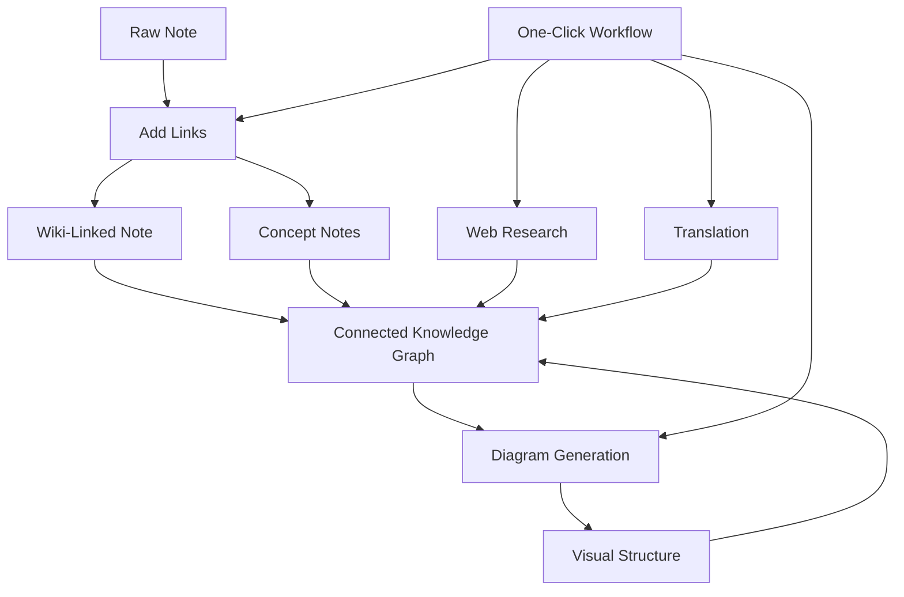

import TLDR from '@site/src/components/TLDR';

# راهنمای مدیریت دانش هوش مصنوعی Obsidian

<TLDR>
**Notemd، خواندن با استفاده از LLM را به دانش پایدار تبدیل می‌کند: لینک‌های ویکی مفاهیم را به هم متصل می‌کنند، یادداشت‌های مفهومی یک گراف قابل بازیابی ایجاد می‌کنند، تحقیقات وب را به صندوق اطلاعاتی شما می‌آورند، ترجمه موانع زبانی را از بین می‌برد، نمودارها ساختار را قابل مشاهده می‌کنند و فرآیندهای کاری همه چیز را با یک کلیک به هم متصل می‌کنند.** این راهنما کل مسیر را پوشش می‌دهد — از یادداشت‌های خام تا یک پایگاه دانش متصل، بصری و چندزبانه.
</TLDR>

## چرا مدیریت دانش با هوش مصنوعی؟

یادداشت‌برداری سنتی فایل‌های صاف تولید می‌کند. حتی با لینک‌های ویکی دستی، اکثر یادداشت‌ها از هم جدا می‌مانند. Notemd از LLMها برای خودکارسازی لایه اتصال استفاده می‌کند:

- **LLMها محتوای شما را می‌خوانند** و آنچه مهم است را شناسایی می‌کنند — اصطلاحات، روش‌ها، افراد، نظریه‌ها
- **لینک‌ها به طور خودکار** در هر بار ظهور یک مفهوم اضافه می‌شوند، نه در بخش «همچنین ببینید» پنهان می‌شوند
- **یادداشت‌های مفهومی به عنوان فایل‌های قابل بازیابی مستقل تولید می‌شوند**
- **تحقیقات یادداشت‌ها را با زمینه‌های منبع وب غنی می‌کنند**
- **نمودارها ساختار را قابل مشاهده می‌کنند** — نقشه‌های ذهنی، نمودارهای جریان، نمودارهای داده از همان محتوا

نتیجه: یک گراف دانش که با هر یادداشتی که پردازش می‌کنید رشد می‌کند، نه فقط زمانی که به یاد آورید لینک اضافه کنید.

## کل مسیر پردازش



هر مرحله مستقل است. می‌توانید یکی یا همه را استفاده کنید. ترتیب مؤثرترین: **افزودن لینک‌ها → یادداشت‌های مفهومی → نمودارها**.

---

## ۱. لینک‌های ویکی: مشخص کردن ارتباطات

لینک‌های ویکی ستون فقرات یک گراف دانش هستند. Notemd از یک LLM برای انجام کارهای زیر استفاده می‌کند:

1. محتوای یادداشت خود را بخوانید (سندهای بلند را به بخش‌های کوچکتر تقسیم کنید)
2. مفاهیم اصلی را شناسایی کنید — با تأکید بر اصطلاحات فنی خاص نسبت به اسامی عمومی
3. در هر بار ظهور، `[[wiki-links]]` را وارد کنید
4. مترادف‌ها را سرکوب کنید تا "ML" و "Machine Learning" گره‌های جداگانه‌ای ایجاد نکنند

### زمان استفاده

- **هر یادداشت بالاتر از ۱۰۰ کلمه** — یادداشت‌های کوتاه مفاهیم کمتری دارند
- **مقالات تحقیقاتی، مستندات فنی، یادداشت‌های جلسه** — سرشار از اصطلاحات ویژه حوزه هستند
- **پس از ثبات محتوا** — دست‌نوشته‌ها را مکرراً پردازش نکنید

### تنظیمات کلیدی

| تنظیمات | توصیه‌شده | دلیل |
|---------|-----------|-----|
| `addLinksProvider` | DeepSeek یا GPT-4o-mini | دقت خوب با هزینه پایین |
| سرکوب مترادف‌ها | فعال | جلوگیری از ایجاد گره‌های تکراری |
| پنجره زمینه | پاراگراف | تعادل بین دقت و هزینه |

→ [Wiki-Links deep dive](/docs/features/wiki-links)

---

## ۲. یادداشت‌های مفهومی: گره‌های دانش قابل بازیابی

پیوندهای ویکی ایده‌ها را به صورت درون‌متنی به هم متصل می‌کنند، اما یادداشت‌های مفهومی هر ایده را به صورت مستقل قابل بازیابی می‌سازند. هر مفهوم فایل `.md` مخصوص خود را دارد:

```markdown
# Machine Learning

## Linked From
- [[My Research Notes]]
- [[Neural Networks Explained]]
```

### فرآیند استخراج

پرامپت LLM ساختار بسیار منظمی دارد:
- تبدیل به شکل مفرد کردن
- ترجیح دادن مفاهیم چندکلمه‌ای به جای کلمات تکی («Dielectric Relaxation» نه «Relaxation»)
- نادیده گرفتن بخش‌های منابع/فهرست منابع
- خروجی را به صورت خطوط `CONCEPT:` برای پارسینگ قطعی ارائه دادن

مفاهیم از طریق `Set<string>` در بین بلوک‌ها حذف تکرار می‌شوند. خطاهای LLM در بلوک‌های جداگانه عملیات را متوقف نمی‌کنند.

### پیوندهای باز

هنگام فعال بودن، هر یادداشت مفهومی ثبت می‌کند که کدام یادداشت‌های منبع به آن اشاره دارند. پنل پیوندهای باز ذاتی Obsidian نیز ارتباطات معکوس را نشان می‌دهد.

### حذف تکرارها

موتور حذف تکرار ۴ مرحله‌ای Notemd موارد زیر را شناسایی می‌کند:
1. **مطابقت‌های دقیق** — مقایسه نام فایل بدون توجه به حالت بزرگ‌وکوچک
2. **اشکال جمع** — "Models.md" در مقابل "Model.md"
3. **همگن‌سازی نمادها** — "A-B.md" در مقابل "A B.md"
4. **وجود کلمه تکی** — "ML.md" زمانی علامت‌گذاری می‌شود که "Machine Learning.md" وجود داشته باشد

### تنظیمات کلیدی

| تنظیمات | توصیه‌شده | دلیل |
|---------|-----------|-----|
| `conceptNoteFolder` | `concepts/` یا `🧠 concepts/` | سازماندهی خزانه را حفظ می‌کند |
| `extractConceptsAddBacklink` | روشن | بازجستار معکوس را فعال می‌کند |
| `extractConceptsMinimalTemplate` | خاموش | قالب کامل با Linked From |
| مدل برای هر وظیفه | DeepSeek | استخراج مفاهیم نیازی به مدل‌های گران‌قیمت ندارد |
| سرکوب مترادفات | روشن | همان تنظیم بر روی لینک کردن و استخراج هر دو تأثیر می‌گذارد |

→ [مطالعه عمیق یادداشت‌های مفهومی](/docs/features/concept-notes)

---

## ۳. تحقیق: وارد کردن وب به سیستم

Notemd جستجوی وب را در فرآیند یادداشت‌برداری شما ادغام می‌کند:

1. **ساختاردهی پرس‌وجو** — عنوان یا بخش انتخاب‌شده یادداشت شما به یک پرس‌وجو تبدیل می‌شود
2. **جستجوی وب** — Tavily (توصیه‌شده، نیاز به کلید API) یا DuckDuckGo (رایگان، بدون نیاز به کلید)
3. **خلاصه‌سازی LLM** — نتایج جستجو به یک خلاصه مرتبط تبدیل می‌شوند
4. **افزودن به یادداشت** — خلاصه در محل کرسور یا به عنوان بخش جدید اضافه می‌شود

### زمان استفاده

- قبل از پردازش یک موضوع جدید — ابتدا زمینه وب را به دست آورید
- هنگامی که یک یادداشت مفهومی نیاز به غنی‌سازی دارد — ابتدا تحقیق کرده و سپس لینک‌ها را اضافه کنید
- برای بررسی‌های ادبی — یک پوشه از یادداشت‌ها را به صورت دسته‌جمعی تحقیق کنید

### تنظیمات کلیدی

| تنظیمات | توصیه‌شده | دلیل |
|---------|-----------|-----|
| `researchProvider` | GPT-4o یا Claude | تحقیق نیازمند خلاصه‌سازی با کیفیت بالاتر است |
| سرویس جستجو | Tavily | رابطه بهتر، عمق قابل پیکربندی |
| `maxResearchContentTokens` | 4000 | تعادل بین عمق و هزینه |

→ [بررسی عمیق درباره تحقیق](/docs/features/research)

---

## ۴. ترجمه: شکستن موانع زبانی

Notemd با استفاده از LLM پیکربندی‌شده توسط شما یادداشت‌ها را ترجمه می‌کند — نه با یک ابزار ترجمه ویژه API. این بدان معناست:

- **ترجمه‌های آگاه از زمینه** — LLM کل سند را درک می‌کند، نه جمله به جمله
- **مدیریت اصطلاحات فنی** — «gradient descent» همانند «梯度下降» باقی می‌ماند و نه «坡度向下」
- **پشتیبانی از دسته‌ها** — ترجمه کل یک پوشه از یادداشت‌ها در یک عملیات انجام می‌شود
- **مدل بر اساس هر وظیفه** — از Gemini Flash برای ترجمه استفاده می‌شود (سریع، ارزان، چندزبانه)

### پشتیبانی از زبان‌ها

خود Notemd از ۲۱ زبان UI پشتیبانی می‌کند. زبان هدف ترجمه می‌تواند برای هر وظیفه به صورت جداگانه پیکربندی شود. جفت‌های رایج: EN↔ZH، EN↔JA، EN↔KO، EN↔DE، EN↔FR، EN↔ES.

→ [بررسی عمیق درباره ترجمه](/docs/features/translation)

---

## ۵. نمودارها: نمایش ساختار

خط لوله نمودار Notemd ابتدا بر اساس مشخصات است: LLM یک `DiagramSpec` JSON ساختاریافته تولید می‌کند، سپس ابزارهای تبدیل آن را به فرمت هدف تبدیل می‌کنند. این روش نتایج قابل اعتمادتری نسبت به درخواست سینتکس خام Mermaid از LLM ارائه می‌دهد.

### تشخیص قصد

Notemd بهترین نوع نمودار را بر اساس محتوا استنباط می‌کند:

- **جداول حاوی اعداد** → نمودار داده‌ها (Vega-Lite)
- **واژگان کلاینت/سرور** → نمودار توالی (Mermaid)
- **شیء/کلید اصلی** → نمودار ER (Mermaid)
- **مرحله/جریان فرآیند** → نمودار جریان (Mermaid)
- **کلمات کلیدی نقشه مفهومی** → JSON Canvas (Obsidian بومی)
- **پیش‌فرض** → نقشه ذهنی (Mermaid)

### زنجیره رندرینگ

هدف اصلی → جایگزین → جایگزین → HTML. اگر سینتکس Mermaid موفق نشود، یک بار دیگر با زمینه خطا به LLM تلاش می‌شود و سپس به یک نمودار حداقلی روی می‌آید.

### تنظیمات کلیدی

| تنظیمات | توصیه‌شده | دلیل |
|---------|-----------|-----|
| `enableExperimentalDiagramPipeline` | روشن | کیفیت بهتر از طریق اولویت دادن به مشخصات |
| `experimentalDiagramCompatibilityMode` | `best-fit` | هدف بومی بر اساس قصد |
| `summarizeToMermaidProvider` | GPT-4o یا Claude | مشخصات نمودار نیاز به استدلال فضایی دارد |
| `autoMermaidFixAfterGenerate` | روشن | خطاهای سینتکس LLM را به‌طور خودکار شناسایی می‌کند |
| تقویت دانش محلی | روشن برای مختصات دامنه | دقت را با استفاده از زمینه‌ی vault بهبود می‌بخشد |

→ [بررسی عمیق نمودارها](/docs/features/diagrams)

---

## ۶. فرآیندهای کاری: خودکارسازی با یک کلیک

فرآیندهای کاری، چندین وظیفه را در یک دکمه نوار کناری ترکیب می‌کنند. فرمت DSL به این صورت است:

```
task1 | task2 | task3
```

مثال: `addLinks` | استخراج مفاهیم | generateDiagram` — پردازش یک یادداشت از متن خام تا تبدیل آن به یک گره دانشی بصری کاملاً متصل، در یک کلیک.

### فرآیندهای کاری توصیه‌شده

| فرآیند کاری | زنجیره | کاربرد |
|----------|-------|----------|
| فرآیند کامل | `addLinks \| extractConcepts \| generateDiagram` | یادداشت‌های جدید |
| ابتدا تحقیق کنید | `research \| addLinks` | موضوعات ناآشنا |
| چندزبانه | `translate \| addLinks` | یادداشت‌های چندزبانه |
| فقط نمودار | `generateDiagram` | تصویرسازی سریع |

→ [بررسی عمیق فرآیندها](/docs/features/workflows)

---

## ۷. LLM ارائه‌دهندگان: ۳۶ گزینه از ابری تا محلی

Notemd از ۳۶ ارائه‌دهنده در ۴ نوع انتقال پشتیبانی می‌کند. گروه‌های کلیدی:

- **ابر بین‌المللی**: OpenAI, Anthropic, Google, Mistral, xAI
- **ابر چین**: DeepSeek, Qwen, Doubao, Moonshot, GLM, Baidu, SiliconFlow
- **گیت‌وی‌ها**: OpenRouter, GitHub Models, Hugging Face, Vercel
- **محلی**: Ollama, LMStudio, OVMS — هیچ کلید API وجود ندارد، هیچ داده‌ای از دستگاه شما خارج نمی‌شود

### استراتژی مدل بر حسب وظیفه

مؤثرترین روش، استفاده از مدل‌های ارزان برای وظایف ساده و مدل‌های قدرتمند برای وظایف پیچیده است:

```
extractConcepts  → DeepSeek (fast, cheap, accurate enough)
addLinks          → DeepSeek or GPT-4o-mini
research          → GPT-4o or Claude (needs quality)
generateDiagram   → GPT-4o or Claude (needs spatial reasoning)
translate         → Gemini Flash (fast, multilingual)
```

→ [مرور کلی ارائه‌دهندگان LLM](/docs/providers/overview)

---

## فهرست بررسی‌های اولیه

1. **نصب Notemd** — [پلاگین‌های جامعه](/docs/getting-started/installation) (توصیه‌شده) یا به صورت دستی
2. **پیکربندی یک ارائه‌دهنده** — DeepSeek (آسان‌ترین روش)، OpenAI، یا Ollama (رایگان)
3. **پردازش اولین یادداشت** — راست‌کلیک → "پردازش فایل (افزودن لینک‌ها)"
4. **تنظیم پوشه مفهوم** — تنظیمات → Notemd → خروجی → پوشه مفهوم
5. **استخراج مفاهیم** — اجرای دستور "Extract concepts" روی همان یادداشت
6. **تولید نمودار** — اجرای دستور "Generate diagram" برای نمایش ارتباطات
7. **ایجاد فرآیند کار** — پیوند دادن مراحل بالا به یک دکمه یک‌کلیکی

## پیکربندی‌های توصیه‌شده

### دانشجو (بودجه)

```
Provider: DeepSeek (free tier available)
Concept extraction: DeepSeek
Research: DuckDuckGo (free) + DeepSeek
Diagrams: Off (or legacy Mermaid)
Workflows: addLinks | extractConcepts
```

### پژوهشگر (کیفیت)

```
Provider: GPT-4o (primary)
Concept extraction: DeepSeek (cost savings)
Research: GPT-4o + Tavily
Diagrams: best-fit mode, GPT-4o
Workflows: research | addLinks | extractConcepts | generateDiagram
```

### حریم خصوصی در اولویت (فقط محلی)

```
Provider: Ollama (llama3 or qwen2.5:7b)
All tasks: Ollama
Research: DuckDuckGo (free, no API key)
Diagrams: legacy Mermaid mode
```

### دوزبانه (ZH + EN)

```
Primary: DeepSeek (Chinese queries)
Translation: Google Gemini Flash
Research: Tavily + DeepSeek (Chinese search context)
Language output: per-task (extractConceptsLanguage: zh-CN)
```

---

## الگوهای رایج

### الگو: پردازش یک مقاله پژوهشی

1. وارد کردن محتوای PDF (یا کپی کردن)
2. **تحقیق** — دریافت اطلاعات وب درباره موضوع
3. **افزودن لینک‌ها** — شناسایی و پیوند دادن مفاهیم کلیدی
4. **استخراج مفاهیم** — ایجاد یادداشت‌های مستقل
5. **تولید نمودار** — نمایش ساختار مقاله

### الگو: غنی‌سازی یادداشت روزانه

1. یادداشت روزانه بنویسید
2. **افزودن لینک‌ها** — ایده‌های امروز را به مفاهیم موجود مرتبط می‌کند
3. یادداشت‌های مفهومی با لینک‌های بازخورد به‌طور خودکار به‌روزرسانی می‌شوند

### الگو: بررسی ادبیات علمی

1. پوشه‌ای با مقالات/یادداشت‌ها ایجاد کنید
2. **افزودن لینک‌ها به صورت دسته‌ای** — کل پوشه را پردازش کنید
3. **حذف تکرارهای مفهومی** — یادداشت‌های تقریباً مشابه را پاک کنید
4. **تولید نمودار** — نقشه ذهنی کل ادبیات علمی

---

*Notemd منبع باز (MIT) است و با Obsidian 0.15.0+ در تمام پلتفرم‌ها کار می‌کند. [همین حالا نصب کنید](/docs/getting-started/installation) یا [در GitHub ببینید](https://github.com/Jacobinwwey/obsidian-NotEMD).*
