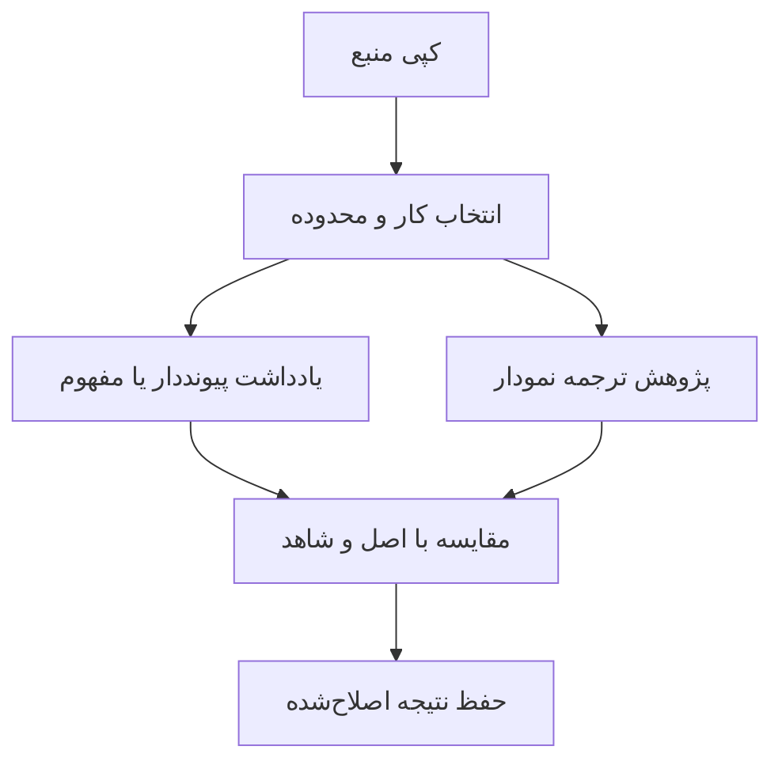

import TLDR from '@site/src/components/TLDR';

# مدیریت دانش با هوش مصنوعی در Obsidian

<TLDR>روش مفید اصل، پاسخ مدل و اصلاح خودتان را جدا نگه می‌دارد. Notemd پیوند، استخراج، پژوهش، ترجمه و نمودار قابل بررسی تولید می‌کند. با یک منبع شروع کنید، نتیجه را ببینید و بعد پوشهٔ محدود را خودکار کنید.</TLDR>

## تعیین نتیجه

یادداشت پیونددار، مفهوم، خلاصهٔ مستند، ترجمه یا نمودار را انتخاب کنید. فایل و پیوند بیشتر درک یا بازیابی بهتر را تضمین نمی‌کند. روش تأیید و یافتن دوبارهٔ محتوا را مشخص کنید.

## مسیر کامل


```mermaid
flowchart TD
    A[کپی منبع] --> B[انتخاب کار و محدوده]
    B --> C[یادداشت پیونددار یا مفهوم]
    B --> D[پژوهش ترجمه نمودار]
    C --> E[مقایسه با اصل و شاهد]
    D --> E
    E --> F[حفظ نتیجه اصلاح‌شده]
```

این‌ها کارهای قابل انتخاب‌اند، نه تمام مراحل یک دکمهٔ اولیه. پیش از زنجیره کردن منبع و مقصد را بررسی کنید.

## ۱. پیوند: آشکار کردن رابطه

**پردازش فایل (افزودن پیوندها)** را اجرا و `_processed.md` را از نظر اصطلاح، نقل‌قول، کد و فرمول مقایسه کنید. دستور حوزه یا مترادف برابری یا آستانهٔ عددی را اجبار نمی‌کند. اگر تکرارپذیری عنوان موجود اولویت است تطبیق قطعی را در نظر بگیرید. [پیوند](./features/wiki-links).

## ۲. مفهوم: جدا کردن نام و توضیح

پوشه تعیین کنید. استخراج مستقل اصل را حفظ و فقط عنوان می‌سازد. برای `Linked From` تازه پیوند بازگشت را روشن و قالب کمینه را خاموش کنید. **تولید دسته‌ای از عنوان‌ها** جداست و می‌تواند فایل قبلی را هم پردازش کند. مقصد complete و نام‌های همسان با معنای متفاوت را بررسی کنید. [مفهوم](./features/concept-notes).

## ۳. پژوهش: حفظ مدرک

موضوع یا عنوان و Tavily یا DuckDuckGo را انتخاب، سپس **پژوهش و خلاصه‌سازی** را اجرا کنید. کلید خالی Tavily انتخاب را عوض نمی‌کند. منابع را باز کنید. بازیابی محلی واژگانی گزیده را به LLM می‌فرستد؛ نمایهٔ محلی آفلاین بودن مسیر را اثبات نمی‌کند. [پژوهش](./features/research).

## ۴. ترجمه: معنا و ساختار

زبان را انتخاب و فایل را ترجمه کنید. `_<language>.md` می‌تواند خروجی موجود را عوض کند. برای عبارت، یادداشت موقت بسازید. اصطلاح، عدد، کد، پیوند و ریاضی را بسنجید؛ قطعه‌بندی ممکن است زمینه را کم کند. شمار زبان UI یا سایت کیفیت جفت زبان را ثابت نمی‌کند. [ترجمه](./features/translation).

## ۵. نمودار: منبع قابل ویرایش

نوع و منبع سازگار را برگزینید و اصل و SVG یا PNG یا PDF لازم را حفظ کنید. تصویر حفظ همهٔ رابطه‌ها در ویرایشگر دیگر را ثابت نمی‌کند. CircuitikZ محدود و آزمون کامپایلش جداست؛ پیکان بین شاخهٔ Drawnix ثابت و Mermaid/SVG در PPTX ممکن است تصویر باشد. [نمودار](./features/diagrams).

## ۶. گردش‌کار: خودکارسازی مرحلهٔ آزموده

نام، `::` و کارهای جداشده با `>` زنجیره را تعریف می‌کنند:

```text
One-Click Extract::process-current-add-links>batch-generate-from-titles>batch-mermaid-fix
```

این پیوند، عنوان و ترمیم Mermaid است، نه پژوهش یا نمودار عمومی. شرط و خروجی هر کار حفظ می‌شود. حالت اولیه با خطای گزارش‌شده می‌ایستد؛ فقط وقتی ادامه دهید که کار بعد ورودی باقی‌مانده را بپذیرد. لغو فایل کامل را پس نمی‌گیرد. [گردش‌کار](./features/workflows).

## ۷. ارائه‌دهنده: پروتکل و کار

36 نمایه پنج خانواده را پوشش می‌دهند. بر اساس نشانی، حق دسترسی، شرط داده و نتیجهٔ سنجیده انتخاب کنید. زمان و هزینه را با اصل و prompt یکسان مقایسه کنید. مسیر اختصاصی ابتدا خاموش است؛ همه را پیش از فرض محلی بودن بررسی کنید. [ارائه‌دهنده](./providers/overview).

## بررسی آغازین

1. نصب و کپی منبع را حفظ کنید.
2. مدل دقیق را بیازمایید.
3. پوشهٔ مفهوم و مقصد جدا تعیین کنید.
4. روی کپی اجرا کنید.
5. مقایسه و اصلاح را ذخیره کنید.
6. به پوشهٔ کوچک گسترش دهید و قبل از زنجیرهٔ بلند نتیجهٔ جزئی را ببینید.

## موقعیت‌های رایج

### کار با مقاله

با ابزار خارجی به Markdown تبدیل و جدول، فرمول و شکل را بررسی کنید. مفهوم و قطعه را استخراج، پرسش دقیق را پژوهش و فقط رابطهٔ قابل تأیید را رسم کنید. مقاله و اصلاحات را نگه دارید.

### نگهداری مفهوم

پوشهٔ جدا به کار ببرید، اصطلاح را بسنجید و توضیح زیرمجموعهٔ منتخب را تولید کنید. پیش از پاک‌سازی پشتیبان بگیرید. شمار زیاد جای تعریف دقیق و پیمایش مفید را نمی‌گیرد.

### محتوای خصوصی

سرور محلی، مدل و وابستگی را آماده کنید. مسیرها را بررسی و در صورت نیاز پژوهش شبکه را کنار بگذارید. گزارش را قبل از اشتراک ببینید. مقدار اولیهٔ loopback جلوی تنظیم نشانی دوردست را نمی‌گیرد.

### ادامهٔ گروه

تا پایان خطا یا لغو صبر، گزارش و خروجی و بازیابی را مقایسه و فقط بخش لازم را تکرار کنید. لغوشده یعنی خالی نیست؛ پیش از حذف همراه‌ها ارجاع را بررسی کنید.

## گام بعد

- [شروع سریع](./getting-started/quick-start).
- [گروه](./advanced/batch-processing).
- [توسعه‌دهنده](./developers/overview).
- [Agent](./agents/overview).
