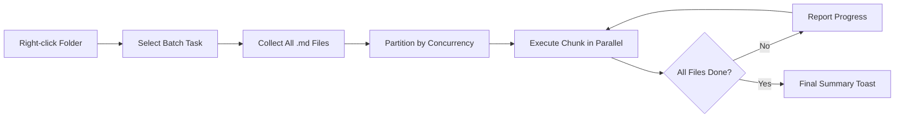

import TLDR from '@site/src/components/TLDR';

# Pakettiprosessointi

<TLDR>
**Notemd prosessoi koko kansiojen kokonaisuuden yhdellä toiminnalla, mahdollistając konfiguroitavan samanaikaisuuden ja kirjoittamisen hallinnan.** Paina oikea painikka kansiolle, jotta voit pakettina lisätä wiki-linkkejä, poistaa käsiteltyjä aineita, tehdä tutkimuksia tai kääntää kaikki sisällössä olevat tiedot. Samanaikaisuusrajoitteet estävät API-virheiden syntyä. Edenemistä ilmoitetaan tiedostojen mukaan. Kirjoittaminen voi toimia eri tavoin: jättää olemassa olevat tiedot, lisätä ne tai asettaa uudet tiedot. Epäonnistuneet tiedostot tallennetaan ilman paketin keskeyttämistä.

Tämä kuuluu [Obsidian AI-tietojen hallintasuunnitelmaan](/docs/pillar-ai-knowledge).
</TLDR>

## Yleenvaate

Pakettiprosessointi muuttaa tiedostokansion yhteen toiminnaksi. Sijaan siitä, että avataan jokainen tiedosto ja käytetään komenteja erikseen, painetaan oikea painikka kansiolle ja valitaan toimenpide. Notemd käy kautta kaikista `.md`-tiedostojen ja soveltaa valittua toimintaa, ilmoittając edenemistä reaalissa aikassa.

Tämä ominaisuus on olennainen koko avaran tietojen poistamiseen. Esimerkiksi pärast kymmeniä PDF-tiedostojen impordia voi pakettina lisätä linkkejä ja sitten pakettina poistaa käsiteltyjä aineita, mikä rakentaa tietograafian minutin aikassa, ei tuntien aikassa.

## Kuidas se toimii

### Pakettikäytännön malli

1. **Tiedostojen kerääminen** -- Notemd skannaa tarkoituksen kansion rekursiivisesti (tai vain ylemmällä tasolla, riippuen asetuksista) ja kerää kaikki `.md`-tiedostot.
2. **Samanaikaisuuden jakaminen** -- Tiedostot jakataan osiin vastaavasti `batchConcurrency`-asetukseen. Jokainen osa toimii samalla aikalla; muut osat toimivat järjestysmukaisesti.
3. **Käyttö** -- Jokainen tiedosto käsitellään samalla loogikalla kuin yksityisen tiedoston komentoilla. Yksittäisten toimintojen ja mallien asetukset arvestetaan.
4. **Edenemistiedot** -- Jokaisen tiedoston valmistumisen jälkeen ilmestyy ilmoitus, joka näyttää `N / Total`-edennystä.
5. **Virhehallinta** -- Jos tiedosto epäonnistuu (API-virhe, verkon aikataulu jne.), virhe tallennetaan ja paketti jatkuu. Lopullinen yhteenveto listaa kaikki epäonnistuneet tiedostot.
6. **Valmistuminen** -- Yhteenvetoilmoitus ilmoittaa kokonaisen käsiteltyn määrän, edustavat toiminnat ja epäonnistukset.

### Yrittäytyminen kirjoittamiseen

Tarkistetaan tiedosto, jossa on jo wiki-linkkejä, konseptitietoja tai käännöksiä; Notemd-nin toiminta riippuu kirjoittamisasetuksesta:

| Režimi | Toiminta |
|------|----------|
| **Jätä kuin on** | Olemassa oleva sisältö jää muutomattomaksi. Tarkistetaan vain muuttomia tiedostoja. |
| **Lisää** (perustaulukko) | Uusi sisältö lisätään. Olemassa olevat wiki-linkkejä, konseptitietot tai käännöksyt säilyvät. |
| **Asenda** | Tiedosto tarkistetaan uudelleen kokonaan. Kaikki aiemmat Notemd-nin muutokset kirjoitetaan üle. |

Wiki-linkkejä koskevaltia: jos tiedosto sisältää juba `[[wiki-links]]`, režimi **Jätä kuin on** jättää sen muutomattomaksi, samalla kun režimi **Asenda** lähettää koko tiedon uudelleen LLM-lle uusien linkkien lisäämiseksi. Käytä **Jätä kuin on** suorittamiseen jatkuvasti ja **Asenda** muutokset tulostamiseen tilannossa, kun malli on uudennettu.

### Samaa aikaa käytetään tiedostoja

`batchConcurrency`-nin asetus rajoittaa samanaikaisia API-äviä. Tämä estää kiirustaksojen virheitä (HTTP 429) suurten kansiojen tarkistamiselta tarjoajilla, jotka käyttävät strictseja kvoteja.

| Samaa aikaa käytetään tiedostoja | Suositeltu käyttökohtaisuudet | Typical Rate-Limit Impact |
|-------------|----------------|---------------------------|
| `1` | Tasuta tierit, striikkinpitäjät | Ei (sarakkeet) |
| `3` (omistusasetus) | Enimmäiset pilvapalvelut | Matala |
| `5` | Ollama (lokalisoinnin), suuri tierit | Ei / Matala |
| `10` | Lokalisoinnin mallit nopealla tulostuksella | Ei |

Jos saat 429-virheitä paketitöökalujen käytön aikana, vähentä samanaikaisia pyyntöjä 1 tai 2:ksi.

## Konfigurointi

| Asetus | Omistusasetus | Vaikutus |
|---------|---------|--------|
| `batchConcurrency` | `3` | Maksimillinen samanaikainen API-pyyntö kaustatoimintojen aikana |
| `batchOverwriteExisting` | `false` | Kirjoita olemassa oleva Notemd-sisältö üle. `false` = lisääminen-režiimi. |
| `batchSkipProcessed` | `false` | Jätä huomiotta tiedostot, jotka sisältävät jo Notemd-merkkejä (esim. wiki-liitkeitä) |
| `batchRecursive` | `true` | Lisää alamkataloogit kataloogin skannauksessa |
| `enableStableApiCall` | `false` | Aktivoi uudellepyyntilogika (kunnen 4 yrittäjää) jokaisen tiedoston kanssa pakettoinnin aikana |

### Työpäivän mukaiset mallit pakettiprosessoinnin kanssa

Jokainen paketto-toiminta käyttää vastaavaa tehtävän mukaista mallia. Batch-add-links käyttää `addLinksProvider`, batch-research käyttää `researchProvider` ja niin edelleen. Tämä tarkoittaa, että voit määritellä halvempat mallit suuremman määrän toimintoille ja varata kallempat mallit laadun suhteessa tärkeille tehtäville.

## Esimerkki

Sinulla on kausta `papers/`, jossa on 40 impordattua tutkimusnotaa. Haluat lisätä wiki-linkkejä ja erottaa ymmärrettävät aiheet kaikista niistä.

1. Oikeasta paina `papers/` -kaustaa
2. Valitse **"Notemd: Process folder (add links)"**
3. Notemd skannaa kaustan, löytää 40 `.md` -failia ja töötlee ne kolmea kerralla (perusyhteistyösuunta)
4. Edenemisilmoitus näyttää: `12/40 files processed...`
5. Laukkuun ~3 minuutin jälkeen yhteenvetolimoitus raportoi: `39 succeeded, 1 failed (API timeout on paper-37.md)`
6. Kertoa uudelleen **"Notemd: Process folder (extract concepts)"**, jotta luodetaan concept -notat kaikille 40 -leihin

Yksi epäonnistunut faili tallentuu. Voit käyttää sen uudelleen myöhemmin.

## Vinkit

- **Alka matalalla yhteistyösuuntailla** -- Jos et tiedä oma palveluntarjoajan kiirustaksoja, alka `1` -lla ja suurenda järk-käyrin.
- **Käytä skip -režiimiin muutoksetekojen päivittämiseen** -- Pärast ensimmäistä täysää osaa vaihtaa `batchSkipProcessed: true` -lle, jotta vain uusimmat notat töödellään seuraavissa käyttöissä.
- **Aktivoi stabilit API -kutsut** -- `enableStableApiCall: true` lisää uudelleenkäynnillogikan, joka toistaa toiminnan ajatusmuotoisen verkonvirheiden korjaamiseksi pitkissä osissa.
- **Käytä uudelleen pärast mallin uusentamista** -- Jos vaihtaat paremmaan malliin, aseta `batchOverwriteExisting: true` -lle ja käytä uudelleen, jotta saad paremmat linkit ja concept -notat.

---

## Järguvät toimet

- [Workflows](/docs/features/workflows) -- Yhdistä osataskut yhdellä painamiskertaisella sivupuolen painikkeella
- [Custom Prompts](/docs/advanced/custom-prompts) -- Kohanda prompteja osataskujen poistamiseen
- [Troubleshooting](/docs/advanced/troubleshooting) -- Korjaa kiirustaksovirheet ja yhteyshäiriöt osataskujen käyttössä
- [LLM Tarjoajat](/docs/providers/overview) -- Tekstin mukaan mallikonfiguroinnin viite
