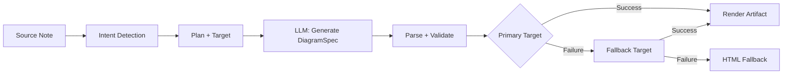
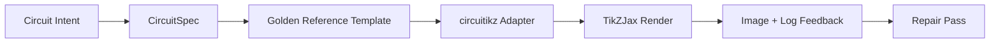

import TLDR from '@site/src/components/TLDR';

# Diagrammit

<TLDR>
**Notemd luoo diagrammeja sinun merkintöistä spec-first -prosessin kautta.** LLM tuottaa renderer-erillisen `DiagramSpec`-JSON-koodin, jota sitten erikoisadapterit muuntavat Mermaid-, JSON Canvas-, Vega-Lite-, HTML-, muokattaviksi HTML/SVG-, Draw.io-, Drawnix- tai rajoitettujen circuitikz-luottolukujenä. Tuo tukea 9 tarkoituustyyppiä, automaattisia varauksellisia ketjuja, live-previewia SVG/PNG/PDF-ekspordin kanssa, semantistista verkkointia sekä lokalisoidun tiedon perusteella laadittua generointia.
</TLDR>

Tämä kuuluu [Obsidian AI-tietojen hallintasuunnitelmaan](/docs/pillar-ai-knowledge).

## Arkkitehtuuri: Spec-First-pipeline

Notemd ei kysy kuntaan LLM-sta tuottamaan suoraan Mermaid-/Vega/Canvas-syntaksia. Sille asemelle:



**Miksi spec-first?** LLM-t tuottavat usein epäsisällistä renderer-syntaksia (erityisesti Mermaid). Strukturoitu `DiagramSpec` voi valvota ennen renderointia, ja sama spec voi toimia varausketjuina useille renderereille.

## Tuettuva diagrammityyppit

| Tarkoitus | Päärendereri | Varaukset | Käytöskenttä |
|--------|-----------------|-----------|----------|
| `mindmap` | Mermaid | HTML | Hierarkilliset teemat |
| `flowchart` | Mermaid | HTML | Prosessivaihtoehtojat, päätöksetiedot |
| `sequence` | Mermaid | HTML | Client-server-interakiot, protokollit |
| `classDiagram` | Mermaid | HTML | OOP-klassien suhteet |
| `erDiagram` | Mermaid | HTML | Tietokonekehystöket, entiteettien suhteet |
| `stateDiagram` | Mermaid | HTML | Oloskemmat, elinkaupalliset mallit |
| `canvasMap` | JSON Canvas | Mermaid → HTML | Aikakartat, tietojen graafit |
| `dataChart` | Vega-Lite | Mermaid → HTML | Säve-, rea-, alue-, hajutus-, pirukka- ja tabelmallit |
| `circuit` | circuitikz | ei | Rajoitettut circuitikz-diagramme valvottuista `CircuitSpec`-lukujista |

## Tarkoituksen tunnistaminen

Notemd arvioi sinun merkinnän sisältöä käyttäen avainasanojen arvoituksia ja määrittää parhaan diagrammityypin:

| Tarkoitus | Aiheuttajat | Vitoutuminen |
|--------|----------|------------|
| `dataChart` | Tabelit, numeriset cellit, määrä-/kehitystavauksia koskevat avainasanoet, prosenttilukut | 0.88 |
| `sequence` | Pyytö/tulostus-sanovalikoima (4+ sopimukset) tai `->`/`=>`-merkit | 0.82 |
| `erDiagram` | Primärisväyty, ulkopuoliset väytyt, entiteetti, kehystö (2+ sopimukset) | 0.80 |
| `stateDiagram` | Olosuhteet, siirto, poistoehto, käynnissä, epäonnistunut (3+ sopimukset) | 0.76 |
| `flowchart` | Numeroituja vaiheita (2+) tai if/then/else/töövoima-sanovalikoima | 0.74 |
| `canvasMap` | Kontseptikartta, tietojen grafiikki, sijaintipohainen, klusteri | 0.72 |
| `circuit` | circuitikz, TikZJax, circuit, schematic, CMOS, NMOS, PMOS, MOSFET, VDD/GND, `vin`/`vout` | 0.78 |
| `mindmap` | Vaikkaista vaihtoehto | 0.55 |

Päästä üle **Ehdotettu diagrammityypi**-asetuksella, vasemariban valintaydinnolla tai selkeän käskupalvelun valikolla.

## Render Target Selection

Eksperimentaali spec-first-pipelineillä on nyt kaksi erillistä kontrollointa:

| Kontrolli | Asetus | Vaikutus |
|---------|---------|--------|
| Ehdotettu diagrammityypi | `preferredDiagramIntent` | Ohjaa genereeritun `DiagramSpec` semantista muotoa |
| Ehdotettu render-targetti | `preferredDiagramRenderTarget` | Valitsee artefaktin renderoinnin välineen **Generate diagram**- ja **Preview diagram**-toimintoille |

Aseta **Preferred render target** arvoon **Auto**, jotta se toimii suunnittelijan vaihtoehtona, tai valitse suoraan Mermaid, JSON Canvas, Vega-Lite, HTML, Editable HTML/SVG, Draw.io, Drawnix tai Circuitikz. Tämä päällepano soveltuu vain artikkelinluomis- ja preview-komentoille. Standardinen **Summarise as Mermaid diagram**-komento jää mermaid-tuettavaan välittöön, jotta olemassaolevat Markdown-työprosessit eivät vaihtoehtoisesti muuttu suoraa muotoa.

Tämä erottelu on tärkeää, koska `flowchart`-tarkoituksen voi nyt renderoida Mermaid-formaattina Markdown-merkintöille, HTML-formaattina vahvaa varaukselua varten, muokattaviksi HTML/SVG-formaattina seuravaan muokkaamiseen tai Draw.io/Drawnix-lähteetekstinain SVG-arviointituloksina. `circuit`-tarkoituus suunnitetaan Circuitikz:ään ja vaatii valvottua `CircuitSpec`; se ei ole pyyntö suvaliseen TikZ-textiin.
## Käyttö

### Generate a Diagram

1. Avaa tiedon
2. Käytä käskupalvelusta **"Notemd: Generate diagram"**
3. Notemd tunnistaa tarkoituksen, genereerii specin, renderoi ja salvestaa artefaktin

**Väljöntiedostot tarkoituksen mukaan:**

| Tavoite | Lisäosaa | Failinimen malle |
|--------|-----------|------------------|
| Mermaid | `.md` | `{note}_summ.md` |
| JSON Canvas | `.canvas` | `{note}_diagram.canvas` |
| Vega-Lite | `.json` | `{note}_diagram.json` |
| HTML | `.html` | `{note}_diagram.html` |
| Muokattavat HTML/SVG | `.html` | `{note}_diagram.html` |
| Draw.io | `.drawio` + `.drawio.svg` + `.drawio.md` | `{note}_diagram.drawio` sekä sen arviointitulokset |
| Drawnix | `.drawnix` + `.drawnix.svg` + `.drawnix.md` | `{note}_diagram.drawnix` sekä sen arviointitulokset |
| Circuitikz | `.tex` + `.tex.svg` + `.tex.md` | `{note}_diagram.tex` sekä sen arviointitulokset |

### Diagrammin ennittäkset

1. Käytä **"Notemd: Edellistäkset diagrammaa"**
2. Modaalikokemus avautuu renderoidun diagrammin kanssa
3. Ekspordi SVG-, PNG- tai PDF-formaattina käyttäen työkalupalkkien painikkeita

**Automaattinen näyttöavainnin avautuminen** on saatavilla asetuksissa – luomisen jälkeen näyttöavainnin modaalikokemus avautuu automaattisesti.

PNG- ja PDF-preview-ekspordissa käytetään konfiguroitua preview PPI:aa. Perusarvo on 300 PPI, ja arvot yli 600 PPI piirritään 600:ksi. SVG-pyykät pysyvät vektorimuodossa. Lähteetekstit kuten `.drawio`, `.drawnix` ja `.tex` voivat tarjoaa `previewSvg`-tuloksen, jotta Obsidian voi näyttää ja ekspordia arvioidavia kuvia ilman diagram.net-, Drawnix-, LaTeX- tai TikZJax-sisältöjen sijoitusta pluginin toimintaan.

Eeläytöluokkalla on myös arteikkeiden diagnostiikan-paneeli. Renderoinnin ohjelmistot ja suitsutestit voivat liittää `RenderArtifact.diagnostics`; luokka näyttää diagnostiikan yhteenveton, jossa on virheiden/hoihtoehtojen/tietojen määrät, sen jälkeen tärkeysaste, diagnostiikan tyyppi, sanoitus sekä parannusvinkit eeläytön kohdalla. Sama yhteenveto näytetään myös diagnostiikan tukea tarjoavissa historiallisissa kirjoituksissa, mikä mahdollistaa kerran toisensa jälkeen tehtyjen circuitikz suitsutestien vertailun ilman kaiken kirjoituksen avamista. Arteikkeille, jotkilla on lähteeteksti mutta jotka eivät voi renderoida sisällä tai HTML-iframe-menetelmän kautta, luokka käyttää nyt vain lähteetekstin eeläytöä sijaan täysin tyhjän iframe:n käyttöä. Tämä annaa circuitikz-tilastointiprosesseille, SVG-textitoken-tarkistuksille, PNG-tyhjän ekranikuva-tarkistuksille, vain matkanpaikkojen perusteilla tehtäville yleisille raportteille sekä tuleviin raportteille näkyvän käyttöliittymän, ilman että TikZJax tai LaTeX tulisi pakolliseksi plugin-runktiman riippuvuudeksi tai ilman että lähteeteksti pidetään vahvistetuksi visuaalisena renderoinnuksena.

### Legacy Mermaid-režimi

Kun `enableExperimentalDiagramPipeline` on poissa, Notemd lähettää suoraan Mermaid-kysymyksen LLM:lle. Tämä ohjaa täysin kiertoketjun kautta. Jos eksperimentaali-kiertoketju ehtoo, se palaa tähän režiimiin.

## Renderinnan taustapalvelut

### Mermaid

6 adapteria (mindmap, flowchart, sequence, ER, class, state) – kääntä `DiagramSpec` Mermaid-syntaksiin. Tulosten luomisen jälkeen `mermaid.parse()` valvostaa sen. Jos valvonta ehtoja ei täyda:

1. **LLM uudelleen** — yksi yrittö Mermaid virheilmoituksen kontekstina
2. **Minimaalinen varaus** — lihto Mermaid-diagramma spec-node-ID:istä

**Legacy Mermaid Fixer** korjaa automaattisesti yleisiä LLM syntyyliksetoja: note -direktiivien normalisoiminen, pipe-label -tunnisteiden pakottaminen, semikolmion uusipäätöshoitto, smart -quote -tunnisteet, kaksisuorakkeiset nopeat, kuvin epämukavuudet ja muut.

### JSON Canvas

Luo Obsidian JSON Canvas -muotoilun kohtaisen ruumilisen paikannusmallin:
- Sulkut sijoitetaan syvyyden mukaan (x = syvyyden × 420) ja indeksin mukaan (y = indeksin × 170)
- Läpimääräys lajitunnon pituudelta
- Ehdot `fromSide: 'right'`, `toSide: 'left'`, `toEnd: 'arrow'` -tunnisteilla

### Vega-Lite

Luo automaattisen koodinmuuttamisen kanssa täydelliset Vega-Lite v5 JSON -spesifikationit:
- **Cartesian -chartit** (bar/line/area/point/scatter): x + y -kanavat + väri useiden sarjien jaoks
- **Pie**: theta = y (määrällinen), väri = x (nominatiivinen)
- **Taulukko**: rivi = x, teksti = y + sarakkeet = sarjat

Pimeä ja helppää teematilaa yhdistetään syvällisesti ennen kompiloimista.

### HTML

Yleiskäyttöinen varapalo. Itsetoimiv HTML -dokumentti, jossa on:
- CSP -meta -tiedostot
- Helppä/pimeä režiimi `prefers-color-scheme` -kautta
- Kohdanmukaiset UI -siltat 20 kielikentälle
- Osat: hero, strukturi (sulkujen puu), suhteet, huomiot, datasarjien taulukot

### Muokattavat HTML/SVG

Selkeä kuva-tavoite muokattavien eksportto-prosessien jaoks. Se projekteerii `DiagramSpec` deterministiseen `SemanticFigureModel`, sitten renderoi itsestään toimivan HTML-dokumentin, jossa on sisälläisiä SVG-ryhmiä, jotka sisältävät Draw.io-tyylisää annotaatioita:

- `data-drawio-type`, `data-drawio-id` ja `data-drawio-role` semantisten sijoitteiden puhul
- `data-drawio-source` ja `data-drawio-target` semantisten edustajien puhul
- stabilit sijoitus-/edustaja-tunnistimet pääsevän tyyhjennys- ja kokonaisuushuollon jälkeen
- ei skriptejä, ei ulkopuolisia kirjoja eikä ulkopuolisia resursseja

Tämä tavoite ei ole todistettavasti vaihtoehtoisen suunnittelun reitti vielä. Se on saatavilla selkeän renderointitavoikena, kun tuotteen ratkaistaan muokkaustoiminta eri verkostojen ohjelmistoissa.

### Draw.io ja Drawnix eksporttoliittymät

Päivitetty toteutus säilyttää kolmannen osapuolen suorittimen tukea artefaktin rajoissa, samalla kun se jatkaa selkeiden renderointitavoitteiden paljastamista:

| Tavoite | Sopimus | Käytössä olevat riippuvuudet |
|--------|----------|--------------------|
| Draw.io | deterministinen, pakottamattompi `mxfile`-XML-tiedosto `SemanticFigureModel`-lta, sekä SVG/PNG/PDF-arviointitulokset | ei mitään pluginin toimintaa eikä CI:ssä |
| Drawnix | minimistinen `.drawnix`-JSON-alamosa, joka käyttää `geometry`- ja `arrow-line`-elementtejä, sekä SVG/PNG/PDF-arviointitulokset | ei mitään pluginin toimintaa eikä CI:ssä |

Tasapaino on tahtevasti valittu: Notemd voi vahvistaa näkyviä siltiä, stabiileja ID:itä ja tuettua primitiivien kattavuutta ilman diagram.net Desktop-, Drawnix-, Plait- tai ainult selaimen editorin tilan sisällyttämistä pluginiin.

### circuitikz / TikZJax suunta

Väylädiagrammit eivät ole sama ongelma kuin yleiset vähenväylät. Elektrisistä väylistä käytettävä oikea syntaksitarkoitus on yleensä **circuitikz**, joka renderoidaan Obsidian kautta pluginaikkeja kuten TikZJax. TikZJax voi laadita paketteja kuten `circuitikz`, `pgfplots`, `tikz-cd` ja `chemfig`, mikä tekee sen kiinnostavaksi fysikan, väylien, kemian ja matemaatin tiedonnottojen kanssa.

Riski on se, että raaka LLM-generoitu TikZ on hapu:

- Monipuolinen väyläntopologia voi olla elektrisesti oikea, mutta visuaalisesti lukematon;
- Yhteydessä olevat juotimet ja merkit voivat tehdä oikean netlistin käytöttömäksi opinnotiedoissa;
- Puuttevat paketin eelliset osat, väärät ankaat tai epäsisällisiä komponentin nimet voivat estää renderoinnin;
- Palautteet renderoinnin työkalulta ovat yleensä kuvan tasolla, kun taas LLM generoitu tekstitasollinen geometria.

Parhempi arkitekttuuri on käsitellä circuitikz rajoitettuana diagrammitarkoituksena, ei vapaavormin pyyntöäksi:



Esimerkkimodelli pitää kuvailla väyläntopologian ja paikannuksen erikseen:

| Sulu | Vastuutta | Esimerkki |
|-------|----------------|---------|
| Topologia | elektriset sijainnit ja komponenttien yhteydet | `VDD -> RD -> drain(M1)`, `source(M1) -> GND` |
| Paikannus | verkostojen asentaminen, suuntaus, reittiyhdot | `M1 at (3,2.2)`, sisäänkirjoitus vasemmassa, väljottaminen oikeassa |
| Style | paketti, voltamme‑konvensio, siltit, ankaat | `\begin{circuitikz}[american voltages]` |
| Valvonta | kompilaus‑logi, puutteet ankkeissa, yhteenpistymis-/kuvakuvan tarkistukset | TikZJax/LaTeX‑diagnostiikka plus visuaalinen tarkistus |

### Päivän circuitikz prototyyppi

Notemd sisältää nyt ensimmäisen rajoitettun repositoorion prototyyppin tässä suunnassa. Se on suositeltavasti offline‑tilassa ja mallipyyrittävä:

```bash
npm run diagram:export-circuitikz -- --input cmos-inverter.json --output cmos-inverter.tex
```

Prototyyppi lisää rajoitettuun `CircuitSpec`-rajoitteeseen sekä deterministisen eksportoinnin kuudeen kultaisen referenssiperheeseen:

Eksperimentaalisessa diagrammin tuotantopisteessä on tämä nyt myös saatavilla `intent: "circuit"`-mallin ja renderointitavoitteen `circuitikz` kautta. Luodut `DiagramSpec`-tiedostot voivat sisältää `circuitSpec`-tietoja vain circuit-intentin tilanteissa. `CircuitikzRenderer` kirjoittaa saman deterministisen `.tex`-lähteetekstin ja liittää sihi SVG-arkkitehtuurin perusteella luodun arviointituloksen, mikä mahdollistaa Obsidianin arviointin sekä SVG/PNG/PDF-exportin. Tämä arviointitulokset ei ole LaTeX/TikZJax-kompilaation tuloksia; todelliset renderoinnin tukijät ovat edelleen alla olevissa selkeissä komentoissa.

Suportoiduissa kultaisissa mallissa `layoutHints.inputSide` ja `layoutHints.outputSide` jäävät vain esittelytarkoituksellisiin kontrolloihin. Ne voivat siirtää deterministisen sisään-/uloskirjautumisportin sijainnin, mutta ne eivät muuttaa arkkitehtuurin merkintää eikä mahdollista parannusprosessia, jolla voit uudelleen suunnittela circuitin.

| Välinvaihto tyyppi | Kuldinen viite | Virtan varmistus |
|--------------|------------------|-------------------|
| `common-source-amplifier` | `common-source-nmos-v1` | valvostaa `VDD -> R_D -> M1.D`, `vin -> M1.G`, `M1.S -> GND` ja `M1.D -> vout` ennen LaTeX‑kirjoittamista |
| `cmos-inverter` | `cmos-inverter-v1` | valvostaa PMOS-over-NMOS‑topologian, yhdistyneen girin sisäänkirjoituksen, yhdistyneen drenin väljottamisen, `VDD -> MP.S` ja `MN.S -> GND` ennen LaTeX‑kirjoittamista |
| `cmos-buffer` | `cmos-buffer-v1` | valvostaa kaksi järjestynyt inversoritasoa, keskityspiste `vmid`, taastettu `vout` sekä yhdistyneet VDD/GND‑rajad ennen LaTeX‑kirjoittamista |
| `cmos-transmission-gate` | `cmos-transmission-gate-v1` | valvostaa parallelliset PMOS/NMOS‑sovelluslaitteet `vin` ja `vout` välillä komplementaarisilla `phib` / `phi`‑kontrolloilla ennen LaTeX‑kirjoittamista |
| `cmos-nand2` | `cmos-nand2-v1` | Valvostaa parallellisen PMOS-tahteen, järjestäyksen NMOS-tahteen, kahden sisäänkirjautumisen `va` / `vb` sekä `vout` ennen LaTeX-lukemista |
| `cmos-nor2` | `cmos-nor2-v1` | Valvostaa sarjan PMOS-pull-up-, parallellisen NMOS-pull-down-, kahden sisäänkirjautumisen `va` / `vb`- ja `vout`-toiminnan ennen LaTeX-lukemista |

Tämä ei ole yleinen TikZ-generaatiotiimi. Se ei vastaa suvalisia TikZ-koodia, kompiloita LaTeXia, käyttää TikZJaxia, tarkistaa skennauksia pluginin toimintaa aikana eikä käynnistä automatisoidua kuvatulostusparannusta. Ne toimenpiteet ovat edelleen tulevissa vaiheissa.

Preview-diagrammi-komento voi uudelleen avata salattuja circuitikz lähteetekstejä suoraan, kun tiedoston laajennus on `.tex` tai `.tikz` ja lähteessä on `\usepackage{circuitikz}` tai `\begin{circuitikz}`. Tämä menetelmä on circuitikz vain lähteestä perustuva näyttö: modaalikenttä näyttää lähteetekstin, diagnostiikan, kopioi-/salaa-ohjeiden sekä historian meta-tietoja, mutta se ei kompiloita LaTeXia eikä kutsua TikZJax pluginin toimintaa aikana.

Samalla lähteistä vain perustuva näytöksentekijän rajoitus kattaa nyt salattuja Draw.io-ja Drawnix-artikkeleja. `.drawio`-failit hyväksyntään, kun ne näevät outoa Draw.io XML (- `mxfile` tai `mxGraphModel`), ja `.drawnix`-failit hyväksyntään, kun ne ovat Drawnix JSON koos `type: "drawnix"`-ään ja `elements`-arrayin. Palvelintaa diagram.net eikä Drawnix-valkoispuhelinhostia ei todella sisällytetä; näitä näytöksiä näyttää lähteekoodin, diagnostikan ja artikkelien historian ilman, että vaadittaisiin palvelimessa sisältävää visuaalista editoria.

Topologian säilyttävän parannuksen kanssa annetaan parannuksen edellinen speciifikationi viiteena ennen kuin parannettu kandidaat hyväksytään:

```bash
npm run diagram:export-circuitikz -- --input repaired-cmos-inverter.json --topology-reference cmos-inverter.json --output cmos-inverter.tex
```

Onnistumisvarmuus käyttää `createCircuitTopologySignature` ja `assertCircuitTopologyUnchanged` `circuitKind`, `goldenReferenceId`, verkonkomponentteja, komponenttien ID:itä/tyyppejä/terminaaleja sekä suunaton yhteyden päätöspisteitä vertailuun ennen tulostusta. Merkit, tiitelin teksti, paikannusvihjeet, yhteyden järjekordi ja yhteyden merkit jätetään tahtavasti huomiotta. Kandidaat, joka lisää shortia tai uudelleen suunnittelee terminaalin, ehtoo `Circuit topology drift detected` ennen kuin `.tex`-faili kirjoitetaan.

CLI voi nyt analysoida olemassa olevan LaTeX/TikZJax komentointilogin ilman kompilaatorin käyttöä:

```bash
npm run diagram:export-circuitikz -- --input cmos-inverter.json --output cmos-inverter.tex --compile-log cmos-inverter.log --diagnostics-output cmos-inverter.diagnostics.json
```

Tämä diagnostiikan tiedosto raportoi puutuvista paketteista kuten `circuitikz.sty`, tietoyttömiä TikZ/circuitikz-avainia, TikZ-tiedostojen syntaksivirheitä kuten puutuvia koma-merkkejä, kontrolloimattomia argumentteja tasapainotetuista sulkeista tai lopetamatta siltiä, määritelmättömiä kontrollijärjestelmiä, yleisiä LaTeX-virheitä, kiireisästi päätetyksiä sekä varoitteellisia overfull `\hbox`-hoihtoja. Se jää logit perustuvaan: lokalaisten LaTeX/TikZJax-tulkinnoiden ja kuvaskärjenlaatuisten tarkistusten toteutus on edelleen erillinen tulevainen tehtävä.

Hoitajan suodotuskontrolloiden käyttöön voi saman CLI käyttää valintaalisesti selkeästi konfiguroituja renderaattoreita ilman shell-komentojen analysointia:

```bash
npm run diagram:export-circuitikz -- --input cmos-inverter.json --output cmos-inverter.tex --compile-executable pdflatex --compile-arg -interaction=nonstopmode --compile-arg -halt-on-error --compile-arg -output-directory={outputDir} --compile-arg {tex} --expected-artifact {outputDir}/{jobName}.pdf
```

Kompilausjätkäuksessa käytetään `shell: false`, `{tex}`, `{outputDir}` ja `{jobName}` sijaantekoja muodostetaan argumenttikerron arvoiksi, luetaan luotu `{jobName}.log` ja palautetaan `compileExecution` plus `compileDiagnostics` CLI JSON välityksellä. `--compile-executable` on vain renderaatorin binääri tai paketin path; renderaatorin merkit kuuluvat kertouviin `--compile-arg` arvoihin. Tyhjät käyttöohjelmat eivät toimi `compile-executable-invalid` muodossa, puuttevat binäärit eivät toimi `compile-executable-not-found` muodossa, ja shell-komentoja sisältävät käyttöohjelmakentotekstit saavat suositukset argumenttien jakamiseksi, jotta Windows, Linux ja macOS noudattavat samaa suoraan käytön sopimusta. `--expected-artifact` avulla raportoidaan myös `compileExecution.renderSmoke` ja CLI eivät toimi, jos renderaatori ei luoda tyhjättä artikkelia. Se ei siiskä paketa LaTeX:ta, tee TikZJax pluginin käyttöajaliseksi riippuvuudeksi eikä teke täysinkuvan tasolla visuaalista parannusta.

Jos oletettu artefaktti on `.svg`, siirryy smoke-check yhden kerroksen syvemmälle:

```bash
npm run diagram:export-circuitikz -- --input cmos-inverter.json --output cmos-inverter.tex --compile-executable dvisvgm --compile-arg ... --expected-artifact {outputDir}/{jobName}.svg --expected-svg-text v_{in} --expected-svg-text v_{out}
```

SVG smoke-ohjelma kontrolloi `<svg>` juurikohdan, positiivisia dimensioita tai `viewBox`, vähintään yhtä näkyvää graafikan elementtia jälkeen, kun peitetty/tuhoutuvat elementit poistetaan, kaikki pyytämät tekstitokenit, ilmennävät elementit `viewBox` ulkopuolella, ilmennävät yhteen rakenneet `<text>` / `<tspan>`-silti, sekä ilmennävät tekstisiltit, jotka yhteydessä `render-svg-label-overlap` ovat graafikan elementtien päällä. Oodattava teksti etsitään näkyvästä tekstistä ja dekooditavista käyttökykymetaan kuten `aria-label`, `<title>` ja `<desc>`, mikä mahdollistaa niillä renderoihin, jotka säilyttävät semantiset siltit välittömästi näkyvän `<text>` ulkopuolella, todentamaan tekstitokenien olemassaolon ilman OCR:n tarpeetta. Geometrian kontrolli käyttää nyt muuttokenttien huomioittavaa geometriaa yleisille ryhmän- ja elementtin `transform`-atribuutteille, mikä tarkoittaa, että suoritatut, skaalattuut, pöitätyt, kääntetyt tai matrismuuttokenttien mukaan muuttetut SVG -kotiot kontrolloituvat muuttokenttien yhdistämisen jälkeen. Se kattaa täsmäisiä kaareiden rajoja A/a-kaareiden äärimille, täsmäisiä Bezier-käveiden rajoja C/S/Q/T-käveiden äärimille, SVG-rajoja, jotka huomioivat värvikostan paksuutta, sekä siltien yhteydessä olevia kontrolloita, `polyline` / `polygon` -graafikan geometriaa, ja ratkaisee myös vain radan perusteella olevien glyfien paikannusketjujen `<use href="#...">` -viiteistä, takaisinottakseen, että uudelleen käytettäviihin glyfiradanoihin muuttetyt siltit voivat edelleen epäonnistua rajoitettujen taustakansojen kontrolloissa, jos paikattu glyfin geometria ulkee `viewBox` -rajoista. Useat paikattuut `tspan` -siltit yhdellä `<text>` -isäelementillä vertaillaan erillistä siltikotia, mikä auttaa havaitsemaan LaTeX-tyylin SVG -lomakkeet, jotka muuten yhdistäisivät erilaiset siltit yhteen tekstikohdaksi. Paikattuut `text` ja `tspan` -kotiot kunnioittavat `text-anchor` -arvoja `start`, `middle` ja `end`, mikä mahdollistaa keskittyneitä ja oikealle suoritettuja siltiä käyttää teksti-/silti- ja silti-/graafikan yhteydessä olevien ongelmien diagnoosina ilman tarvetta browserin tasolla tekstityypillä. Definitioonillaan vain olevat glyfiradanot `<defs>` ei lueta näkyviksi graafikan elementteiksi, mutta niiden omat definitiokenttien `transform` -atribuuttit sovelletaan ennen `<use>` -paikannusta, mikä takaa, että skaalattuut tai peilattuut glyfin definitsiot ei jää märkittävästi alhaalle. Silti-/graafikan yhteydessä oleva kontrolli käyttää pienen graafikkokotion toleranssia ja ilmoitettuja `stroke-width` -arvoja, mikä mahdollistaa, että pitkät, paksut ja polyygoonilaiset komponentin piirteet voivat katsotaan potentiaalisiksi siltien loettavuusongelmiksi, kun niiden näkyvä värvikosta saavuttaa siltin. Vain radan perusteella ratkaiseet glyfisiltit `<use href="#...">` vertaillaan myös graafikkokotioihin ja epäonnistuvat `render-svg-path-glyph-overlap`, jos uudelleen käytettävät glyfin geometriat yhteydessä ovat viivojen tai komponenttien päällä. Jos renderoi tekee siltistä uudelleen käytettävät radan glyfiden sijaan etsytävää `<text>` -tekstia eikä säilytä käyttökykymetaa, smoke-raportti tallentaa `pathOnlyGlyphUseCount` -tietoja ja epäonnistuu pyytämällä tekstitokenin kautta `render-svg-text-path-only`, sijaan siitä että se pettää, että silti on vain puuttuvaa. Muut epäonnistukset raportoidaan `render-svg-invalid`, `render-svg-dimension-missing`, `render-svg-no-visible-elements`, `render-svg-text-missing`, `render-svg-out-of-bounds`, `render-svg-text-overlap`, `render-svg-label-overlap` tai `render-svg-path-glyph-overlap` -kautta. Tekstitokenin- ja yhteydessä olevien kontrolloita tulisi käsitellä vain struktuurillisina smoke-testeiksi niille renderoihin, jotka säilyttävät siltit etsytävän SVG -tekstin tai käyttökykymetaan muodossa; vain radan perusteella SVG -lomakkeet vaativat edelleen hiljaisempaa kuva-/OCR-kontrolloa, jotta voidaan todistaa visuaalisen siltien loettavuuden, ja tämä smoke-testi ei edes väitele, että se kattaa täysin SVG -radat.

Peitetyt SVG-ryhmät ja -elementit jätetään aina huomiotta näkyvien elementtien lämentämisen ja geometrian keräämisen aikana. Atribuutit tai sisäistyleet `display:none`, `visibility:hidden`, `visibility:collapse` sekä yleinen `opacity:0` eivät voi tehdä muuten tyhjästä renderoinnista näkyvän väljonteen testin läpimisen.

Tiekeskeiset glifin definitsiot voivat olla suorat tiedot tai ryhmitetyt/symbolejä sisältävät konteinerit `<defs>`-ssä. Smoke-pass ratkaisee alam-tietojen geometrian `<g id="...">` ja `<symbol id="...">` lähtöästä ennen `<use>` asentamista, mikä mahdollistaa, että pakottu glifin väljonti toimii edelleen `pathOnlyGlyphUseCount`-, rajoitettujen taustakansojen kontrolloinnissa sekä `render-svg-path-glyph-overlap`-ssä.

Tieanalyysija seuraa myös aluetien alustapauksia ja asettaa aktiivisen punktin uudelleen `Z/z`, mikä mahdollistaa suhteellisten käskyn päätteiden jatkumisen oikeasta SVG punktista pääsenä suletun alueen jälkeen, estäen väärän `render-svg-out-of-bounds` diagnostikan syntyminen.

Sama geometrian prosessi seuraa SVG numerologisen sääntöjen mukaisia kohdakomaista desimaalia ja selkeitä plussmerkkejä, mikä tähän vuoksi kompaktiset dvisvgm-koordinaatit kuten `.5`, `-.5` tai `+.5` pysyvät osakaaluksi rajojen kontrolloin aikana, sijoittuen sen sijaan epätoivottuihin geometriarajoihin tai jätetyiksi.

Jos renderointilaitteesi välittää `.png`, saman oletetun tulosteen path muuttuu ensimmäiseksi screenshot-smokeeksi: Notemd decodoi mittomuotoiset 1/2/4/8-bitin indeksoitu-väri-PNG-faileet, 1/2/4/8/16-bitin hallitusvärinen PNG-faileet sekä 8/16-bitin hallitusvärinen-alfa/RGB/RGBA PNG-faileet. Indeksoitu-väri- ja alapitkävyyshallitusvärinen-kuvat tukevat pakattuja näyttöalueita; indeksoitu-väri-kuvat tukevat myös PLTE-ja valintaista tRNS-tietoa; hallitusvärinen/RGB-kuvat tukevat tRNS-transparentsejä näyttöalueita. 16-bitin suorat näyttöalueet normaloidaan saman 8-bitin RGBA-viittailutilaan, jota käytetään smoke-kontrolloissa. Smoke-kontrolli todistaa positivisia määrääksiä, tallentaa taustan rajojen `foregroundBounds`-ena, tallentaa taustan tiheysen sellestä kotikoneesta `foregroundDensity`-ena, epäonnistuu `render-png-blank`-ena, kun jokainen näkyvä pikseli vastaa ylävasaisen taustaväriä, epäonnistuu `render-png-content-clipped`-ena, kun taustan sisältö puuttelee kuvan rajoja, epäonnistuu `render-png-foreground-too-small`-ena, kun suuri screenshotillä on vähemmän kuin neliö taustan pikseltä, ja epäonnistuu `render-png-foreground-dense`-ena, kun taustan pikselit ovat erittäin tiheitä mittelmätön kotikoneen sisällä. Ei tuettu PNG-muotoja epäonnistuvat `render-png-unsupported`-ena sekä muotovalikoiman mukaisilla ohjeilla Adam7-mittomuotoisille PNG:ille tai ei tuettuiin indeksoitu-väri-bitipitoisuuksiin. Tämä havaitsee tyhjät screenshotit, ilmenevän canvas-kappaleen poistamisen, alarendattuja taustan näyttöalueita, ensimmäisiä pikselitasolla tapahtuvia kokonaisuusvirheitä sekä väärää renderointilaitteen PNG-eksportointiasetuksia ilman että tarvitsettaan platfommi-specificka shell-tulostusta. Tämä ei ole vielä OCR-tasolla siltien tunnistaminen, tarkka tekstin yhteyden havaitseminen tai topologian säilyttävä kuvan parannus.

Kun diagnostiikat näyttävät epäonnistunut kompiloinnin tai render-smoke-käytön, CLI voi myös kirjoittaa topologian säilyttävän parannusluettelon:

```bash
npm run diagram:export-circuitikz -- --input cmos-inverter.json --topology-reference cmos-inverter.json --output cmos-inverter.tex --compile-log cmos-inverter.log --repair-brief-output cmos-inverter.repair-brief.json
```

Parannusluettelo käyttää schemaa `notemd.circuitikz.repair-brief.v1` ja sisältää lähteekoodin `CircuitSpec`, topologian merkkinen, kompiloinnin/render-käytön diagnostiikat, sallittuja muutoksia, estetyjä topologian muutoksia, seuraavia kontrolltoiveita sekä strukturoituja `repairPrompt`-ja. Promptin rooli on `topology-preserving-circuitikz-repair`; sen `diagnosticFocus`-listaus perustuu kompiloinnin/render-käytön diagnostiikoihin, ja sen `acceptanceCriteria`-vaatimukset edellyttävät kandidaatin valvontaa sekä uutta kompiloinnia ja render-smoke-käyttöä. Se on siirtolomakkeena hilisempään parannusahelmaan, ei väite siitä, että Notemd jo toimii autonoomisesti visuaalisessa parannuksessa.

Kun parannuskandidaati on luotu, sama CLI voi valvita sitä vastaan luettelon ennen tulostusta:

```bash
npm run diagram:export-circuitikz -- --input repaired-cmos-inverter.json --repair-brief cmos-inverter.repair-brief.json --output repaired-cmos-inverter.tex
```

`--repair-brief` kontrolloi kandidaatin topologian merkkinen luettelosta ja se on toisensa kanssa vastakkuisia `--topology-reference`-hen. Tämän katsausprosessin läpiminen todistaa vain topologian säilyttämisen; kandidaatti tarvitsee edelleen kompiloinnin diagnostiikat ja render-smoke-käytön kontrollit.

`--repair-brief`-tulokset sisältävät myös `repairAcceptance`-tiedot schemaan `notemd.circuitikz.repair-acceptance.v1` mukaisesti. Se raportoi `topology-signature`-, `compile-diagnostics`- ja `render-smoke`-katsausprosessit `passed`-, `failed`- tai `missing`-ena; paljastaa `remainingChecks`-tiedot; ja pitää `readyForVisualAcceptance` epätoivottuna, kunnes kandidaatin käyttö sisältää kaikki vaadittavat tiedot.

Käytä `--repair-acceptance-output` yhdessä `--repair-brief`-hen, kun CI tai väljastus-tiedot tarvitsevat kestävää JSON-tiedostoa:

```bash
npm run diagram:export-circuitikz -- --input repaired-cmos-inverter.json --repair-brief cmos-inverter.repair-brief.json --output repaired-cmos-inverter.tex --repair-acceptance-output repaired-cmos-inverter.repair-acceptance.json
```

Väljastus- tai hoitajan tietojen vuoksi käytä kaikki tuetut kuldiset perheet yhdistetyn fixture-käyttöjärjestelmän kautta:

```bash
npm run diagram:smoke-circuitikz -- --output-dir docs/export/circuitikz-smoke --compile-executable pdflatex --compile-arg -interaction=nonstopmode --compile-arg -halt-on-error --compile-arg -output-directory={outputDir} --compile-arg {tex} --expected-artifact {outputDir}/{jobName}.pdf
```

Käyttöjärjestelmä käyttää `docs/maintainer/fixtures/circuitikz/common-source-nmos-v1.json`-, `docs/maintainer/fixtures/circuitikz/cmos-inverter-v1.json`-, `docs/maintainer/fixtures/circuitikz/cmos-buffer-v1.json`-, `docs/maintainer/fixtures/circuitikz/cmos-transmission-gate-v1.json`-, `docs/maintainer/fixtures/circuitikz/cmos-nand2-v1.json`- ja `docs/maintainer/fixtures/circuitikz/cmos-nor2-v1.json`-, kutsuu saman shell-tulostusratkan jokaiselle fixtureille ja palauttaa yhdistetyn JSON-raportin, jossa on tiedot jokaisesta fixtureistä `compileExecution`- ja `compileDiagnostics`-ena. Se on edelleen hoitajan käsk, ei plugin-runktimen riippuvuus.

Kun hoitajan laitteessa ei ole vielä renderointilaitteetta konfiguroitu, käytä samaa fixture-käyttöä ilman `--compile-executable`-a ja säilytä ympäristön katsausprosessi selkeästi:

```bash
npm run diagram:smoke-circuitikz -- --output-dir docs/export/circuitikz-smoke --report-output docs/export/circuitikz-smoke/renderer-availability.json
```

Se ratkaus kirjoittaa todennäköisen fixturein `.tex`-artefakteja, mutta palauttaa `ok: false`-en, jossa `rendererAvailability.status` on asettettu `missing-configuration`-eksi sekä `compile-executable-invalid`-diagnostiikan. Käsittele sitä vain renderointilaitteen saatavuuden tueena; se ei ole kompiloinnin, render-smoke- tai visuaalisen hyväksyminen.

### Kuldisen referenssin promptin muoto

Lähitulevaisuudessa anna käyttöön renderoitavainen kuldinen referenssi ennen kuin pyytät sirkuitin variantia. Rajoitettu prompt pitää säilyttävän sisäänkirjautumisen, koordinaattiskaalan, ankkakentän ja suunnittelukäytännöt:

```latex
\usepackage{circuitikz}
\begin{document}
\begin{circuitikz}[american voltages]
\draw
  (3,5) node[vcc]{$V_{DD}$}
  to [R, l=$R_D$] (3,3)
  to [short, *-o] (5,3) node[right]{$v_{out}$}
  (3,3) to [short] (3,2.2)
  node[nmos, anchor=D] (M1) {$M_1$}
  (M1.S) to [short] (3,0.5)
  node[ground]{}
  (M1.G) to [short, -o] (0.8,2.2)
  node[left]{$v_{in}$};
\draw
  (3,0.5) node[below right]{$S$};
\end{circuitikz}
\end{document}
```

CMOS-inverterin tapauksessa promptin tulisi pyytää selkeää topologian sekä paikannusrajoitteet, ei vain "draw a CMOS inverter":

- Säilytä `VDD` ylän puolella, `GND` alän puolella, sisäänantoi vasemmassa, väljottu oikeassa;
- Käytä `pmos` ylpeänä `nmos`:lla, yhdistetyillä viivoilla ja yhdistetyillä virtauskanavilla;
- Säilytä väljundipiste virtauskanavan yhteyspisteessä ja merkki se `*-o`:lla;
- Käytä nimeillisiä ankkereita (`PM1.G`, `NM1.G`, `PM1.D`, `NM1.D`) visuaalisesti suoritettujen koordinaatien sijaan;
- Vältä diagonaalia tai ristuvia viivoja ilman elektrisen vaatimuksen olemassaolua.

### Prahtinen eden ja seuraavat vaiheet

| Ala | Prahtinen tila | Seuraava toimi |
|------|----------------|-----------|
| Yleiset diagrammit | Spec-first-pipeline on käytössä Mermaid, JSON Canvas, Vega-Lite, HTML:lle | Jatka semantisen verifikoinnin kattavuuden laajentamista |
| Muokattavat kuvat | `editable-html-svg`, Draw.io XML ja Drawnix JSON artefaktien rajat on rakennettu | Lisäydy suurempia primitiivejä vain kun testit osoittavat muokattavuutta |
| CLI-tukea | `npm run diagram:export-artifact` eksportoi muokattavat HTML/SVG-, Draw.io-, Drawnix-, Circuitikz- ja SVG/PNG/PDF-arviointitodot yhdestä valvottuasta `DiagramSpec`-tulostuksesta | Uusien tavoitteiden tulostuksessa lisätään tavoitteelle specificoituja test-konfiguraatioita |
| circuitikz | `DiagramSpec(intent: "circuit", circuitSpec) -> CircuitikzRenderer -> circuitikz` eksportoi yleiset lähteet, CMOS-inverterit, `cmos-buffer` / `cmos-buffer-v1`, `cmos-transmission-gate` / `cmos-transmission-gate-v1`, `cmos-nand2` / `cmos-nand2-v1` ja `cmos-nor2` / `cmos-nor2-v1` kultatemplaatit, paljastaa UI-tarkoitukset/tulostus-tavoitteet, kirjoittaa TeX-tekstin sekä SVG/PNG/PDF-ennusteet, valvoo topologian ennen tulostusta, analysoi kompiloinkirjoja, voi käyttää erillisiä lokalisoiduja renderointilaitteita sekä `--expected-artifact`-parametria, ja säilyttää vain lähteekoodin varapalautteen sekä ennusteiden diagnostikan `RenderArtifact.diagnostics`-kanavan ja ennuste-modaalina | Lisätään OCR-tasolla siltien tunnistus vain radat sisältävälle visuaaliselle tekstille, tarkat pikselitasolla yhteyksentekijän kontrollit, laajempi SVG-radatunnuksien kattavuus tarpeen mukaan, automaattinen renderointilaitteiden asentaminen/tunnistaminen vain siinä tapauksessa, kun ne voivat jää valintaan, sekä automaattinen topologian säilyttävä parannusprosessi |
| TikZJax yhdistelmä | Kandidaattinen renderointihostaus Obsidian-puolen näytökselle | Säilyttäkää se valintaan; älä tee TikZJax pakolliseksi plugin-runktimen riippuvuudeksi |

## Konfigurointi

| Asetus | Omistusasetus | Vaikutus |
|---------|---------|--------|
| `enableExperimentalDiagramPipeline` | `false` | Vaihtoehto spec-first ja vanhaa Mermaid välillä |
| `experimentalDiagramCompatibilityMode` | `'legacy-mermaid'` | `'legacy-mermaid'` = Mermaid vain; `'best-fit'` = perus tarkoitukset + varaukset |
| `preferredDiagramIntent` | `undefined` (auto) | Ylöntaa automaattinen tarkoituksen tunnistus |
| `preferredDiagramRenderTarget` | `undefined` (auto) | Arteffaktin renderoinnin asettaminen uudelleen, mukaan lukien Draw.io, Drawnix ja Circuitikz |
| `summarizeToMermaidLanguage` | `'en'` | Diagrammin merkintöjen tarkoituskieli |
| `summarizeToMermaidProvider` / `Model` | DeepSeek | Tehtävän mukaainen LLM diagrammin luomiseen |
| `autoMermaidFixAfterGenerate` | (konstanttien väliltä) | Auto-käytä vanha parannuslaitteet Mermaid tuloksilla |
| `enableLocalKnowledgeForDiagramGeneration` | `false` | Lisää lähteeseen lokalisoidut tietot |

### Lokalisoidut tietojen lisääminen

Aktivoituessa Notemd ottaa käyttöön relevante kontekstikatkaukset sinun vaultin lokalaisesta tietotekistästä (MiniSearch-pohjainen) ja lisää ne lähteemarkkdidyn alkaan. Täydentämisohje määrittelee: "Ainoastaan tukea‑viite; säilyttäkää lähteetiedon perusstrukturi loydyksena."

### Sopivuusrežimit

- **`legacy-mermaid`**: Kaikki tarkoitukset suunnataan Mermaid:ni. Ei‑Mermaid tarkoitukset (canvasMap, dataChart) sunnitaan käyttämään `flowchart` tai `mindmap`:a. Ei ole varausketjuä.
- **`best-fit`**: Jokainen tarkoitus suunnataan sen omalle tavoitteelle. Jos perustavoite ehtyy, käytetään varausketjua (esim. Vega-Lite → Mermaid → HTML).

## Eeläkkaus & eksportointi

| Toimenpide | Metodit |
|--------|--------|
| SVG export | `mermaid.render()` / `vega.View.toSVG()` / SVG builder for Canvas |
| PNG-luottaminen | SVG → Kuvaa → Canvas tai etukatselu-rasterointi määritetyllä PPI:llä → PNG ArrayBuffer |
| PDF-luottaminen | SVG → rasterikuvaa määritetyllä PPI:llä → yhden sivun PDF |
| Lähteetiedon salaus | Raaka artefaktin sisältö salataan tavoitteekohdan mukaisella laajennuksella |
| Ainoastaan lähteetiedon eeläkkaus | Ei‑inline artefaktit, joissa näytetään lähteetiedon sisältö koodina sekä diagnostiikkaa, ilman iframe‑tulkintaa |
| Semantinen auditointi | Mermaid, JSON Canvas, Vega-Lite, muokattavat HTML/SVG, Draw.io, Drawnix sekä rajoitettu Circuitikz perustuvat tiedostoon `scripts/diagram-semantic-verification.js` sekä renderoinnin/CLI-testeihin |

**Caching**: RenderCache käyttää `{spec, target, theme}` deterministista JSON-avaintia. Matkan aikana toimiva duplikaatiointi estää kaksinkertaiset renderoinnut.

## Vinkit

- **Alkaa `best-fit`-režillä** — se tuottaa parhaan visuaalisen tuloksen jokaiselle tarkoituksentyyppille
- **Käytä voimakkeita malleja kompleksisille diagrammille** — suoratoimukka- ja ER-diagrammit saavat hyöty GPT-4o tai Claudeista
- **Aktivoi lokaliset tiedot** domaintin omiin diagrammiin — relevaattinen vault-taihtoehto parantaa täydellisyyttä
- **Määri `autoMermaidFixAfterGenerate`** — ilman sitä esiintyvät yleisesti Mermaid-syntyylikset virheet
- **Legatiivinen korjausohjelma on laajaperustava** — jos Mermaid-esikatselu ehtyy, korjauskomennon käyttö käsitsi ratkaisee usein sen

---

## Järguvät toimet

- 🔗 [Wiki-Links](./wiki-links) — Kuidas konseptit yhdistetään sisällön päälle
- 📝 [Concept Notes](./concept-notes) — Ekstrahoi konsepttejä diagrammin lähteemateriaalille
- 🔍 [Research](./research) — Täydentä diagrammeja verkkokäytetyillä tietoilla
