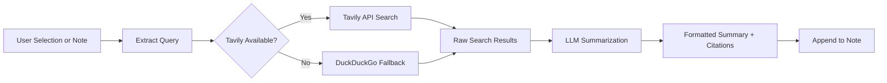

import TLDR from '@site/src/components/TLDR';

# Tutkimus ja verkkokysely

<TLDR>
**Notemd kysytää internetistä tietoa ja lisää LLM - yhteenvetottuja tuloksia suoraan sinun notoihin.** Tavily API on pääkyselypalvelin; DuckDuckGo toimii ilman asetuksia toisen vaihtoehtona. Tulokset yhteenvetottakseen sisältävät lähteitä ja lisätään `## Research`-ohjeen alla. Tukitaan yksityisen noton tutkimus, paketin muodossa kaustan tutkimus sekä tehtäökohdan mukaista mallin valinta yhteenvetottavaksi toimenpiteeksi.

Tämä kuuluu [Obsidian AI-tietojen hallintasuunnitelmaan](/docs/pillar-ai-knowledge).
</TLDR>

## Yleenvaate

Tutkimus on yksi Notemd'nin vahvimmista yhdistelmistä: se sulkee syklin lähdöksen, kyselyn ja kirjoittamisen välillä. Sijaan siitä että vaihtaudut selaimelle tundetun termin etsimiseen, highlightoi sinun se ja lasketaan Notemd kysyä, yhteenvetottaa sekä lisätä tulokset – kaikki sinun avarassasi.

Prosessi on täysin asettettavissa. Vaihtaa voi kyselypalvelija, LLM, joka kirjoittaa yhteenveton, sekä siitä, käytäänkö tuloksia aktiivisen noton alla tai kirjoitetaanko ne erillisiin fiileihin. Paketimodi mahdollistaa tutkimaan kaikki kaustan notot yhdellä klikkaamisella.

## Kuidas se toimii

### Kysely – siirto yhteenvetoon prosessi



1. **Kyselytermien poistaminen** -- Notemd poistaa kyselytermit valinnastasi tai noton titelistä.
2. **Verkkokysely** -- Ensimmäisesti pyritään käyttää Tavily. Jos ei ole määritelty API-avain, käytetään automaattisesti DuckDuckGo (ei avaintia tarvita).
3. **LLM yhteenveto** -- Toimitetut kyselytulokset lähetetään määriteltuun LLM, joka tuottaa lyhyen yhteenveton sisällä olevien lähteiden kanssa.
4. **Lisääminen** -- Muodostettu yhteenveto lisätään `## Research`-ohjeen alla aktiivisen noton alla.

### Tavily vs. DuckDuckGo

| Aspektti | Tavily | DuckDuckGo |
|--------|--------|------------|
| API-avain | Tarvitaan (tila on ilmaista) | Ei tarvita |
| Tulosten laatu | Korkeampi (suunniteltu AI:lle) | Kelpaa yleisiin kyselyihin |
| Kiirustusrajoitukset | Suuri ilmaista taso | Rajoitettu käyttö |
| Konfigurointi | `tavilyApiKey` asetuksissa | Ilmaista konfigurointi – automaattinen vaihto |

### Pakettikatalojen tutkimus

Painaa oikealla painikella kataloosi ja valitse **"Notemd: Tutkimuskatalo"**. Kaikki `.md` -tiedostot kataloossa käsitellään järjestynyt (tai parallellisesti määrattuun samanaikaisuuslukkuun). Jokainen merkintä saa oman tutkimusyhteenvetonsa.

## Konfigurointi

| Asetus | Omistusasetus | Vaikutus |
|---------|---------|--------|
| `tavilyApiKey` | `''` | Tavily API -avain. Kun se on tyhjä, käytetään ainoastaan DuckDuckGo. |
| `researchProvider` / `researchModel` | DeepSeek | Tulostuskäytön LLM -yhteenvetojen tehdäksä |
| `maxResearchContentTokens` | `4000` | Tokenit sisällön lähettämiseen LLM -iin. Liiallinen osa poistetaan. |
| `researchAppendToNote` | `true` | Lisää yhteenveto lähtemerkintään. Jos ei, luodaan erillinen tiedosto. |
| `researchLanguage` | `'en'` | Yhteenvetottujen tutkimusten väljölaskukieli |

### Käytönkohtainen malliennuste

Tutkimuksia hyödyntää malli, joka toimii monikielisen sisällön kanssa ja tuottaa hyvin strukturoituja tekstejä. Voi huomata:

- **DeepSeek** – perusversio, halpa, hyvä laatu
- **GPT-4o** – parempi yhteenvetointi, korkeampi hinta
- **Gemini Flash** – nopea ja odotonta, sopii yleisille kysymyksille

## Esimerkki

Luet artikkelia *transformer attention mechanisms* -teemasta ja satut tundemattomaan termiin: *relative positional encoding*. Sijaan siitä että jätät Obsidian:

1. Valaistaa **"relative positional encoding"**
2. Oikeaklikkaus --> **"Notemd: Tutkimus ja yhteenveto"**
3. Notemd etsii internetistä, yhteenvetoo parhaat tulokset ja lisää:

```markdown
## Research

### Relative Positional Encoding

Relative positional encoding is a method used in transformer models
where positional information is expressed as relative distances between
tokens rather than absolute positions. Introduced by Shaw et al. (2018),
it improves generalization to unseen sequence lengths compared to
absolute encodings (Vaswani et al., 2017).

Sources:
- [Shaw et al., Self-Attention with Relative Position Representations (2018)](https://arxiv.org/abs/1803.02155)
- [Transformer Positional Encoding Overview](https://example.com/transformer-pos-enc)
```

Yhteenveto on nyt osa sinun avarastasi – se on hakettavaa, yhdistettävää ja käytettävää offline.

## Vinkit

- **Määri Tavily-kehys parhaiden tulosten saamiseksi** – jopa ilmaista taso tarjoaa paremman relevanssin kuin raaka DuckDuckGo.
- **Käytä voimakasta yhteenvetointimallia** – halvat mallit voivat tuhota nykyisiä teknisitä tietoja.
- **Tutka kokonaan** jälkeen ensimmäisen lähdön, jotta voit täyttää tilanteita useissa notioissa yhtä aikaa.
- **Tarkista lisättyjä yhteenvetoja** – LLM-mallit voivat luoda epätoivoisia lähteetietoja. Verraa tärkeitä väiteitä.

---

## Järguvät toimet

- [Concept Notes](./concept-notes) – Eritä ja säilytä tärkeät terminit tutkimustuloksista
- [Wiki-Links](./wiki-links) – Yhdistä tutkimuksista saatuja konseptteja sinun avarassasi
- [Translation](./translation) – Kääntä tutkimusyhteenvetoja toiseen kieliin
- [LLM Tarjoajat](/docs/providers/overview) -- Konfiguroi yhteenvettoinnissa käytettävä malli
