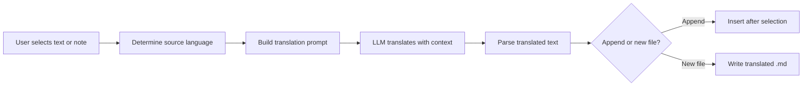

import TLDR from '@site/src/components/TLDR';

# Käännös

<TLDR>
**Notemd kääntää tekstiä 21+ kielen välillä LLM-voimistettuun kääntöpalveluun.** Se toetaa yksityisen valinnan kääntöä, koko notan kääntöä sekä paketin kaustan kääntöä. Jokainen kääntötöitä tehtävä voi käyttää erillistä tarjoajaa ja mallia tehtävän asetuksien kautta. Tuloksentekieli on erikseen käsiteltävää UI-kielistä. Tulokset lisätään alkuperäiseen tekstiin tai kirjoitetaan uudeen tiedostoon vastaavasti sinun valintasi mukaan.

Tämä kuuluu [Obsidian AI-tietojen hallintasuunnitelmaan](/docs/pillar-ai-knowledge).
</TLDR>

## Yleenvaate

Kääntö Notemd-ssä ei ole sanokirjan etsintä – se on LLM-voimistettu, kontekstitunnettu kääntö. Malli näkee koko paragrafin tai notan, säilyttäen tonin, alueellisen terminologian ja lausestrukturan. Tämä tuottaa parempia tuloksia kuin lauseittain toimivat palvelut, erityisesti teknisessä, akateemisessa ja luovassa kirjoituksessa.

Tämä ominaisuus toetaa kolmea alueetta: valinta, aktiivinen notta ja koko kausta. Yhdistettyä tehtävän mukaiseen mallivalintaan käyttäen voit käyttää nopeaa mallia (Gemini Flash) vapaalle kääntöille ja voimakasta mallia (Claude Sonnet) nuansseihin tarkkaan sisältöön – ilman että sinun pitää muuttaa omaa globaalista tarjoajaa.

## Kuidas se toimii

### Kääntökomento



1. **Lähteikielen tunnistaminen** – LLM arvostaa lähteikieleen sisältöstä. Ei tarvitse sitä käsitsi määritellä.
2. **Kysymyksen luominen** – Notemd luoo kysymyksen, jossa on tarkoituksentekieli, valittavasti alueellinen vihje ja kääntettävä sisältö.
3. **LLM-kääntö** – Konfiguroitu `translateProvider` / `translateModel` käsittelee pyytämystä. Malli säilyttää markdown-muotoilu, wiki-linkit ja koodiplokkit.
4. **Tulokset** – Kääntetty teksti lisätään alkuperäisen tekstin alle tai kirjoitetaan uudeen tiedostoon avarassa.

### Kieletynjot

Notemd toetaa kaikki kieletynjot, jotka perustavan LLM toetaa. Yleisimmät yhteydet ovat:

| Lähteikieli | Tavoite | Typinen laatu |
|--------|--------|----------------|
| Englanti | Kiina (lihtentetty) | Suuretlaatuinen |
| kiinakieli | englanti | suuretuloinen |
| englanti | japankieli | hyvä |
| englanti | saksa / ranska / espanja | hyvä |
| mistä tahansa tuettu | mistä tahansa tuettu | mallitaito |

The `translateLanguage` setting controls the **output language**. The source language is auto-detected.

### Mallin valinta tehtävälle

Käännön laatu muuttuu merkittävästi mallin mukaan. Notemd lets you assign a dedicated model just for translation:

| Malli | Nopeus | Laatu | Kustannus | Paras käyttö |
|-------|-------|--------|------|----------|
| `gemini-2.0-flash-exp` | Nopea | Hyvä | Matala | Välinainen, suuri määrä |
| `gpt-4o-mini` | Nopea | Hyvä | Matala | Nopeat etsintät |
| `deepseek-chat` | Keski | Hyvä | Väliin pieni | Budjettinen monikielinen |
| `claude-3-5-sonnet` | Keski | Suuretulot | Keski | Tekniset / akateemiset |
| `gpt-4o` | Keski | Suuret | Keski | Nüansseihin tarkka prosa |

### Pakettikatalojen kääntö

Painaa oikea painiketta katalolle ja valitse **"Notemd: Kääntä kataloosi"**, jotta kääntetään kaikki märkinnät selle katalon sisällä. Jokainen tiedosto käsitellään erikseen. Samaa aikaa käsiteltäviä tiedostoja määrittelee suoratoimisuasetus.

## Konfigurointi

| Asetus | Omistusasetus | Vaikutus |
|---------|---------|--------|
| `translateProvider` / `translateModel` | DeepSeek | Erihallintaa tarjoava palveluntarjoaja kääntötyöksille |
| `translateLanguage` | `'en'` | Tarkoituksikieli |
| `translationAppendToNote` | `true` | Lisää kääntetty teksti alkuperäisen tekstin alle. Jos arvo on false, luodetaan uusi tiedosto. |
| `batchConcurrency` | `3` | Pakettikääntön aikana samaa aikaa käsiteltäviä tiedostojen määrä |

## Esimerkki

Luet kiinalaisen tutkimusmärkinnän ja haluat sen englanninkielisen version.

1. Avaa märkinnä
2. Painaa oikea painiketta --> **"Notemd: Kääntä nykyinen tiedosto"**
3. Notemd tunnistaa kiinan kielen, kääntää sen sinun määritellytään tarkoituksikielille (englantiin) ja lisää:

```markdown
## Translation (English)

The experimental results show that the proposed method achieves
a 12% improvement in F1 score compared to the baseline, primarily
due to the enhanced feature extraction module described in Section 3.
```

Alkuperäinen kiinalainen teksti jää muutomattomana käännön yläpuolelle. `## Translation`-ohje säilyttää mbothat versiot samassa tiedostossa helposti saatavaksi.

## Vinkit

- **Käytä Gemini Flash suurtiloille** -- se on nopein ja halvimpi valinta suurten katalojen pakettikääntöön.
- **Säilytä wiki-liitokset** -- Notemd:n käsku kertoo LLM:lle, että `[[wiki-links]]` tulee säilyttää muotoilun aikana muutomattomana. Tarkista tuloksen jälkeen, koska jotkut mallit voivat aikaisin poistaa ne.
- **Määritä väljöksi oleva kieli selkeästi** -- automaattinen tunnistus toimii lähteeksi, mutta konfiguroi aina `translateLanguage`, jotta ei ole epäselvyyttä siirtokysestä.
- **Kertokirjojen paketimuotoilu** -- jos sinun kertokirjoiden kansio on yhdessä kielessä ja sinun on tarpeen ne toisessa kielessä, kansioluokanmuotoilu tekee sen yhden kerralla.

---

## Järguvät toimet

- [Research](./research) -- etsi ja yhteenvetöitä minkä kielellä tahansa, sitten muotoila tulokset
- [Workflows](./workflows) -- yhdistä muotoilu wiki-liitoksien tai kertokirjojen poistamisen kanssa
- [Batch Processing](/docs/advanced/batch-processing) -- samanaikaisuus ja uudelleenkirjoittaminen kansiolaittojen käytössä
- [LLM Providers](/docs/providers/overview) -- valitse parhaa mallia sinun kielipaarille
