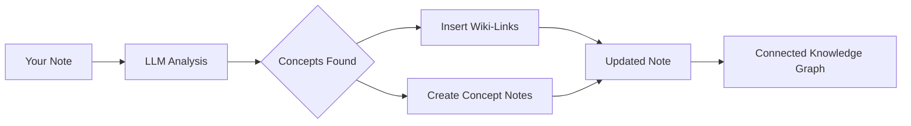

import TLDR from '@site/src/components/TLDR';

# Wiki-linkit

<TLDR>
**Notemd lisää automaattisesti `[[wiki-links]]` tärkeille käsitteille sinun notioihisi.** LLM lukee sinun sisällön, tunnistaa kontekstissa tärkeitä terminejä ja lisää Obsidian-tyylin wiki-linkit jokaisessa esiintymissä. Vaihtoehtoisesti luodaan konsepttipalat taaslinkkeillä. Tukitaan samasanojen poistaminen, linkin turvallisuus muuttamisen tai poistaman yhteydessä sekä puhtaasti extraktio-režiimi (ilman tiedostojen muutoksetta). Erillisesti Auto Linkistä, joka sopii vain olemassa olevien notion nimille, Notemd käyttää AI:aa uusien käsitteiden tunnistamiseen ja vastaavien notiojen luomiseen. Tämä kuuluu [Obsidian AI-tietojen hallintan ohjeeseen](/docs/pillar-ai-knowledge).
</TLDR>

## Yleenvaate

Wiki-linkit ovat Notemd:n keskeinen ominaisuus. Se muuntaa tavallisen tekstin yhdistetyiksi tietojen graafikuksi seuraavilla tavoin:

1. **Analysoi sinun notioisi** käyttäen LLM
2. **Tunnistaa tärkeitä käsiteitä** (termineet, henkilöt, metodit, teooriat)
3. **Lisää `[[wiki-links]]`** jokaisessa esiintymissä
4. **Luo konsepttipalat** (valittavasti) taaslinkkeillä

## Kuidas se toimii

### Prosessi



### Esimerkki

**Ennen:**
```markdown
Machine learning models use neural networks to learn patterns from data.
The transformer architecture revolutionized natural language processing.
```

**Jälkeen:**
```markdown
[[Machine learning]] models use [[neural networks]] to learn patterns from data.
The [[transformer architecture]] revolutionized [[natural language processing]].
```

## Käyttö

### Perus: Lisää linkit nykyiseen notioon

1. Avaa tiedon
2. Painaa oikea painikka editorissa → **"Process file (add links)"**
3. Oota muutama sekunti
4. Käsitteet ovat nyt yhdistetyt!

### Paketti: Käsittele useita merkintöjä

1. Oikeasta paina kaustaa tiedostovalitsemissa
2. Valitse **"Notemd: Process folder (add links)"**
3. Konfiguroi:
   - Samaa aikaa käsiteltäviä tiedostoja (miten paljon)
   - Uusikaata olemassa olevat linkit (kyllä/ei)
4. Paina **Käsittele**

### Valintainen: Linkita konkreettinen teksti

1. Esitä teksti, joka käsitellään
2. Oikeasta paina → **"Käsittele valinta (lisää linkkejä)"**
3. Ainoastaan esitetty osa analysoituu

## Notemd vs Auto Link

Obsidianilla on kaksi lähestymistapa automaatiseen wiki-linkkistämiseen:

| | **Auto Link** | **Notemd** |
|--|---------------|-------------|
| Linkkin lähteä | Vaultissa olevat olemassa olevat merkintöjen nimet | LLM-tunnistetut käsitelmän sisällössä olevat konseptit |
| Yhteydet uusiin käsiteltyihin | Ei — otsikko mussi jo olla olemassa | Jaa — AI tunnistaa käsiteltyjä ja luoo merkintöitä |
| Synoniimien hallinta | Ei | Jaa — synoniimien poistaminen |
| Käsiteltyjen merkintöjen luominen | Ei | Jaa — taasyhteyksillä ja duplikaatien poistamisella |
| Pakettiprosessointi | Ei (yksi tiedosto) | Jaa (kaustatasolla) |
| Toimenpito per toimenpide | Ei | Jaa |

**Auto Link** toimii otsikkojen mukaisesti: jos merkintö nimeä "Machine Learning" on olemassa, se muotoi esiintymät `[[Machine Learning]]`-ksi. Jos merkintö ei ole olemassa, ei tapahtu mitään.

**Notemd** on AI-johdonnoitu: LLM lukee sinun sisällön, ymmärtää kontekstin, tunnistaa käsiteltyjä, jotka *sulkeutuvat* yhteydeksi — even if no note exists yet — ja luoo sekä yhteyden että käsiteltyjen merkintöjen.

## Ominaisuudet

### Synoniimien poistaminen

**Probleemi:** "transformer", "transformers", "Transformer architecture" → 3 erillistä käsiteltyä

**Lösung:** Notemd tunnistaa lähellisiä duplikaateja ja käyttää kanoninen muoto.

**Konfigurointi:**
```
Settings → Advanced → Synonym Suppression
Threshold: 0.8 (0 = off, 1 = aggressive)
```

### Linkintä turvallisuus

**Kun nimetät uudellean käsitteellistä tiedostoa:**
- Kaikki wiki-linkit päivitetään automaattisesti (Obsidian pääominaisuus)
- Tagasilinkit pysyvät muutomattomina

**Kun poistat käsitteellisen tiedoston:**
- Linkit pysyvät mutta näkyvät „unlinked mentions“-ena
- Voit luoda uudelleen mistä tahansa esiintymistä

### Puhtaasta extraktointimodeilla

**Extrahoi käsitteet ilman alkuperäisen tiedoston muuttamista:**

1. Paina oikea painikko → **„Extract concepts (no linking)"**
2. Käsitteelliset tiedostot luodut
3. Alkuperäinen tiedosto muutomaton

Käyttötila: Ainoastaan lukemiskelvollisen sisällön tai lopullisten versioiden käsitely.

## Käsitteellisten tiedostojen luontaminen

### Automatinen luontaminen

**Kun se on aktivoitu (varsinaisesti), Notemd luostaa:**

```markdown
---
tags: [concept, auto-generated]
created: 2026-06-13
source: [[Original Note Name]]
---

# Machine Learning

A branch of artificial intelligence that enables computers
to learn from data without explicit programming.

## Occurrences in Your Vault

- [[Original Note Name#Section]]
- [[Another Note#Header]]

## Related Concepts

- [[Neural Networks]]
- [[Deep Learning]]
- [[Supervised Learning]]
```

### Konfigurointi

**Tulostuskausta:**
```
Settings → Output → Concept Folder
Default: concepts/
```

**Hierarktilinen strukturi:**
```
Settings → Output → Use Hierarchical Folders
If enabled:
  papers/my-paper.md → papers/concepts/Concept.md
If disabled:
  → concepts/Concept.md
```

**Malli:**
```
Settings → Output → Concept Template
Customize with variables:
  {{concept}} — Concept name
  {{description}} — LLM-generated description
  {{backlinks}} — List of source notes
  {{date}} — Creation date
```

## Edistyneet valintat

### Yhteyspano

**Miten paljon ympäristötekstiä lähettää:**

```
Settings → Linking → Context Window
Options: Sentence | Paragraph | Full Note
Default: Paragraph
```

Suurempi = parempi tarkkuus, suurempi hinta.

### Minimaaliset esiintymät

**Linkitä vain ne käsitteet, jotka ilmuvat usein:**

```
Settings → Linking → Min Occurrences
Default: 1 (link all)
```

Asenna 2 tai 3, jotta keskittytään kertoisiin teemoihin.

### Ekskluudiromaat

**Jätä käyttöön teatud sanojen:**

```
Settings → Linking → Exclude List
Example: note, idea, example, thing
```

Tässä tavalla estetään yleistä termineiden liian paljon linkitsemistä.

### Kohdanomaiset pyyntöt

**Ylöntaa varsinaisia LLM ohjeita:**

```
Settings → Advanced → Custom Linking Prompt
Default:
  "Identify key concepts, theories, methods, and technical
   terms in the following text. Return as a list..."
```

Muokkaa niitä domaaniin specifickeihin tarpeisiin (esim. "Keskittyy meditsiiniterminologiaan").

## Vinkit ja parhaat praktiikat

### ✅ TEKÄ

- **Tarkista tiedot, joilla on >100 sanaa** — Korkean pituuden tiedot sisältävät vähän käytännöllisiä aihetoimeita
- **Käytä voimakkaia mallia** paremmalle aihetoimien tunnistamiseen (GPT-4o, Claude)
- **Tarkista ennen hyväksymistä** — Varmista, että suositeltuja linkkejä on sinnillisiä
- **Valmistaa iteratiivisesti** — Tarkista 5–10 tiedostoa, vaatita graafiaa, päivitä asetukset

### ❌ ÄÄTKÄ

- **Yli-linkkaista** — Ei jokaiselle sanalle tarvitse olla linkki
- **Tarkista muotoiluja kerran toisensa jälkeen** — Aihetoimet voivat muuttua, odota stabilisointia
- **Jätä synonyymit huomiotta** — Aktivoi estämistä, ettei ilmene "ML" vs "Machine Learning"

## Toimintaehdot

### Nopeus

| Tiedoston suurus | GPT-4o-mini | Claude Sonnet | Ollama (lokalisoinnin) |
|-----------|-------------|---------------|----------------|
| 500 sanaa | 2–3 sekuntia | 3–5 sekuntia | 5–10 sekuntia |
| 2000 sanaa | 5–8 sekuntia | 10–15 sekuntia | 20–40 sekuntia |
| 5000+ sanaa | Osittainen (useita kutsuja) | Osittain | Osittain |

### Kustannusarvio

**Esimerkki: 1000-sanan longheet GPT-4o-mini kanssa**
- Sisäänantava määrä: ~1500 tokenia
- Lähteenväli: ~200 tokenia
- Kustannus: ~

**100 merkkinen parantaminen paketittain:** ~

## Virheiden ratkaiseminen

### Ei linkkejä lisätty

**Kontrolloi:**
1. LLM kutsu on suoritettu edullisesti (Asetukset → Diagnostiikka)
2. Notissa on tarpeeksi sisältöä (>50 sanaa)
3. Konseptit ovat tekniset/tarkoitukselliset (ei vain sanajäsenet)

**Proovi:**
- Käytä voimakkaampaa mallia
- Suurenta kontekstikokoa
- Kontrolloi API-avainnin todellisuutta

### Liian paljon linkkejä

**Lääket**
1. Suurenda minimaaliset esiintymät (2 tai 3)
2. Lisää yleisiä sanoja poistolistaan
3. Käytä vähemmän aggressiivista mallia

### Väärit tiedot yhdistetyt

**Parannukset:**
1. Käytä käsiteltävää pyyntöä domaani specificiteettiin
2. Aktivoi sanonyksensupressio
3. Tarkista käsittävästi ja poista yhdistykset

### Linkit katkeuvat muuttamisen jälkeen

**Tämä on normaalinen Obsidian toiminta.**

Kaikkeen linkkien päivittämiseen:
1. Muokkaa konsepttikuvaus
2. Obsidian päivittää automaattisesti `[[old]]` → `[[new]]`

---

## Järguvät toimet

- 📖 [Konsepttikuvausnotat](./concept-notes) — Syvällinen yksityiskohtainen tutkimus konsepttikuvausten luomista
- 🔍 [Tutkimuksen yhdistäminen](./research) — Yhdistä linkit verkkotutkimuksien kanssa
- 🎨 [Diagrammit](./diagrams) — Visualoi sinun tietoympyränsi
