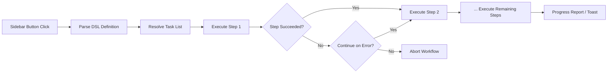

import TLDR from '@site/src/components/TLDR';

# Työprosessit

<TLDR>
**Notemd Työprosessit yhdistävät useita tehtäviä yhteen yhdellä klikkaamisella toimintoon.** Määritä järjestelmät kuten `add-links > extract-concepts > research > diagram` käyttäen yksinkertoa DSL:aa. Työprosessit ilmuvat puolekaluun painikkeina, jotka käyttävät koko ketjun nykyisessä tiedostossa tai kaustassa. Asennuksessa on olemassa etukäteen määriteltyt työprosessit; luodaan omat asetuksissa. Jokainen vaihe käyttää omaa tehtävälle specificoidutta mallikonfigurointia.

Tämä kuuluu [Obsidian AI-tietojen hallintasuunnitelmaan](/docs/pillar-ai-knowledge).
</TLDR>

## Yleenvaate

Työprosessi poistaa vaikeuudet tehtävien yksittäisen käyttöön. Sijaan siitä, että pitäisi oikeasta klikkaa neliä kertaa linkkien lisäämiseen, käsitteiden poistamiseen, tuntumattomien termien tutkimiseen ja diagrammin luomiseen, painaat yhdellä puolekalun painikkeella ja koko ketju käytetään. Notemd hallitsee järjestelmän, virheiden levymisen ja edenpidon raportoinnin.

Työprosessit määritetään kerrokselta DSL:lla (alueellisella kielenä). Ne asuvat asetuksissa, ilmuvat Obsidian puolekalun klikattavina painikkeina ja ne voivat soveltaa jaksoon nykyiseen tiedostoon tai koko kaustaan.

## Kuidas se toimii

### Työprosessin käyttöketju



1. **Tulkita** -- DSL-teksti jakataan `>` (tai `>`) perusteella järjestykselliseen tehtävien tunnistajien listaksi.
2. **Tarkistaa** -- Jokainen tunnistaja siirtyy sisäisen komentoon (add-links, extract-concepts, research, translate, diagram jne.).
3. **Käyttää** -- Vaiheet käytetään järjestyksellisesti. Jokainen vaihe käyttää konfiguroituja tehtävälle specificoituja tarjoajia ja mallia.
4. **Virhehallinta** -- Jos vaihe ehtyy, työprosessi tai poistaa tai jatkaa seuraavaan vaiheeseen, riippuen sinun virhepolitiikastasi.
5. **Valmis** -- Ilmoitus raportoi edun tai listoi kaikki ehtyneet vaiheet.

### DSL-muoto

Työprosessit määritetään `>`-erottuina tehtävien tunnistajien järjestelmänä:

```
process-current-add-links>extract-concepts-current>research-and-summarize
```

**Saadaolevat tehtävien tunnistajat:**

| Tunnistaja | Toimenpide |
|------------|--------|
| `process-current-add-links` | Lisää wiki-linkkejä aktiiviseen tiedonnotkoon |
| `extract-concepts-current` | Eritä käsiteltyistä tiedonnotkosta käsitelmälliset ajatukset |
| `research-and-summarize` | Tutka valittu teksti tai tiedonnotkan nimi |
| `process-current-translate` | Kääntä aktiivinen tiedonnotka |
| `summarize-to-mermaid` | Luo diagramma aktiivisestä tiedonnotkasta |
| `generate-from-title` | Luo sisältö tiedonnotkan nimestä |
| `extract-original-text` | Eritä alkuperäinen teksti (OCR-/skannattuun sisältöön) |

**Kataloogitasolla olevat variantit** asettaavat `current`:n `folder`:ksi tunnistusnimen kanssa.

### Eelmäntunnustetut vs. käsiteltävät työprosessit

Notemd sisältää valmiita työprosesseja yleisille mallille:

| Työprosessi | Ahelma | Käytöskenttä |
|----------|-------|----------|
| **Yhden painutuksen päälle erittäminen** | add-links > extract-concepts > research | Tehokkaasti töidä tutkimusartikkelia yhdellä kerralla |
| **Koko tuotantopiste** | add-links > extract-conceptit > tutkimus > diagrammi | Täydellinen tietojen poistaminen visualisoinnin kanssa |
| **Kääntä + Linkkaa** | kääntä > add-links | Kääntä ja linkkaa konseptit siirtymäkielille |

**Omakustoidut työprosessit** luodaan asetuksissa:

1. Avaa **Asetukset** --> **Notemd** --> **Työprosessit**
2. Painaa **"Lisää työprosessi"**
3. Sisesta DSL-ahelma (esim. `process-current-add-links>extract-concepts-current`)
4. Anna sille näytönime (esim. "Nopea linkka + Poistaminen")
5. Uusi painikko ilmuu välitaulukossa heti

## Konfigurointi

| Asetus | Omistusasetus | Vaikutus |
|---------|---------|--------|
| `workflows` | Eelmästä määritetty joukko | Työprosessien definitsiojen array (nimi + DSL) |
| `workflowContinueOnError` | `true` | Jatka seuraavaan vaiheeseen, jos nykyinen vaihe ehtyy |
| `workflowShowProgress` | `true` | Näytä edistymistietoja jokaisen vaiheen valmistumisen jälkeen |

### Työprosessissa olevat tehtäökohdan mallit

Jokainen toimenpideen vaihe käyttää omaa taskatyyppillistä mallikonfigurointia. Ei ole tarpea määritellä mallia DSL:ssä itse. Ratkaisun järjekordi on:

1. Taskatyyppinen tarjoaja/malli, jos `useMultiModelSettings` on käytössä
2. Yleinen `activeProvider` muuten

Tämä tarkoittaa, että `add-links` voi toimia DeepSeek-llä samalla kun `research` toimii GPT-4o -llä – kaikki samassa toimenpideen klikissa.

## Esimerkki

Olet just impordinnut yhtä PDF-a masinoppimisartikkelista omaan avaruksesiin ja haluat täysän tietojen poistamisen:

1. Avaa impordattu tiedosto
2. Klikkaa **"Full Pipeline"** -painiketta sijainnivalikossa
3. Notemd käynnistyy:
   - **Toimenpide 1**: Lisää wiki-linkkejä – `[[attention mechanism]]`, `[[transformer]]` jne.
   - **Toimenpide 2**: Poista käsiteltyjä aineita – luodaan aineetiedot sinun aineetokiossi
   - **Toimenpide 3**: Tutkinta – yhteenvetottavat verkkolähteet keskeisiin termiin
   - **Toimenpide 4**: Diagramma – luodetaan Mermaid-malli artikkelin rakenteesta
4. Laukkuun noin 30 sekuntia myöhemmin on tiedostossa linkkit, aineetiedot ovat olemassa, tutkimustulokset on lisätty ja diagrammatoimi on salattu

Kaikki yhden klikin kautta.

## Vinkit

- **Alka etukäteen määriteltyiltä toimenpiteiltä** – ne kattavat useimmat yleiset mallit. Kohandaa vain siis, kun tarvitset erilistä järjestystä.
- **Aktivoi `workflowContinueOnError`** – epäonnistunut diagrammatoimenpide ei tohisi estää koko toimenpideen toimintaa.
- **Käytä kansiojen työprosesseja** massitööhöntekoon – oikeasta paina kansiolle, valitse työprosessi, ja kaikki tiedot töidetään.
- **Nimeä työprosessit selkeästi** – puolekaluun on rajoitettu tilaa. Käytä lyhkiä, toimintoorihtisiä nimesiä kuten "Quick Extract" tai "Translate + Link".

---

## Järguvät toimet

- [Research](./research) -- Ymmärkää, mitä tutkimusvaihe tekee, ennen kuin lisätät sen työprosesseihin
- [Wiki-Links](./wiki-links) -- Päälinkitysteknologia, jota käytetään useimmissa työprosesseissa
- [Concept Notes](./concept-notes) -- Ajattelun poistaminen työprosessivaiheena
- [Batch Processing](/docs/advanced/batch-processing) -- Samaa aikaa toiminta ja edenemismäärän raportointi kansiojen työprosesseissa
