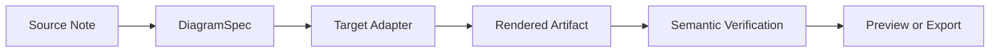
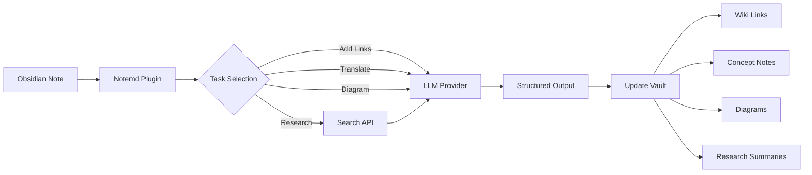

import TLDR from '@site/src/components/TLDR';

# Esittely Notemd:sta

<TLDR>
**Notemd** (Note + EMD — Enhanced Markdown Documents) on avoimen lähtekoodin Obsidian-plugini, joka muuntaa LLM-välineillä tehtyä lukemista kestävään tietoon. Erillisesti chat-pohjaisista AI-laitteista, joissa tiedot kadovat keskustelun jälkeen, Notemd kirjoittaa tulokset **direktiivisesti sinun vaultisiin** wiki-linkkejä, konseptitietoja, tutkimusyhteenvetoja, käännöksiä, työprosesseja ja diagrammeja. Se on suunniteltu tutkijille, opiskelijoille ja tietojenhankkijoille, jotka haluavat, että heidän lukemisensa, tutkimustensa ja visuaaliset selityksensä koonnistuvat strukturoituun, kehittyvään tietograafioon.
</TLDR>

## Mitä on Notemd?

Notemd yhdistää **30+ suurta kielellistä mallia** (OpenAI, Anthropic, Google, DeepSeek, Qwen, Ollama ja muut) sinun Obsidian-työprosessisiin, jotta voidaan automatisoida tietojen poistaminen, organisoiminen, kääntö, tutkimus ja diagrammin luominen.

### Päätilanne: hetkelliset vs. kestävät tietot

| Aspektti | Chat-pohjainen AI (ChatGPT jne.) | Notemd |
|--------|-------------------------------|--------|
| **Kuhaan tulokset menevät** | Chat-tiedot (kadovat) | Sinun Obsidian-vaultisi (kestää) |
| **Muoto** | Simpelit tekstivastaukset | Strukturoituja tiedostoja: `[[wiki-links]]`, konseptitietot, diagrammit |
| **Pikaaikainen arvo** | Tulee uudelleen kysyä jokaisen kerran | Koonnistuu tietograafioon |
| **Poistotietoisuus** | Interneti on tarpeen | Toimii täysin poistotietoisuudessaan Ollama |

## Päätoiminnot

### 1. **Automaattinen wiki-yhdistäminen**
- LLM tunnistaa keskeiset käsitteet sinun notioissasi
- Lähetää `[[wiki-links]]` jokaisessa ilmumisessa
- Vaihtoehtoisesti luodaan yhdistetyt käsitteetiedot
- Synonyymien poistaminen dupliikkojen välttämiseksi

### 2. **Käsitteetiedon luominen**
- Tarkistaa keskeiset käsitteet artikkeleista, paperista ja notioista
- Luo erilliset käsitteetiedot taustalinkkien kanssa
- Kohdannettavat väljälaskutilat ja mallit

### 3. **Web-tutkimuksen yhdistäminen**
- Etsi Tavily tai DuckDuckGo Obsidian sisällä
- LLM yhteenvetoo tuloksetta lähtöviiteiden kanssa
- Lisää tutkimustulokset nykyiseen notiin

### 4. **Monikielinen kääntö**
- Kääntä valituja osia tai koko notia
- Toetetaan 21+ UI kieltä
- Suora uloskirjautumiskielen konfigurointi
- Pakettikääntön tuki

### 5. **Diagrammien luontaminen**
- **Mermaid**: Vierailukartat, järjestys-, klassi-, tila-, ER- ja Gantt-diagrammit
- **JSON Canvas**: Obsidian kansalliset paikannusmuodot
- **Vega-Lite**: Datadiagrammit, aikaseriat ja hajureitodiat
- **HTML / Muokattavat HTML/SVG**: Itsevalmis kuvat kohtaisilla semantisten annotaatioiden kanssa
- **Draw.io / Drawnix artefaktien rajat**: Hoitajan käyttöön suunnatut eksportit samasta semantisesta kuvamallista
- **Välinekuvadiagrammien suunnitelma**: circuitikz/TikZJax tuki suunnitellaan kuldisten viiteiden, rajoitettujen pyyntöjen, renderoinnin palautteiden ja topologian/paikannusvalvontan perusteella, ei raakaan, rajoitteittomaan LLM TikZ:ään
- **Eelennäksen diagnostiikka**: Renderoidut artefaktit voivat paljastaa komentoinnin/renderoinnin virheiden diagnostiikan, ja epälinjaisia lähteitä voi tarkistaa ilman pluginin LaTeX-ytimen tarpeetta
- Mermaid-virheiden syntaksi-autotoisto

### 6. **Yhden painutuksen käyttöflussit**
- Ketjosta useita toimintoja puutarhakkeen painikeiksi
- DSL-pyyhin tööflussin määrittely
- Esimerkki: `add-links > extract-concepts > research > diagram`

## Kuka sollte Notemd käyttää?

✅ **Tutkijat**, jotka läsentävät artikleja ja luovat kirjallisuusarvioita
✅ **Opiskelijat**, jotka järjestävät opinnannottoja ja luovat konseptikaarteja
✅ **Tietojenkäyttäjät**, jotka haluavat, että läsityksensä pysyisi
✅ **Kaksikieliset ammattilaiset**, jotka tarvitsevat kääntöä + wiki-yhdistäyksiä
✅ **Yksityisyystunneelliset käyttäjät**, jotka haluavat paikallista LLM-tukia (Ollama)
✅ **Vaihtoehtoiset käyttäjät**, jotka kohandavat pyyntöjä ja tööflussia

## Miksi Notemd + Obsidian?

**Obsidian** on paikallisuuskeskistyn, markdown-pyyhin tietojankanta. **Notemd** lisää AI-voimia:
- Sinun dataasi pysyy sinun avarassasi (ei pilvapalvelussa)
- Toimii offline paikallisten mallien kanssa
- Tasuta ja avoimen lähtekoodin (MIT-litsenssi)
- Yhdistyy olemassaoleviin Obsidian-plugineihin
- Skaalautuu kymmeniin tuhannoihin nooteihin

## Alustus

1. **Asenna**: Asetukset → Yhteisöpluginit → Selaa → "Notemd"
2. **Konfiguroi**: Lisä sinun LLM-palveluntarjoajan API-avain (tai käytä lokalaista Ollama)
3. **Proovi**: Avaa noiteen → Oikeasta paina → "Tulkita tiedosto (lisää linkkejä)"
4. **Tutkii**: Katso sivupalkki yhdellä klikkaulla toimintaketjuja

👉 [Asennusohje](./getting-started/installation) | [Nopean alustuskoulutus](./getting-started/quick-start)

## Diagrammit – suunta kehityksessä

Notemd-diagrammit ovat muuttumassa "kysy mallilta kirjoittaa yksi syntaksisano"-mallista suoraan kerroksittuun käytäntöön:

Prahtinen rakentus tukee jo Mermaid, JSON Canvas, Vega-Lite, HTML-varauksia, muokattavaa HTML/SVG-, Draw.io XML-tuotteita, minimaalista Drawnix JSON-alamryhmää, ennittelydiagnostiikkaa/tai vain lähteetiedostoja varauksina sekä offline `CircuitSpec -> circuitikz`-proototyyppejä yleisille lähteille ja CMOS-inverterin kultatempliteille. Välineiden diagrammit ovat vaikeampia: circuitikz voi ilmaista täpsää elektrisen topologian, mutta rajoitsemattomat LLM-lauskitukset tuovat usein lukemattomia suunnittelua tai renderoituutta epätoivottavat LaTeX-tiedostot. Seuraava suunta on säilyttää circuitikz rajoitettuna kultatempliteiden, sijaintisilmukkien asetuksien, renderointidiagnostiikan ja kuvauskuvien palautusaheloiden avulla.

Lue tarkemmat [Diagrammit](./features/diagrams)-artikkelissa.

## Arkkitehtuuri

## Notemd vs muut Obsidian-AI-pluginit

Enimmäiset Obsidian-AI-pluginit ovat keskittyneet vuoropuheluun (sinä kysyt, AI vastaa, tiedot jäävät chatiin). Notemd on **kirjoituskeskistynyt**: AI töötlee sinun noitteesi ja kirjoittaa strukturoituja tulemusia suoraan sinun avaruksesiin.

| Toimintavaihtoehto | Notemd | Copilot | Smart Connections | Text Generator |
|-----------|--------|---------|-------------------|-----------------|
| Auton wiki-linkin lisääminen | Jaa | Ei | Ei | Ei |
| Kontsepttipyynnön luominen | Kyllä (backlinkit + duplikaatien poistaminen) | Ei | Ei | Ei |
| Diagrammin luominen | Kyllä (Mermaid, Canvas, Vega-Lite, HTML, muokattavat artektit) | Ei | Ei | Ei |
| Webin tutkimusten yhdistäminen | Kyllä (Tavily + DuckDuckGo) | Ei | Ei | Ei |
| Pakettikanssojen töötely | Jaa | Rajoitettu | Ei | Rajoitettu |
| Toimenpito per toimenpide | Kyllä (7 tehtävää, itsenäiset mallit) | Ei | Ei | Ei |
| Yhdellä painamiskertaa toimintajonot | Kyllä (DSL) | Ei | Ei | Ei |
| Kääntö (paketti) | Jaa | Ei | Ei | Ei |
| Viestintä varastokoneen kanssa | Ei | Jaa | Ei | Ei |
| Semantinen sarnasuuskysely | Ei | Ei | Jaa | Ei |
| Mallipohjainen generointi | Ei | Ei | Ei | Jaa |
| LLM palveluntarjoajat | 36 (pilvetti + käyttöpäässä + lokalisoinnin) | 3-5 | 2-3 | 3-5 |
| Täysin offline | Kyllä (Ollama) | Osittainen | Osittainen | Osittainen |

**Milloin valita Notemd**: Haluat, että AI luottaa pitkäaikaisen tietograafian – ei vain keskustele sinun muistatuksetta.

**Milloin valita Copilot**: Haluat vestlevän AI-assistentin Obsidian sisällä.

**Milloin valita Smart Connections**: Haluat avastaa olemassa olevat suhteet merkintöjen välillä semantisen hakun kautta.

## Filosofia

**Notemd uskee, että AI sollte den menschlichen Wissensaufbau ergänzen, nicht ersetzen.** Palvelu:
- Pitoi sinut kontrollissa (tarkista ennen muutoksien soveltamista)
- Ymmärtää kontekstin (kaikki tulokset viitavat lähteeseen)
- Respektoi yksityisyttä (sijallinen LLM-tuki, ilman telemetriaa)
- Jää laajentettavaksi (avattu APIs, käsiteltyt työprosessit)

<!-- notemd-acknowledgments -->
## Kiitokset ja viiteprojektit

Notemdia ylläpidetään itsenäisesti. Kiitämme avoimen lähdekoodin projekteja ja yhteisöjä, jotka ovat vaikuttaneet dokumentoituihin suunnittelupäätöksiin tai tarjoavat integraatioiden perustan. Maininta tunnustaa vain vaikutuksen tai yhteentoimivuuden; se ei tarkoita hyväksyntää, sidossuhdetta, mukana toimitettua koodia tai väitettä koodin uudelleenkäytöstä.

- **Viiteprojektit:** [cloudy-tech-diagrams-skill](https://github.com/cloudy-liu/cloudy-tech-diagrams-skill), [Drawnix](https://github.com/plait-board/drawnix), [diagrams.net / draw.io](https://www.diagrams.net/), [repo-saga](https://github.com/teee32/repo-saga).
- **Avoimen lähdekoodin perustat:** [Mermaid](https://github.com/mermaid-js/mermaid), [Vega-Lite](https://vega.github.io/vega-lite/), [Slidev](https://github.com/slidevjs/slidev), [CircuitikZ](https://github.com/circuitikz/circuitikz), [Tectonic](https://github.com/tectonic-typesetting/tectonic), [Docusaurus](https://docusaurus.io).
- Kukin projekti säilyttää oman lisenssinsä ja ehtonsa; Notemd on saatavilla [MIT-lisenssillä](https://github.com/Jacobinwwey/obsidian-NotEMD/blob/main/LICENSE).

## Avoin lähtekoodi

- **Litsenssi**: MIT
- **Lähteekoodi**: [github.com/Jacobinwwey/obsidian-NotEMD](https://github.com/Jacobinwwey/obsidian-NotEMD)
- **Kuntti**: [Discord](https://discord.gg/qnGgsQ9W) | [GitHub Discussions](https://github.com/Jacobinwwey/obsidian-NotEMD/discussions)
- **Panostaminen**: PR:t ovat tervetut, katso [CONTRIBUTING.md](https://github.com/Jacobinwwey/obsidian-NotEMD/blob/main/CONTRIBUTING.md)

---

**Järgующее**: [Installation →](./getting-started/installation)
