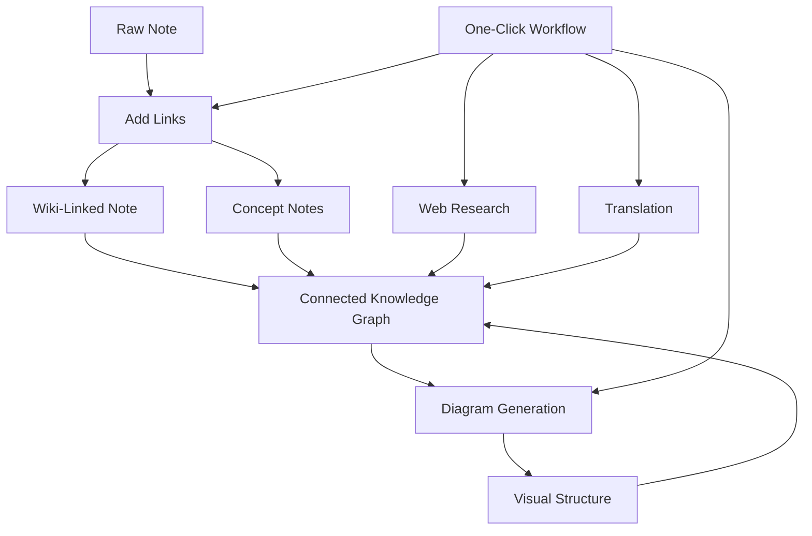

import TLDR from '@site/src/components/TLDR';

# Obsidian AI-tietojen hallintaohje

<TLDR>
**Notemd muuttaa LLM-voimaisen lukemisen kestävään tietoon: wiki-linkkit yhdistävät konsepttejä, konsepttipalat luovat palautettavan graafin, tutkimukset tuovat verkon sinun avaruksesiin, kääntöjä purkaa kielitilat, diagrammit tekevät strukturan näkyväksi, ja työprosessit yhdistävät kaikki yhdellä klikkilla.** Tämä ohje kattaa koko prosessiketjun – toisinlaatuisista merkintöistä yhdistettyyn, visuaaliseen, monikieliseen tietojen basesiin.
</TLDR>

## Miksi AI-tietojen hallinta?

Perinteiset merkintät tuovat ainoastaan suorat tiedostot. Vaikka käytetään käsitsi wiki-linkkejä, enintään merkintät jäävät yhdistymättömiksi. Notemd käyttää LLM-ja automatisoimaan yhdistyskerroksen:

- **LLM-t lukevat sinun sisällöksesi** ja tunnistavat mikä on tärkeää – termit, metodit, henkilöt, teooriat
- **Linkkit lisätään automaattisesti** jokaisen konsepttin esiintymisen yhteydessä, eikä peidetä „katso myös“-osioon
- **Konsepttipalat luodut** erillistä, palautettavista tiedostoista
- **Tutkimukset rikastavat merkintöjä** verkkokäytöllisestä kontekstistä
- **Diagrammit tekevät strukturan näkyväksi** – mentykartat, virtauskaavat, datakaavat samasta sisällöstä

Tuloksena: tietografiikka, joka kasvaa jokaisen sinun käsiteltävän merkintän kanssa, ei vain siis, kun muistat lisätä linkkejä.

## Koko prosessiketju



Jokainen vaihe on itsenäinen. Voit käyttää yhtä tai kaikkia. Kansainvälisimmin vaikutteellinen järjestys: **Lisää linkkit → Konsepttipalat → Diagrammit**.

---

## 1. Wiki-linkkit: Yhdistysten selkeä muotoilu

Wiki-linkkit ovat tietografiikan selkeä alustus. Notemd käyttää LLM-a täyttäkseen seuraavia tehoja:

1. Lue oma tiedon sisältö (jaka pitkät dokummentit osiin)
2. Tunnista keskeiset käsitteet — anna prioriteetti konkreettisiin, teknisille termineihin kuin yleisiin nimissä
3. Lisää `[[wiki-links]]` jokaisessa ilmennysessä
4. Ehdä sanojaan saman merkinnän ansiosta, jotta "ML" ja "Machine Learning" ei luoda erillisiä nodeja

### Kun käyttää

- **Jokainen tiedonnotto >100 sanaa** — pienempiä nottoja on vähän käsiteitä
- **Tutkimusartikkelit, tekniset dokumentit, keskustelunnotat** — ne sisältävät paljon alueellisia terminejä
- **Kun sisältö on stabilinen** — älä töidä muodostuksia kertoja

### Pääasetukset

| Asetus | Suositeltu | Miksi |
|---------|-----------|-----|
| `addLinksProvider` | DeepSeek tai GPT-4o-mini | Hyvä täpsyys madalla hinnaalla |
| Sanojaan saman merkinnän ehdäminen | Aktiivinen | Ehdottaa duplikaattisten nodejen luomista |
| Yhteyspano | Paragrafi | Tarkkuuden ja hintan tasapaino |

→ [Wiki-Linkit – syvällinen tutkimus](/docs/features/wiki-links)

---

## 2. Konseptitiedot: Palautettavat tieton nodit

Wiki-linkit yhdistävät ideita suoraan, mutta konseptitiedot tekevät jokaisen idean erikseen palautettavaksi. Jokainen konseptti saa oman `.md`-failin:

```markdown
# Machine Learning

## Linked From
- [[My Research Notes]]
- [[Neural Networks Explained]]
```

### Extraktointiprosessi

LLM-kysymyksellä on korkea struktuuri:
- Normaloi yhteenmuotoon
- Ehdotetaan usean sanoisen konseptin käyttöä yksilöisiä sanoja vastaan ("Dielectric Relaxation", ei "Relaxation")
- Jätä pois viite- ja bibliografiakohdat
- Luo `CONCEPT:`-rivit deterministiselle analyysille

Konsepttejä poistetaan duplikaateista osien välillä käyttäen `Set<string>`. LLM-virheet yksittäisissä osissa ei estä toimintaa.

### Palautuslinkit

Kun se on aktivoitu, jokainen konseptitiedosto tallentaa, mitä lähteetiedostoja se mainostavat. Obsidian:n omat palautuslinkitaulukot näyttävät myös vastaisia yhteyksiä.

### Deduplikointi

Notemd:n 4-vaiheinen duplikaatipoistointimekanismi havaitsee:
1. **Täysin samanmukaiset** – epätilastollinen nimelun vertailu
2. **Monimuotojen muotoilu** — "Models.md" vs "Model.md"
3. **Symbolin normalisointi** — "A-B.md" vs "A B.md"
4. **Yksikössä olevien sanojen hallinta** — "ML.md" merkitään, kun "Machine Learning.md" on olemassa

### Avainasetukset

| Asetus | Suositeltu | Miksi |
|---------|-----------|-----|
| `conceptNoteFolder` | `concepts/` tai `🧠 concepts/` | Pitoi avarakoti organisoituina |
| `extractConceptsAddBacklink` | Käytössä | Mahdollistaa vastaisen etsinnän |
| `extractConceptsMinimalTemplate` | Poissa | Täysin malli Linked From -tyyppillä |
| Tehtäökohdan môdeli | DeepSeek | Aiatekstrointi ei vaadi kalliita môlmejä |
| Syyneiden estö | Käytössä | Samat asetukset vaikuttavat niihin linkkeihin kuin ekstraktioon |

→ [Concept Notes deep dive](/docs/features/concept-notes)

---

## 3. Tutkimus: Webin käyttö märkintäprosessissa

Notemd yhdistää webissä hakemisen sinun märkintäprosessisiin:

1. **Hakukysymyksen luominen** — sinun märkintän titeli tai valinta muuttuu hakukysymyksiksi
2. **Webissä hakeminen** — Tavily (soovitatulla tavalla, tarvitaan API-avain) tai DuckDuckGo (tilittu, ei tarvitse avaintia)
3. **LLM - yhteenvetointi** — hakutulokset yhdistetään kokonaisiksi relevanteiksi yhteenvetoiksi
4. **Lisää märkintään** — yhteenveto lisätään kursorin sijalle tai uudelle osalle

### Kun käyttää

- Ennen uuden aiheen käsiteltämistä — saa esimerkiksi webissä tiedot ennen
- Kun concept note-ja tarvitsee täydentämistä — tutka ennen ja lisää linkkejä
- Kirjallisuuskäymisiin — tutka kokonaan märkintöjen kansio

### Pääasetukset

| Asetus | Soovitatulla tavalla | Miksi |
|---------|-----------|-----|
| `researchProvider` | GPT-4o tai Claude | Tutkimuksessa on tarpeen parempaa yhteenvetointia |
| Hakupalvelu | Tavily | Parhaa suosituksen laatuja, asettettavaa syvyyttä |
| `maxResearchContentTokens` | 4000 | Syvyyden ja kustannuksen välinen tasapaino |

→ [Research deep dive](/docs/features/research)

---

## 4. Kääntö: kielen estojen poistaminen

Notemd kääntää merkintöjä käyttäen sinun asettamasi LLM – ei erillistä kääntöohjelmaa API. Tämä tarkoittaa:

- **Ympäristökäskeiset kääntöjä** – LLM ymmärkee koko dokumentin, ei vain lauseita
- **Tekniset terminit** – "gradient descent" jää "梯度下降"iksi, ei "坡度向下"iksi
- **Pakettikääntö** – kääntä koko merkintöjen kansio yhdellä toiminnalla
- **Tehtäökohdan môdeli** – käytä Gemini Flash-kääntöä (nopea, halpa, monikielinen)

### Kielitukemus

Notemd itse tukee 21 UI kieltä. Kääntösihteentuki on asettettavaa tehtäkkökohtaisesti. Yleisimmät yhteydet: EN↔ZH, EN↔JA, EN↔KO, EN↔DE, EN↔FR, EN↔ES.

→ [Translation deep dive](/docs/features/translation)

---

## 5. Diagrammit: struktuurin näkyvyyden luominen

Notemd-nin diagrammituotevalinta perustuu speciin: LLM tuottaa strukturoituun `DiagramSpec` JSON, jota sitten sovellukset kääntävät siirtymäsuuntaan. Tämä annaa usaldusväärisemän tuloksen kuin pyytäminen LLM tuottamaan raakaa Mermaid-syntaksia.

### Tarkoituksen tunnistaminen

Notemd arvioi sisältöstä parhaan diagrammityypin:

- **Numeroiden kanssa tabelit** → data chart (Vega-Lite)
- **Klient/tietokone-kielit** → järjestysdiagrammi (Mermaid)
- **Entiteetti/primäinen kieli** → ER-diagrammi (Mermaid)
- **Vaihe/prosessi** → voolu-diagrammi (Mermaid)
- **Kontseptikartan avainasemat** → JSON Canvas (Obsidian kielisä)
- **Vaikkaus** → mieleenkarta (Mermaid)

### Rendering Chain

Primäinen tarkoitus → varaus → varaus → HTML. Jos Mermaid-syntaksi ehtyy, se yrittää uudelleen yhdessä virhekontekstilla LLM:lle, sitten vaihtuu minimaaliseen diagrammiin.

### Avainasetukset

| Asetus | Suositeltu | Miksi |
|---------|-----------|-----|
| `enableExperimentalDiagramPipeline` | Käytössä | Parhaa laadua spec-first -menetelmällä |
| `experimentalDiagramCompatibilityMode` | `best-fit` | Kielisä tarkoitus ideo perusteella |
| `summarizeToMermaidProvider` | GPT-4o tai Claude | Diagrammin spec-ihmiset vaativat ruumillista syystäksentelyä |
| `autoMermaidFixAfterGenerate` | Käytössä | Pystyy automaattisesti löytämään LLM-syntektipäivät |
| Sisäisen tieteen laajentaminen | Aktivoitu domainti-tyyppiseen käyttöön | Parantaa täydellisyttä vault-taihteen kanssa |

→ [Diagrammit syvällisemmin](/docs/features/diagrams)

---

## 6. Työprosessit: Yhden painutuksen automatisointi

Työprosessit yhdistävät useat tehtävät yhteiseen vasempan puoleen olevaan painikkeeseen. DSL-muoto on:

```
task1 | task2 | task3
```

Esimerkki: `addLinks | extractConcepts | generateDiagram` — töidäte notea toisessa muodossa olevasta tekstistä täysin yhdistetyksi, visuaaliseksi tieton nodeksi yhden painutuksen kanssa.

### Suositeltu työprosessi

| Työprosessi | Ahelma | Käytöskenttä |
|----------|-------|----------|
| Koko prosessi | `addLinks \| extractConcepts \| generateDiagram` | Uusi note |
| Alkuperäinen tutkimus | `research \| addLinks` | Tuntemattomat aiheet |
| Polyglot | `translate \| addLinks` | Monikieliset notit |
| Käytä vain diagrammaa | `generateDiagram` | Nopea visualisointi |

→ [Workflows deep dive](/docs/features/workflows)

---

## 7. LLM tarjoajat: 36 valintaa pilvistä paikalliseen

Notemd toetaa 36 tarjoajaa 4 transporttyypin kautta. Pääryhmät:

- **Rahvusvahainen pilvi**: OpenAI, Anthropic, Google, Mistral, xAI
- **Hiinan pilvi**: DeepSeek, Qwen, Doubao, Moonshot, GLM, Baidu, SiliconFlow
- **Gateway-tarjoajat**: OpenRouter, GitHub Models, Hugging Face, Vercel
- **Paikallinen**: Ollama, LMStudio, OVMS — ei API-tyyppiä, tiedot eivät lähe sinun laitteestasi

### Yksittäisten tehtävien mallestrategia

Kostohyökkäysvaltaisimpi asettelu käyttää halvia mallia yksinkertaisille tehtäville ja voimakkaia mallia monimutkaisille:

```
extractConcepts  → DeepSeek (fast, cheap, accurate enough)
addLinks          → DeepSeek or GPT-4o-mini
research          → GPT-4o or Claude (needs quality)
generateDiagram   → GPT-4o or Claude (needs spatial reasoning)
translate         → Gemini Flash (fast, multilingual)
```

→ [LLM tarjoajien yleenvaade](/docs/providers/overview)

---

## Alustuskontrollolista

1. **Asenna Notemd** — [Community Plugins](/docs/getting-started/installation) (soovitatulla tavalla) tai käsitsi
2. **Konfiguroi tarjoaja** — DeepSeek (helpompi), OpenAI, tai Ollama (tilaittu)
3. **Täydennä sinun ensimmäinen tiedosto** — oikeasta painikosta → "Process file (add links)"
4. **Set concept-kansio** — Asetukset → Notemd → Tulostus → Concept-kansio
5. **Extract concepts** — käynnistä „Extract concepts“ samalla tiedonnotolla
6. **Generate a diagram** — käynnistä „Generate diagram“ yhteyksien visualisoimiseen
7. **Create a workflow** — yhdistä yllä olevat toimet yhdelle painamiskertaiselle painikkeelle

## Suositeltu konfigurointi

### Student (Budget)

```
Provider: DeepSeek (free tier available)
Concept extraction: DeepSeek
Research: DuckDuckGo (free) + DeepSeek
Diagrams: Off (or legacy Mermaid)
Workflows: addLinks | extractConcepts
```

### Researcher (Quality)

```
Provider: GPT-4o (primary)
Concept extraction: DeepSeek (cost savings)
Research: GPT-4o + Tavily
Diagrams: best-fit mode, GPT-4o
Workflows: research | addLinks | extractConcepts | generateDiagram
```

### Privacy-First (Local Only)

```
Provider: Ollama (llama3 or qwen2.5:7b)
All tasks: Ollama
Research: DuckDuckGo (free, no API key)
Diagrams: legacy Mermaid mode
```

### Bilingual (ZH + EN)

```
Primary: DeepSeek (Chinese queries)
Translation: Google Gemini Flash
Research: Tavily + DeepSeek (Chinese search context)
Language output: per-task (extractConceptsLanguage: zh-CN)
```

---

## Common Patterns

### Pattern: Process a Research Paper

1. Import PDF content (or paste)
2. **Research** — saa web-päivänäkymän aiheesta
3. **Add Links** — tunnistaa ja yhdistää tärkeitä konsepttejä
4. **Extract Concepts** — luoda erilliset tiedonnot
5. **Generate Diagram** — visualisoi paperin rakennus

### Pattern: Daily Note Enrichment

1. Kirjoita päivännotto
2. **Lisä linkkejä** — yhdistää tänään käytetyt ideat olemassa oleviin konsepttiin
3. Konsepttipäivännotot päivitetään automaattisesti taaslinkkien avulla

### Malli: Kirjallisuuskeskustelu

1. Luo kausta artikkeleiden/tietojen kanssa
2. **Lisä linkkejä kokonaan** — käsittele koko kausta
3. **Ehdottompaa konseptteja** — poista läheisesti samanlaiset tiedot
4. **Luo diagramma** — mielikaartti koko kirjallisuudesta

---

*Notemd on avoimen lähtekoodin (MIT) ohjelmisto ja toimii Obsidian 0.15.0+ kaikilla platfommissa. [Asenna nyt](/docs/getting-started/installation) tai [katso GitHubilla](https://github.com/Jacobinwwey/obsidian-NotEMD).*
