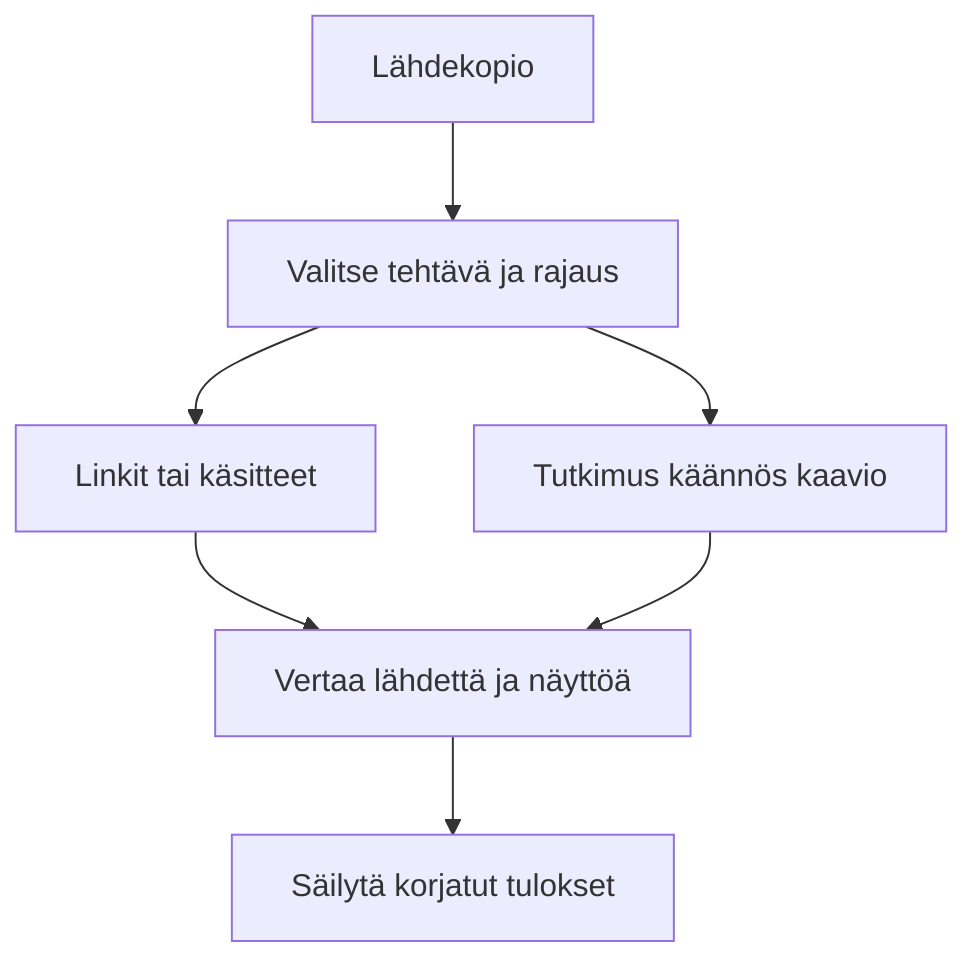

import TLDR from '@site/src/components/TLDR';

# Tekoälyavusteinen tiedonhallinta Obsidianissa

<TLDR>Toimiva työnkulku erottaa lähteet, mallivastaukset ja omat korjaukset. Notemd tuottaa linkkejä, käsitteitä, tutkimusta, käännöksiä ja kaavioita tarkistettavina dokumentteina. Aloita yhdestä lähteestä, tarkista ja automatisoi sitten rajattu kansio.</TLDR>

## Valitse tulos

Tarvitsetko linkitetyn muistiinpanon, käsitteitä, lähdepohjaisen yhteenvedon, käännöksen vai kaavion? Tiedosto- tai linkkimäärä ei takaa ymmärrystä tai löydettävyyttä. Päätä miten tarkistat ja löydät sisällön.

## Kokonaisreitti


```mermaid
flowchart TD
    A[Lähdekopio] --> B[Valitse tehtävä ja rajaus]
    B --> C[Linkit tai käsitteet]
    B --> D[Tutkimus käännös kaavio]
    C --> E[Vertaa lähdettä ja näyttöä]
    D --> E
    E --> F[Säilytä korjatut tulokset]
```

Nämä ovat tarjolla olevia tehtäviä, eivät yhden oletuspainikkeen kaikki vaiheet. Säilytä lähde ja tarkista tulos ennen ketjun rakentamista.

## 1. Linkit: suhteet näkyviksi

Käytä **Process file (add links)** ja vertaa `_processed.md`:n termejä, lainauksia, koodia ja kaavoja. Aihealue-/synonyymiohje ei pakota identiteettiä tai numeerista rajaa. Deterministinen vastaavuus voi sopia paremmin olemassa olevien otsikoiden toistettavaan linkitykseen. [Linkit](./features/wiki-links).

## 2. Käsitteet: termi erilleen selityksestä

Valitse kansio. Erillinen poiminta säilyttää lähteen ja luo otsikot. Uusien tiedostojen `Linked From`: paluulinkit päälle, suppea malli pois. **Batch generate from titles** on erillinen ja voi käsitellä vanhoja sopivia muistiinpanoja. Tarkista complete-siirto ja samojen nimien merkityserot. [Käsitteet](./features/concept-notes).

## 3. Tutkimus: säilytä näyttö

Valitse aihe/otsikko, Tavily tai DuckDuckGo ja **Research & summarize**. Tyhjä Tavily-avain ei vaihda palvelua. Avaa lähteet ja tarkista väitteet. Valinnainen leksikaalinen paikallishaku lähettää katkelmat valitulle LLM:lle; paikallinen indeksi ei tee reitistä offline-tilaa. [Tutkimus](./features/research).

## 4. Käännös: merkitys ja rakenne

Valitse kohdekieli ja käännä tiedosto. Oletus `_<language>.md` voi korvata vanhan tuloksen. Käytä tilapäistä muistiinpanoa katkelmalle. Tarkista termit, numerot, koodi, linkit ja matematiikka; osittaminen voi menettää kontekstin. UI-/sivustokielet eivät todista kieliparin laatua. [Käännös](./features/translation).

## 5. Kaaviot: lähde jatkokäsittelyyn

Valitse yhteensopiva pari ja säilytä lähde sekä tarvittava SVG/PNG/PDF. Kuva ei todista kaikkien suhteiden säilymistä toisessa editorissa. CircuitikZ on rajattu ja käännetään erikseen, Drawnixin haaranuolet staattisia ja Mermaid/SVG voi olla PPTX:ssä kuvana. [Kaaviot](./features/diagrams).

## 6. Työnkulut: automatisoi kokeillut vaiheet

Nimi, `::` ja `>`-erotellut toiminnot määrittävät ketjun:

```text
One-Click Extract::process-current-add-links>batch-generate-from-titles>batch-mermaid-fix
```

Se sisältää linkit, otsikkogeneroinnin ja Mermaid-korjauksen, ei yleistä tutkimus-/kaaviovaihetta. Ehdot ja tulokset säilyvät tehtäväkohtaisina. Oletus pysähtyy raportoituun virheeseen; jatko sopii vain jäljellä olevan syötteen kestäville vaiheille. Peruutus ei poista valmiita tuotoksia. [Työnkulut](./features/workflows).

## 7. Tarjoajat: tehtävä ja protokolla

36 profiilia kattaa viisi perhettä. Valitse osoitteen, oikeuksien, tietoehtojen ja mitatun tuloksen mukaan. Vertaa aikaa/kustannusta samalla lähteellä ja kehotteella. Tehtäväreititys on aluksi pois; tarkista kaikki reitit ennen paikallisuusoletusta. [Tarjoajat](./providers/overview).

## Ensimmäiset tarkistukset

1. Asenna ja säilytä lähdekopiot.
2. Määritä ja testaa tarkka malli.
3. Valitse käsitekansio ja erilliset kohteet.
4. Testaa kopio.
5. Vertaa ja säilytä korjaukset.
6. Laajenna pieneen kansioon ja tarkista osatulokset ennen pitkiä ketjuja.

## Käyttötilanteet

### Artikkelin käsittely

Muunna ulkoisesti Markdowniksi ja tarkista taulukot, kaavat ja kuvat. Poimi käsitteet/katkelmat, tutki tarkkoja kysymyksiä ja piirrä vain tarkistettavia suhteita. Säilytä alkuperäinen ja korjaukset.

### Käsitteiden ylläpito

Käytä erillistä kansiota, arvioi termit ja generoi selityksiä rajatulle joukolle. Varmuuskopioi ennen siivousta. Määrät eivät korvaa täsmällisiä määritelmiä ja toimivaa navigointia.

### Yksityinen aineisto

Valmistele paikallispalvelin, mallit ja riippuvuudet. Tarkista reitit ja vältä verkkotutkimusta tarvittaessa. Tarkista raportit ennen jakamista. Loopback-oletus ei estä etäosoitteen määrittämistä.

### Erän jatkaminen

Odota virheen/peruutuksen päättymistä, tarkista raportti, tulokset ja palautukset, vertaa ristiriidat ja uusi rajatusti. Peruutettu ei tarkoita tyhjää; tarkista viitteet ennen oheistiedostojen poistamista.

## Seuraavaksi

- [Pika-aloitus](./getting-started/quick-start).
- [Eräajo](./advanced/batch-processing).
- [Kehittäjät](./developers/overview).
- [Agentit](./agents/overview).
