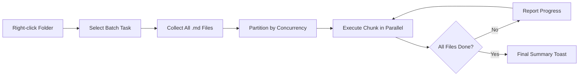

import TLDR from '@site/src/components/TLDR';

# Traitement par lots

<TLDR>
**Notemd traite des dossiers entiers en une seule opération, avec une concurrence configurable et un contrôle de suppression.** Cliquez avec le bouton droit sur un dossier pour ajouter en lot des liens wiki, extraire des concepts, effectuer des recherches ou traduire toutes les notes qu’il contient. Les limites de concurrence empêchent les erreurs de limitation de débit API. La progression est indiquée pour chaque fichier. Le comportement de suppression est configurable : sauter les fichiers existants, les ajouter en appendice ou les remplacer. Les fichiers qui échouent sont enregistrés sans interrompre le traitement en lot.

Ceci fait partie du [Obsidian Guide de gestion des connaissances IA](/docs/pillar-ai-knowledge).
</TLDR>

## Aperçu général

Le traitement par lots transforme un dossier de notes en une seule opération. Au lieu d’ouvrir chaque note et d’exécuter des commandes individuellement, vous cliquez avec le bouton droit sur le dossier et sélectionnez la tâche. Notemd parcourt chaque fichier `.md`, applique l’action choisie et indique l’avancement en temps réel.

Cette fonctionnalité est essentielle pour l’extraction des connaissances dans l’ensemble du coffre-fort. Après avoir importé des dizaines de PDF, par exemple, en utilisant d’abord batch-add-links puis batch-extract-concepts, votre graphe de connaissances est créé en quelques minutes plutôt qu’en heures.

## Comment ça marche

### Modèle d’exécution par lots

1. **Collecte de fichiers** -- Notemd parcourt le répertoire cible de manière récursive (ou uniquement au niveau supérieur, selon les paramètres) et collecte tous les fichiers `.md`.
2. **Partitionnement de la concurrence** -- Les fichiers sont divisés en blocs en fonction de la valeur de `batchConcurrency`. Chaque bloc s’exécute en parallèle ; les blocs s’exécutent séquentiellement.
3. **Exécution** -- Chaque fichier est traité selon la même logique que la commande pour un seul fichier. Les paramètres du fournisseur et du modèle par tâche sont respectés.
4. **Rapport de progression** -- Une notification toast est mise à jour après chaque fichier terminé, affichant la progression `N / Total`.
5. **Gestion des erreurs** -- Si un fichier échoue (erreur API, délai d’attente réseau, etc.), l’erreur est enregistrée et le traitement par lots se poursuit. Le résumé final liste tous les fichiers qui ont échoué.
6. **Completion** -- Un toast de résumé indique le nombre total traité, les succès et les échecs.

### Comportement d’écriture surchargée

Lors du traitement d’un fichier qui contient déjà des liens wiki, des notes conceptuelles ou des traductions, le comportement de Notemd dépend de la configuration de suppression :

| Mode | Comportement |
|------|----------|
| **Sauter** | Le contenu existant reste inchangé. Seuls les fichiers non modifiés sont traités. |
| **Append** (par défaut) | Un nouveau contenu est ajouté en fin. Les liens wiki, concepts ou traductions existants sont conservés. |
| **Remplacer** | Le fichier a été entièrement rétraité. Toutes les modifications précédentes Notemd ont été écrasées. |

Pour les liens wiki en particulier : si une note contient déjà `[[wiki-links]]`, le mode **skip** la laisse telle quelle, tandis que **replace** envoie à nouveau toute la note à LLM afin d’y insérer un lien frais. Utilisez **skip** pour un traitement incrémental et **replace** pour un retraitement après une mise à jour du modèle.

### Contrôle de concurrence

La configuration `batchConcurrency` limite le nombre de appels parallèles API. Cela évite les erreurs de limitation de débit (HTTP 429) lors du traitement de grands dossiers auprès de fournisseurs ayant des quotas stricts.

| Concurrence | Recommandé pour | Impact typique de la limitation de débit |
|-------------|----------------|---------------------------|
| `1` | Forfaits gratuits, fournisseurs stricts | Aucun (numéros de série) |
| `3` (par défaut) | La plupart des fournisseurs de services cloud | Bas |
| `5` | Ollama (local), forfaits généreux | Aucun / Faible |
| `10` | Modèles locaux avec une inférence rapide | Aucun |

Si vous rencontrez des erreurs 429 lors du traitement par lots, réduisez la concurrence à 1 ou 2.

## Configuration

| Configuration | Par défaut | Appliquer |
|---------|---------|--------|
| `batchConcurrency` | `3` | Nombre maximal de appels parallèles API pendant les opérations sur les dossiers |
| `batchOverwriteExisting` | `false` | Écraser le contenu existant de Notemd. `false` = mode d’ajout. |
| `batchSkipProcessed` | `false` | Ignorer les fichiers qui contiennent déjà des marqueurs Notemd (par exemple, des liens wiki) |
| `batchRecursive` | `true` | Inclure les sous-dossiers lors du balayage du dossier |
| `enableStableApiCall` | `false` | Activer la logique de tentative répétée (jusqu’à 4 essais) par fichier lors du traitement en lot |

### Modèles par tâche en lot

Chaque opération par lot utilise le modèle correspondant à la tâche. batch-add-links utilise `addLinksProvider`, batch-research utilise `researchProvider`, et ainsi de suite. Cela signifie que vous pouvez attribuer des modèles peu coûteux aux opérations à grande échelle et réserver des modèles chers aux tâches où la qualité est importante.

## Exemple

Vous avez un dossier `papers/` contenant 40 notes de recherche importées. Vous souhaitez y ajouter des liens wiki et extraire des concepts à partir de toutes.

1. Cliquez avec le bouton droit sur le dossier `papers/`
2. Sélectionnez **"Notemd: Dossier de traitement (ajouter des liens)"**
3. Notemd scanne le dossier, trouve 40 fichiers `.md`, et les traite par groupes de 3 (concurrency par défaut)
4. Une notification de progression affiche : `12/40 files processed...`
5. Après environ 3 minutes, un toast de résumé affiche : `39 succeeded, 1 failed (API timeout on paper-37.md)`
6. Répétez avec **"Notemd: Process folder (extract concepts)"** pour créer des notes de concepts pour les 40 éléments.

Le fichier qui a échoué a été enregistré dans les journaux. Vous pouvez le relancer uniquement sur ce fichier par la suite.

## Conseils

- **Commencez avec une faible concurrence** – Si vous n’êtes pas sûr des limites de débit de votre fournisseur, commencez par `1` et augmentez progressivement.
- **Utilisez le mode saut pour les mises à jour incrémentielles** -- Après le premier lot complet, passez en `batchSkipProcessed: true` afin que seules les nouvelles notes soient traitées lors des exécutions suivantes.
- **Activer les appels stables API** -- `enableStableApiCall: true` ajoute une logique de tentative qui permet de se remettre d’erreurs réseau temporaires lors de traitements de grande envergure.
- **Relancer après les mises à jour du modèle** -- Si vous passez à un modèle amélioré, définissez `batchOverwriteExisting: true` et relancez l’opération pour obtenir des liens et des concepts plus performants.

---

## Prochaines étapes

- [Workflows](/docs/features/workflows) -- Enchaîner des tâches par lots en boutons de barre latérale d’un clic
- [Custom Prompts](/docs/advanced/custom-prompts) -- Personnaliser les prompts pour l’extraction en lot
- [Dépannage](/docs/advanced/troubleshooting) -- Corriger les erreurs de limitation de débit et les échecs de connexion lors des exécutions en lot
- [LLM Fournisseurs](/docs/providers/overview) -- Référence de configuration du modèle par tâche
