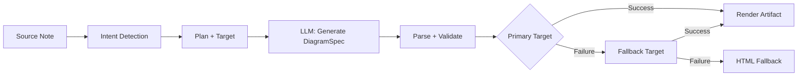
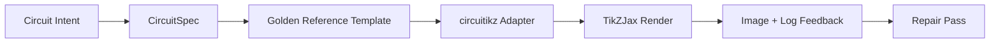

import TLDR from '@site/src/components/TLDR';

# Diagrammes

<TLDR>
**Notemd génère des diagrammes à partir de vos notes grâce à un pipeline basé sur des spécifications.** L’LLM produit un fichier JSON `DiagramSpec` indépendant du moteur de rendu, puis des adaptateurs dédiés le traduisent en formats Mermaid, JSON Canvas, Vega-Lite, HTML, HTML/SVG modifiables, Draw.io, Drawnix ou diagrammes circuitikz restreints. Il prend en charge 9 types d’intention, des chaînes de fallback automatiques, une prévisualisation en temps réel avec export en SVG/PNG/PDF, une vérification sémantique et une génération enrichie par des connaissances locales.
</TLDR>

Ceci fait partie du [Obsidian Guide de gestion des connaissances IA](/docs/pillar-ai-knowledge).

## Architecture : Pipeline basé sur les spécifications en premier

Notemd ne demande jamais à LLM de générer directement une syntaxe Mermaid/Vega/Canvas. Au lieu de cela :



**Pourquoi privilégier la spécification en premier ?** Les LLM génèrent fréquemment une syntaxe de rendu invalide (en particulier les Mermaid). Une `DiagramSpec` structurée peut être validée avant le rendu, et la même spécification peut alimenter plusieurs moteurs de rendu en tant que solutions de secours.

## Types de diagrammes pris en charge

| Intention | Éditeur principal | Solutions de secours | Cas d'utilisation |
|--------|-----------------|-----------|----------|
| `mindmap` | Mermaid | HTML | Découpage hiérarchique des sujets |
| `flowchart` | Mermaid | HTML | Flux de processus, arbres de décision |
| `sequence` | Mermaid | HTML | Interactions client-serveur, protocoles |
| `classDiagram` | Mermaid | HTML | Relations entre classes OOP |
| `erDiagram` | Mermaid | HTML | Schémas de base de données, relations entre entités |
| `stateDiagram` | Mermaid | HTML | Machines à états, modèles de cycle de vie |
| `canvasMap` | JSON Canvas | Mermaid → HTML | Cartes conceptuelles, graphes de connaissances |
| `dataChart` | Vega-Lite | Mermaid → HTML | Barre, ligne, zone, dispersion, cercle, tableaux |
| `circuit` | circuitikz | none | Diagrammes circuitikz restreints à partir de charges utiles `CircuitSpec` validées |

## Détection d’intention

Notemd détermine le meilleur type de diagramme à partir du contenu de votre note en utilisant une évaluation basée sur des mots-clés :

| Intention | Déclencheurs | Confiance |
|--------|----------|------------|
| `dataChart` | Tableaux, cellules numériques, mots-clés de mesure/taux de progression, pourcentages | 0.88 |
| `sequence` | Vocabulaire demande/réponse (4+ correspondances) ou marqueurs `->`/`=>` | 0.82 |
| `erDiagram` | Clé primaire, clé étrangère, entité, schéma (2+ occurrences) | 0.80 |
| `stateDiagram` | État, transition, en attente, en cours, échec (3+ correspondances) | 0.76 |
| `flowchart` | Étapes numérotées (2+) ou vocabulaire if/then/else/workflow | 0.74 |
| `canvasMap` | Carte conceptuelle, graphe de connaissances, spatial, cluster | 0.72 |
| `circuit` | circuitikz, TikZJax, circuit, schematic, CMOS, NMOS, PMOS, MOSFET, VDD/GND, `vin`/`vout` | 0.78 |
| `mindmap` | Solution de secours par défaut | 0.55 |

Surmonter cela en utilisant la configuration **Preferred diagram type**, le sélecteur de barre latérale, ou une option explicite de palette de commandes.

## Sélection de la cible de rendu

Le pipeline expérimental basé sur les spécifications dispose désormais de deux contrôles indépendants :

Définissez **Preferred render target** sur **Auto** pour la valeur par défaut du planificateur, ou choisissez explicitement Mermaid, JSON Canvas, Vega-Lite, HTML, Editable HTML/SVG, Draw.io, Drawnix ou Circuitikz. Cette modification ne s’applique qu’aux commandes d’artefact et de prévisualisation. La commande standard **Summarise as Mermaid diagram** reste configurée pour un format compatible Mermaid afin que les workflows Markdown existants ne changent pas silencieusement de format.

Cette séparation est importante car une intention `flowchart` peut désormais être rendue en Mermaid pour les notes Markdown, en HTML pour un fallback fiable, en Editable HTML/SVG pour une édition ultérieure, ou sous forme d’artefacts sources Draw.io/Drawnix accompagnés d’images SVG à examiner. Une intention `circuit` redirige vers Circuitikz et exige une charge utile `CircuitSpec` validée ; il ne s’agit pas d’une demande de texte TikZ arbitraire.
## Utilisation

### Générer un diagramme

1. Ouvrir une note
2. Exécutez **"Notemd: Générer le diagramme"** depuis la palette de commandes
3. Notemd détecte l’intention, génère la spécification, rend et enregistre l’artefact

**Fichiers de sortie par cible :**

| Cible | Extension | Modèle de nom de fichier |
|--------|-----------|------------------|
| Mermaid | `.md` | `{note}_summ.md` |
| JSON Canvas | `.canvas` | `{note}_diagram.canvas` |
| Vega-Lite | `.json` | `{note}_diagram.json` |
| HTML | `.html` | `{note}_diagram.html` |
| Éditable HTML/SVG | `.html` | `{note}_diagram.html` |
| Draw.io | `.drawio` + `.drawio.svg` + `.drawio.md` | `{note}_diagram.drawio` ainsi que des fichiers d’accompagnement pour la revue |
| Drawnix | `.drawnix` + `.drawnix.svg` + `.drawnix.md` | `{note}_diagram.drawnix` ainsi que des fichiers d’accompagnement pour la revue |
| Circuitikz | `.tex` + `.tex.svg` + `.tex.md` | `{note}_diagram.tex` ainsi que des fichiers d’accompagnement pour la revue |

### Aperçu d’un diagramme

1. Exécutez **"Notemd: Aperçu du diagramme"**
2. Une boîte modale s’ouvre avec le diagramme affiché
3. Exportez en SVG, PNG ou PDF à l’aide des boutons de la barre d’outils

L’**ouverture automatique de la prévisualisation** est disponible dans les paramètres : après génération, le mode prévisualisation s’ouvre automatiquement.

L’export en prévisualisation en PNG et PDF utilise le PPI de prévisualisation configuré. La valeur par défaut est de 300 PPI, et les valeurs supérieures à 600 PPI sont limitées à 600. Les fichiers SVG conservent leur taille vectorielle. Les artefacts sources tels que `.drawio`, `.drawnix` et `.tex` peuvent fournir un fichier `previewSvg` d’accompagnement, permettant à Obsidian d’afficher et d’exporter des images révisables sans intégrer circuitikz.net, Drawnix, LaTeX ou TikZJax lors du fonctionnement du plugin.

Le volet d’aperçu dispose également d’un panneau de diagnostics des artefacts. Les générateurs d’affichage et les tests de fonctionnement peuvent ajouter la clé `RenderArtifact.diagnostics` ; le volet affiche ensuite un résumé des diagnostics indiquant le nombre d’erreurs, d’avertissements et d’informations, ainsi que leur gravité, le type de diagnostic, le message correspondant et des conseils de correction à côté de l’aperçu. Ce même résumé est affiché dans les entrées d’historique prenant en compte les diagnostics, ce qui permet de comparer plusieurs tentatives de test de fonctionnement avec circuitikz sans avoir à ouvrir chaque entrée individuellement. Pour les artefacts qui possèdent du contenu source mais ne peuvent pas être affichés en ligne ou via le chemin iframe HTML, le volet passe désormais par un aperçu basé uniquement sur le contenu source, au lieu d’imposer un iframe vide. Cela offre aux tests de compilation/génération de circuitikz, aux vérifications des tokens de texte SVG, aux vérifications d’écran capturé PNG vierge, aux rapports de chevauchement de glyphes basés uniquement sur les chemins, ainsi qu’aux futurs rapports de chevauchement, une interface utilisateur visible, sans imposer TikZJax ou LaTeX comme dépendance obligatoire en temps de exécution du plugin, ni prétendre que le texte source est déjà une représentation visuelle vérifiée.

### Mode Legacy Mermaid

Lorsque `enableExperimentalDiagramPipeline` est désactivé, Notemd envoie une demande Mermaid directe à LLM. Cela contourne complètement le pipeline de spécification. Si le pipeline expérimental échoue, on revient à ce mode.

## Backend de rendu

### Mermaid

6 adaptateurs (organigramme mental, diagramme de flux, séquence, ER, classe, état) traduisent `DiagramSpec` en syntaxe Mermaid. Après génération, `mermaid.parse()` valide la sortie. En cas d’échec de la validation :

1. **LLM retry** — une tentative avec le message d’erreur Mermaid en contexte
2. **Fallback minimal** — un diagramme simplifié Mermaid basé sur les IDs des nœuds de spécification

**Legacy Mermaid Fixer** répare automatiquement les erreurs de syntaxe LLM courantes : normalisation des directives note, échappement des étiquettes pipe, répositionnement des points-virgules, guillemets intelligents, flèches à double tiret, incohérences de forme, et bien plus encore.

### JSON Canvas

Produit un format Obsidian JSON Canvas avec une disposition spatiale :
- Nœuds positionnés en fonction de la profondeur (x = profondeur × 420) et de l’index (y = index × 170)
- Largeur estimée à partir de la longueur de l’étiquette
- Arêtes avec `fromSide: 'right'`, `toSide: 'left'`, `toEnd: 'arrow'`

### Vega-Lite

Crée des spécifications complètes Vega-Lite v5 JSON avec encodage automatique :
- **Graphiques cartésiens** (barrés/lignes/aires/points/en nuage) : canaux x + y + couleur pour plusieurs séries
- **Pie** : thêta = y (quantitatif), couleur = x (nominal)
- **Tableau** : ligne = x, texte = y + colonne = série

Les correctifs des thèmes sombre et clair sont fusionnés en profondeur avant la compilation.

### HTML

Solution de secours universelle. Document autonome HTML contenant :
- En-têtes meta CSP
- Mode clair/obscur via `prefers-color-scheme`
- Étiquettes UI localisées pour 20 locales
- Sections : hero, structure (arbre de nœuds), relations, appels d’attention, tableaux de séries de données

### Éditable HTML/SVG

Cible explicite pour les flux de travail d’exportation modifiables. Elle projette `DiagramSpec` vers un `SemanticFigureModel` déterministe, puis génère un document autonome HTML contenant des groupes SVG intégrés qui présentent des annotations de style Draw.io :

- `data-drawio-type`, `data-drawio-id` et `data-drawio-role` sur les nœuds sémantiques
- `data-drawio-source` et `data-drawio-target` sur les arêtes sémantiques
- identifiants stables de nœud/bord après normalisation des espaces blancs et gestion des collisions
- Aucun script, aucune police externe, et aucun fichier distant

Cible qui n’est pas intentionnellement la route par défaut du planificateur pour l’instant. Elle est disponible en tant que cible de rendu explicite, tandis que le chemin du produit permet de valider le comportement d’édition dans des outils réels.

### Draw.io et Drawnix Exporter les limites

La mise en œuvre actuelle maintient le support des éditeurs tiers à la frontière de l’artefact tout en exposant des cibles de rendu explicites :

| Cible | Contrat | Dépendance en temps de exécution |
|--------|----------|--------------------|
| Draw.io | XML `mxfile` déterministe et non compressé issu de `SemanticFigureModel`, ainsi que des fichiers de visualisation SVG/PNG/PDF | Aucun élément dans le temps d’exécution du plugin ni lors du CI |
| Drawnix | Sous-ensemble minimal de JSON `.drawnix` utilisant les éléments `geometry` et `arrow-line`, ainsi que des fichiers de visualisation SVG/PNG/PDF | Aucun élément dans le temps d’exécution du plugin ni lors du CI |

Le compromis est délibéré : Notemd peut vérifier les étiquettes visibles, les identifiants stables et la couverture des primitives prises en charge sans intégrer Diagrams.net Desktop, Drawnix, Plait ou l’état de l’éditeur uniquement basé sur le navigateur dans le plugin.

### circuitikz / TikZJax Direction

Les schémas électriques ne posent pas le même type de problème que les diagrammes de flux génériques. La syntaxe appropriée pour les circuits électriques est généralement **circuitikz**, affichée en Obsidian à l’aide de plugins tels que TikZJax. TikZJax peut charger des paquets tels que `circuitikz`, `pgfplots`, `tikz-cd` et `chemfig`, ce qui le rend intéressant pour les notes de physique, d’électricité, de chimie et de mathématiques.

Le risque est que le TikZ généré à partir de LLM brut soit fragile :

- Une topologie de circuit complexe peut être électriquement correcte mais illisible visuellement.
- Des fils et des étiquettes qui se chevauchent peuvent rendre une liste de connexions correcte inutilisable pour les notes d’étude.
- L'absence de préambules de paquet, des ancrages incorrects ou des noms de composants invalides peuvent empêcher l'affichage.
- Les retours du rendeur sont généralement au niveau de l’image, tandis que le LLM génère une géométrie au niveau du texte.

L’architecture la plus adaptée consiste à traiter circuitikz comme une cible de diagramme contrainte, et non comme une instruction de forme libre :



Le modèle de première classe doit décrire la topologie du circuit et son agencement séparément :

| Couche | Responsabilité | Exemple |
|-------|----------------|---------|
| Topologie | nœuds électriques et connexions de composants | `VDD -> RD -> drain(M1)`, `source(M1) -> GND` |
| Mise en page | placement dans le réseau, orientation, voies de routage | `M1 at (3,2.2)`, entrée à gauche, sortie à droite |
| Style | emballage, convention de tension, étiquettes, ancrages | `\begin{circuitikz}[american voltages]` |
| Validation | Journal de compilation, ancrages manquants, vérifications de chevauchement/écran capturé | TikZJax/Diagnostic LaTeX + revue visuelle |

### Prototype actuel circuitikz

Notemd inclut désormais le premier prototype de répertoire contraint pour cette direction. Il est délibérément hors ligne et lié à un modèle :

```bash
npm run diagram:export-circuitikz -- --input cmos-inverter.json --output cmos-inverter.tex
```

Le prototype ajoute une frontière `CircuitSpec` contrainte ainsi qu’un exporteur déterministe pour six familles de référence standard :

Dans le pipeline de diagrammes expérimental, il est désormais également accessible via `intent: "circuit"` et la cible de rendu `circuitikz`. Le `DiagramSpec` généré ne peut intégrer un `circuitSpec` que pour une intention de type circuit. `CircuitikzRenderer` écrit la même source `.tex` déterministe et ajoute un fichier de prévisualisation SVG dérivé de cette topologie de circuit validée, ce qui permet une prévisualisation dans Obsidian ainsi qu’une exportation en SVG/PNG/PDF. Ce fichier de prévisualisation n’est pas le résultat d’une compilation LaTeX/TikZJax ; les preuves réelles issues du rendu proviennent toujours des commandes spécifiques indiquées ci-dessous.

Pour les modèles standards pris en charge, `layoutHints.inputSide` et `layoutHints.outputSide` restent des contrôles uniquement destinés à la présentation. Ils permettent de déplacer de manière déterministe l’emplacement des ports d’entrée/sortie, mais ils ne modifient pas la signature de la topologie ni ne permettent une étape de correction pour réorganiser le circuit.

| Type de circuit | Référence dorée | Garantie actuelle |
|--------------|------------------|-------------------|
| `common-source-amplifier` | `common-source-nmos-v1` | Vérifie `VDD -> R_D -> M1.D`, `vin -> M1.G`, `M1.S -> GND` et `M1.D -> vout` avant d’écrire du LaTeX |
| `cmos-inverter` | `cmos-inverter-v1` | Vérifie la topologie PMOS-over-NMOS, l’entrée à porte partagée, la sortie à drain partagé, `VDD -> MP.S`, et `MN.S -> GND` avant d’écrire du LaTeX |
| `cmos-buffer` | `cmos-buffer-v1` | Vérifie deux étages d’inverseurs en cascade, le nœud intermédiaire `vmid`, la valeur restaurée `vout`, ainsi que les rails VDD/GND partagés avant d’écrire du LaTeX |
| `cmos-transmission-gate` | `cmos-transmission-gate-v1` | Vérifie les dispositifs de passage PMOS/NMOS en parallèle entre `vin` et `vout` avec des commandes complémentaires `phib` / `phi` avant d’écrire du LaTeX |
| `cmos-nand2` | `cmos-nand2-v1` | Vérifie le tirage vers le haut parallèle avec PMOS, le tirage vers le bas en série avec NMOS, les deux entrées `va` / `vb`, ainsi que `vout` avant d’écrire du LaTeX |
| `cmos-nor2` | `cmos-nor2-v1` | Vérifie la série de tirage vers le haut PMOS, le tirage vers le bas en parallèle NMOS, les deux entrées `va` / `vb`, ainsi que `vout` avant d’écrire du LaTeX |

Il ne s’agit pas d’un générateur TikZ général. Il ne prend pas en charge du TikZ arbitraire, ne compile pas LaTeX, n’appelle pas TikZJax, ne consulte pas d’écrans d’affichage pendant le temps d’exécution du plugin, et ne met pas en œuvre de correction automatique basée sur des retours d’image. Ces fonctionnalités restent des étapes ultérieures.

La commande Diagramme d’avant-visualisation peut rouvrir directement les artefacts sources enregistrés circuitikz lorsque l’extension de fichier est `.tex` ou `.tikz` et que le code source contient `\usepackage{circuitikz}` ou `\begin{circuitikz}`. Cette méthode constitue une prévisualisation uniquement basée sur le source circuitikz : la fenêtre modale affiche le code source, les diagnostics, les contrôles de copie/enregistrement ainsi que les métadonnées d’historique, mais elle ne compile pas LaTeX ni n’appelle TikZJax pendant l’exécution du plugin.

La même limite de prévisualisation basée uniquement sur la source couvre désormais les artefacts enregistrés Draw.io et Drawnix. Les fichiers `.drawio` sont acceptés s’ils ressemblent à Draw.io XML (`mxfile` ou `mxGraphModel`), et les fichiers `.drawnix` sont acceptés s’ils sont de type Drawnix JSON avec `type: "drawnix"` ainsi qu’un tableau `elements`. Le plugin ne prend toujours pas en charge diagram.net ni l’hébergeur de tableau blanc Drawnix ; ces prévisualisations affichent le code source, les diagnostics et l’historique des artefacts sans nécessiter d’éditeur visuel intégré au plugin.

Pour une réparation qui préserve la topologie, transmettez la spécification pré-réparation en tant que référence avant d’accepter un candidat réparé :

```bash
npm run diagram:export-circuitikz -- --input repaired-cmos-inverter.json --topology-reference cmos-inverter.json --output cmos-inverter.tex
```

Le garde de réparation utilise `createCircuitTopologySignature` et `assertCircuitTopologyUnchanged` pour comparer `circuitKind`, `goldenReferenceId`, les réseaux, les IDs/types/terminaux des composants, ainsi que les extrémités des connexions non orientées avant d’afficher le résultat. Les étiquettes, le texte de titre, les indications de mise en page, l’ordre des connexions et les étiquettes de connexion sont intentionnellement ignorés. Un candidat qui ajoute un élément court ou qui réorganise les terminaux échoue avec `Circuit topology drift detected` avant que le fichier `.tex` ne soit écrit.

Le CLI peut maintenant analyser un journal de compilation LaTeX/TikZJax existant sans exécuter de compilateur :

```bash
npm run diagram:export-circuitikz -- --input cmos-inverter.json --output cmos-inverter.tex --compile-log cmos-inverter.log --diagnostics-output cmos-inverter.diagnostics.json
```

Ce chemin de diagnostic indique l’absence de paquets tels que `circuitikz.sty`, des clés TikZ/circuitikz inconnues, des erreurs de syntaxe dans les chemins TikZ comme l’absence de points-virgules, des arguments non terminés dus à des accolades déséquilibrées ou à des étiquettes non fermées, des séquences de contrôle non définies, des erreurs générales de LaTeX, des arrêts d’urgence, ainsi que des avertissements de surcharge `\hbox`. Il reste basé sur les journaux : l’exécution locale de LaTeX/TikZJax et les mécanismes de qualité d’écran sont encore des tâches futures distinctes.

Pour les vérifications de base des mainteneurs, le même CLI peut optionnellement exécuter un rendeur explicitement configuré sans analyse des commandes shell :

```bash
npm run diagram:export-circuitikz -- --input cmos-inverter.json --output cmos-inverter.tex --compile-executable pdflatex --compile-arg -interaction=nonstopmode --compile-arg -halt-on-error --compile-arg -output-directory={outputDir} --compile-arg {tex} --expected-artifact {outputDir}/{jobName}.pdf
```

Le lanceur de compilation utilise `shell: false`, remplace les placeholders `{tex}`, `{outputDir}` et `{jobName}` par des valeurs d’array d’arguments, lit le `{jobName}.log` généré, et renvoie `compileExecution` ainsi que `compileDiagnostics` dans la sortie CLI JSON. `--compile-executable` ne représente que le chemin du binaire ou du wrapper du rendeur ; les flags du rendeur doivent figurer dans des valeurs répétées de `--compile-arg`. Les exécutables vides échouent en tant que `compile-executable-invalid`, les binaires manquants échouent en tant que `compile-executable-not-found`, et les chaînes d’exécutables ayant la forme d’une commande shell reçoivent des indications pour séparer les arguments afin que Windows, Linux et macOS respectent le même contrat d’exécution directe. Avec `--expected-artifact`, il indique également `compileExecution.renderSmoke` et échoue au CLI si le rendeur ne crée pas d’artefact non vide. Il ne prend toujours pas en charge LaTeX, ne fait pas de TikZJax une dépendance de runtime pour les plugins, ni ne réalise de réparation visuelle au niveau des captures d’écran.

Si l’artefact attendu est `.svg`, la vérification de base s’approfondit d’un niveau supplémentaire :

```bash
npm run diagram:export-circuitikz -- --input cmos-inverter.json --output cmos-inverter.tex --compile-executable dvisvgm --compile-arg ... --expected-artifact {outputDir}/{jobName}.svg --expected-svg-text v_{in} --expected-svg-text v_{out}
```

SVG smoke vérifie la racine `<svg>`, les dimensions positives ou `viewBox`, au moins un élément de dessin visible après exclusion des éléments cachés/transparents, tous les tokens de texte demandés, les éléments évidents en dehors de `viewBox`, les étiquettes `<text>` / `<tspan>` positionnées en surimposition évidente, ainsi que les étiquettes de texte en surimposition avec des éléments de dessin via `render-svg-label-overlap`. Le texte attendu est recherché dans le texte visible et dans les métadonnées d’accessibilité décodées telles que `aria-label`, `<title>` et `<desc>`, de sorte que les rendeurs qui conservent des étiquettes sémantiques en dehors de `<text>` peuvent toujours respecter les exigences relatives aux tokens de texte sans avoir recours à l’OCR. La phase de géométrie prend désormais en compte les transformations pour les attributs courants de groupe et d’élément `transform`, ce qui permet de vérifier les boîtes SVG traduites, escalées, rotées, décalées ou transformées par matrice après composition des transformations. Elle couvre les limites exactes des arcs pour les extrémités A/a, les limites exactes des courbes Bezier pour les extrémités C/S/Q/T, les limites SVG tenant compte de l’épaisseur du trait ainsi que les vérifications de surimposition des étiquettes, la géométrie de dessin `polyline` / `polygon`, et résout également le positionnement des glyphes basés uniquement sur des chemins provenant de `<use href="#...">`, de sorte que les étiquettes converties en chemins de glyphes réutilisables peuvent encore échouer aux vérifications relatives au cadre défini lorsque leur géométrie dépasse `viewBox`. Plusieurs étiquettes `tspan` positionnées sous un même parent `<text>` sont comparées comme des boîtes d’étiquettes distinctes, ce qui permet de détecter les sorties de type LaTeX SVG qui, autrement, fusionneraient des étiquettes différentes en un seul nœud de texte. Les boîtes `text` et `tspan` positionnées respectent les valeurs `start`, `middle` et `end`, ce qui permet aux étiquettes centrées ou alignées à droite de déclencher des diagnostics de surimposition texte/texte ou étiquette/dessin sans nécessiter un affichage de texte au niveau du navigateur. Les chemins de glyphes contenant uniquement des définitions à l’intérieur de `<defs>` ne sont pas comptés comme des éléments de dessin visibles, mais leurs propres attributs locaux `transform` sont appliqués avant le placement `<use>`, afin que les définitions de glyphes escalées ou miroir ne soient pas sous-estimées. La vérification étiquette/dessin utilise une petite tolérance pour les boîtes de dessin ainsi que la valeur déclarée `stroke-width`, de sorte que des fils fins, des fils épais et des contours de composants polygonaux peuvent tous être considérés comme des cas potentiels de difficulté de lisibilité des étiquettes lorsque leur trait visible atteint une étiquette. Les étiquettes de glyphes basées uniquement sur des chemins résolues à partir de `<use href="#...">` sont également comparées aux boîtes de dessin et échouent avec `render-svg-path-glyph-overlap` lorsque la géométrie des glyphes réutilisables surimpose des fils ou des composants. Si un rendeur convertit les étiquettes en glyphes de chemin réutilisables au lieu de texte recherchable `<text>` et ne conserve pas les métadonnées d’accessibilité, le rapport smoke enregistre `pathOnlyGlyphUseCount` et fait échouer le token de texte demandé via `render-svg-text-path-only`, au lieu de prétendre que l’étiquette est simplement absente. Les autres échecs sont signalés via `render-svg-invalid`, `render-svg-dimension-missing`, `render-svg-no-visible-elements`, `render-svg-text-missing`, `render-svg-out-of-bounds`, `render-svg-text-overlap`, `render-svg-label-overlap` ou `render-svg-path-glyph-overlap`. Les vérifications de tokens de texte et de surimposition ne doivent être considérées que comme des tests structurels pour les rendeurs qui conservent les étiquettes sous forme de texte recherchable SVG ou de métadonnées d’accessibilité ; les sorties basées uniquement sur des chemins SVG nécessitent encore la vérification ultérieure par capture d’écran/OCR pour prouver la lisibilité visuelle des étiquettes, et cette phase de test ne prétend pas non plus à une couverture complète des chemins SVG.

Les groupes et éléments cachés SVG sont systématiquement ignorés lors du comptage des éléments visibles et de la collecte des données géométriques. Les attributs ou styles en ligne `display:none`, `visibility:hidden`, `visibility:collapse`, ainsi que l’ensemble `opacity:0`, ne permettent pas à un artefact de rendu autrement vide de passer le test de vérification des sorties visibles.

Les définitions de glyphes basées uniquement sur des chemins peuvent être des chemins directs ou des conteneurs de groupes/symboles à l’intérieur de `<defs>`. L’étape de vérification résout la géométrie des chemins enfants à partir de `<g id="...">` et `<symbol id="...">` avant le positionnement à `<use>`, de sorte que le résultat des glyphes encapsulés alimente toujours `pathOnlyGlyphUseCount`, les contrôles de canevas délimité et `render-svg-path-glyph-overlap`.

Le analyseur de chemins suit également le début des sous-chemins et réinitialise le point actuel sur `Z/z`, de sorte que les commandes relatives après un sous-chemin fermé reprennent à partir du bon point SVG au lieu de générer des diagnostics faux `render-svg-out-of-bounds`.

La même étape de géométrie suit la grammaire SVG pour les décimales avec point décimal et les signes plus explicites, de sorte que des coordonnées dvisvgm compactes telles que `.5`, `-.5` ou `+.5` restent fractionnaires lors des vérifications de limites, au lieu de devenir une géométrie hors limites fausse ou d’être ignorées.

Si le rendeur émet `.png`, le même chemin d’artefact attendu devient la première capture d’écran utilisée pour les vérifications : Notemd décode les fichiers PNG en couleur indexée de 1/2/4/8 bits non entrelacés, les fichiers PNG en gris de 1/2/4/8/16 bits, ainsi que les fichiers PNG en gris avec alpha/RGB/RGBA de 8/16 bits. Les images en couleur indexée et en gris sous-binaire prennent en charge des échantillons compressés ; les images en couleur indexée prennent également en charge les données PLTE et facultatives tRNS ; les images en gris/RGB prennent en charge des échantillons transparents tRNS. Les échantillons directs de 16 bits sont normalisés dans le même espace de comparaison RGBA de 8 bits utilisé par les vérifications. La vérification s’assure que les dimensions sont correctes, enregistre les limites du premier plan sous la forme de `foregroundBounds`, enregistre la densité du premier plan à l’intérieur de cette zone sous la forme de `foregroundDensity`, échoue avec `render-png-blank` lorsque chaque pixel visible correspond à la couleur de fond en haut à gauche, échoue avec `render-png-content-clipped` lorsque le contenu du premier plan touche les limites de l’image, échoue avec `render-png-foreground-too-small` lorsqu’une grande capture d’écran contient moins de quatre pixels en premier plan, et échoue avec `render-png-foreground-dense` lorsque les pixels en premier plan sont anormalement denses à l’intérieur d’une boîte de délimitation non triviale. Les formats PNG non pris en charge entraînent une erreur `render-png-unsupported`, accompagnée de directives spécifiques au format pour les PNG entrelacés Adam7 ou les profondeurs de couleur indexée non supportées. Cela permet de détecter les captures d’écran vides, le recadrage évident de la toile, les empreintes du premier plan mal rendues, les premiers échecs dus à une surpopulation au niveau des pixels, ainsi que des paramètres d’exportation PNG incorrects du rendeur, sans avoir besoin de dépendances spécifiques à une plateforme. Il ne s’agit pas encore d’une reconnaissance de texte au niveau OCR, d’une détection précise du chevauchement de texte, ni d’une réparation d’image conservant la topologie.

Lorsque les diagnostics indiquent une compilation échouée ou un exécution de render-smoke infructueuse, le CLI peut également rédiger un rapport de réparation préservant la topologie :

```bash
npm run diagram:export-circuitikz -- --input cmos-inverter.json --topology-reference cmos-inverter.json --output cmos-inverter.tex --compile-log cmos-inverter.log --repair-brief-output cmos-inverter.repair-brief.json
```

Le descriptif de réparation utilise le schéma `notemd.circuitikz.repair-brief.v1` et contient la source `CircuitSpec`, la signature de topologie, les diagnostics de compilation/rendu, les modifications autorisées, les modifications de topologie interdites, les étapes de vérification suivantes, ainsi qu’un `repairPrompt` structuré. Le rôle du prompt est `topology-preserving-circuitikz-repair` ; sa liste `diagnosticFocus` est dérivée des diagnostics de compilation/rendu, et ses `acceptanceCriteria` exigent une validation des candidats ainsi que de nouvelles vérifications de compilation et de rendu. Il s’agit du format de transfert pour un cycle de réparation ultérieur, et non d’une affirmation selon laquelle Notemd effectue déjà une réparation visuelle autonome.

Après la génération d’un candidat de réparation, le même CLI peut le valider par rapport au cahier des charges avant d’écrire le résultat :

```bash
npm run diagram:export-circuitikz -- --input repaired-cmos-inverter.json --repair-brief cmos-inverter.repair-brief.json --output repaired-cmos-inverter.tex
```

`--repair-brief` vérifie la signature de la topologie candidate indiquée dans le résumé, et elle est mutuellement exclusive avec `--topology-reference`. Le passage de cet étape ne prouve que la préservation de la topologie ; le candidat doit encore subir des diagnostics de compilation ainsi que des tests render-smoke.

Le résultat `--repair-brief` comprend également des preuves `repairAcceptance` selon le schéma `notemd.circuitikz.repair-acceptance.v1`. Il indique que les étapes `topology-signature`, `compile-diagnostics` et `render-smoke` sont classées comme `passed`, `failed` ou `missing` ; il expose `remainingChecks` ; et maintient `readyForVisualAcceptance` comme faux tant que l’exécution du candidat ne contient pas toutes les preuves requises.

Utilisez `--repair-acceptance-output` avec `--repair-brief` lorsque les preuves de CI ou de publication nécessitent un fichier JSON durable :

```bash
npm run diagram:export-circuitikz -- --input repaired-cmos-inverter.json --repair-brief cmos-inverter.repair-brief.json --output repaired-cmos-inverter.tex --repair-acceptance-output repaired-cmos-inverter.repair-acceptance.json
```

Pour obtenir des preuves de publication ou d’entretien, exécutez chaque famille gold supportée à l’aide du lanceur d’essais agrégés :

```bash
npm run diagram:smoke-circuitikz -- --output-dir docs/export/circuitikz-smoke --compile-executable pdflatex --compile-arg -interaction=nonstopmode --compile-arg -halt-on-error --compile-arg -output-directory={outputDir} --compile-arg {tex} --expected-artifact {outputDir}/{jobName}.pdf
```

Le lanceur utilise `docs/maintainer/fixtures/circuitikz/common-source-nmos-v1.json`, `docs/maintainer/fixtures/circuitikz/cmos-inverter-v1.json`, `docs/maintainer/fixtures/circuitikz/cmos-buffer-v1.json`, `docs/maintainer/fixtures/circuitikz/cmos-transmission-gate-v1.json`, `docs/maintainer/fixtures/circuitikz/cmos-nand2-v1.json` et `docs/maintainer/fixtures/circuitikz/cmos-nor2-v1.json`, appelle le même chemin d’exportateur sans shell pour chaque fixture, et renvoie un rapport global JSON contenant les valeurs `compileExecution` et `compileDiagnostics` par fixture. Il s’agit toujours d’une commande de mainteneur, et non d’une dépendance en temps de exécution du plugin.

Lorsqu’une machine d’entretien n’a pas encore de rendeur configuré, exécutez la même commande de fixation sans `--compile-executable` et persistez explicitement la porte d’environnement :

```bash
npm run diagram:smoke-circuitikz -- --output-dir docs/export/circuitikz-smoke --report-output docs/export/circuitikz-smoke/renderer-availability.json
```

Ce chemin écrit toujours les artefacts déterministes du fixture `.tex`, mais renvoie `ok: false` avec `rendererAvailability.status` mis à `missing-configuration` ainsi qu’un diagnostic `compile-executable-invalid`. Considérez-le uniquement comme une preuve de disponibilité du rendeur ; il ne constitue pas une validation de compilation, de test de rendu ou d’acceptation visuelle.

### Forme de prompt de référence dorée

Pour une utilisation à court terme, fournissez une référence d’or pouvant être rendue avant de demander une variante de circuit. Une instruction restreinte doit conserver le préambule, l’échelle des coordonnées, le style des ancrages et les conventions de routage :

```latex
\usepackage{circuitikz}
\begin{document}
\begin{circuitikz}[american voltages]
\draw
  (3,5) node[vcc]{$V_{DD}$}
  to [R, l=$R_D$] (3,3)
  to [short, *-o] (5,3) node[right]{$v_{out}$}
  (3,3) to [short] (3,2.2)
  node[nmos, anchor=D] (M1) {$M_1$}
  (M1.S) to [short] (3,0.5)
  node[ground]{}
  (M1.G) to [short, -o] (0.8,2.2)
  node[left]{$v_{in}$};
\draw
  (3,0.5) node[below right]{$S$};
\end{circuitikz}
\end{document}
```

Pour un inverseur CMOS, la demande doit préciser la topologie ainsi que les contraintes de placement, et non simplement « dessiner un inverseur CMOS ».

- Conservez `VDD` en haut, `GND` en bas, l’entrée à gauche et la sortie à droite ;
- Utilisez `pmos` au-dessus de `nmos`, avec des portes partagées et des drains partagés ;
- conservez le nœud de sortie à la jonction de drainage et marquez-le avec `*-o` ;
- Utilisez des ancres nommées (`PM1.G`, `NM1.G`, `PM1.D`, `NM1.D`) au lieu de coordonnées déduites visuellement ;
- Évitez les fils diagonaux ou croisés sauf si c’est requis sur le plan électrique.

### Progrès actuel et prochaines phases

| Zone | Statut actuel | Prochain mouvement |
|------|----------------|-----------|
| Diagrammes généraux | Pipeline basé sur les spécifications mis en œuvre pour Mermaid, JSON Canvas, Vega-Lite, HTML | Continuer à étendre la couverture de la vérification sémantique |
| Figures modifiables | Les limites des artefacts `editable-html-svg`, Draw.io XML, ainsi que Drawnix JSON ont été mises en œuvre | Ajoutez des primitives plus riches uniquement après que les tests aient prouvé l’éditabilité |
| Support CLI | `npm run diagram:export-artifact` exporte des fichiers HTML/SVG modifiables, ainsi que des preuves de révision au format Draw.io, Drawnix, Circuitikz, et SVG/PNG/PDF, à partir d’un `DiagramSpec` validé | Ajouter des fixtures de test spécifiques aux cibles lors du déploiement de nouvelles cibles |
| circuitikz | `DiagramSpec(intent: "circuit", circuitSpec) -> CircuitikzRenderer -> circuitikz` exporte des modèles d’or pour des composants tels que common-source, inverseur CMOS, `cmos-buffer` / `cmos-buffer-v1`, `cmos-transmission-gate` / `cmos-transmission-gate-v1`, `cmos-nand2` / `cmos-nand2-v1`, et `cmos-nor2` / `cmos-nor2-v1`, expose les options d’intention UI/cible de rendu, génère du TeX accompagné de prévisualisations SVG/PNG/PDF, valide la topologie avant l’export, analyse les journaux de compilation, permet d’exécuter des rendeurs locaux explicites via `--expected-artifact`, et propose un fallback basé uniquement sur le code source ainsi que des diagnostics de prévisualisation accessibles via `RenderArtifact.diagnostics` et le modal de prévisualisation | Ajouter une reconnaissance de labels au niveau OCR pour le texte visuel ne contenant que des chemins, des vérifications précises d’overlap au niveau des pixels, une couverture plus étendue des chemins SVG lorsque c’est nécessaire, une installation/découverte automatique des rendeurs uniquement si cela reste optionnel, ainsi qu’une exécution automatique de réparations conservant la topologie |
| Intégration TikZJax | Sélectionner un hôte de rendu pour l’affichage du côté Obsidian | Laissez-le optionnel ; ne faites pas de TikZJax une dépendance obligatoire au moment de l’exécution du plugin |

## Configuration

| Configuration | Par défaut | Appliquer |
|---------|---------|--------|
| `enableExperimentalDiagramPipeline` | `false` | Alterner entre le mode spécifications en premier et le mode ancien Mermaid |
| `experimentalDiagramCompatibilityMode` | `'legacy-mermaid'` | `'legacy-mermaid'` = Mermaid uniquement ; `'best-fit'` = cibles natives + solutions de secours |
| `preferredDiagramIntent` | `undefined` (automatique) | Dépasser la détection automatique des intentions |
| `preferredDiagramRenderTarget` | `undefined` (automatique) | Surcharger le générateur d’artefacts, y compris Draw.io, Drawnix et Circuitikz |
| `summarizeToMermaidLanguage` | `'en'` | Langue cible pour les étiquettes de diagramme |
| `summarizeToMermaidProvider` / `Model` | DeepSeek | LLM par tâche pour la génération de diagrammes |
| `autoMermaidFixAfterGenerate` | (de constantes) | Lancer automatiquement le correcteur de versions anciennes sur la sortie de Mermaid |
| `enableLocalKnowledgeForDiagramGeneration` | `false` | Augmenter la source avec les connaissances du coffre-fort local |

### Augmentation des connaissances locales

Lorsqu’il est activé, Notemd récupère des extraits de contexte pertinents à partir de la base de connaissances locale de votre coffre-fort (basée sur MiniSearch) et les ajoute en tête du markdown source. L’instruction d’augmentation indique : « Seule une référence complémentaire ; conservez la structure principale fidèle à la note source. »

### Modes de compatibilité

- **`legacy-mermaid`** : Toutes les intentions sont redirigées vers Mermaid. Les intentions qui ne sont pas de type Mermaid (canvasMap, dataChart) sont contraintes d’être envoyées vers `flowchart` ou `mindmap`. Aucune chaîne de fallback.
- **`best-fit`** : Chaque intention est redirigée vers sa cible native. Si celle-ci échoue, la chaîne de secours est parcourue (par exemple, Vega-Lite → Mermaid → HTML).

## Aperçu et exportation

| Action | Méthode |
|--------|--------|
| SVG export | Constructeur `mermaid.render()` / `vega.View.toSVG()` / SVG pour Canvas |
| Export en PNG | SVG → Image → Échantillonneur rasterisé sur le PPI configuré → Buffet d’octets PNG |
| Export en PDF | SVG → image rasterisée au PPI configuré → PDF une page |
| Enregistrer la source | Contenu brut de l’artefact enregistré avec l’extension spécifique à la cible |
| Aperçu uniquement source | Artefacts non en ligne dont le contenu source est affiché sous forme de code ainsi que des diagnostics, sans rendu dans un iframe |
| Audit sémantique | Vérification de Mermaid, JSON Canvas, Vega-Lite, HTML/SVG modifiables, Draw.io, Drawnix ainsi que de circuitikz restreint par `scripts/diagram-semantic-verification.js` en plus des tests du générateur et de la CLI |

**Mémorisation en cache** : RenderCache utilise une clé déterministe JSON de `{spec, target, theme}`. La déduplication en temps réel empêche les rendus redondants.

## Conseils

- **Démarrez en mode `best-fit`** — il produit le meilleur résultat visuel pour chaque type d’intention
- **Utilisez des modèles puissants pour des diagrammes complexes** — les organigrammes et les diagrammes ER profitent de GPT-4o ou Claude
- **Activer les connaissances locales** pour les diagrammes spécifiques à un domaine — le contexte du coffre-fort pertinent améliore la précision
- **Définir `autoMermaidFixAfterGenerate`** — Les erreurs de syntaxe Mermaid sont fréquentes sans cela
- **Le correcteur de problèmes hérité est complet** — si la prévisualisation de Mermaid échoue, l’exécution manuelle de la commande de correction résout souvent le problème

---

## Prochaines étapes

- 🔗 [Liens Wiki](./wiki-links) — Comment les concepts sont liés en ligne de texte
- 📝 [Notes de concept](./concept-notes) — Extraire les concepts pour le matériel source du diagramme
- 🔍 [Recherche](./research) — Améliorer les diagrammes avec des données provenant du Web
