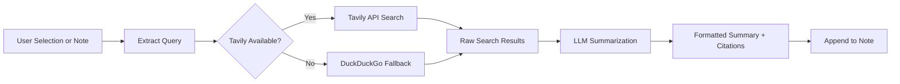

import TLDR from '@site/src/components/TLDR';

# Recherche et recherche sur le Web

<TLDR>
**Notemd consulte le web et insère directement dans vos notes les résultats LLM résumés.** Tavily API constitue le moteur de recherche principal ; DuckDuckGo sert de solution de secours sans configuration requise. Les résultats sont résumés avec des citations sources et ajoutés sous un en-tête `## Research`. Il prend en charge la recherche dans une seule note, la recherche dans des dossiers par lots, ainsi que le choix d’un modèle pour l’étape de résumé selon chaque tâche.

Ceci fait partie du [Obsidian Guide de gestion des connaissances IA](/docs/pillar-ai-knowledge).
</TLDR>

## Aperçu général

La recherche est l’une des intégrations les plus puissantes de Notemd : elle crée un cycle complet entre la lecture, la recherche et l’écriture. Au lieu de passer par un navigateur pour rechercher un terme inconnu, vous le mettez en surbrillance et laissez Notemd effectuer la recherche, rédiger un résumé et ajouter les résultats — tout cela directement dans votre coffre-fort.

Le processus est entièrement configurable. Vous choisissez le fournisseur de recherche, le LLM qui rédige le résumé, ainsi que le fait de joindre les résultats à la note active ou de les enregistrer dans des fichiers séparés. Le mode par lots vous permet de rechercher toutes les notes d’un dossier d’un seul clic.

## Comment ça marche

### Pipeline de recherche puis de résumé



1. **Extraction de la requête** -- Notemd extrait les termes de recherche à partir de votre sélection ou du titre de la note.
2. **Recherche sur le Web** -- La tentative Tavily a lieu en premier. Si aucune clé API n’est configurée, DuckDuckGo est utilisé automatiquement (aucune clé requise).
3. **LLM résumé** -- Les résultats de recherche bruts sont envoyés au LLM configuré, qui génère un résumé concis avec des citations sources intégrées.
4. **Append** -- Le résumé formaté est ajouté sous un en-tête `## Research` dans la note active.

### Tavily contre DuckDuckGo

| Apparence | Tavily | DuckDuckGo |
|--------|--------|------------|
| Clé API | Obligatoire (niveau gratuit disponible) | Pas requis |
| Qualité du résultat | Plus élevé (conçu spécialement pour l’IA) | Adéquat pour les requêtes générales |
| Limites de débit | Niveau gratuit généreux | Sujet à un régulateur de débit |
| Configuration | `tavilyApiKey` dans les paramètres | Zéro configuration -- fallback automatique |

### Recherche de dossiers par lots

Cliquez avec le bouton droit sur un dossier et sélectionnez **"Notemd : Dossier de recherche"**. Chaque fichier `.md` dans le dossier est traité séquentiellement (ou en parallèle, selon la concurrence configurée). Chaque note reçoit son propre résumé de recherche.

## Configuration

| Configuration | Par défaut | Appliquer |
|---------|---------|--------|
| `tavilyApiKey` | `''` | Tavily API clé. Lorsqu’elle est vide, seuls DuckDuckGo sont utilisés. |
| `researchProvider` / `researchModel` | DeepSeek | LLM par tâche pour résumer les résultats de recherche |
| `maxResearchContentTokens` | `4000` | Budget de tokens pour le contenu envoyé à LLM. Le surplus est tronqué. |
| `researchAppendToNote` | `true` | Ajoute un résumé à la note source. Si la valeur est fausse, un fichier séparé est créé. |
| `researchLanguage` | `'en'` | Langue de sortie pour la recherche résumée |

### Recommandation de modèle par tâche

La recherche bénéficie d’un modèle capable de gérer du contenu multilingue et de produire de la prose bien structurée. Considérez :

- **DeepSeek** -- par défaut, abordable, bonne qualité
- **GPT-4o** -- résumé de meilleure qualité, coût plus élevé
- **Gemini Flash** -- rapide et peu coûteux, idéal pour des requêtes simples

## Exemple

Vous lisez un article sur les *mécanismes d’attention Transformer* et vous tombez sur un terme inconnu : *encodage positionnel relatif*. Au lieu de laisser Obsidian :

1. Surligner **"relative positional encoding"**
2. Clic droit --> **"Notemd : Recherche et résumé"**
3. Notemd recherche sur le Web, résume les meilleurs résultats, et ajoute :

```markdown
## Research

### Relative Positional Encoding

Relative positional encoding is a method used in transformer models
where positional information is expressed as relative distances between
tokens rather than absolute positions. Introduced by Shaw et al. (2018),
it improves generalization to unseen sequence lengths compared to
absolute encodings (Vaswani et al., 2017).

Sources:
- [Shaw et al., Self-Attention with Relative Position Representations (2018)](https://arxiv.org/abs/1803.02155)
- [Transformer Positional Encoding Overview](https://example.com/transformer-pos-enc)
```

Le résumé fait désormais partie de votre coffre-fort : il est recherchable, lienable et accessible hors ligne.

## Conseils

- **Définissez une clé Tavily pour obtenir de meilleurs résultats** – même le plan gratuit offre une plus grande pertinence que le DuckDuckGo brut.
- **Utilisez un modèle de résumé performant** – les modèles bon marché peuvent simplifier à l’excès des contenus techniques nuancés.
- **Recherche par lots** après une lecture initiale afin de combler les lacunes dans de nombreuses notes en même temps.
- **Vérifier les résumés ajoutés** -- LLMs peuvent inventer des détails sur la source. Vérifiez les affirmations clés.

---

## Prochaines étapes

- [Notes de concept](./concept-notes) -- Extraire et conserver les termes clés issus des résultats de recherche
- [Liens-Wiki](./wiki-links) -- Reliez les concepts issus de recherches dans votre coffre-fort
- [Traduction](./translation) -- Traduire les résumés de recherche dans une autre langue
- [LLM Fournisseurs](/docs/providers/overview) -- Configurer le modèle utilisé pour la synthèse
