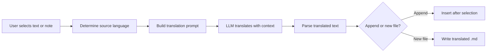

import TLDR from '@site/src/components/TLDR';

# Traduction

<TLDR>
**Notemd permet de traduire du texte entre 21 langues ou plus grâce à une technologie de traduction développée par LLM.** Il prend en charge la traduction sélective d’un seul élément, la traduction complète d’une note, ainsi que la traduction batch d’un dossier entier. Chaque tâche de traduction peut utiliser un fournisseur et un modèle spécifiques via des paramètres dédiés à chaque tâche. La langue de sortie peut être configurée indépendamment de la langue UI. Les résultats sont ajoutés au fichier existant ou enregistrés dans un nouveau fichier selon vos préférences.

Ceci fait partie du [Obsidian Guide de gestion des connaissances IA](/docs/pillar-ai-knowledge).
</TLDR>

## Aperçu général

La traduction dans Notemd n’est pas une recherche dans un dictionnaire – c’est une traduction consciente du contexte, assurée par LLM. Le modèle prend en compte tout le paragraphe ou la note, préservant le ton, la terminologie sectorielle et la structure des phrases. Cela permet d’obtenir des résultats de meilleure qualité que les services de traduction phrase par phrase, en particulier pour l’écriture technique, académique et créative.

Cette fonctionnalité prend en charge trois plages d’application : la sélection, la note active et le dossier entier. En combinant cela avec une sélection de modèle par tâche, vous pouvez utiliser un modèle rapide (Gemini Flash) pour des traductions occasionnelles et un modèle puissant (Claude Sonnet) pour du contenu sensible aux nuances – sans changer votre fournisseur global.

## Comment ça marche

### Le commandement Traduire



1. **Détection de la source** -- Le LLM déduit la langue de source à partir du contenu. Vous n’avez pas besoin de la spécifier manuellement.
2. **Construction du prompt** -- Notemd crée un prompt qui inclut la langue cible, une indication de domaine optionnelle, ainsi que le contenu à traduire.
3. **Traduction LLM** -- Les processus `translateProvider` / `translateModel` configurés traitent la demande. Le modèle conserve le formatage Markdown, les liens wiki et les blocs de code.
4. **Sortie** -- Le texte traduit est soit ajouté en dessous du texte original, soit écrit dans un nouveau fichier dans le coffre-fort.

### Paires de langues

Notemd prend en charge tout couple de langues que le LLM sous-jacent prend en charge. Les couples les plus courants incluent :

| Source | Cible | Qualité typique |
|--------|--------|----------------|
| Anglais | Chinois simplifié | Excellente |
| Chinois | Anglais | Excellente |
| Anglais | Japonais | Très bien |
| Anglais | Allemand / Français / Espagnol | Très bien |
| Tout est pris en charge | Tout est pris en charge | Dépendant du modèle |

La configuration `translateLanguage` contrôle la **langue de sortie**. La langue source est détectée automatiquement.

### Sélection du modèle par tâche

La qualité de la traduction varie considérablement d’un modèle à l’autre. Notemd vous permet d’affecter un modèle dédié uniquement à la traduction :

| Modèle | Vitesse | Qualité | Coût | Idéal pour |
|-------|-------|--------|------|----------|
| `gemini-2.0-flash-exp` | Vite | Bien | Bas | Décontracté, grand volume |
| `gpt-4o-mini` | Vite | Bien | Bas | Recherches rapides |
| `deepseek-chat` | Moyen | Bien | Très bas | Budget multilingue |
| `claude-3-5-sonnet` | Moyen | Excellente | Moyen | Technique / académique |
| `gpt-4o` | Moyen | Excellente | Moyen | Prose sensible aux nuances |

### Traduction de dossier par lots

Cliquez avec le bouton droit sur un dossier et sélectionnez **"Notemd: Traduire le dossier"** pour traduire toutes les notes contenus dans ce dossier. Chaque fichier est traité de manière indépendante. La valeur de la configuration de parallélisme détermine le nombre de fichiers qui sont traduits en même temps.

## Configuration

| Configuration | Par défaut | Appliquer |
|---------|---------|--------|
| `translateProvider` / `translateModel` | DeepSeek | Fournisseur dédié aux tâches de traduction |
| `translateLanguage` | `'en'` | Langue de sortie cible |
| `translationAppendToNote` | `true` | Ajoutez le texte traduit en dessous du texte original. Si c’est faux, créez un nouveau fichier. |
| `batchConcurrency` | `3` | Nombre de fichiers traités en parallèle lors de la traduction par lots |

## Exemple

Vous lisez une note de recherche en chinois et souhaitez en obtenir une version en anglais :

1. Ouvrez la note
2. Clic droit --> **"Notemd : Traduire le fichier actuel"**
3. Notemd détecte le chinois, le traduit dans la langue cible que vous avez configurée (anglais), et ajoute :

```markdown
## Translation (English)

The experimental results show that the proposed method achieves
a 12% improvement in F1 score compared to the baseline, primarily
due to the enhanced feature extraction module described in Section 3.
```

Le texte chinois original reste inchangé au-dessus de la traduction. Le titre `## Translation` permet de conserver les deux versions dans le même fichier pour une référence facile.

## Conseils

- **Utilisez Gemini Flash pour les volumes importants** – c’est l’option la plus rapide et la moins chère pour la traduction en lot de grands dossiers.
- **Conserver les liens wiki** – L’instruction de Notemd demande à LLM de laisser `[[wiki-links]]` intact dans la traduction. Vérifiez après traduction, car certains modèles les déballent parfois.
- **Définir explicitement la langue de sortie** – la détection automatique fonctionne pour le texte source, mais configurez toujours `translateLanguage` afin d’éviter toute ambiguïté concernant la langue cible.
- **Traduire en lot les notes de concept** -- si votre dossier de concepts est dans une langue et que vous avez besoin qu’il soit dans une autre, la traduction au niveau du dossier s’en charge en une seule étape.

---

## Prochaines étapes

- [Recherche](./research) -- Rechercher et résumer dans n'importe quelle langue, puis traduire les résultats
- [Workflows](./workflows) -- Traduction en chaîne avec liens wiki ou extraction de concepts
- [Traitement par lots](/docs/advanced/batch-processing) -- Concurrence et comportement d’écrasement pour les opérations sur des dossiers
- [LLM Fournisseurs](/docs/providers/overview) -- Choisissez le meilleur modèle pour votre paire de langues
