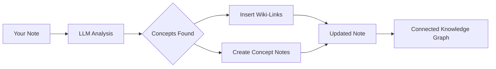

import TLDR from '@site/src/components/TLDR';

# Liens wiki

<TLDR>
**Notemd ajoute automatiquement `[[wiki-links]]` aux concepts clés de vos notes.** Le LLM lit votre contenu, identifie les termes importants dans le contexte et insère des liens wiki au style Obsidian à chaque occurrence. Il crée éventuellement des fichiers de notes de concept avec des liens inversés. Il prend en charge la suppression des synonymes, la préservation de l’intégrité des liens en cas de renomage ou de suppression, ainsi qu’un mode d’extraction pur (sans modification de fichier). Contrairement à Auto Link qui ne correspond qu’aux titres de notes existants, Notemd utilise l’IA pour identifier de nouveaux concepts et créer des notes correspondantes. Cela fait partie du [Obsidian Guide de gestion des connaissances par IA](/docs/pillar-ai-knowledge).
</TLDR>

## Aperçu général

Le lien vers des wikis est la fonction principale de Notemd. Il transforme du texte brut en un graphe de connaissances interconnecté en :

1. **Analyse de votre note** à l’aide d’un LLM
2. **Identifier les concepts clés** (termes, personnes, méthodes, théories)
3. **Insérer `[[wiki-links]]`** à chaque occurrence
4. **Création de notes de concept** (facultatif) avec des liens inversés

## Comment ça marche

### Traiter



### Exemple

**Avant :**
```markdown
Machine learning models use neural networks to learn patterns from data.
The transformer architecture revolutionized natural language processing.
```

**Après :**
```markdown
[[Machine learning]] models use [[neural networks]] to learn patterns from data.
The [[transformer architecture]] revolutionized [[natural language processing]].
```

## Utilisation

### Basique : Ajouter des liens à la note actuelle

1. Ouvrir une note
2. Cliquez avec le bouton droit dans l’éditeur → **"Traiter le fichier (ajouter des liens)"**
3. Attendez quelques secondes.
4. Les concepts sont maintenant liés !

### Lot : Traiter plusieurs notes

1. Cliquez avec le bouton droit sur un dossier dans l’Explorateur de fichiers
2. Sélectionnez **"Notemd: Dossier de traitement (ajouter des liens)"**
3. Configurer :
   - Concurrence (nombre de fichiers en parallèle)
   - Écraser les liens existants (oui/non)
4. Cliquez sur **Process**

### Sélectif : Lier un texte spécifique

1. Sélectionner le texte à traiter
2. Clic droit → **"Sélectionner des processus (ajouter des liens)"**
3. Seule la partie soulignée est analysée

## Notemd contre Lien automatique

Obsidian propose deux approches pour le lien automatique vers les wikis :

| | **Lien automatique** | **Notemd** |
|--|---------------|-------------|
| Source du lien | Titres des notes existantes dans le coffre-fort | Concepts identifiés dans le contenu LLM |
| Peut relier de nouveaux concepts | Non — le titre doit déjà exister | Oui — L’IA identifie les concepts et crée des notes |
| Gestion des synonymes | Non | Oui — suppression des synonymes |
| Création d’une note de concept | Non | Oui — avec des liens inversés et la suppression des doublons |
| Traitement par lots | Non (fichier unique) | Oui (au niveau du dossier) |
| Affectation du modèle par tâche | Non | Oui |

**Auto Link** effectue une correspondance par titre : si une note nommée « Machine Learning » existe, il encadre les occurrences dans `[[Machine Learning]]`. Si la note n’existe pas, rien ne se passe.

**Notemd** est piloté par l’IA : le LLM lit votre contenu, comprend le contexte, identifie les concepts qui *devraient* être liés — même s’aucune note n’existe encore — et crée à la fois le lien et la note de concept.

## Fonctionnalités

### Suppression de synonymes

**Problème :** "transformer", "transformers", "Architecture Transformer" → 3 concepts distincts

**Solution :** Notemd détecte les quasi-dupliques et utilise la forme canonique.

**Configuration :**
```
Settings → Advanced → Synonym Suppression
Threshold: 0.8 (0 = off, 1 = aggressive)
```

### Intégrité du lien

**Lorsque vous renommez une note de concept :**
- Tous les liens wiki se mettent à jour automatiquement (fonctionnalité de base Obsidian)
- Les backlinks restent intacts

**Lorsque vous supprimez une note de concept :**
- Les liens restent, mais s’affichent comme des « mentions non liées ».
- Vous pouvez recréer à partir de n’importe quelle occurrence

### Mode d’extraction pure

**Extraire les concepts sans modifier le texte original :**

1. Clic droit → **"Extraire les concepts (sans lien)"**
2. Les notes de concept sont créées
3. Le fichier original est intact.

Cas d’usage : Traitement de contenus en lecture seule ou de versions finales.

## Génération de note conceptuelle

### Création automatique

**Lorsqu’il est activé (par défaut), Notemd crée :**

```markdown
---
tags: [concept, auto-generated]
created: 2026-06-13
source: [[Original Note Name]]
---

# Machine Learning

A branch of artificial intelligence that enables computers
to learn from data without explicit programming.

## Occurrences in Your Vault

- [[Original Note Name#Section]]
- [[Another Note#Header]]

## Related Concepts

- [[Neural Networks]]
- [[Deep Learning]]
- [[Supervised Learning]]
```

### Configuration

**Dossier de sortie :**
```
Settings → Output → Concept Folder
Default: concepts/
```

**Structure hiérarchique :**
```
Settings → Output → Use Hierarchical Folders
If enabled:
  papers/my-paper.md → papers/concepts/Concept.md
If disabled:
  → concepts/Concept.md
```

**Modèle :**
```
Settings → Output → Concept Template
Customize with variables:
  {{concept}} — Concept name
  {{description}} — LLM-generated description
  {{backlinks}} — List of source notes
  {{date}} — Creation date
```

## Options avancées

### Fenêtre de contexte

**Combien de texte environnant envoyer :**

```
Settings → Linking → Context Window
Options: Sentence | Paragraph | Full Note
Default: Paragraph
```

Plus grand = plus grande précision, coût plus élevé.

### Minimum d'occurrences

**Seuls les concepts qui apparaissent plusieurs fois doivent être liés :**

```
Settings → Linking → Min Occurrences
Default: 1 (link all)
```

Définissez sur 2 ou 3 pour vous concentrer sur les thèmes récurrents.

### Exclure les motifs

**Ignorer certains mots :**

```
Settings → Linking → Exclude List
Example: note, idea, example, thing
```

Empêche la création de liens excessifs vers des termes génériques.

### Prompt personnalisé

**Surcharger les instructions par défaut LLM :**

```
Settings → Advanced → Custom Linking Prompt
Default:
  "Identify key concepts, theories, methods, and technical
   terms in the following text. Return as a list..."
```

Modifier pour des besoins spécifiques au domaine (par exemple, « Se concentrer sur la terminologie médicale »).

## Conseils et bonnes pratiques

### ✅ FAIT

- **Traiter les notes de plus de 100 mots** — Les notes courtes ne contiennent que peu de concepts
- **Utilisez des modèles puissants** pour une meilleure identification des concepts (GPT-4o, Claude)
- **Vérification avant acceptation** — Vérifiez que les liens suggérés soient pertinents
- **Construire de manière itérative** — Traiter 5 à 10 notes, examiner le graphe, ajuster les paramètres

### ❌ NE FAITES PAS

- **Over-link** — Tous les noms n’ont pas besoin d’un lien
- **Traiter les brouillons en boucle** — Les concepts peuvent évoluer, attendre qu’ils soient stables
- **Ignorer les synonymes** — Activer la suppression pour éviter « ML » et « Machine Learning »

## Performances

### Vitesse

| Taille de la note | GPT-4o-mini | Claude Sonnet | Ollama (local) |
|-----------|-------------|---------------|----------------|
| 500 mots | 2-3 secondes | 3 à 5 secondes | 5-10 secondes |
| 2000 mots | 5-8 secondes | 10-15 secondes | 20-40 secondes |
| 5000+ mots | Par lots (appels multiples) | En chunks | En chunks |

### Estimation des coûts

**Exemple : note de 1000 mots avec GPT-4o-mini**
- Entrée : ~1500 tokens
- Sortie : ~200 tokens
- Coût : ~0,001 $

**Traitement par lots de 100 notes :** ~0,10 $

## Résolution de problèmes

### Aucun lien ajouté

**Vérifier :**
1. LLM L'appel a réussi (Paramètres → Diagnostic)
2. La note contient suffisamment de contenu (>50 mots)
3. Les concepts sont techniques/spécifiques (et non seulement des pronoms)

**Essayer :**
- Utilisez un modèle plus puissant
- Augmenter la fenêtre de contexte
- Vérifier la validité de la clé API

### Trop de liens

**Solutions :**
1. Augmenter le nombre minimal d’occurrences (2 ou 3)
2. Ajouter des mots courants à la liste d’exclusion
3. Utilisez un modèle moins agressif

### Concepts incorrects liés

**Corrections :**
1. Utilisez un prompt personnalisé pour une spécificité de domaine
2. Activer la suppression des synonymes
3. Vérifier manuellement et désassocier

### Les liens se brisent après le renomage

**C’est un comportement normal Obsidian.**

Pour mettre à jour tous les liens :
1. Renommer la note de concept
2. Obsidian met à jour automatiquement `[[old]]` → `[[new]]`

---

## Prochaines étapes

- 📖 [Concept Notes](./concept-notes) — Analyse approfondie de la création de notes de concept
- 🔍 [Intégration de la recherche](./research) — Combiner les liens avec la recherche sur le Web
- 🎨 [Diagrammes](./diagrams) — Visualisez votre graphe de connaissances
