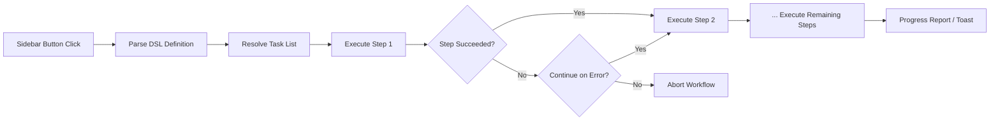

import TLDR from '@site/src/components/TLDR';

# Flux de travail

<TLDR>
**Les workflows Notemd relient plusieurs tâches en une seule action à un clic.** Définissez des séquences comme `add-links > extract-concepts > research > diagram` à l’aide d’un DSL simple. Les workflows apparaissent sous forme de boutons dans la barre latérale et exécutent toute la chaîne sur la note ou le dossier actuel. Ils sont fournis avec des workflows prédéfinis ; créez-en de personnalisés dans les paramètres. Chaque étape utilise sa propre configuration de modèle par tâche.

Ceci fait partie du [Obsidian Guide de gestion des connaissances IA](/docs/pillar-ai-knowledge).
</TLDR>

## Aperçu général

Un flux de travail élimine les difficultés liées à l’exécution des tâches une par une. Au lieu de cliquer droit quatre fois pour ajouter des liens, extraire des concepts, rechercher des termes inconnus et générer un diagramme, il suffit de cliquer sur un bouton de la barre latérale et toute la chaîne s’exécute. Notemd gère le séquencement, la propagation des erreurs et la transmission des informations sur l’avancement.

Les workflows sont définis dans un DSL léger (langage spécifique au domaine). Ils se trouvent dans les paramètres, apparaissent sous forme de boutons cliquables dans la barre latérale Obsidian, et peuvent être appliqués soit à la note actuelle, soit à un dossier entier.

## Comment ça marche

### Tuyau d’exécution du flux de travail



1. **Parse** -- La chaîne DSL est divisée en fonction de `>` (ou `>`) pour obtenir une liste ordonnée d’identifiants de tâche.
2. **Resolve** -- Chaque identifiant correspond à une commande interne (add-links, extract-concepts, research, translate, diagram, etc.).
3. **Exécuter** -- Les étapes s’exécutent séquentiellement. Chaque étape utilise son fournisseur et son modèle configurés pour tâche.
4. **Gestion des erreurs** -- Si une étape échoue, le flux de travail soit est interrompu, soit continue vers l’étape suivante, en fonction de votre politique d’erreur.
5. **Terminé** -- Une notification toast indique le succès ou énumère les étapes qui ont échoué.

### Format DSL

Les workflows sont définis comme une séquence d’identifiants de tâches séparés par `>` :

```
process-current-add-links>extract-concepts-current>research-and-summarize
```

**Identifiants de tâches disponibles :**

| Identifier | Action |
|------------|--------|
| `process-current-add-links` | Ajouter des liens wiki à la note active |
| `extract-concepts-current` | Extraire les concepts de la note active |
| `research-and-summarize` | Rechercher le texte sélectionné ou le titre de la note |
| `process-current-translate` | Traduire la note active |
| `summarize-to-mermaid` | Générer un diagramme à partir de la note active |
| `generate-from-title` | Générer du contenu à partir du titre de la note |
| `extract-original-text` | Extraire le texte d’origine (pour l’OCR / du contenu scanné) |

**Variantes au niveau du dossier** remplacent `current` par `folder` dans le nom de l’identifiant.

### Flux de travail prédéfinis vs. flux de travail personnalisés

Notemd est livré avec des flux de travail prêts à l’emploi pour les modèles courants :

| Flux de travail | Chaîne | Cas d'utilisation |
|----------|-------|----------|
| **Extraction en un clic** | ajouter-des-liens > extraire-des-concepts > rechercher | Traiter un article de recherche en une seule passe |
| **Pipeline complet** | ajouter-des-liens > extraire-des-concepts > rechercher > diagramme | Extraction complète des connaissances avec visualisation |
| **Traduire + Lien** | Traduire > Ajouter des liens | Traduisez ensuite les concepts en langue cible |

Les **flux de travail personnalisés** sont créés dans les paramètres :

1. Ouvrez **Paramètres** --> **Notemd** --> **Flux de travail**
2. Cliquez sur **« Ajouter un flux de travail »**
3. Entrez la chaîne DSL (par exemple, `process-current-add-links>extract-concepts-current`)
4. Donnez-lui un nom d’affichage (par exemple, « Lien rapide + Extraction »).
5. Le nouveau bouton apparaît immédiatement dans la barre latérale

## Configuration

| Configuration | Par défaut | Appliquer |
|---------|---------|--------|
| `workflows` | Ensemble prédéfini | Tableau des définitions de flux de travail (nom + DSL) |
| `workflowContinueOnError` | `true` | Passez à l'étape suivante si l'étape actuelle échoue |
| `workflowShowProgress` | `true` | Afficher une notification de progression après chaque étape terminée |

### Modèles par tâche dans les workflows

Chaque étape d’un flux de travail utilise sa propre configuration de modèle par tâche. Vous n’avez pas besoin de spécifier des modèles dans le DSL lui-même. L’ordre de résolution est :

1. Fournisseur/modèle par tâche si `useMultiModelSettings` est activé
2. Globale `activeProvider` sinon

Cela signifie que `add-links` peut s’exécuter sur DeepSeek tandis que `research` s’exécute sur GPT-4o – tout cela au sein d’un même clic de flux de travail.

## Exemple

Vous venez d’importer un PDF d’un article sur l’apprentissage automatique dans votre coffre-fort et vous souhaitez une extraction complète des connaissances :

1. Ouvrez la note importée
2. Cliquez sur le bouton de la barre latérale **"Full Pipeline"**
3. Notemd exécute :
   - **Étape 1** : Ajouter des liens wiki -- `[[attention mechanism]]`, `[[transformer]]`, etc.
   - **Étape 2** : Extraire les concepts – crée des notes de concept dans votre dossier de concepts
   - **Étape 3** : Recherche – résume les sources Web pour les termes clés
   - **Étape 4** : Diagramme -- génère un Mermaid organigramme de la structure du document
4. Après environ 30 secondes, votre note contient des liens, des notes de concept sont créées, des recherches y sont ajoutées, et un fichier de diagramme est enregistré

Tout en un seul clic.

## Conseils

- **Commencez par des flux de travail prédéfinis** – ils couvrent les schémas les plus courants. Personnalisez-les uniquement lorsque vous avez besoin d’une séquence différente.
- **Activer `workflowContinueOnError`** -- une étape de diagramme qui échoue ne doit pas interrompre l’ensemble du pipeline.
- **Utilisez les workflows de dossier** pour le traitement en masse – faites un clic droit sur un dossier, sélectionnez un workflow, et chaque note sera traitée.
- **Donnez des noms clairs aux flux de travail** – l’espace dans la barre latérale est limité. Utilisez des noms courts et orientés vers une action tels que « Extraction rapide » ou « Traduire + Lier ».

---

## Prochaines étapes

- [Recherche](./research) -- Comprendre ce que fait l'étape de recherche avant de l'ajouter aux workflows
- [Liens Wiki](./wiki-links) -- Fonctionnalité de liaison de base utilisée dans la plupart des flux de travail
- [Notes de concept](./concept-notes) -- Extraction de concepts en tant qu’étape du flux de travail
- [Traitement par lots](/docs/advanced/batch-processing) -- Concurrence et rapport de progression pour les workflows de dossiers
