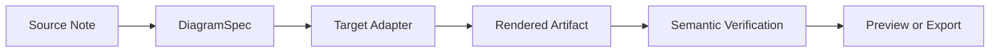
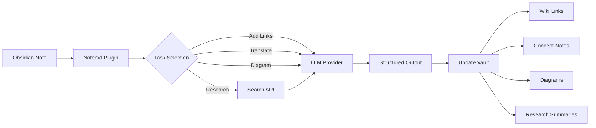

import TLDR from '@site/src/components/TLDR';

# Introduction à Notemd

<TLDR>
**Notemd** (Note + EMD — Documents Markdown améliorés) est un plugin Obsidian open source qui transforme la lecture assurée par LLM en connaissances persistantes. Contrairement aux IA basées sur des chats où les informations disparaissent après la session, Notemd enregistre les résultats **directement dans votre coffre-fort** sous forme de liens wiki, de notes conceptuelles, de résumés de recherche, de traductions, de flux de travail et de diagrammes. Il est conçu pour les chercheurs, les étudiants et les professionnels du savoir qui souhaitent que leurs lectures, recherches et explications visuelles s’accumulent au sein d’un graphe de connaissances structuré et en évolution constante.
</TLDR>

## Qu'est-ce que Notemd ?

Notemd intègre **plus de 30 grands modèles de langage** (OpenAI, Anthropic, Google, DeepSeek, Qwen, Ollama, et d’autres) dans votre flux de travail Obsidian afin d’automatiser l’extraction des connaissances, leur organisation, la traduction, la recherche et la génération de diagrammes.

### Différence clé : connaissances éphémères vs. connaissances persistantes

| Apparence | IA basée sur le chat (ChatGPT, etc.) | Notemd |
|--------|-------------------------------|--------|
| **Où vont les résultats** | Historique de chat (disparaît) | Votre coffre-fort Obsidian (persiste) |
| **Format** | Réponses en texte brut | Fichiers structurés : `[[wiki-links]]`, notes de concept, diagrammes |
| **Valeur à long terme** | Il faut le demander à nouveau chaque fois | Accumule dans un graphe de connaissances |
| **Accès hors ligne** | Nécessite Internet | Fonctionne entièrement hors ligne avec Ollama |

## Capacités de base

### 1. **Création automatique de liens wiki**
- LLM identifie les concepts clés dans vos notes
- Insère `[[wiki-links]]` à chaque occurrence
- Crée éventuellement des notes de concept liées
- Suppression des synonymes pour éviter les doublons

### 2. **Génération de la note conceptuelle**
- Extrait les concepts clés des articles de recherche, des articles et des notes
- Génère des fichiers de concept dédiés avec des liens inversés
- Chemins de sortie et modèles personnalisables

### 3. **Intégration de la recherche web**
- Interroger Tavily ou DuckDuckGo depuis Obsidian
- LLM résume les résultats avec des citations sources
- Ajoute les résultats de la recherche à la note actuelle

### 4. **Traduction multilingue**
- Traduisez des extraits ou des notes entières
- Prend en charge plus de 21 langues UI
- Configuration indépendante de la langue de sortie
- Soutien à la traduction par lots

### 5. **Génération de diagrammes**
- **Mermaid**: Diagrammes de flux, séquentiels, de classes, d’états, ER, Gantt
- **JSON Canvas**: layouts natifs de Obsidian
- **Vega-Lite**: Graphiques de données, séries temporelles, graphiques en nuage de points
- **HTML / HTML éditable/SVG**: Artefacts de figures autonomes avec annotations sémantiques
- **Draw.io / Drawnix limites des artefacts** : chemins d’exportation destinés aux mainteneurs, issus du même modèle de figure sémantique
- **Feuille de route des schémas électriques** : le support circuitikz/TikZJax est conçu en s’appuyant sur des références d’or, des instructions restreintes, des retours de rendu et une validation de la topologie/layout, plutôt que sur des LLM TikZ bruts et non contraints.
- **Diagnostic de prévisualisation** : Les artefacts de rendu peuvent révéler des diagnostics liés à la compilation ou au rendu, et les sources non intégrées peuvent être inspectées sans avoir besoin d’un environnement LaTeX en temps de exécution côté plugin.
- Correction automatique de syntaxe pour les erreurs Mermaid

### 6. **Flux de travail en un clic**
- Enchaîner plusieurs actions en boutons de barre latérale
- Définition de flux de travail basé sur DSL
- Exemple : `add-links > extract-concepts > research > diagram`

## Qui devrait utiliser Notemd ?

✅ **Les chercheurs** qui lisent des articles et établissent des revues de littérature
✅ **Étudiants** qui organisent des notes de cours et créent des cartes conceptuelles
✅ **Les travailleurs du savoir** qui souhaitent que les informations lues soient conservées
✅ **Professionnels bilingues** nécessitant une traduction + création de liens wiki
✅ **Utilisateurs soucieux de la confidentialité** qui souhaitent un support local LLM (Ollama)
✅ **Utilisateurs avancés** qui personnalisent les prompts et les flux de travail

## Pourquoi Notemd + Obsidian ?

**Obsidian** est une base de connaissances axée sur le local et basée sur Markdown. **Notemd** ajoute des capacités surhumaines grâce à l’IA :
- Vos données restent dans votre coffre-fort (et non dans un service cloud).
- Fonctionne hors ligne avec des modèles locaux
- Gratuit et open source (licence MIT)
- S’intègre aux plugins Obsidian existants
- Évolue jusqu’à des dizaines de milliers de notes

## Début rapide

1. **Installation** : Paramètres → Plugins communautaires → Parcourir → "Notemd"
2. **Configurer** : Ajoutez la clé API de votre fournisseur LLM (ou utilisez Ollama local).
3. **Essayez-le** : Ouvrez une note → Cliquez avec le bouton droit → « Traiter le fichier (ajouter des liens) »
4. **Explorer** : Vérifiez la barre latérale pour trouver des flux de travail en un clic

👉 [Guide d'installation](./getting-started/installation) | [Tutoriel de démarrage rapide](./getting-started/quick-start)

## Direction des capacités du diagramme

Le travail de diagrammation d’Notemd évolue en s’éloignant de la méthode consistant à demander au modèle d’écrire une seule chaîne de syntaxe, pour adopter plutôt un pipeline en couches :

La mise en œuvre actuelle prend déjà en charge les solutions de secours Mermaid, JSON Canvas, Vega-Lite, HTML, les éléments HTML/SVG modifiables, les artefacts Draw.io XML, un sous-ensemble minimal Drawnix JSON, les diagnostics de prévisualisation et les solutions de secours uniquement basées sur le code source, ainsi qu’un prototype hors ligne `CircuitSpec -> circuitikz` pour les modèles standards de sources communes et d’inverseurs CMOS. Les schémas électriques constituent une catégorie plus difficile : circuitikz permet d’exprimer une topologie électrique précise, mais une sortie non contrainte par LLM produit souvent des chemins de connexion illisibles ou du LaTeX qui ne s’affiche pas. La prochaine étape consiste à maintenir circuitikz sous contrôle grâce à des modèles de référence, des règles de disposition en grille de nœuds, des diagnostics de rendu et des boucles de retour via des captures d’écran.

Lisez les détails dans [Diagrams](./features/diagrams).

## Architecture

## Notemd contre d’autres plugins d’IA Obsidian

La plupart des plugins d’IA Obsidian sont conçus pour la conversation en premier lieu (vous posez une question, l’IA répond, les informations restent dans le chat). Notemd, quant à lui, est **conçu pour l’écriture en premier lieu** : l’IA traite vos notes et écrit directement des résultats structurés dans votre coffre-fort.

| Capacité | Notemd | Copilot | Smart Connections | Text Generator |
|-----------|--------|---------|-------------------|-----------------|
| Insertion automatique de liens wiki | Oui | Non | Non | Non |
| Génération de note conceptuelle | Oui (avec des liens renvoyants + suppression des doublons) | Non | Non | Non |
| Génération de diagrammes | Oui (Mermaid, Canvas, Vega-Lite, HTML, artefacts modifiables) | Non | Non | Non |
| Intégration de la recherche web | Oui (Tavily + DuckDuckGo) | Non | Non | Non |
| Traitement par lots des dossiers | Oui | Limité | Non | Limité |
| Affectation du modèle par tâche | Oui (7 tâches, modèles indépendants) | Non | Non | Non |
| Chaînes de flux de travail en un clic | Oui (DSL) | Non | Non | Non |
| Traduction (par lots) | Oui | Non | Non | Non |
| Discuter avec le coffre-fort | Non | Oui | Non | Non |
| Recherche de similarité sémantique | Non | Non | Oui | Non |
| Génération basée sur des modèles | Non | Non | Non | Oui |
| Fournisseurs LLM | 36 (cloud + gateway + local) | 3-5 | 2-3 | 3-5 |
| Entièrement hors ligne | Oui (Ollama) | Partiel | Partiel | Partiel |

**Quand choisir Notemd** : vous souhaitez que l’IA crée un graphe de connaissances persistant — et non simplement discuter de vos notes.

**Quand choisir Copilot** : vous souhaitez un assistant IA conversationnel à l’intérieur de Obsidian.

**Quand choisir Smart Connections** : vous souhaitez découvrir les relations existantes entre des notes grâce à une recherche sémantique.

## Philosophie

**Notemd estime que l’IA devrait compléter le travail de connaissance des humains, et non le remplacer.** Le plugin :
- Vous maintient sous contrôle (revue avant application des modifications)
- Préservation du contexte (tous les résultats renvoient à la source)
- Respecte la vie privée (support local LLM, pas de télémétrie)
- Reste extensible (interfaces ouvertes API, flux de travail personnalisés)

<!-- notemd-acknowledgments -->
## Remerciements et projets de référence

Notemd est maintenu de manière indépendante. Nous remercions les projets et communautés open source qui ont éclairé des décisions de conception documentées ou fournissent des fondations d’intégration. La mention reconnaît uniquement une influence ou une interopérabilité ; elle n’implique ni approbation, ni affiliation, ni code intégré, ni revendication de réutilisation de code.

- **Projets de référence:** [cloudy-tech-diagrams-skill](https://github.com/cloudy-liu/cloudy-tech-diagrams-skill), [Drawnix](https://github.com/plait-board/drawnix), [diagrams.net / draw.io](https://www.diagrams.net/), [repo-saga](https://github.com/teee32/repo-saga).
- **Fondations open source:** [Mermaid](https://github.com/mermaid-js/mermaid), [Vega-Lite](https://vega.github.io/vega-lite/), [Slidev](https://github.com/slidevjs/slidev), [CircuitikZ](https://github.com/circuitikz/circuitikz), [Tectonic](https://github.com/tectonic-typesetting/tectonic), [Docusaurus](https://docusaurus.io).
- Chaque projet conserve sa propre licence et ses conditions ; Notemd est disponible sous [licence MIT](https://github.com/Jacobinwwey/obsidian-NotEMD/blob/main/LICENSE).

## Logiciel libre

- **Licence** : MIT
- **Source** : [github.com/Jacobinwwey/obsidian-NotEMD](https://github.com/Jacobinwwey/obsidian-NotEMD)
- **Communauté** : [Discord](https://discord.gg/qnGgsQ9W) | [GitHub Discussions](https://github.com/Jacobinwwey/obsidian-NotEMD/discussions)
- **Contribuer** : les PR sont les bienvenus, consultez [CONTRIBUTING.md](https://github.com/Jacobinwwey/obsidian-NotEMD/blob/main/CONTRIBUTING.md)

---

**Suivant** : [Installation →](./getting-started/installation)
