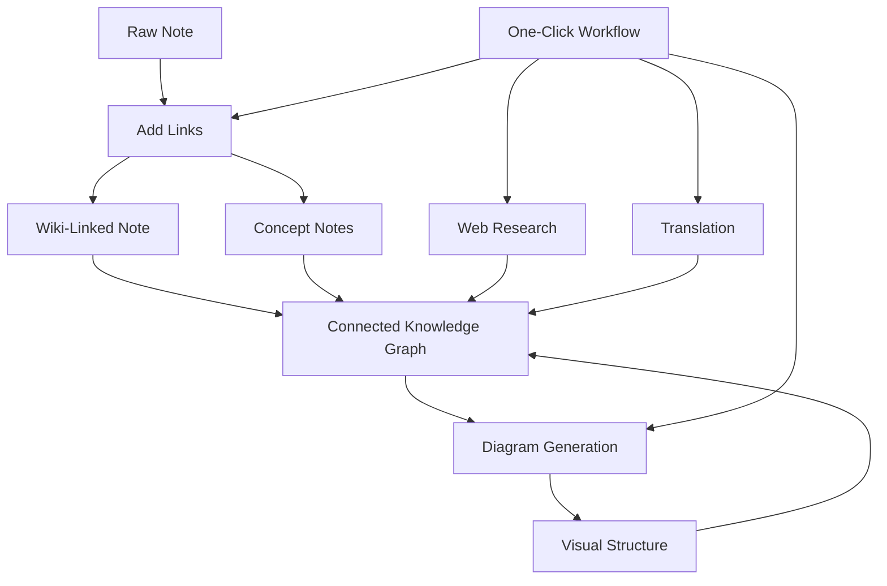

import TLDR from '@site/src/components/TLDR';

# Obsidian Guide de gestion des connaissances en IA

<TLDR>
**Notemd transforme la lecture alimentée par LLM en connaissances durables : des liens wiki relient les concepts, des notes de concept créent un graphe consultable, la recherche intègre le web dans votre coffre-fort, la traduction brise les barrières linguistiques, les diagrammes rendent la structure visible, et les workflows relient tout cela en un seul clic.** Ce guide couvre l’ensemble du processus — des notes brutes à une base de connaissances connectée, visuelle et multilingue.
</TLDR>

## Pourquoi la gestion des connaissances par l’IA ?

La prise de notes traditionnelle génère des fichiers plats. Même avec des liens wiki manuels, la plupart des notes restent désconnectées. Notemd utilise LLMs pour automatiser la couche de connexion :

- **LLMs lisent votre contenu** et identifient ce qui est important — termes, méthodes, personnes, théories
- **Les liens sont insérés automatiquement** à chaque occurrence d’un concept, et non cachés dans une section « voir aussi ».
- Les **notes de concept** sont générées en tant que fichiers indépendants pouvant être récupérés.
- **La recherche enrichit les notes** avec du contexte provenant d’Internet
- **Les diagrammes rendent la structure visible** — cartes mentales, organigrammes, graphiques de données à partir du même contenu

Le résultat : un graphe de connaissances qui s’agrandit à chaque note que vous traitez, et non seulement lorsque vous vous souvenez d’ajouter des liens.

## Le pipeline complet



Chaque étape est indépendante. Utilisez-en une ou toutes. La séquence la plus efficace : **Ajouter des liens → Notes de concept → Diagrammes**.

---

## 1. Liens wiki : rendre les connexions explicites

Les liens wiki constituent l’ossature d’un graphe de connaissances. Notemd utilise un LLM pour :

1. Lisez le contenu de votre note (divisé en parties pour les documents longs)
2. Identifier les concepts fondamentaux — en donnant la priorité à des termes techniques spécifiques par rapport aux noms génériques
3. Insérez `[[wiki-links]]` à chaque occurrence
4. Supprimer les synonymes afin que « ML » et « Machine Learning » ne créent pas de nœuds distincts

### Quand l'utiliser

- **Chaque note >100 mots** — les notes plus courtes ne présentent que peu de concepts
- **Articles de recherche, documents techniques, notes de réunion** — riches en termes spécifiques au domaine
- **Une fois le contenu stable** — ne traitez pas les brouillons en boucle

### Paramètres clés

| Configuration | Recommandé | Pourquoi |
|---------|-----------|-----|
| `addLinksProvider` | DeepSeek ou GPT-4o-mini | Bonne précision à bas coût |
| Suppression des synonymes | On | Empêche les nœuds dupliqués |
| Fenêtre de contexte | Paragraphe | Équilibre entre précision et coût |

→ [Découverte approfondie des liens Wiki](/docs/features/wiki-links)

---

## 2. Notes de concept : Nœuds de connaissances récupérables

Les liens wiki relient les idées en ligne, mais les notes de concept permettent de récupérer chaque idée de manière indépendante. Chaque concept dispose de son propre fichier `.md` :

```markdown
# Machine Learning

## Linked From
- [[My Research Notes]]
- [[Neural Networks Explained]]
```

### Le processus d’extraction

L’invite LLM est fortement structurée :
- Normaliser en forme singulière
- Préférer les concepts à plusieurs mots aux mots simples (“Relaxation diélectrique” et non “Relaxation”)
- Ignorer les sections de références/bibliographie
- Sortie en `CONCEPT:` lignes pour une analyse déterministe

Les concepts sont dédoublés entre les différents blocs grâce à `Set<string>`. Les erreurs LLM sur des blocs individuels n’interrompent pas l’opération.

### Liens inversés

Lorsqu’il est activé, chaque note de concept enregistre les notes sources qui la mentionnent. Le panneau d’ancrages natif de Obsidian affiche également les connexions inverses.

### Déduplication

Le moteur de suppression des doublons en 4 étapes de Notemd permet de détecter :
1. **Correspondances exactes** — comparaison des noms de fichiers insensible à la casse
2. **Formes plurielles** — « Models.md » contre « Model.md »
3. **Normalisation des symboles** — « A-B.md » contre « A B.md »
4. **Contenu à un seul mot** — "ML.md" est marqué lorsqu'"Machine Learning.md" existe

### Paramètres clés

| Configuration | Recommandé | Pourquoi |
|---------|-----------|-----|
| `conceptNoteFolder` | `concepts/` ou `🧠 concepts/` | Maintient le coffre-fort organisé |
| `extractConceptsAddBacklink` | On | Permet la recherche inverse |
| `extractConceptsMinimalTemplate` | Désactivé | Modèle complet avec Liens externes |
| Modèle par tâche | DeepSeek | L'extraction de concepts n'a pas besoin de modèles coûteux. |
| Suppression des synonymes | On | La même configuration affecte à la fois le liage et l’extraction |

→ [Découverte approfondie des notes de concept](/docs/features/concept-notes)

---

## 3. Recherche : Intégrer le Web

Notemd intègre la recherche sur le Web dans votre flux de travail de prise de notes :

1. **Construction de la requête** — le titre ou la sélection de votre note devient une requête de recherche
2. **Recherche sur le Web** — Tavily (recommandé, clé API requise) ou DuckDuckGo (gratuit, aucune clé requise)
3. **LLM résumé** — les résultats de recherche sont condensés en un résumé pertinent
4. **Ajouter à la note** — résumé ajouté à la position du curseur ou en tant que nouvelle section

### Quand l'utiliser

- Avant de traiter un nouveau sujet — obtenez d’abord le contexte web
- Lorsqu’une note de concept nécessite des compléments — effectuez des recherches puis ajoutez des liens
- Pour les revues de littérature — effectuer une recherche en lot sur un dossier de notes

### Paramètres clés

| Configuration | Recommandé | Pourquoi |
|---------|-----------|-----|
| `researchProvider` | GPT-4o ou Claude | La recherche a besoin d’une synthèse de meilleure qualité |
| Service de recherche | Tavily | Meilleure pertinence, profondeur configurable |
| `maxResearchContentTokens` | 4000 | Équilibre entre la profondeur et le coût |

→ [Recherche approfondie](/docs/features/research)

---

## 4. Traduction : Briser les barrières linguistiques

Notemd traduit les notes en utilisant votre LLM configuré — et non un service de traduction dédié API. Cela signifie :

- **Traductions conscientes du contexte** — le LLM comprend le document dans son intégralité, et non phrase par phrase
- **Gestion des termes techniques** — « gradient descent » reste « 梯度下降 » et non « 坡度向下 »
- **Support par lots** — traduire un dossier entier de notes en une seule opération
- **Modèle par tâche** — utilisez Gemini Flash pour la traduction (rapide, économique, multilingue)

### Soutien linguistique

Notemd prend en charge lui-même 21 langues UI. La langue cible de traduction peut être configurée pour chaque tâche. Paires courantes : EN↔ZH, EN↔JA, EN↔KO, EN↔DE, EN↔FR, EN↔ES.

→ [Analyse approfondie de la traduction](/docs/features/translation)

---

## 5. Diagrammes : rendre la structure visible

Le pipeline de diagrammes de Notemd est basé sur la spécification en premier : le LLM génère un `DiagramSpec` JSON structuré, puis des adaptateurs le traduisent dans le format cible. Cela produit des résultats plus fiables que de demander au LLM une syntaxe Mermaid brute.

### Détection d’intention

Notemd déduit le meilleur type de diagramme à partir du contenu :

- **Tables avec des numéros** → graphique de données (Vega-Lite)
- **Vocabulaire client/serveur** → diagramme de séquence (Mermaid)
- **Entité/clé primaire** → Diagramme ER (Mermaid)
- **Flux d'étapes/processus** → organigramme (Mermaid)
- **Mots-clés de la carte conceptuelle** → JSON Canvas (Obsidian natif)
- **Par défaut** → carte mentale (Mermaid)

### Chaîne de rendu

Cible principale → solution de secours → solution de secours → HTML. Si la syntaxe Mermaid échoue, il tente à nouveau une fois avec le contexte d’erreur vers LLM, puis passe à un diagramme minimal.

### Paramètres clés

| Configuration | Recommandé | Pourquoi |
|---------|-----------|-----|
| `enableExperimentalDiagramPipeline` | On | Meilleure qualité grâce à une approche basée sur les spécifications en premier |
| `experimentalDiagramCompatibilityMode` | `best-fit` | Cible native par intention |
| `summarizeToMermaidProvider` | GPT-4o ou Claude | Les spécifications de diagrammes nécessitent un raisonnement spatial |
| `autoMermaidFixAfterGenerate` | On | Détection automatique des erreurs de syntaxe LLM |
| Augmentation des connaissances locales | Utiliser pour des domaines spécifiques | Améliore la précision avec le contexte du coffre-fort |

→ [Analyse approfondie des diagrammes](/docs/features/diagrams)

---

## 6. Flux de travail : Automatisation en un clic

Les workflows enchaînent plusieurs tâches en un seul bouton de barre latérale. Le format DSL est :

```
task1 | task2 | task3
```

Exemple : `addLinks` | extraireLesConcepts | generateDiagram` — transforme une note à partir de texte brut en un nœud de connaissance visuel entièrement connecté en un seul clic.

### Flux de travail recommandés

| Flux de travail | Chaîne | Cas d'utilisation |
|----------|-------|----------|
| Processus complet | `addLinks \| extractConcepts \| generateDiagram` | Nouvelles notes |
| Recherche d'abord | `research \| addLinks` | Sujets inconnus |
| Polyglotte | `translate \| addLinks` | Notes multilingues |
| Seulement le diagramme | `generateDiagram` | Visualisation rapide |

→ [Analyse approfondie des workflows](/docs/features/workflows)

---

## 7. LLM Fournisseurs : 36 options, du cloud au local

Notemd prend en charge 36 fournisseurs sur 4 types de transport. Groupes clés :

- **Cloud international** : OpenAI, Anthropic, Google, Mistral, xAI
- **Cloud chinois** : DeepSeek, Qwen, Doubao, Moonshot, GLM, Baidu, SiliconFlow
- **Passerelles** : OpenRouter, GitHub Models, Hugging Face, Vercel
- **Local** : Ollama, LMStudio, OVMS — pas de clé API, aucune donnée ne quitte votre machine

### Stratégie de modèle par tâche

La configuration la plus économique consiste à utiliser des modèles bon marché pour les tâches simples et des modèles puissants pour les tâches complexes :

```
extractConcepts  → DeepSeek (fast, cheap, accurate enough)
addLinks          → DeepSeek or GPT-4o-mini
research          → GPT-4o or Claude (needs quality)
generateDiagram   → GPT-4o or Claude (needs spatial reasoning)
translate         → Gemini Flash (fast, multilingual)
```

→ [Aperçu des fournisseurs LLM](/docs/providers/overview)

---

## Liste de vérification pour commencer

1. **Installer Notemd** — [Plugins communautaires](/docs/getting-started/installation) (recommandé) ou manuellement
2. **Configurer un fournisseur** — DeepSeek (le plus simple), OpenAI, ou Ollama (gratuit)
3. **Traitez votre première note** — clic droit → « Traiter le fichier (ajouter des liens) »
4. **Définir le dossier du concept** — Paramètres → Notemd → Sortie → Dossier du concept
5. **Extraire les concepts** — exécutez « Extraire les concepts » sur la même note
6. **Générer un diagramme** — exécutez « Générer diagramme » pour visualiser les connexions
7. **Créer un flux de travail** — relier ce qui précède à un bouton en un clic

## Configurations recommandées

### Étudiant (Budget)

```
Provider: DeepSeek (free tier available)
Concept extraction: DeepSeek
Research: DuckDuckGo (free) + DeepSeek
Diagrams: Off (or legacy Mermaid)
Workflows: addLinks | extractConcepts
```

### Chercheur (Qualité)

```
Provider: GPT-4o (primary)
Concept extraction: DeepSeek (cost savings)
Research: GPT-4o + Tavily
Diagrams: best-fit mode, GPT-4o
Workflows: research | addLinks | extractConcepts | generateDiagram
```

### Privilégier la confidentialité (uniquement local)

```
Provider: Ollama (llama3 or qwen2.5:7b)
All tasks: Ollama
Research: DuckDuckGo (free, no API key)
Diagrams: legacy Mermaid mode
```

### Bilingue (ZH + EN)

```
Primary: DeepSeek (Chinese queries)
Translation: Google Gemini Flash
Research: Tavily + DeepSeek (Chinese search context)
Language output: per-task (extractConceptsLanguage: zh-CN)
```

---

## Modèles courants

### Modèle : Traiter un article de recherche

1. Importer le contenu de PDF (ou le coller)
2. **Recherche** — obtenir du contexte web sur le sujet
3. **Ajouter des liens** — identifier et relier les concepts clés
4. **Extraire les concepts** — créer des notes indépendantes
5. **Générer le diagramme** — visualiser la structure du papier

### Modèle : Enrichissement de la note quotidienne

1. Écrire une note quotidienne
2. **Ajouter des liens** — relie les idées d’aujourd’hui aux concepts existants
3. Les notes de concept s’actualisent automatiquement avec des liens inversés

### Modèle : Revue de la littérature

1. Créer un dossier avec papers/notes
2. **Ajout en lot de liens** — traiter un dossier entier
3. **Dédupliquer les concepts** — nettoyer les notes presque identiques
4. **Générer le diagramme** — carte mentale de toute la littérature

---

*Notemd est open source (MIT) et fonctionne avec Obsidian 0.15.0+ sur toutes les plateformes. [Installez-le maintenant](/docs/getting-started/installation) ou [visualisez-le sur GitHub](https://github.com/Jacobinwwey/obsidian-NotEMD).*
