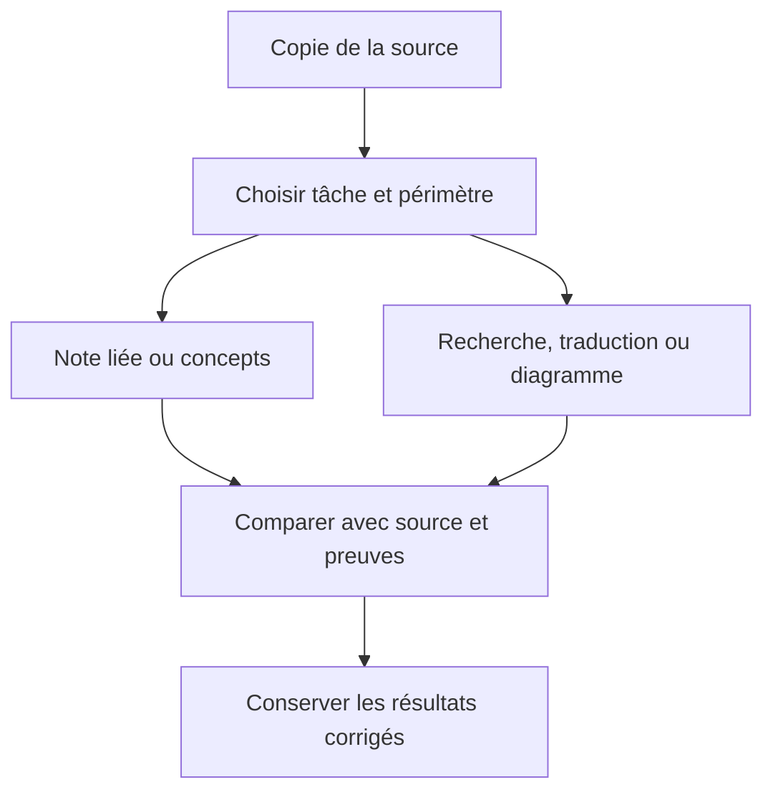

import TLDR from '@site/src/components/TLDR';

# Organiser les connaissances avec l’IA dans Obsidian

<TLDR>
Un bon parcours distingue source, génération et corrections. Notemd propose liens, extraction, recherche, traduction et diagrammes sous forme de fichiers vérifiables. Commencez par une source, contrôlez le résultat, puis automatisez un dossier délimité.
</TLDR>

## Définir le résultat

Choisissez la production utile : note liée, concepts, synthèse sourcée, traduction ou diagramme. Plus de fichiers et de liens ne signifie pas meilleure compréhension ni recherche. Définissez comment vérifier puis retrouver le contenu.

## Parcours complet


```mermaid
flowchart TD
    A[Copie de la source] --> B[Choisir tâche et périmètre]
    B --> C[Note liée ou concepts]
    B --> D[Recherche, traduction ou diagramme]
    C --> E[Comparer avec source et preuves]
    D --> E
    E --> F[Conserver les résultats corrigés]
```

Ces tâches sont disponibles séparément ; aucun bouton par défaut ne les accomplit toutes. Conservez la source et vérifiez les destinations avant l’enchaînement.

## 1. Liens : expliciter les relations

Lancez **Traiter le fichier (ajouter des liens)** sur une copie et contrôlez `_processed.md`. Vérifiez utilité des termes et fidélité des citations, du code et des équations.

Apprentissage ciblé et consignes sur les synonymes ne prouvent ni équivalence exacte ni seuil numérique. Préférez une correspondance déterministe si la reproductibilité sur des titres existants prime. [Guide des liens](./features/wiki-links).

## 2. Concepts : séparer terme et explication

Choisissez le dossier avant extraction. Les notes autonomes sont limitées au titre par défaut, sans modifier la source. Activez les backlinks et désactivez le modèle minimal pour `Linked From` dans les nouvelles notes.

**Génération par lot à partir des titres** est distinct de l’extraction et peut traiter aussi les concepts déjà présents. Gardez un dossier d’essai, puis vérifiez le déplacement vers complete. Les doublons reposent sur des heuristiques de noms : confirmez avant suppression. [Guide des concepts](./features/concept-notes).

## 3. Recherche : conserver les preuves

Choisissez sujet ou titre et Tavily/DuckDuckGo, puis **Rechercher et résumer**. Une clé Tavily absente ne bascule pas de moteur. Ouvrez les URL et vérifiez les affirmations.

La recherche locale optionnelle est lexicale ; ses extraits vont au LLM choisi. Un index local ne rend donc pas toute la tâche hors ligne ou privée à l’appareil. [Guide de recherche](./features/research).

## 4. Traduction : sens et structure

Choisissez langue et traduction du fichier. Le suffixe par défaut est `_<language>.md` ; une destination existante peut être écrasée. Pour un passage, utilisez une note temporaire.

Comparez termes, nombres, code, liens et notations. Le découpage peut perdre du contexte. Les 21 langues d’interface et 34 routes Web ne garantissent aucune paire de traduction. [Guide de traduction](./features/translation).

## 5. Diagrammes : choisir une source réutilisable

Choisissez type et source compatibles, relisez, puis enregistrez source et SVG/PNG/PDF utiles. Une image ne garantit pas que l’éditeur externe conserve toutes les relations.

CircuitikZ est contraint et sa compilation a un contrôle séparé. Les flèches Drawnix entre branches restent statiques après réorganisation. Les tableaux PowerPoint s’améliorent, mais Mermaid/SVG peuvent rester des images. [Guide des diagrammes](./features/diagrams).

## 6. Workflows : automatiser une séquence vérifiée

Un nom, `::`, puis les identifiants séparés par `>` définissent le bouton :

```text
One-Click Extract::process-current-add-links>batch-generate-from-titles>batch-mermaid-fix
```

La chaîne ajoute liens, contenu depuis les titres et réparation Mermaid ; elle n’ajoute pas recherche générique ni diagramme. Chaque étape conserve prérequis et sorties, sans pipeline arbitraire de texte.

L’erreur signalée arrête par défaut. Continuer n’est pertinent que si les étapes restantes acceptent les entrées disponibles. Annuler conserve les sorties terminées. [Guide des workflows](./features/workflows).

## 7. Fournisseurs : protocole et besoin

Les 36 préréglages couvrent cinq protocoles. Choisissez selon endpoint, accès au modèle, politique de données et résultat mesuré. Comparez vitesse/coût avec les mêmes sources et prompts.

Les routes par tâche sont désactivées par défaut ; activez-les délibérément et vérifiez chacune avant de considérer le parcours local. [Guide des fournisseurs](./providers/overview).

## Vérifications initiales

1. Installer et sauvegarder les sources.
2. Configurer et tester le couple exact.
3. Choisir dossier de concepts et destinations distinctes.
4. Exécuter une tâche sur une copie.
5. Comparer et conserver les corrections.
6. Tester un petit lot et ses résultats partiels avant une longue chaîne.

## Parcours fréquents

### Étudier un article

Convertissez d’abord avec un outil externe et corrigez équations, figures et tableaux. Extrayez concepts ou passages originaux ; recherchez des questions précises. Ne produisez un diagramme que s’il clarifie une relation vérifiable. Gardez l’article original et les corrections.

### Entretenir les concepts

Utilisez un dossier dédié, relisez les termes, puis enrichissez un sous-ensemble choisi. Sauvegardez avant nettoyage ; le volume ne remplace pas les définitions exactes et la navigation utile.

### Traiter du contenu privé

Préparez modèle local, serveur et dépendances. Contrôlez les routes par tâche et évitez la recherche réseau si nécessaire. Relisez les diagnostics avant partage. Un défaut loopback n’empêche pas de configurer une adresse distante.

### Reprendre un lot interrompu

Attendez la stabilisation. Lisez rapport, sorties terminées et récupération ; comparez conflits, puis relancez le périmètre voulu. Annulé ne veut pas dire vide ; vérifiez les références avant suppression des compagnons.

## Pour continuer

- [Démarrage rapide](./getting-started/quick-start).
- [Lots](./advanced/batch-processing).
- [Développeurs](./developers/overview).
- [Agents](./agents/overview).
