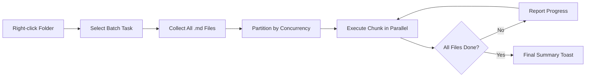

import TLDR from '@site/src/components/TLDR';

# עיבוד בקבוצות

<TLDR>
**Notemd מעבד את כל התיקיות בפעולה אחת עם שליטה במקביליות ובהחלפה.** לחץ ימני על תיקייה כדי להוסיף באופן אוטומטי קישורי wiki, לשלוף רעיונות, לחקור או לתרגם את כל ההערות שבתוכה. מגבלות המקביליות מונעות שגיאות של API. מתקבלות דיווחי התקדמות לפי קובץ. התנהגות ההחלפה ניתנת להגדרה: לדלג על קיימים, להוסיף או להחליף. קבצים שנכשלו נרשמים מבלי לעצור את העיבוד הקבוצתי.

זהו חלק מה[Obsidian מדריך ניהול ידע AI](/docs/pillar-ai-knowledge).
</TLDR>

## סקירה

עיבוד בקבוצות הופך תיקייה של הערות לפעולה אחת. במקום לפתוח כל הערה ולבצע פקודות בנפרד, לוחצים ימני על התיקייה ובוחרים את המשימה. Notemd עובר על כל קובץ `.md`, מיישם את הפעולה הנבחרת ומדווח על ההתקדמות בזמן אמת.

תכונה זו הכרחית לשליפת ידע ברמת הארכיון כולו. לאחר ייבוא עשרות PDF, למשל, הוספה אוטומטית של קישורים לאחר מכן שליפה אוטומטית של רעיונות, בונים את גרף הידע שלכם בדקות ולא בשעות.

## אופן הפעולה

### מודל ביצוע בקבוצות

1. **איסוף קבצים** -- Notemd סורק את התיקייה היעד באופן רקורסיבי (או רק ברמת הרמה העליונה, בהתאם להגדרות) ואוסף את כל קבצי `.md`.
2. **חלוקה למקביליות** -- הקבצים מחולקים לקבוצות בהתאם להגדרת `batchConcurrency`. כל קבוצה מתבצעת במקביל; הקבוצות מתבצעות ברצף.
3. **ביצוע** -- כל קובץ מעובד באמצעות אותה לוגיקה כמו הפקודה לקובץ בודד. מתחשבים בהגדרות הספק והמודל לכל משימה.
4. **דיווח התקדמות** -- הודעת toast מתעדכנת לאחר סיום כל קובץ, ומציגה את ההתקדמות `N / Total`.
5. **טיפול בשגיאות** -- אם קובץ נכשל (שגיאת API, זמן חיבור לרשת וכו'), השגיאה נרשמת והעיבוד הקבוצתי ממשיך. סיכום סופי מציג את כל הקבצים שנכשלו.
6. **סיום** -- הודעת toast סיכום מדווחת על הכמות הכוללת שעובדה, ההצלחות והכישלונות.

### התנהגות כתיבה מחדש

בעת עיבוד קובץ שכבר מכיל קישורי wiki, רשימות רעיונות או תרגומים, ההתנהגות של Notemd תלויה בהגדרת הכתיבה מחדש:

| מצב | התנהגות |
|------|----------|
| **דלג** | התוכן הקיים נשאר ללא שינוי. רק קבצים שלא שונו מעובדים. |
| **הוסף בסוף** (ברירת המחדל) | תוכן חדש מוסף בסוף. קישורי wiki, הרעיונות או התרגומים הקיימים נשמרים. |
| **החליף** | הקובץ מעובד מחדש לחלוטין. כל השינויים הקודמים של Notemd מוחלפים. |

לגבי יצירת קישורי wiki באופן ספציפי: אם רשימה כבר מכילה `[[wiki-links]]`, מצב **דלג** משאיר אותה כמו שהיא, בעוד ש**החליף** שולח את כל הרשימה ל-LLM כדי להוסיף קישורים חדשים. השתמשו ב**דלג** לעיבוד הדרגתי וב**החליף** לעיבוד מחדש לאחר שדרוג של המודל.

### בקרת תוך-זמניות

הגדרת `batchConcurrency` מגבילה את מספר הקריאות המקבילות של API. זה מונע שגיאות מגבלת קצב (HTTP 429) בעת עיבוד תיקיות גדולות אצל ספקים עם מגבלות קפדניות.

| תוך-זמניות | מומלץ לשימוש ב | השפעה טיפוסית על מגבלת הקצב |
|-------------|----------------|---------------------------|
| `1` | רמות בחינם, ספקים קפדניים | אף אחת (סריאלית) |
| `3` (ברירת מחדל) | רוב ספקי הענן | נמוך |
| `5` | Ollama (מקומית), רמות נדיבות | אף אחת / נמוך |
| `10` | מודלים מקומיים עם הסקה מהירה | אף אחת |

אם אתם נתקלים בשגיאות 429 במהלך עיבוד בקבוצות, הפחיתו את הביצועים המקבילים ל-1 או 2.

## הגדרה

| ערך | ברירת מחדל | השפעה |
|---------|---------|--------|
| `batchConcurrency` | `3` | מספר הקריאות המקבילות המרבי של API במהלך פעולות על תיקיות |
| `batchOverwriteExisting` | `false` | לכתוב מחדש את תוכן Notemd הקיים. `false` = מצב הוספה. |
| `batchSkipProcessed` | `false` | לדלג על קבצים שכבר מכילים סימני Notemd (למשל, קישורי wiki) |
| `batchRecursive` | `true` | לכלול תת‑תיקיות בעת סריקת התיקייה |
| `enableStableApiCall` | `false` | להפעיל לוגיקת ניסיונות חוזרים (עד 4 ניסיונות) לכל קובץ במסגרת הבצוע ההמוני |

### מודלים למשימה בודדת בבצוע המוני

כל פעולה בבצוע המוני משתמשת במודל המתאים למשימה. batch-add-links משתמש ב‑`addLinksProvider`, batch-research משתמש ב‑`researchProvider`, וכן הלאה. זה אומר שניתן להקצות מודלים זולים לפעולות בהיקף גדול ולשמור מודלים יקרים למשימות הדורשות איכות גבוהה.

## דוגמה

יש לך תיקייה `papers/` שמכילה 40 רשימות מחקר מיובאות. אתה רוצה להוסיף קישורי wiki ולשלוף רעיונות מכולן:

1. לחץ ימני על התיקייה `papers/`
2. בחר **"Notemd: Process folder (add links)"**
3. Notemd סורק את התיקייה, מוצא 40 קבצי `.md`, ומעבד 3 בכל פעם (רמת ביצועים סטנדרטית)
4. תצוגת התקדמות מראה: `12/40 files processed...`
5. לאחר כ‑3 דקות, תצוגת סיכום מדווחת: `39 succeeded, 1 failed (API timeout on paper-37.md)`
6. חזור על הפעולה באמצעות **"Notemd: Process folder (extract concepts)"** כדי ליצור תגיתות רעיונות עבור כל 40 הקבצים

הקובץ שנכשל נרשם. ניתן להריץ שוב רק את אותו קובץ לאחר מכן.

## טיפים

- **התחל ברמת ביצועים נמוכה** -- אם אינך בטוח לגבי מגבלות הקצב של הספק שלך, התחל עם `1` והגדל בהדרגה.
- **השתמש במצב דילוג לעדכונים הדרגתיים** -- לאחר המחזור המלא הראשון, עבור ל‑`batchSkipProcessed: true` כך שרק התגיתות החדשות יעובדו בריצות הבאות.
- **הפעל שיחות API יציבות** -- `enableStableApiCall: true` מוסיף לוגיקת ניסיונות חוזרים שמתאוששת משגיאות רשת זמניות במחזורים ארוכים.
- **הרץ שוב לאחר שדרוגי מודל** -- אם עוברים למודל טוב יותר, הגדר `batchOverwriteExisting: true` והרץ שוב כדי לקבל קישורים ורעיונות משופרים.

---

## צעדים באופק

- [Workflows](/docs/features/workflows) -- חבר את משימות המחזור לכפתורי צד של לחיצה אחת
- [Custom Prompts](/docs/advanced/custom-prompts) -- התאים אישית את ההוראות לשליפה המחזורית
- [Troubleshooting](/docs/advanced/troubleshooting) -- תקן שגיאות מגבלות קצב וכישלונות חיבור במהלך ריצות המחזור
- [LLM ספקים](/docs/providers/overview) -- התייחסות להגדרת המודל לכל משימה
