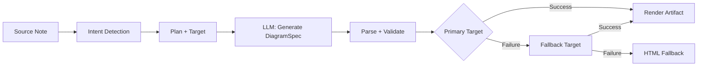
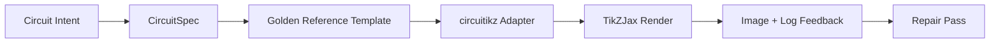

import TLDR from '@site/src/components/TLDR';

# תרשימים

<TLDR>
**Notemd מייצר תרשימים מהרשימות שלכם באמצעות תהליך המבוסס על מפרט ראשון.** ה-LLM מייצר קובץ JSON `DiagramSpec` שאינו תלוי בממשק ייצוג, ולאחר מכן מתאמים מיוחדים מתרגמים אותו לפורמטים של Mermaid, JSON Canvas, Vega-Lite, HTML, HTML/SVG מעוצבים שניתן לערוך, Draw.io, Drawnix, או תרשימי circuitikz מוגבלים. המערכת תומכת ב-9 סוגי כוונות, שרשראות חלופה אוטומטיות, תצוגה בזמן אמת עם יצוא ל-SVG/PNG/PDF, בדיקה סמנטית, וייצור משופר באמצעות ידע מקומי.
</TLDR>

זהו חלק מה[Obsidian מדריך ניהול ידע AI](/docs/pillar-ai-knowledge).

## ארכיטקטורה: תהליך שמתחיל במפרט

Notemd אף פעם לא מבקש מהLLM לייצר תחביר Mermaid/Vega/Canvas ישירות. במקום זאת:



**למה שמתחילים במפרט?** הLLM מייצרים לעתים קרובות תחביר לא תקין לממשק ההצגה (במיוחד Mermaid). מפרט מובנה ניתן לאימות לפני ההצגה, ואותו מפרט יכול לשמש מספר ממשקי הצגה כחלופות.

## סוגי תרשימים תומכים

| כוונה | ממשק הצגה ראשי | חלופות | מקרי שימוש |
|--------|-----------------|-----------|----------|
| `mindmap` | Mermaid | HTML | פירוק נושאים היררכי |
| `flowchart` | Mermaid | HTML | תהליכים, עצי החלטה |
| `sequence` | Mermaid | HTML | אינטראקציות לקוח‑שרת, פרוטוקולים |
| `classDiagram` | Mermaid | HTML | יחסי מחלקות OOP |
| `erDiagram` | Mermaid | HTML | תצורות בסיסי נתונים, יחסי ישויות |
| `stateDiagram` | Mermaid | HTML | מכונות מצב, מודלים של מחזור חיים |
| `canvasMap` | JSON Canvas | Mermaid → HTML | מפות רעיונות, גרפי ידע |
| `dataChart` | Vega-Lite | Mermaid → HTML | מקלעת, קו, שטח, פיזור, עוגה, טבלאות |
| `circuit` | circuitikz | אין | תרשימי מעגלים מוגבלים מנתוני `CircuitSpec` מאומתים |

## זיהוי כוונה

Notemd מסיק את סוג הדיאגרמה הטוב ביותר מתוכן ההערה שלך באמצעות דירוג מילות מפתח:

| כוונה | גורמי הפעלה | ביטחון |
|--------|----------|------------|
| `dataChart` | טבלאות, תאים מספריים, מילות מפתח של מדדים/מגמות, אחוזים | 0.88 |
| `sequence` | אוצר מילים של בקשה/תגובה (4+ התאמות) או סימני `->`/`=>` | 0.82 |
| `erDiagram` | מפתח ראשי, מפתח זר, ישות, תצורה (2+ התאמות) | 0.80 |
| `stateDiagram` | מצב, מעבר, בהמתנה, פועל, כשל (3+ התאמות) | 0.76 |
| `flowchart` | שלבים ממוספרים (2+) או אוצר מילים של if/then/else/workflow | 0.74 |
| `canvasMap` | מפת רעיונות, גרף ידע, מרחבי, קבוצות | 0.72 |
| `circuit` | circuitikz, TikZJax, circuit, schematic, CMOS, NMOS, PMOS, MOSFET, VDD/GND, `vin`/`vout` | 0.78 |
| `mindmap` | אפשרות חלופית ברירת מחדל | 0.55 |

החליפו באמצעות הגדרת **סוג הדיאגרמה המועדף**, בחירת הסיידבר הצדדי, או אפשרות מפלטת הפקודות המפורשת.

## בחירת יעד ההצגה

הצינור הניסיוני שמתחיל במפרט כולל כעת שתי בקרות עצמאיות:

| בקרה | ערך | השפעה |
|---------|---------|--------|
| סוג הדיאגרמה המועדף | `preferredDiagramIntent` | מנחה את הצורה הסמנטית של ה`DiagramSpec` המופק |
| יעד ההצגה המועדף | `preferredDiagramRenderTarget` | בוחר את ממשק ההצגה של המוצר עבור **Generate diagram** ו-**Preview diagram** |

הגדירו את **היעד לייצוג המועדף** ל-**Auto** כערך ברירת המחדל של התכנון, או בחרו במפורש בין Mermaid, JSON Canvas, Vega-Lite, HTML, HTML/SVG מעוצבים שניתן לערוך, Draw.io, Drawnix, או Circuitikz. השינוי יחול רק על פקודות הייצור של הקבצים והתצוגה בזמן אמת. פקודת ה**Summarise as Mermaid diagram** הסטנדרטית נשארת מחוברת לפורמט התואם ל-Mermaid, כך שתהליכי Markdown קיימים לא ישנו את הפורמט באופן אוטומטי.

ההפרדה הזו חשובה מכיוון שכעת ניתן לייצג כוונה של `flowchart` כתרשים Mermaid עבור רשימות Markdown, כ-HTML כחלופה אמינה, כ-HTML/SVG מעוצבים שניתן לערוך לעריכה בשלבים מאוחרים יותר, או כקבצי מקור Draw.io/Drawnix עם קבצי SVG לבדיקה. כוונה של `circuit` מפנה ל-Circuitikz ודורשת קובץ `CircuitSpec` מאומת; זו אינה בקשה לטקסט TikZ שרירותי.
## שימוש

### יצירת דיאגרמה

1. פתח רשימת רעיונות
2. הריצו **"Notemd: Generate diagram"** ממפלטת הפקודות
3. Notemd מזהה את הכוונה, מייצר מפרט, מציג ושומר את המוצר

**קבצי פלט לפי יעד:**

| טארגט | הרחבה | תבנית שם הקובץ |
|--------|-----------|------------------|
| Mermaid | `.md` | `{note}_summ.md` |
| JSON Canvas | `.canvas` | `{note}_diagram.canvas` |
| Vega-Lite | `.json` | `{note}_diagram.json` |
| HTML | `.html` | `{note}_diagram.html` |
| ניתן לערוך HTML/SVG | `.html` | `{note}_diagram.html` |
| Draw.io | `.drawio` + `.drawio.svg` + `.drawio.md` | `{note}_diagram.drawio` יחד עם קבצי בדיקה מלווים |
| Drawnix | `.drawnix` + `.drawnix.svg` + `.drawnix.md` | `{note}_diagram.drawnix` יחד עם קבצי בדיקה מלווים |
| Circuitikz | `.tex` + `.tex.svg` + `.tex.md` | `{note}_diagram.tex` יחד עם קבצי בדיקה מלווים |

### להציג תרשים בפריוויו

1. להריץ **"Notemd: Preview diagram"**
2. מודל חלוני נפתח עם התרשים המוצג
3. יצאו את התוצאה כ-SVG, PNG, או PDF באמצעות כפתורי הכלי

**פתיחה אוטומטית של פריוויו** זמינה בהגדרות — לאחר הייצור, מודל הפריוויו נפתח אוטומטית.

יצוא התצוגה בפורמטי PNG ו-PDF משתמש ברמת ה-PPI שהוגדרה. הערך הברירתי הוא 300 PPI, וערכים הגבוהים מ-600 PPI יוגבלו ל-600. קבצי SVG נשארים בגודל וקטורי. קבצי מקור כמו `.drawio`, `.drawnix`, ו-.tex` יכולים לספק קובץ `previewSvg` מלווה, כך ש-Obsidian יוכל להציג ולייצא תמונות לבדיקה מבלי לשלב את diagram.net, Drawnix, LaTeX, או TikZJax בזמן ריצת התוסף.

לחלון התצוגה המראש יש גם לוחבק של אבחון ארטיפקטים. ממררים ובדיקות ראשוניות יכולים להוסיף את הערך `RenderArtifact.diagnostics`; החלון מציג סיכום של האבחונים עם מספרי שגיאות/אזהרות/מידע, לאחר מכן את רמת החומרה, סוג האבחון, ההודעה ועצות לתיקון, לצד התצוגה המראש. אותו סיכום מוצג גם ברשומות ההיסטוריה שמכילות מידע אבחוני, כך שניתן להשוות בין ניסיונות חוזרים של בדיקות circuitikz מבלי לפתוח כל רשומה בנפרד. עבור ארטיפקטים שיש להם תוכן מקורי אך אינם ניתנים להצגה באופן אינליין או דרך מסלול ה-HTML iframe, החלון עובר כעת לשימוש בתצוגה מראש המבוססת רק על התוכן המקורי, במקום לאלץ שימוש ב-iframe ריק. דבר זה מספק ממשק משתמש גלוי עבור בדיקות קומפילציה/הצגה של circuitikz, בדיקות טקסט ב-SVG, בדיקות סקריןשוט ריק ב-PNG, דיווחים על החפצה של גליפים המבוססים רק על מסלולים, ודיווחים על החפצה בעתיד, מבלי להפוך את TikZJax או LaTeX לתלות הכרחית בזמן ריצה של פלגין, או להעמיד פנים שהטקסט המקורי הוא תוצאת הצגה ויזואלית מאומתת.

### מוד **Mermaid** מיושן

כאשר `enableExperimentalDiagramPipeline` כבוי, Notemd שולח בקשה ישירה Mermaid ל- LLM. זה עוקף לחלוטין את מערך המפרט. אם מערך הניסויים נכשל, הוא חוזר למוד זה.

## מאחורי הקלעים של ההצגה

### Mermaid

6 מתאמים (מפה של מחשבות, תרשים זרימה, סדרה, ER, כיתה, מצב) מתרגמים `DiagramSpec` לתחביר Mermaid. לאחר הייצור, `mermaid.parse()` מאשר את הפלט. אם האימות נכשל:

1. **ניסיון LLM חוזר** — ניסיון אחד עם הודעת השגיאה של Mermaid כהקשר
2. **חזרה מינימלית** — תרשים Mermaid בסיסי ממזהים צמתי המפרט

**Legacy Mermaid Fixer** מתקן אוטומטית שגיאות תחביר LLM נפוצות: נורמליזציה של הנחיות note, בריחה של pipe-label, סידור מחדש של פסיקים, ציטוטים חכמים, חצים עם קו כפול, אי‑התאמות בצורה, ועוד.

### JSON Canvas

יוצרת פורמט Obsidian JSON Canvas עם תצורה מרחבית:
- הצמתים ממוקמים לפי עומק (x = עומק × 420) ולפי אינדקס (y = אינדקס × 170)
- הרוחב מוערך לפי אורך התווית
- קשתות עם `fromSide: 'right'`, `toSide: 'left'`, `toEnd: 'arrow'`

### Vega-Lite

יוצרת מפרטים מלאים של Vega-Lite v5 JSON עם קידוד אוטומטי:
- **גרפים קרטזיים** (מוט/קו/שטח/נקודה/פיזור): ערוצי x + y + צבע למספר סדרות
- **פאי**: theta = y (כמותי), צבע = x (נומינלי)
- **טבלה**: שורה = x, טקסט = y + עמודה = סדרה

תיקוני נושא כהה ובהיר מומסים לעומק לפני הקומפילציה.

### HTML

פתרון חלופי אוניברסלי. מסמך HTML עצמאי עם:
- ראשי תיבות CSP
- מצב בהיר/כהה דרך `prefers-color-scheme`
- תוויות UI מקומיות ל‑20 שפות
- סעיפים: hero, מבנה (עץ צמתים), יחסים, הערות, טבלאות סדרות נתונים

### HTML/SVG ניתנים לעריכה

יעד מספרי מפורש לתהליכי ייצוא שניתן לערוך. הוא מתרגם את `DiagramSpec` ל-`SemanticFigureModel` דטרמיניסטי, ואז מציג מסמך HTML עצמאי עם קבוצות SVG בתוך הטקסט שמכילות הערות בסגנון Draw.io:

- `data-drawio-type`, `data-drawio-id`, ו-`data-drawio-role` על קשרים סמנטיים
- `data-drawio-source` ו-`data-drawio-target` על קצוות סמנטיים
- זהויות יציבות של קשרים/קצוות לאחר נורמליזציה של רווחים וטיפול בהתנגשויות
- אין סקריפטים, אין פונטים חיצוניים, ואין נכסים מרחוק

יעד זה לא הוא באופן מכוון המסלול הברירתי של התכנון כרגע. הוא זמין כיעד תצוגה מפורש בזמן שמסלול המוצר מוכיח התנהגות עריכה בכלים אמיתיים.

### Draw.io ו-Drawnix גבולות ייצוא

היישום הנוכחי שומר על תמיכה במערכות עריכה של צד שלישי בגבולות הארטיפקט, תוך חשיפת יעדי ייצוג מפורשים:

| יעד | חוזה | תלות בזמן ריצה |
|--------|----------|--------------------|
| Draw.io | XML `mxfile` לא מנותב באופן דטרמיניסטי מתוך `SemanticFigureModel`, בתוספת קבצי בדיקה בפורמט SVG/PNG/PDF | אין דבר מסוג זה בזמן ריצת הפלגין או ב- CI |
| Drawnix | קבוצת JSON מינימלית של קובץ `.drawnix` המשתמשת באלמנטים `geometry` ו-`arrow-line`, בתוספת קבצי בדיקה בפורמט SVG/PNG/PDF | אין דבר מסוג זה בזמן ריצת הפלגין או ב- CI |

הפשרה היא מכוונת: Notemd יכול לבדוק תוויות גלויות, זהויות יציבות, וכיסוי של פרימיטיבים תומכים מבלי לשלב את Diagram.net Desktop, Drawnix, Plait, או מצב מערכת של מערכת עריכה שמותקנת רק בדפדפן לתוך הפלגין.

### circuitikz / TikZJax כיוון

תרשימי מעגלים אינם אותה בעיה כמו תרשימי זרימה כלליים. התחביר הנכון למעגלים חשמליים הוא בדרך כלל **circuitikz**, המוצג ב‑Obsidian באמצעות תוספים כמו TikZJax. TikZJax יכול לטעון חבילות כמו `circuitikz`, `pgfplots`, `tikz-cd` ו‑`chemfig`, מה שהופך אותו לאטרקטיבי לתזכירים בפיזיקה, מעגלים, כימיה ומתמטיקה.

הסיכון הוא ש‑TikZ שנוצר ישירות מ‑LLM הוא שביר:

- טופולוגיה מורכבת של מעגלים יכולה להיות נכונה מבחינה חשמלית אך בלתי קריאה מבחינה ויזואלית;
- חוטים ותוויות מתחרים יכולים להפוך רשימת רשת נכונה לבלתי ניתנת לשימוש בתזכירי לימוד;
- חסרון של הקדמות חבילה, יישורים לא נכונים או שמות רכיבים בלתי תקינים יכול למנוע ייצוג;
- המשוב מהממחיש הוא בדרך כלל ברמת התמונה, בעוד ש‑LLM מייצר גאומטריה ברמת הטקסט.

הארכיטקטורה הטובה יותר היא להתייחס ל‑circuitikz כיעד תרשים מוגבל, ולא כהוראה בצורה חופשית:



המודל מהדרגה הראשונה צריך לתאר את הטופולוגיה של המעגל ואת ההסדר בנפרד:

| שכבה | אחריות | דוגמה |
|-------|----------------|---------|
| טופולוגיה | צמתים חשמליים וחיבורי רכיבים | `VDD -> RD -> drain(M1)`, `source(M1) -> GND` |
| הסדר | מיקום ברשת, כיוון, מסלולי הולכה | `M1 at (3,2.2)`, קלט שמאלי, פלט ימני |
| סגנון | חבילה, נורמה של מתח, תוויות, יציבות | `\begin{circuitikz}[american voltages]` |
| אימות | יומן קומפילציה, יציבות חסרות, בדיקות חפיפה/תמונת מסך | TikZJax/אבחוני LaTeX בתוספת בדיקה ויזואלית |

### פרוטוטייפ circuitikz הנוכחי

Notemd כולל כעת את פרוטוטייפ המאגר המוגבל הראשון לכיוון זה. הוא מכוון באופן מכוון להיות לא מחובר לרשת ומוגבל על ידי תבנית:

```bash
npm run diagram:export-circuitikz -- --input cmos-inverter.json --output cmos-inverter.tex
```

הפרוטוטייפ מוסיף גבול `CircuitSpec` מוגבל ומייצא דטרמיניסטי עבור שש משפחות של נתוני התייחסות זהב:

במערכת הפיפליין של הדיאגרמות הניסיונית, ניתן כעת לגשת לכך גם דרך `intent: "circuit"` ויעד הייצוג `circuitikz`. קובץ `DiagramSpec` שנוצר יכול להכיל `circuitSpec` רק עבור מטרה של דיאגרמות מעגלים. `CircuitikzRenderer` כותב את אותו מקור `.tex` דטרמיניסטי ומצרף קובץ בדיקה בפורמט SVG המופק מהטופולוגיה המאומתת של המעגל, מה שמאפשר תצוגה ב- Obsidian וייצוא בפורמטים SVG/PNG/PDF. קובץ הבדיקה אינו תוצאה של קומפילציה של LaTeX/TikZJax; הראיות האמיתיות של הממשק מגיעות עדיין מפקודות הבדיקה המפורשות שמופיעות להלן.

עבור התבניות התומכות של נתוני התייחסות זהב, `layoutHints.inputSide` ו- `layoutHints.outputSide` נשארים בקרות לצורך הצגה בלבד. הן יכולות להזיז את מיקום פורטי הקלט/פלט באופן דטרמיניסטי, אך הן אינן משנות את חתימת הטופולוגיה ואינן מאפשרות ביצוע שלב תיקון לחיבור מחדש של המעגל.

| סוג מעגל | התייחסות זהב | הבטחת מתח |
|--------------|------------------|-------------------|
| `common-source-amplifier` | `common-source-nmos-v1` | מאשר `VDD -> R_D -> M1.D`, `vin -> M1.G`, `M1.S -> GND`, ו-`M1.D -> vout` לפני כתיבת LaTeX |
| `cmos-inverter` | `cmos-inverter-v1` | מאשר טופולוגיה PMOS-over-NMOS, קלט של שער משותף, פלט של דריין משותף, `VDD -> MP.S`, ו-`MN.S -> GND` לפני כתיבת LaTeX |
| `cmos-buffer` | `cmos-buffer-v1` | מאשר שתי שלבי אינוורטר מקבילים, צומת ביניים `vmid`, `vout` משוחזר, ומסילות VDD/GND משותפות לפני כתיבת LaTeX |
| `cmos-transmission-gate` | `cmos-transmission-gate-v1` | מאשר מכשירי מעבר PMOS/NMOS מקבילים בין `vin` ל-`vout` עם בקרות `phib` / `phi` משלימות לפני כתיבת LaTeX |
| `cmos-nand2` | `cmos-nand2-v1` | בודק את ההרמה המקבילה של PMOS, ההורדה החוזרת של NMOS, שני הקלטים `va` / `vb`, ואת `vout` לפני כתיבת LaTeX |
| `cmos-nor2` | `cmos-nor2-v1` | בודק את ההרמה החוזרת של PMOS בסדרה, ההורדה המקבילה של NMOS, שני הקלטים `va` / `vb`, ואת `vout` לפני כתיבת LaTeX |

זהו אינו יוצר TikZ כללי. הוא אינו מקבל קוד TikZ שרירותי, אינו מקומפיל את LaTeX, אינו מזמין את TikZJax, אינו בודק תמונות בזמן ריצת הפלגין, ואינו מבצע תיקון אוטומטי של תמונות על סמך משוב. פעולות אלו נשארות שלבים שיופעלו בהמשך.

הפקודה Preview diagram יכולה לפתוח מחדש ישירות את קבצי המקור circuitikz השמורים כאשר סיומת הקובץ היא `.tex` או `.tikz` והמקור מכיל `\usepackage{circuitikz}` או `\begin{circuitikz}`. שיטה זו היא תצוגת מקור בלבד circuitikz: החלון המודאלי מציג את המקור, את האבחונים, את שליטות ההעתקה/שמירה, ואת מטא-דאטה ההיסטוריה, אך הוא אינו מקמץ LaTeX או מקרא TikZJax בזמן פעולת הפלגין.

גבולות תצוגת המקור בלבד כוללים כעת גם את הקבצים Draw.io ו-Drawnix השמורים. קבצי `.drawio` מתקבלים כאשר הם נראים כמו Draw.io XML (`mxfile` או `mxGraphModel`), וקבצי `.drawnix` מתקבלים כאשר הם Drawnix JSON עם `type: "drawnix"` ומערך `elements`. הפלגין עדיין אינו משלב diagrams.net או את מארח הלוח הלבן Drawnix; תצוגות אלו מציגות את המקור, את האבחונים, ואת היסטוריית הקבצים מבלי לטעון למערכת עריכה ויזואלית בתוך הפלגין.

לצורך תיקון ששומר על הטופולוגיה, יש למסור את המפרט שלפני התיקון כהתייחסות לפני קבלת מועמד מתוקן:

```bash
npm run diagram:export-circuitikz -- --input repaired-cmos-inverter.json --topology-reference cmos-inverter.json --output cmos-inverter.tex
```

מנגנון ההגנה בתיקון משתמש ב-`createCircuitTopologySignature` ו-`assertCircuitTopologyUnchanged` כדי להשוות את `circuitKind`, `goldenReferenceId`, הרשתות, מזהי/סוג/טרמינלים של הרכיבים, וקצוות החיבור הלא מכוונים לפני הפקת התוצאה. תוויות, טקסט הכותרת, הערות עיצוב, סדר החיבור, ותוויות החיבור מתעלמים מהם בכוונה. מועמד שמוסיף חלק קצר או מחבר מחדש טרמינל נכשל עם `Circuit topology drift detected` לפני שהקובץ `.tex` נכתב.

ה-CLI יכול כעת לפרסם לוג של קימוץ LaTeX/TikZJax קיים מבלי להריץ מקמץ:

```bash
npm run diagram:export-circuitikz -- --input cmos-inverter.json --output cmos-inverter.tex --compile-log cmos-inverter.log --diagnostics-output cmos-inverter.diagnostics.json
```

שביל האבחון הזה מדווח על חבילות חסרות כמו `circuitikz.sty`, מפתחות TikZ/circuitikz לא ידועים, שגיאות בתחביר השביל של TikZ כמו חסר פסיקים, ארגומנטים מופרזים מסוגריים לא מאוזנים או תוויות לא סגורות, רצפי בקרה לא מוגדרים, שגיאות LaTeX כלליות, עצירות חירום, ואזהרות על מלאות יתר של `\hbox`. זה עדיין מבוסס לוג: ביצוע מקומי של LaTeX/TikZJax ושלבי איכות תמונת מסך הם עדיין עבודה עתידית נפרדת.

לצורך בדיקות עשן למתחזקים, אותו CLI יכול באופציונלי להריץ ממרה שנקבעה באופן מפורש מבלי לפרסם פקודות שרת:

```bash
npm run diagram:export-circuitikz -- --input cmos-inverter.json --output cmos-inverter.tex --compile-executable pdflatex --compile-arg -interaction=nonstopmode --compile-arg -halt-on-error --compile-arg -output-directory={outputDir} --compile-arg {tex} --expected-artifact {outputDir}/{jobName}.pdf
```

מרץ הקימוץ משתמש ב-`shell: false`, מרחיב את `{tex}`, `{outputDir}`, ואת המקומות `{jobName}` לערכי מערך ארגומנטים, קורא את ה-`{jobName}.log` שנוצר, ומחזיר `compileExecution` יחד עם `compileDiagnostics` בפלט CLI JSON. `--compile-executable` הוא רק שביל הבינארי של הממרה או שביל העטיפה; סימני ממרה צריכים להיות בערכים חוזרים של `--compile-arg`. קבצי ביצוע ריקים נכשלים כ-`compile-executable-invalid`, קבצי בינארי חסרים נכשלים כ-`compile-executable-not-found`, ושרשראות קובץ ביצוע בצורת פקודת שרת מקבלות המלצה לחלק את הארגומנטים כך ש-Windows, Linux, ו-macos יפעלו לפי אותו חוזה ביצוע ישיר. עם `--expected-artifact`, הוא גם מדווח על `compileExecution.renderSmoke` ונכשל ב-CLI אם הממרה אינה יוצרת קובץ לא ריק. הוא עדיין אינו משלב LaTeX, אינו הופך את TikZJax לתלות בזמן פעולת הפלגין, ואינו מבצע תיקון ויזואלי ברמת תמונת מסך.

אם הקובץ הצפוי הוא `.svg`, בדיקת העשן חודרת שכבה נוספת:

```bash
npm run diagram:export-circuitikz -- --input cmos-inverter.json --output cmos-inverter.tex --compile-executable dvisvgm --compile-arg ... --expected-artifact {outputDir}/{jobName}.svg --expected-svg-text v_{in} --expected-svg-text v_{out}
```

בדיקת העשן SVG מאמתת את השורש `<svg>`, ממדים חיוביים או `viewBox`, לפחות רכיב ציור נראה אחרי הדרה של רכיבים נסתרים/שקופים, כל טוקני טקסט מבוקשים, רכיבים ברורים מחוץ ל-`viewBox`, תוויות `<text>` / `<tspan>` ממוקמות החופפות באופן ברור, ותוויות טקסט ברורות החופפות רכיבי ציור דרך `render-svg-label-overlap`. הטקסט הצפוי נחפש בטקסט הנראה ומפוענח מטא-דאטה של נגישות כמו `aria-label`, `<title>`, ו-`<desc>`, כך שממרים ששומרים על תוויות סמנטיות מחוץ ל-`<text>` עדיין יכולים לעמוד בבדיקת טוקני טקסט ללא צורך ב-OCR. שלב הגאומטריה הוא כעת גאומטריה מודעת לטרנספורמציות עבור תכונות קבוצה ורכיב נפוצות `transform`, כך שתיבות SVG מתורגמות, מוגדלות, מסובבות, מעוותות, או מוטרנספורמות במטריצה נבדקות לאחר הרכבת הטרנספורמציות. הוא כולל גבולות מדויקים של קשתות A/a, גבולות מדויקים של עקומות Bezier C/S/Q/T, גבולות SVG מודעים לעובי הקו ובדיקות חפיפת תוויות, גאומטריה של ציור `polyline` / `polygon`, וגם פתרון מיקום גליפים רק של שבילים מתוך התייחסויות `<use href="#...">` כך שתוויות שהומרו למסלולי גליפים ניתנים לשימוש עדיין יכולות להיכשל בבדיקות של לוח גבולות כאשר גאומטריית הגליפ הממוקם חורגת מה-`viewBox`. מספר תוויות `tspan` ממוקמות תחת הורה אחד `<text>` מושוות כתיבות תווית נפרדות, מה שתופס פלט בסגנון LaTeX SVG שאחרת היה מאחד תוויות שונות לקובץ טקסט אחד. תיבות SVG `text` ו-`tspan` ממוקמות מכבדות את הערכים `start`, `middle`, ו-`end`, כך שתוויות ממוקמות במרכז ומימין יכולות לגרום לאבחוני חפיפה של טקסט/תווית מול ציור מבלי לדרוש עיצוב טקסט ברמת מנוע החיפוש. מסלולי גליפים שהם רק הגדרה נמצאים בתוך `<defs>` אינם נחשבים כרכיבי ציור נראים, אך התכונות `transform` המקומיות שלהם מיושמות לפני המיקום `<use>` כך שהגדרות גליפים מוגדלות או משתקפות אינן נמנות בטעות. בדיקת תווית-מול-ציור משתמשת בסובלנות קטנה של תיבת ציור וב-`stroke-width` המצוין, כך שחוטים דקים, חוטים עבים, וקווי מתאר של רכיבים פוליגונליים יכולים להיחשב ככישלונות אפשריים בקריאות תווית כאשר הקו הנראה שלהם מגיע לתווית. תוויות גליפים רק של שבילים שנפתרו מ-`<use href="#...">` מושוות גם הן לתיבות ציור ונכשלות עם `render-svg-path-glyph-overlap` כאשר גאומטריית גליפים ניתנים לשימוש חופפת חוטים או רכיבים. אם ממרה ממירה תוויות לגליפי שביל ניתנים לשימוש במקום `<text>` ניתן לחיפוש ואינה שומרת על מטא-דאטה של נגישות, דוח העשן רושם `pathOnlyGlyphUseCount` ונכשל בטוקן הטקסט המבוקש דרך `render-svg-text-path-only` במקום להעמיד פנים שהתווית פשוט חסרה. כישלונות אחרים מדווחים דרך `render-svg-invalid`, `render-svg-dimension-missing`, `render-svg-no-visible-elements`, `render-svg-text-missing`, `render-svg-out-of-bounds`, `render-svg-text-overlap`, `render-svg-label-overlap`, או `render-svg-path-glyph-overlap`. בדיקות טוקן טקסט וחפיפה צריכות להיחשב רק כבדיקות מבניות לממרים ששומרים על תוויות כטקסט SVG ניתן לחיפוש או מטא-דאטה של נגישות; פלט רק של שבילים SVG עדיין זקוק לשלב מאוחר יותר של תמונת מסך/OCR כדי להוכיח קריאות ויזואליות של תוויות, ובדיקה זו עדיין אינה טוענת לכיסוי מלא של SVG שבילים.

קבוצות ורכיבים SVG נסתרים נדחים באופן אחיד במהלך ספירת הרכיבים הנראים ואיסוף הגאומטריה. תכונות או סגנון פנימי `display:none`, `visibility:hidden`, `visibility:collapse`, ובכלל `opacity:0` אינם יכולים לגרום לקובץ הממרה הריק לעבור בדיקת פלט נראה.

הגדרות גליפים רק של שבילים יכולות להיות שבילים ישירים או מכלים מקובצים/סמליים בתוך `<defs>`. שלב העשן מפתר את גאומטריית השביל הילד מתוך `<g id="...">` ו-`<symbol id="...">` לפני המיקום `<use>`, כך שפלט הגליף המעוטף עדיין מזין את `pathOnlyGlyphUseCount`, בדיקות לוח גבולות, ואת `render-svg-path-glyph-overlap`.

מפרש השביל גם עוקב אחר תחילות של שבילי משנה ומשחזר את הנקודה הנוכחית ב-`Z/z`, כך שפקודות יחסיות לאחר שביל מסוגר ממשיכות מהנקודה הנכונה SVG במקום ליצור אבחונים שגויים של `render-svg-out-of-bounds`.

העברת הגאומטריה הזהה עוקבת אחר חוקיות מספר SVG למספרים עם נקודה בתחילתם ולסימני חבר, כך שקואורדינטות dvisvgm קומפקטיות כמו `.5`, `-.5` או `+.5` נשארות בצורת מספרים שבריים בבדיקות הגבולות במקום להפוך לגאומטריה שאינה בגבולות או להישמט.

אם הממר מפיק `.png`, אותו מסלול של תוצר מצופה הופך לסקריןשוט ראשון של smoke: Notemd מפענח קבצי PNG בצבע ממוקד 1/2/4/8-ביט לא מתואמים, קבצי PNG באפור 1/2/4/8/16-ביט, וקבצי PNG באפור-אלפא/RGB/RGBA 8/16-ביט. תמונות בצבע ממוקד ובאפור תת-בייט תומכות בדגימות מאוחסנות; תמונות בצבע ממוקד תומכות גם ב-PLTE ובנתוני tRNS אופציונליים; תמונות אפור/RGB תומכות בדגימות שקופות tRNS. דגימות ישירות 16-ביט מנורמלות לאותו מרחב השוואה RGBA 8-ביט שמשמש את בדיקות ה-smoke. בדיקת smoke מאשרת ממדים חיוביים, רושמת את גבולות הפריימגרונד כ-`foregroundBounds`, רושמת את צפיפות הפריימגרונד בתוך אותו מסגרת כ-`foregroundDensity`, נכשלת עם `render-png-blank` כאשר כל פיקסל גלוי תואם את צבע הרקע בפינה העליונה-שמאלית, נכשלת עם `render-png-content-clipped` כאשר תוכן הפריימגרונד נוגע בגבול התמונה, נכשלת עם `render-png-foreground-too-small` כאשר סקריןשוט גדול כולל פחות מארבעה פיקסלי פריימגרונד, ונכשלת עם `render-png-foreground-dense` כאשר פיקסלי הפריימגרונד צפופים באופן בלתי רגיל בתוך מסגרת לא טריוויאלית. פורמטי PNG לא תומכים נכשלים עם `render-png-unsupported` ויש הנחיות ספציפיות לפורמטים של Adam7 מתואמים או לעומקי ביט של צבע ממוקד לא תומכים. זה תופס סקריןשוטים ריקים, חיתוך ברור של הקנבס, עקבות פריימגרונד לא ממומשות, כישלונות בצפיפות ברמת הפיקסל הראשון, והגדרות יצוא PNG שגויות של הממר, מבלי להוסיף תלות בשלב ספציפי לפלטפורמה. זה עדיין אינו זיהוי תווים ברמת OCR, גילוי מדויק של חפיפת טקסט, או תיקון תמונה ששומר על טופולוגיה.

כאשר האבחון מראה כישלון בקומפייל או בריצת render-smoke, ה-CLI יכול גם לכתוב תיאור תיקון ששומר על טופולוגיה:

```bash
npm run diagram:export-circuitikz -- --input cmos-inverter.json --topology-reference cmos-inverter.json --output cmos-inverter.tex --compile-log cmos-inverter.log --repair-brief-output cmos-inverter.repair-brief.json
```

תיאור התיקון משתמש בסכמה `notemd.circuitikz.repair-brief.v1` ומכיל את המקור `CircuitSpec`, חתימת הטופולוגיה, אבחוני קומפייל/רנדר, עריכות מותרות, עריכות טופולוגיה אסורות, שלבי בדיקה הבאים, ו-`repairPrompt` ממוקד. תפקיד הפרומפט הוא `topology-preserving-circuitikz-repair`; רשימת ה-`diagnosticFocus` שלו מגובשת מאבחוני הקומפייל/רנדר, וה-`acceptanceCriteria` שלו דורש אימות של מועמדים בתוספת קומפייל ובדיקות render-smoke חדשות. זהו פורמט ההעברה למחזור תיקון מאוחר יותר, ולא טענה ש-Notemd כבר מבצע תיקון ויזואלי אוטונומי.

לאחר שמופק מועמד לתיקון, אותו CLI יכול לאשר אותו בהשוואה לתיאור לפני כתיבת הפלט:

```bash
npm run diagram:export-circuitikz -- --input repaired-cmos-inverter.json --repair-brief cmos-inverter.repair-brief.json --output repaired-cmos-inverter.tex
```

`--repair-brief` בודק את חתימת הטופולוגיה של המועמד מהתיאור והיא סותרת את `--topology-reference`. עבירה על בדיקה זו מוכיחה רק שמירה על טופולוגיה; המועמד עדיין צריך אבחוני קומפייל ובדיקות render-smoke.

תוצאת ה-`--repair-brief` כוללת גם ראיות `repairAcceptance` עם סכמה `notemd.circuitikz.repair-acceptance.v1`. היא מדווחת על בדיקות `topology-signature`, `compile-diagnostics` ו-`render-smoke` כ-`passed`, `failed` או `missing`; חושפת את `remainingChecks`; ושומרת על `readyForVisualAcceptance` כשקרי עד שהריצה של המועמד כוללת את כל הראיות הנדרשות.

השתמשו ב-`--repair-acceptance-output` יחד עם `--repair-brief` כאשר ראיות CI או שחרור צריכות קובץ JSON עמיד:

```bash
npm run diagram:export-circuitikz -- --input repaired-cmos-inverter.json --repair-brief cmos-inverter.repair-brief.json --output repaired-cmos-inverter.tex --repair-acceptance-output repaired-cmos-inverter.repair-acceptance.json
```

לצורך ראיות שחרור או של מתחזק, הריצו כל משפחת הגולדן התומכת דרך מבצע הפיקס'ן הכולל:

```bash
npm run diagram:smoke-circuitikz -- --output-dir docs/export/circuitikz-smoke --compile-executable pdflatex --compile-arg -interaction=nonstopmode --compile-arg -halt-on-error --compile-arg -output-directory={outputDir} --compile-arg {tex} --expected-artifact {outputDir}/{jobName}.pdf
```

המבצע משתמש ב-`docs/maintainer/fixtures/circuitikz/common-source-nmos-v1.json`, `docs/maintainer/fixtures/circuitikz/cmos-inverter-v1.json`, `docs/maintainer/fixtures/circuitikz/cmos-buffer-v1.json`, `docs/maintainer/fixtures/circuitikz/cmos-transmission-gate-v1.json`, `docs/maintainer/fixtures/circuitikz/cmos-nand2-v1.json` ו-`docs/maintainer/fixtures/circuitikz/cmos-nor2-v1.json`, קורא לאותו מסלול יצוא ללא שלב לכל פיקס'ן, ומחזיר דוח כולל JSON עם `compileExecution` ו-`compileDiagnostics` לכל פיקס'ן. זהו עדיין פקודה של מתחזק, ולא תלות בזמן ריצה של פלגין.

כאשר למחשב המתחזק אין ממר מוגדר עדיין, הריצו את אותה פקודת הפיקס'ן ללא `--compile-executable` ושמרו באופן מפורש את שער הסביבה:

```bash
npm run diagram:smoke-circuitikz -- --output-dir docs/export/circuitikz-smoke --report-output docs/export/circuitikz-smoke/renderer-availability.json
```

אותו מסלול עדיין כותב את חפצי הפיקס'ן הדטרמיניסטיים `.tex`, אך מחזיר `ok: false` עם `rendererAvailability.status` שמוגדר ל-`missing-configuration` ועם אבחון `compile-executable-invalid`. יש להתייחס אליו רק כראייה לזמינות הממר; זה אינו קומפייל, render-smoke או קבלה ויזואלית.

### צורת פרומפט של הרפרנס הגולדן

לשימוש בטווח הקרוב, ספקו רפרנס גולדן שניתן להציג לפני בקשה לווריאנט של מעגל. פרומפט מוגבל צריך לשמור על ההקדמה, סולם הקואורדינטות, סגנון העוגן, ונהלי הניהול:

```latex
\usepackage{circuitikz}
\begin{document}
\begin{circuitikz}[american voltages]
\draw
  (3,5) node[vcc]{$V_{DD}$}
  to [R, l=$R_D$] (3,3)
  to [short, *-o] (5,3) node[right]{$v_{out}$}
  (3,3) to [short] (3,2.2)
  node[nmos, anchor=D] (M1) {$M_1$}
  (M1.S) to [short] (3,0.5)
  node[ground]{}
  (M1.G) to [short, -o] (0.8,2.2)
  node[left]{$v_{in}$};
\draw
  (3,0.5) node[below right]{$S$};
\end{circuitikz}
\end{document}
```

עבור אינוורטר CMOS, הפרומפט צריך לבקש טופולוגיה מפורשת יחד עם מגבלות תכנון, ולא רק 'ציירו אינוורטר CMOS':

- שמרו את `VDD` בחלק העליון, את `GND` בחלק התחתון, את הקלט בשמאל, את הפלט בימין;
- השתמש ב- `pmos` מעל `nmos`, עם שערים משותפים וניקוזים משותפים;
- שמור על צומת הפלט בנקודת הניקוז וסמן אותו ב- `*-o`;
- השתמש בעוגנים מוגדרים (`PM1.G`, `NM1.G`, `PM1.D`, `NM1.D`) במקום קואורדינטות שנקבעו ויזואלית;
- הימנע מחוטים אלכסוניים או חוטים החוצים זה את זה אלא אם יש צורך חשמלי.

### התקדמות נוכחית ושלבים הבאים

| שטח | מצב נוכחי | הצעד הבא |
|------|----------------|-----------|
| תרשימים כלליים | מערכת עם ספציפיקציות ראשונות מיושמת עבור Mermaid, JSON Canvas, Vega-Lite, HTML | המשך הרחבת כיסוי הבדיקה הסמנטית |
| תרשימים ניתנים לעריכה | גבולות הארטיפקטים של `editable-html-svg`, Draw.io XML ו- Drawnix JSON מיושמו | הוסף פרימיטיבים מתוחכמים רק לאחר שהמבחנים יוכיחו אפשרות לעריכה |
| תמיכה ב‑CLI | `npm run diagram:export-artifact` מייצא קבצי HTML/SVG שניתן לערוך, יחד עם קבצי Draw.io, Drawnix, Circuitikz, וכן קבצי SVG/PNG/PDF לצורך בדיקה, מתוך `DiagramSpec` מאומת אחד | הוספת תקני smoke ייעודיים ליעדים חדשים ברגע שהם משוחררים |
| circuitikz | `DiagramSpec(intent: "circuit", circuitSpec) -> CircuitikzRenderer -> circuitikz` מייצא תבניות זהב ל‑common-source, CMOS inverter, `cmos-buffer` / `cmos-buffer-v1`, `cmos-transmission-gate` / `cmos-transmission-gate-v1`, `cmos-nand2` / `cmos-nand2-v1`, ו‑`cmos-nor2` / `cmos-nor2-v1`, חושף אפשרויות של intent/UI ו‑target להצגה, כותב TeX יחד עם קבצי תצוגה SVG/PNG/PDF, מאמת את הטופולוגיה לפני הפקדה, מפרש לוגים של קידוד, יכול להריץ ממרים מקומיים מפורשים בתוספת `--expected-artifact`, ושומר על אפשרות fallback של מקור בלבד יחד עם אבחוני תצוגה הנראים דרך `RenderArtifact.diagnostics` והמודל של חלון התצוגה | הוספת זיהוי תווית ברמת OCR לטקסט ויזואלי שמכיל רק מסלולים, בדיקות החפה מדויקות ברמת פיקסל, כיסוי רחב יותר של מסלולי SVG במקומות הנדרשים, התקנה/גילוי אוטומטי של ממרים רק אם ניתן להשאירם אופציונליים, וביצוע אוטומטי של תיקונים ששומרים על הטופולוגיה |
| אינטגרציה של TikZJax | מארח הממחיש המועמד עבור תצוגה בצד Obsidian | שמרו זאת כאופציונלית; אל תהפכו את TikZJax לתלות חובה של זמן ריצה של פלגין |

## הגדרה

| ערך | ברירת מחדל | השפעה |
|---------|---------|--------|
| `enableExperimentalDiagramPipeline` | `false` | החלפה בין ספציפיקציות ראשונות ל- Mermaid מסורתי |
| `experimentalDiagramCompatibilityMode` | `'legacy-mermaid'` | `'legacy-mermaid'` = Mermaid בלבד; `'best-fit'` = יעדים מולדים + חלופות |
| `preferredDiagramIntent` | `undefined` (אוטומטי) | החלפת זיהוי הכוונה האוטומטי |
| `preferredDiagramRenderTarget` | `undefined` (אוטומטי) | עקיפת ממשק ההצגה של הארטיפקט, כולל Draw.io, Drawnix ו-Circuitikz |
| `summarizeToMermaidLanguage` | `'en'` | שפת היעד לתוויות של דיאגרמה |
| `summarizeToMermaidProvider` / `Model` | DeepSeek | LLM לכל משימה ליצירת דיאגרמה |
| `autoMermaidFixAfterGenerate` | (מהקבועים) | הרצה אוטומטית של מתקן התיקונים המסורתי על פלט Mermaid |
| `enableLocalKnowledgeForDiagramGeneration` | `false` | הרחבת המקור עם ידע של אוצר מקומי |

### הרחבת ידע מקומי

כאשר הוא מופעל, Notemd משיג קטעי תוכן רלוונטיים מבסיס הידע המקומי של ה‑vault שלך (המבוסס על MiniSearch) ומוסיף אותם בתחילת ה‑markdown המקורי. ההוראה להרחבה מציינת: "רק הפניות תומכות; שמרו על המבנה הראשי נאמן לרשימת המקור."

### מצבי תאימות

- **`legacy-mermaid`**: כל הכוונות מופנות ל‑Mermaid. כוונות שאינן Mermaid (canvasMap, dataChart) נאלצות לעבור ל‑`flowchart` או `mindmap`. אין שרשרת חלופית.
- **`best-fit`**: כל כוונה מופנית ליעד המקורי שלה. אם היעד הראשי נכשל, היא עוברת דרך שרשרת החלופים (למשל, Vega-Lite → Mermaid → HTML).

## תצוגה מראש וייצוא

| פעולה | שיטה |
|--------|--------|
| SVG export | בונה `mermaid.render()` / `vega.View.toSVG()` / SVG ל‑Canvas |
| ייצוא ל-PNG | SVG → תמונה → Canvas / ממחשה של רסטר ב-PPI המוגדר → ArrayBuffer PNG |
| ייצוא ל-PDF | SVG → תמונת רסטר ב-PPI המוגדר → PDF של דף בודד |
| שמירת מקור | תוכן הארטיפקט הגולמי נשמר עם סיומת ייעודית ליעד |
| תצוגה מראש של מקור בלבד | ארטיפקטים שאינם inline עם תוכן המקור מוצגים כקוד יחד עם אבחונים, ללא רנדרינג של iframe |
| בדיקת סמנטיקה | Mermaid, JSON Canvas, Vega-Lite, HTML/SVG ניתנים לעריכה, Draw.io, Drawnix ו-Circuitikz מוגבלים נבדקים על ידי `scripts/diagram-semantic-verification.js` בתוספת מבחני ממשק ההצגה/CLI |

**אחסון בקשר**: RenderCache משתמש במפתח דטרמיניסטי JSON של `{spec, target, theme}`. ביטול כפילויות בזמן העיבוד מונע הצגות כפולות.

## טיפים

- **התחילו במוד `best-fit`** — הוא מספק את התוצאה הוויזואלית הטובה ביותר לכל סוג כוונה
- **השתמשו במודלים חזקים לדיאגרמות מורכבות** — תרשימי זרימה ותרשימי ER מפיקים תועלת מ-GPT-4o או Claude
- **הפעילו ידע מקומי** לדיאגרמות ספציפיות לתחום — הקשר של vault הרלוונטי משפר את הדיוק
- **הגדירו `autoMermaidFixAfterGenerate`** — שגיאות תחביר Mermaid נפוצות ללא זה
- **המתקן הישן הוא מקיף** — אם התצוגה המקדימה של Mermaid כושלת, ביצוע פקודת המתקן באופן ידני מפתור אותה לעתים קרובות

---

## צעדים באופק

- 🔗 [Wiki-Links](./wiki-links) — כיצד מושגים מחוברים באופן אינליין
- 📝 [Concept Notes](./concept-notes) — שליפת מושגים לחומר מקור של דיאגרמות
- 🔍 [Research](./research) — הרחבת דיאגרמות באמצעות נתונים מהאינטרנט
