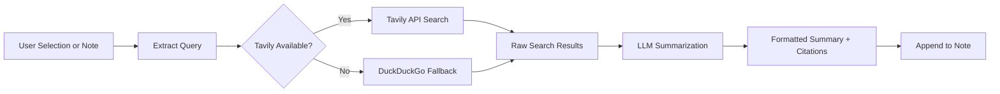

import TLDR from '@site/src/components/TLDR';

# מחקר וחיפוש באינטרנט

<TLDR>
**Notemd מחפש ברשת ומזרים את התוצאות המסוכמות LLM ישירות לרשימות שלכם.** Tavily API הוא מערך החיפוש הראשי; DuckDuckGo משמש כאפשרות חלופית ללא כוונון. התוצאות מסוכמות עם ציטוטי מקור ומוספות תחת כותרת `## Research`. הוא תומך במחקר ברשימה בודדת, במחקר של תיקיות בקבוצה, ובבחירת מודל לשלב הסיכום לפי משימה.

זהו חלק מה[Obsidian מדריך ניהול ידע AI](/docs/pillar-ai-knowledge).
</TLDR>

## סקירה

המחקר הוא אחת האינטגרציות החזקות ביותר של Notemd: הוא יוצר מעגל סגור בין קריאה, חיפוש וכתיבה. במקום לעבור לדפדפן כדי לחפש מושג לא מוכר, סמנו אותו ותנו ל‑Notemd לחפש, לסכם ולהוסיף את הממצאים – כל זה בתוך הארכיון שלכם.

התהליך ניתן לכוונון מלא. אתם בוחרים את ספק החיפוש, את LLM שכותב את הסיכום, והאם התוצאות יוספו לרשימה הפעילה או יירשמו בקבצים נפרדים. מצב קבוצתי מאפשר לחקור כל רשימה בתיקייה בלחיצה אחת.

## אופן הפעולה

### מערך חיפוש‑ואז‑סיכום



1. **שליפת שאילתות** -- Notemd שולף מילות חיפוש מהבחירה שלכם או משם הרשימה.
2. **חיפוש באינטרנט** -- נעשית ניסיון ראשון עם Tavily. אם לא קובעתם מפתח API, DuckDuckGo ישמש אוטומטית (אין צורך במפתח).
3. **סיכום ב‑LLM** -- תוצאות החיפוש הגולמיות נשלחות ל‑LLM המוגדר, שיוצר סיכום קצר עם ציטוטי מקור בתוך הטקסט.
4. **הוספה** -- הסיכום המעוצב מוסף תחת כותרת `## Research` ברשימה הפעילה.

### Tavily לעומת DuckDuckGo

| היבט | Tavily | DuckDuckGo |
|--------|--------|------------|
| מפתח API | נדרש (יש גרסה בחינם) | לא נדרש |
| איכות התוצאה | גבוהה (נוצרה במיוחד ל‑AI) | מספקת לשאילתות כלליות |
| מגבלות קצב | שכבה בחינם נדיבה | תלויה בהגבלת קצב |
| הגדרה | `tavilyApiKey` בהגדרות | אין הגדרות – חזרה אוטומטית |

### מחקר בתיקיית קבוצות

לחץ ימין על תיקייה ובחר **"Notemd: תיקיית מחקר"**. כל קובץ `.md` בתיקייה מעובד ברצף (או במקביל עד לרמת המקביליות המוגדרת). לכל רשימה יש סיכום מחקר משלה.

## הגדרה

| ערך | ברירת מחדל | השפעה |
|---------|---------|--------|
| `tavilyApiKey` | `''` | מפתח Tavily API. כאשר הוא ריק, משתמשים אך ורק ב‑DuckDuckGo. |
| `researchProvider` / `researchModel` | DeepSeek | LLM לכל משימה לסיכום תוצאות החיפוש |
| `maxResearchContentTokens` | `4000` | תקציב טוקנים לתוכן הנשלח ל‑LLM. עודף יגוזם. |
| `researchAppendToNote` | `true` | להוסיף סיכום לרשימה המקורית. אם הערך שקרי, נוצר קובץ נפרד. |
| `researchLanguage` | `'en'` | שפת הפלט לסיכום המחקר |

### המלצת מודל לכל משימה

המחקר מרוויח ממודל שמטפל בתוכן רב‑לשוני ויוצר טקסט מאורגן היטב. שקלו:

- **DeepSeek** -- ברירת מחדל, במחיר נוח, איכות טובה
- **GPT-4o** -- סיכום באיכות גבוהה יותר, עלות גבוהה יותר
- **Gemini Flash** -- מהיר וזול, מתאים לשאילתות פשוטות

## דוגמה

אתם קוראים מאמר על *מנגנוני תשומת לב של transformer* ונתקלים במושג לא מוכר: *relative positional encoding*. במקום להשאיר Obsidian:

1. הדגישו **"relative positional encoding"**
2. לחצו ימינה --> **"Notemd: Research and summarize"**
3. Notemd מחפש ברשת, מסכם את התוצאות העיקריות, ומוסיף:

```markdown
## Research

### Relative Positional Encoding

Relative positional encoding is a method used in transformer models
where positional information is expressed as relative distances between
tokens rather than absolute positions. Introduced by Shaw et al. (2018),
it improves generalization to unseen sequence lengths compared to
absolute encodings (Vaswani et al., 2017).

Sources:
- [Shaw et al., Self-Attention with Relative Position Representations (2018)](https://arxiv.org/abs/1803.02155)
- [Transformer Positional Encoding Overview](https://example.com/transformer-pos-enc)
```

הסיכום נמצא כעת בארכיון שלכם, ניתן לחפש בו, ליצור קישורים אליו, ולגשת אליו ללא אינטרנט.

## טיפים

- **הגדירו מפתח Tavily לתוצאות הטובות ביותר** -- אפילו המנוי החינמי מספק רלוונטיות טובה יותר מאשר DuckDuckGo גולמי.
- **השתמשו במודל סיכום איכותי** -- מודלים זולים עלולים לפשט תוכן טכני מורכב.
- **בצעו מחקר בקבוצות** לאחר קריאה ראשונית כדי למלא פערים במספר רב של רשימות בבת אחת.
- **בדקו את הסיכומים המוספים** -- LLM עלולים ליצור הזיות לגבי פרטי המקור. בדקו את הטענות העיקריות.

---

## צעדים באופק

- [Concept Notes](./concept-notes) -- שלפו ושמרו מושגים חשובים מתוצאות המחקר
- [Wiki-Links](./wiki-links) -- יצרו קישורים בין המושגים שנוצרו מהמחקר בארכיון שלכם
- [Translation](./translation) -- תרגמו את סיכומי המחקר לשפה אחרת
- [LLM ספקים](/docs/providers/overview) -- להגדיר את המודל המשמש לסיכום
