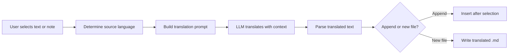

import TLDR from '@site/src/components/TLDR';

# תרגום

<TLDR>
**Notemd מתרגם טקסט בין 21+ שפות באמצעות תרגום המבוסס על LLM.** הוא תומך בתרגום של בחירה בודדת, תרגום של כל ההערה, ותרגום של תיקיות באופן קבוצתי. כל משימת תרגום יכולה להשתמש בספק ובמודל ייעודיים דרך הגדרות לכל משימה. שפת הפלט ניתנת להגדרה נפרדת משפת הUI. התוצאות מתווספות או נכתבות לקובץ חדש בהתאם להעדפתכם.

זהו חלק מה[Obsidian מדריך ניהול ידע AI](/docs/pillar-ai-knowledge).
</TLDR>

## סקירה

התרגום בNotemd אינו חיפוש במילון – זהו תרגום המבוסס על LLM ומודע להקשר. המודל רואה את הפסקה המלאה או את ההערה, ושומר על הטון, על המונחים הייחודיים לתחום ועל מבנה המשפטים. זה מניב תוצאות באיכות גבוהה יותר משירותים של תרגום מילה במילה, במיוחד לטקסטים טכניים, אקדמיים ויצירתיים.

התכונה תומכת בשלושה טווחים: בחירה, הערה פעילה ותיקייה שלמה. בשילוב עם בחירת מודל לכל משימה, ניתן להשתמש במודל מהיר (Gemini Flash) לתרגומים יומיומיים ובמודל חזק (Claude Sonnet) לתוכן הדורש דיוק – מבלי לשנות את הספק הגלובלי שלכם.

## אופן הפעולה

### הפקודה Translate



1. **זיהוי מקור** -- LLM מסיק את שפת המקור מהתוכן. אין צורך לציין אותה באופן ידני.
2. **בניית הפרומפט** -- Notemd בונה פרומפט שכולל את שפת היעד, הערה אופציונלית לתחום ואת התוכן שצריך לתרגם.
3. **תרגום בLLM** -- ה`translateProvider` / `translateModel` המוגדרים מעבדים את הבקשה. המודל שומר על פורמט markdown, קישורי wiki ובלוקי קוד.
4. **פלט** -- הטקסט המתורגם מתווסף מתחת למקור או נכתב לקובץ חדש בארכיון.

### זוגות שפות

Notemd תומך בכל זוג שפות שהLLM הבסיסי תומך בו. זוגות נפוצים כוללים:

| מקור | טארגט | איכות טיפוסית |
|--------|--------|----------------|
| אנגלית | סינית (פשוטה) | מעולה |
| עברית | אנגלית | מצוין |
| אנגלית | יפנית | טוב מאוד |
| אנגלית | גרמנית / צרפתית / ספרדית | טוב מאוד |
| כל שפה תומכת | כל שפה תומכת | תלוי במודל |

ההגדרה `translateLanguage` שולטת ב**שפת הפלט**. שפת המקור נקבעת אוטומטית.

### בחירת מודל למשימה

איכות התרגום משתנה באופן משמעותי בהתאם למודל. Notemd מאפשר לך להקצות מודל ייעודי רק לתרגום:

| מודל | מהירות | איכות | עלות | מתאים ל- |
|-------|-------|--------|------|----------|
| `gemini-2.0-flash-exp` | מהיר | טוב | נמוך | שימוש יומיומי, נפח גבוה |
| `gpt-4o-mini` | מהיר | טוב | נמוך | חיפושים מהירים |
| `deepseek-chat` | בינוני | טוב | מאוד נמוך | תכנון בתקציב רב-לשוני |
| `claude-3-5-sonnet` | בינוני | מעולה | בינוני | טכני / אקדמי |
| `gpt-4o` | בינוני | מעולה | בינוני | פרוזה רגישה לניואנסים |

### תרגום תיקיות בקבוצה

לחץ ימני על תיקייה ובחר **"Notemd: Translate folder"** כדי לתרגם כל ההערות בתיקייה. כל קובץ מעובד באופן עצמאי. הגדרת הביצועים המקבילים שולטת במספר הקבצים שמתורגמים בו-זמנית.

## הגדרה

| ערך | ברירת מחדל | השפעה |
|---------|---------|--------|
| `translateProvider` / `translateModel` | DeepSeek | ספק מיוחד למשימות תרגום |
| `translateLanguage` | `'en'` | שפת הפלט היעד |
| `translationAppendToNote` | `true` | הוסף את הטקסט המתורגם מתחת לטקסט המקורי. אם הערך הוא false, נוצר קובץ חדש. |
| `batchConcurrency` | `3` | מספר הקבצים שמעובדים בו-זמנית במהלך תרגום בקבוצה |

## דוגמה

אתה קורא הערת מחקר בסינית ורוצה גרסה באנגלית:

1. פתח את ההערה
2. לחץ ימני --> **"Notemd: Translate current file"**
3. Notemd מזהה סינית, מתרגם לשפת היעד שהוגדרה (אנגלית), ומוסיף:

```markdown
## Translation (English)

The experimental results show that the proposed method achieves
a 12% improvement in F1 score compared to the baseline, primarily
due to the enhanced feature extraction module described in Section 3.
```

הטקסט הסיני המקורי נשאר ללא שינוי מעל התרגום. הכותרת `## Translation` שומרת על שתי הגרסאות באותו קובץ לנוחות גישה.

## טיפים

- **השתמש ב‑Gemini Flash לתרגום בכמויות גדולות** -- זו האפשרות המהירה והזולה ביותר לתרגום בקבוצה של תיקיות גדולות.
- **שמור על לינקי ויקי** -- ההוראה של Notemd מורה ל-LLM לשמור על `[[wiki-links]]` בלתי משתנה בתרגום. בדקו לאחר התרגום, שכן מודלים מסוימים לפעמים מסירים אותם.
- **הגדירו במפורש את שפת הפלט** -- זיהוי אוטומטי עובד עבור המקור, אך תמיד הגדירו את `translateLanguage` כדי למנוע עמימות לגבי היעד.
- **תרגום המוני של רשימות רעיונות** -- אם תיקיית הרעיונות שלכם בשפה אחת ואתם צריכים אותה בשפה אחרת, תרגום ברמת התיקייה מטפל בכך בשלב אחד.

---

## צעדים באופק

- [Research](./research) -- חפשו וסכמו בכל שפה, ואז תרגמו את התוצאות
- [Workflows](./workflows) -- חברו תרגומים עם לינקי ויקי או שליפת רעיונות
- [Batch Processing](/docs/advanced/batch-processing) -- ביצוע מקביל והתנהגות כתיבה חוזרת לפעולות על תיקיות
- [LLM Providers](/docs/providers/overview) -- בחרו את המודל הטוב ביותר עבור זוג השפות שלכם
