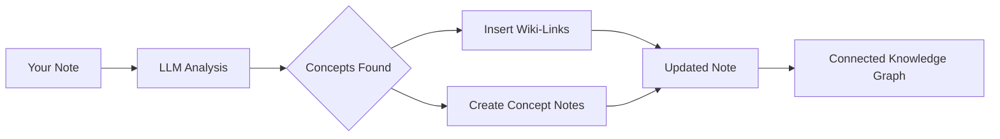

import TLDR from '@site/src/components/TLDR';

# Wiki-Links

<TLDR>
**Notemd מוסיף אוטומטית `[[wiki-links]]` למושגים המרכזיים ברשימות ההערות שלך.** הLLM קורא את התוכן שלך, מזהה מונחים חשובים בהקשר, ומכניס קישורי wiki בסגנון Obsidian בכל הופעה. באופציונלי נוצרים קבצי הערות מושגים עם קישורים החוזרים. תומך בדיכוי שמות נרדפים, בשמירה על שלמות הקישורים בעת שינוי שם/מחיקה, ובמצב של חילוץ טהור (ללא שינוי בקבצים). בניגוד ל‑Auto Link שמתאים רק לכותרות הערות קיימות, Notemd משתמש ב‑AI כדי לזהות מושגים חדשים וליצור הערות מתאימות. זהו חלק מה[Obsidian מדריך ניהול הידע ב‑AI](/docs/pillar-ai-knowledge).
</TLDR>

## סקירה

יצירת קישורי wiki היא המאפיין המרכזי של Notemd. היא ממירה טקסט רגיל לגרף ידע מחובר באמצעות:

1. **ניתוח ההערות שלך** באמצעות LLM
2. **זיהוי מושגים מרכזיים** (מונחים, אנשים, שיטות, תיאוריות)
3. **הכנסת `[[wiki-links]]`** בכל הופעה
4. **יצירת הערות מושגים** (אופציונלי) עם קישורים החוזרים

## אופן הפעולה

### תהליך



### דוגמה

**לפני:**
```markdown
Machine learning models use neural networks to learn patterns from data.
The transformer architecture revolutionized natural language processing.
```

**אחרי:**
```markdown
[[Machine learning]] models use [[neural networks]] to learn patterns from data.
The [[transformer architecture]] revolutionized [[natural language processing]].
```

## שימוש

### בסיסי: הוספת קישורים להערה הנוכחית

1. פתח רשימת רעיונות
2. לחיצה ימנית במערכת העריכה → **"Process file (add links)"**
3. המתנה של מספר שניות
4. המושגים כעת מקושרים!

### בלוק: עיבוד מספר הערות

1. לחיצה ימנית על תיקייה ב‑File Explorer
2. בחר **"Notemd: Process folder (add links)"**
3. הגדרות:
   - ביצוע מקביל (כמה קבצים בו‑זמנית)
   - כתיבה חוזרת של קישורים קיימים (כן/לא)
4. לחץ על **Process**

### סלקטיבי: קישור לטקסט מסוים

1. הדגשת הטקסט לעיבוד
2. לחיצה ימנית → **"Process selection (add links)"**
3. רק החלק המודגש נבדק

## Notemd לעומת Auto Link

Obsidian כולל שתי גישות ליצירת קישורי wiki אוטומטיים:

| | **Auto Link** | **Notemd** |
|--|---------------|-------------|
| מקור הקישור | שמות הערות קיימים ב‑Vault | מושגים שנזהו על ידי LLM בתוכן |
| ניתן ליצור קישורים למושגים חדשים | לא — הכותרת חייבת להתקיים כבר | כן — הבינה המלאכותית מזהה מושגים ויוצרת רשימות תגובות |
| טיפול במילים נרדפות | לא | כן — דיכוי של מילים נרדפות |
| יצירת רשימת תגובות למושג | לא | כן — עם קישורים החוזרים וביטול חזרות |
| עיבוד בקבוצות | לא (קובץ בודד) | כן (ברמת תיקייה) |
| הפניית מודל לפי משימה | לא | כן |

**Auto Link** מתאים את הכותרת: אם קיימת רשימת תגובות בשם "Machine Learning", היא עוטפת את ההופעות ב‑`[[Machine Learning]]`. אם הרשימה אינה קיימת, שום דבר לא קורה.

**Notemd** מונע על ידי בינה מלאכותית: ה‑LLM קורא את התוכן שלך, מבין את ההקשר, מזהה מושגים ש*צריך* לקשר אליהם — גם אם אין עדיין רשימת תגובות — ויוצר הן את הקישור והן את רשימת התגובות למושג.

## תכונות

### דיכוי של מילים נרדפות

**בעיה:** "transformer", "transformers", "Transformer architecture" → 3 מושגים נפרדים

**פתרון:** Notemd מזהה חזרות קרובות ומשתמש בצורה הקנונית.

**הגדרות:**
```
Settings → Advanced → Synonym Suppression
Threshold: 0.8 (0 = off, 1 = aggressive)
```

### שלמות הקישורים

**כאשר אתם משנים שם לפתק רעיון:**
- כל הקישורים בוויקי מתעדכנים אוטומטית (Obsidian מאפיין בסיסי)
- הקישורים ההפוכים נשארים שלמים

**כאשר אתם ממחקים פתק רעיון:**
- הקישורים נשארים אך מוצגים כ'הזכרות ללא קישור'
- ניתן ליצור אותו מחדש מכל הופעה

### מצב של חילוץ טהור

**לחלץ רעיונות מבלי לשנות את המקור:**

1. לחיצה ימנית → **"לחלץ רעיונות (בלי קישורים)"**
2. נוצרים פתקי רעיון
3. הקובץ המקורי לא נפגע

מקרי שימוש: עיבוד תוכן רק לקריאה או טיוטות סופיות.

## יצירת פתקי רעיון

### יצירה אוטומטית

**כאשר מופעל (באופן אוטומטי), Notemd יוצר:**

```markdown
---
tags: [concept, auto-generated]
created: 2026-06-13
source: [[Original Note Name]]
---

# Machine Learning

A branch of artificial intelligence that enables computers
to learn from data without explicit programming.

## Occurrences in Your Vault

- [[Original Note Name#Section]]
- [[Another Note#Header]]

## Related Concepts

- [[Neural Networks]]
- [[Deep Learning]]
- [[Supervised Learning]]
```

### הגדרה

**תיקיית הפלט:**
```
Settings → Output → Concept Folder
Default: concepts/
```

**מבנה היררכי:**
```
Settings → Output → Use Hierarchical Folders
If enabled:
  papers/my-paper.md → papers/concepts/Concept.md
If disabled:
  → concepts/Concept.md
```

**תבנית:**
```
Settings → Output → Concept Template
Customize with variables:
  {{concept}} — Concept name
  {{description}} — LLM-generated description
  {{backlinks}} — List of source notes
  {{date}} — Creation date
```

## אפשרויות מתקדמות

### חלון ההקשר

**כמה טקסט סביב לשלוח:**

```
Settings → Linking → Context Window
Options: Sentence | Paragraph | Full Note
Default: Paragraph
```

גודל גדול יותר = דיוק גבוה יותר, עלות גבוהה יותר.

### הופעות מינימליות

**הצג רק רעיונות שמופיעים מספר פעמים:**

```
Settings → Linking → Min Occurrences
Default: 1 (link all)
```

הגדר ל‑2 או 3 כדי להתמקד בנושאים חוזרים.

### תבניות להדרה

**דלג על מילים מסוימות:**

```
Settings → Linking → Exclude List
Example: note, idea, example, thing
```

מונע יצירת קישורים יתר למושגים כלליים.

### הוראות מותאמות אישית

**לשנות את ההוראות הבסיסיות של LLM:**

```
Settings → Advanced → Custom Linking Prompt
Default:
  "Identify key concepts, theories, methods, and technical
   terms in the following text. Return as a list..."
```

שנה לצרכים ספציפיים לתחום (למשל, "התמקד בטרמינולוגיה רפואית").

## עצות ומעשי טובה

### ✅ כן

- **עבדו על הערות עם יותר מ-100 מילים** — הערות קצרות מניבות מעט מושגים
- **השתמשו במודלים חזקים** לזיהוי מושגים טוב יותר (GPT-4o, Claude)
- **בדקו לפני הסכמה** — בדקו שהקישורים המוצעים הגיוניים
- **בנו באופן איטרטיבי** — עבדו על 5-10 הערות, בדקו את הגרף, שנו את ההגדרות

### ❌ לא

- **הוסיפו יותר מדי קישורים** — לא לכל שם עצם יש צורך בקישור
- **עבדו על טיוטות שוב ושוב** — המושגים עשויים להשתנות, חכו עד שיהיו יציבים
- **התעלמו ממילים נרדפות** — הפעילו דיכוי כדי למנוע "ML" לעומת "Machine Learning"

## ביצועים

### מהירות

| גודל ההערה | GPT-4o-mini | Claude Sonnet | Ollama (מקומי) |
|-----------|-------------|---------------|----------------|
| 500 מילים | 2-3 שניות | 3-5 שניות | 5-10 שניות |
| 2000 מילים | 5-8 שניות | 10-15 שניות | 20-40 שניות |
| 5000+ מילים | חלוקה לחלקים (קריאות מרובות) | מחולק לחלקים | מחולק לחלקים |

### הערכת עלויות

**דוגמה: תזכיר של 1000 מילים עם GPT-4o-mini**
- קלט: ~1500 טוקנים
- הפקה: ~200 טוקנים
- עלות: ~

עיבוד המוני של 100 רשימות: כ-0.10

## פתרון בעיות

### לא נוספו קישורים

**בדיקה:**
1. LLM הקריאה הצליחה (הגדרות → אבחון)
2. לפתק יש מספיק תוכן (>50 מילים)
3. המושגים הם טכניים/ספציפיים (לא רק כינויים)

**נסו:**
- השתמשו במודל חזק יותר
- הגדל את חלון ההקשר
- בדקו את תקפות המפתח API

### יותר מדי קישורים

**פתרונות:**
1. הגדל את מספר ההופעות המינימלי (2 או 3)
2. הוסף מילים נפוצות לרשימת החריגה
3. השתמשו במודל פחות אגרסיבי

### רעיונות שגויים מקושרים

**תיקונים:**
1. השתמשו בהוראה מותאמת אישית לספציפיות של הדומיין
2. הפעילו דיכוי של מילים נרדפות
3. בדקו באופן ידני ונתקו את הקישורים

### הקישורים נשברים לאחר שינוי שם

**זוהי התנהגות רגילה Obsidian.**

כדי לעדכן את כל הקישורים:
1. שנו את שם המסמך המושגי
2. Obsidian מעדכן אוטומטית `[[old]]` → `[[new]]`

---

## צעדים באופק

- 📖 [מסמכים מושגיים](./concept-notes) — חדירה עמוקה ליצירת מסמכים מושגיים
- 🔍 [אינטגרציה של מחקר](./research) — שילוב של קישורים עם מחקר באינטרנט
- 🎨 [דיאגרמות](./diagrams) — ויזואליזציה של גרף הידע שלכם
