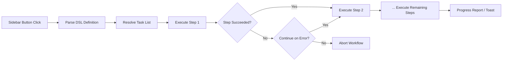

import TLDR from '@site/src/components/TLDR';

# תהליכי עבודה

<TLDR>
**Notemd תהליכי עבודה מחברים מספר משימות לפעולה אחת בלחיצה אחת.** ניתן להגדיר רצפים כמו `add-links > extract-concepts > research > diagram` באמצעות DSL פשוט. תהליכי העבודה מופיעים ככפתורים בצד המסך שמריצים את כל השרשרת על ההערה או התיקייה הנוכחיים. התוכנה מגיעה עם תהליכי עבודה מוגדרים מראש; ניתן ליצור תהליכים מותאמים אישית בהגדרות. כל שלב משתמש בהגדרת המודל הייחודית לו.

זהו חלק מה[Obsidian מדריך ניהול ידע AI](/docs/pillar-ai-knowledge).
</TLDR>

## סקירה

תהליך עבודה מבטל את הקושי שבביצוע משימות אחת אחרי השנייה. במקום ללחוץ פעמיים בכפתור ימין כדי להוסיף קישורים, לשלוף רעיונות, לחקור מושגים לא מוכרים וליצור דיאגרמה, מספיק ללחוץ על כפתור בצד המסך וכל השרשרת מתבצעת. Notemd אחראי על הסדר, העברת שגיאות ודיווח על ההתקדמות.

תהליכי עבודה מוגדרים ב‑DSL קל משקל (שפה ספציפית לתחום). הם נמצאים בהגדרות, מופיעים ככפתורים ניתנים ללחיצה בצד המסך של Obsidian, וניתן ליישם אותם על ההערה הנוכחית או על תיקייה שלמה.

## אופן הפעולה

### מערכת ביצוע תהליכי עבודה



1. **פירוש** -- השרשורת של DSL מחולקת לפי `>` (או `>`) לרשימה ממוינת של זיהויי משימות.
2. **פתרון** -- כל זיהוי מתאים לפקודה פנימית (add-links, extract-concepts, research, translate, diagram וכו').
3. **ביצוע** -- השלבים מתבצעים ברצף. כל שלב משתמש בספק ובמודל המוגדרים לו.
4. **טיפול בשגיאות** -- אם שלב כלשהו נכשל, תהליך העבודה יכול להפסיק או להמשיך לשלב הבא, בהתאם למדיניות השגיאות שלך.
5. **סיום** -- הודעת toast מדווחת על הצלחה או מפרטת את השלבים שנכשלו.

### פורמט DSL

תהליכי עבודה מוגדרים כרצף של זיהויי משימות המופרדים ב‑`>`:

```
process-current-add-links>extract-concepts-current>research-and-summarize
```

**זיהויי משימות זמינים:**

| זיהוי | פעולה |
|------------|--------|
| `process-current-add-links` | להוסיף קישורי wiki לפתק הפעיל |
| `extract-concepts-current` | לשלוף רעיונות מהפתק הפעיל |
| `research-and-summarize` | לחקור את הטקסט הנבחר או את שם הפתק |
| `process-current-translate` | לתרגם את הפתק הפעיל |
| `summarize-to-mermaid` | ליצור תרשים מהפתק הפעיל |
| `generate-from-title` | ליצור תוכן משם הפתק |
| `extract-original-text` | לשלוף את הטקסט המקורי (ל‑OCR / תוכן מסורק) |

**ווריאנטים ברמת התיקייה** – החליפו `current` ב‑`folder` בשם הזיהוי.

### תהליכי עבודה מוגדרים מראש לעומת תהליכים מותאמים אישית

Notemd מגיע עם תהליכי עבודה מוכנים לתבניות נפוצות:

| תהליך עבודה | שרשרת | מקרי שימוש |
|----------|-------|----------|
| **שליפה בלחיצה אחת** | add-links > extract-concepts > research | לעבד מאמר מחקר במעבר אחד |
| **צינור עבודה מלא** | add-links > extract-concepts > research > diagram | הפקת ידע מלאה עם ויזואליזציה |
| **תרגום + קישור** | translate > add-links | תרגם ולאחר מכן קשר את המושגים בשפה היעד |

**תהליכי עבודה מותאמים אישית** נוצרים בהגדרות:

1. פתח **Settings** --> **Notemd** --> **Workflows**
2. לחץ על **"Add Workflow"**
3. הזן את שרשרת DSL (למשל, `process-current-add-links>extract-concepts-current`)
4. תן לו שם תצוגה (למשל, "Quick Link + Extract")
5. הכפתור החדש מופיע מיד בסביבה הצדדית

## הגדרה

| ערך | ברירת מחדל | השפעה |
|---------|---------|--------|
| `workflows` | קבוצה מוגדרת מראש | מערך של הגדרות תהליכי עבודה (שם + DSL) |
| `workflowContinueOnError` | `true` | המשך לשלב הבא אם השלב הנוכחי נכשל |
| `workflowShowProgress` | `true` | הצגת הודעת התקדמות לאחר סיום כל שלב |

### מודלים למשימה בתהליכי עבודה

כל שלב בתהליך עבודה משתמש בהגדרת המודל הייחודית שלו לכל משימה. אין צורך לציין מודלים ב‑DSL עצמו. סדר הפתרון הוא:

1. ספק/מודל לכל משימה אם `useMultiModelSettings` נמצא שם
2. `activeProvider` גלובלי במקרה האחר

זה אומר ש‑`add-links` יכול לרוץ על DeepSeek בעוד ש‑`research` רץ על GPT-4o – הכל בתוך אותו קליק של תהליך עבודה.

## דוגמה

רק ייבאתם PDF של מאמר למידת מכונה לארכיון שלכם ורוצים חילוץ מידע מלא:

1. פתחו את ההערה שהובאה
2. לחצו על כפתור הצד **"Full Pipeline"**
3. Notemd מבצע:
   - **שלב 1**: הוספת קישורי wiki – `[[attention mechanism]]`, `[[transformer]]` וכו'
   - **שלב 2**: חילוץ רעיונות – יוצר הערות רעיון בתיקיית הרעיונות שלכם
   - **שלב 3**: מחקר – מסכם מקורות אינטרנט למילות מפתח
   - **שלב 4**: תרשים – יוצר מפה שכלית של Mermaid של מבנה המאמר
4. לאחר כ‑30 שניות, להערה שלכם יש קישורים, הערות רעיון קיימות, המחקר מוסף, וקובץ תרשים נשמר

הכל בלחיצה אחת.

## טיפים

- **התחילו עם תהליכי עבודה מוגדרים מראש** – הם מכסים את התבניות הנפוצות ביותר. התאימו רק כאשר אתם צריכים סדר שונה.
- **הפעילו `workflowContinueOnError`** – שלב תרשים שנכשל לא צריך לעצור את כל המערכת.
- **השתמשו בעבודות תיקייה** לעיבוד המוני – לחצו בכפתור הימני על תיקייה, בחרו עבודה, וכל הרשימות יעובדו.
- **קראו לעבודות בבירור** – שטח הצד הוא מוגבל. השתמשו בשמות קצרים ומונחים כמו "הפקה מהירה" או "תרגום + קישור".

---

## צעדים באופק

- [Research](./research) – הבינו מה עושה שלב המחקר לפני שאתם מוסיפים אותו לעבודות
- [Wiki-Links](./wiki-links) – התכונה הבסיסית של יצירת קישורים המשמשת ברוב העבודות
- [Concept Notes](./concept-notes) – חילוץ רעיונות כשלב בעבודה
- [Batch Processing](/docs/advanced/batch-processing) – ביצוע מקביל ודיווח על התקדמות לעבודות תיקייה
