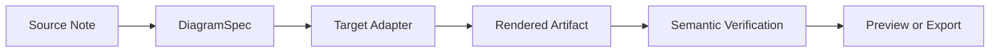
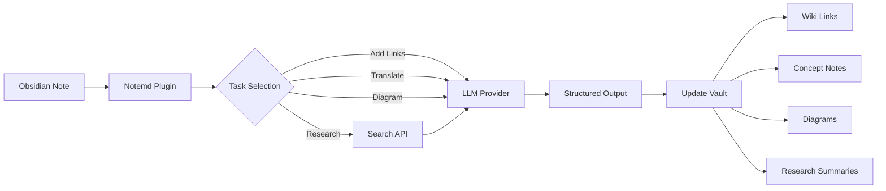

import TLDR from '@site/src/components/TLDR';

# הכרת בסיס הידע Notemd

<TLDR>
**Notemd** (Note + EMD — Enhanced Markdown Documents) הוא תוסף מקור פתוח ל-Obsidian שממיר קריאה המבוססת על LLM לידע קבוע. בניגוד ל-AI המבוסס שיחה שבו התובנות נעלמות לאחר השיחה, Notemd כותב את התוצאות **ישירות לארכיון שלך** כקישורי wiki, רשימות רעיונות, סיכומי מחקר, תרגומים, תהליכי עבודה ודיאגרמות. הוא נוצר עבור חוקרים, סטודנטים ועובדי ידע שרוצים שהקריאה, המחקר וההסברים הוויזואליים יצטברו לגרף ידע מובנה ומתפתח.
</TLDR>

## מהו Notemd?

Notemd משלב **30+ מודלי שפה גדולים** (OpenAI, Anthropic, Google, DeepSeek, Qwen, Ollama ועוד) לתהליך העבודה של Obsidian כדי לאוטומציה את חילוץ הידע, ארגונו, תרגומו, המחקר בו ויצירת הדיאגרמות.

### ההבדל המרכזי: ידע זמני לעומת ידע קבוע

| היבט | AI מבוסס שיחה (ChatGPT, וכו') | Notemd |
|--------|-------------------------------|--------|
| **לאן התוצאות הולכות** | היסטוריית שיחות (נעלמת) | הארכיון שלך ב-Obsidian (נשאר) |
| **פורמט** | תשובות טקסט פשוט | קבצים מובנים: `[[wiki-links]]`, רשימות רעיונות, דיאגרמות |
| **ערך לטווח ארוך** | יש לשאול שוב בכל פעם | מצטבר לגרף ידע |
| **גישה ללא אינטרנט** | דורש אינטרנט | פועל במלואו ללא אינטרנט עם Ollama |

## יכולות בסיסיות

### 1. **חיבור אוטומטי ל‑Wiki**
- LLM מזהה רעיונות מרכזיים ברשימות הרשימות שלך
- מכניס `[[wiki-links]]` בכל הופעה
- באופציה יוצר רשימות רעיונות מקושרות
- דיכוי נרדפים כדי למנוע חזרות

### 2. **יצירת רשימות רעיונות**
- מוציא רעיונות בסיסיים ממאמרים, כתבות, רשימות
- יוצר קבצי רעיונות ייעודיים עם קישורים חוזרים
- נתיבי פלט ותבניות שניתן להתאים אותם

### 3. **אינטגרציה של מחקר באינטרנט**
- מחפש Tavily או DuckDuckGo מתוך Obsidian
- LLM מסכם את התוצאות עם ציטוטי מקור
- מוסיף ממצאי מחקר לרשימת ההערות הנוכחית

### 4. **תרגום רב-לשוני**
- לתרגם בחירות או את כל ההערות
- תומך ביותר מ‑21 UI שפות
- הגדרה עצמאית של שפת הפלט
- תמיכה בתרגום בקבוצות

### 5. **יצירת דיאגרמות**
- **Mermaid**: תרשימי זרימה, סדר, מחלקות, מצבים, ER, Gantt
- **JSON Canvas**: תצורות ילידיות של Obsidian
- **Vega-Lite**: גרפי נתונים, סדרות זמן, תרשימי פיזור
- **HTML / HTML ניתנים לעריכה/SVG**: יצירות תרשים עצמאיות עם הערות סמנטיות
- **Draw.io / גבולות היצירה Drawnix**: שבילי ייצוא למתחזקים מאותו מודל תרשים סמנטי
- **מסלול דיאגרמות מעגלים**: התמיכה circuitikz/TikZJax נוצרת סביב רפרנסים זהב, הנחיות מוגבלות, משוב על ייצור ואימות טופולוגיה/תצורה במקום LLM TikZ לא מוגבל
- **אבחון תצוגה מראש**: יצירות הייצור יכולות לחשוף אבחוני עשן של קומפילציה/ייצור, ומקורות שאינם בליניארי ניתן לבדוק ללא צורך בסביבת LaTeX בצד הפלגין
- תיקון אוטומטי של תחביר לשגיאות Mermaid

### 6. **עבודות בלחיצה אחת**
- לחבר מספר פעולות לכפתורים בצד המסך
- הגדרת תהליכי עבודה המבוססת על DSL
- דוגמה: `add-links > extract-concepts > research > diagram`

## מי צריך להשתמש ב- Notemd?

✅ **חוקרים** הקוראים מאמרים ויוצרים סקירות ספרותיות
✅ **סטודנטים** המארגנים רשימות לימוד ויוצרים מפות רעיונות
✅ **עובדי ידע** הרוצים שהתובנות מהקריאה יישמרו
✅ **מקצוענים דו-לשוניים** הזקוקים לתרגום + קישורים לוויקי
✅ **משתמשים מודעי פרטיות** הרוצים תמיכה מקומית ב- LLM (Ollama)
✅ **משתמשים מתקדמים** המתאימים אישית הוראות ותהליכי עבודה

## למה Notemd + Obsidian?

**Obsidian** היא בסיס ידע המבוסס על מרקדו ומעדיף את השימוש המקומי. **Notemd** מוסיפה יכולות על-אנושיות:
- הנתונים שלך נשארים במאגר שלך (לא בשירות ענן)
- פועלת ללא אינטרנט עם מודלים מקומיים
- חינמית ובמקור פתוח (רישיון MIT)
- משתלבת עם תוספים קיימים של Obsidian
- מתאים לעשרות אלפי רשימות

## התחלה

1. **התקנה**: הגדרות → תוספי קהילה → חיפוש → "Notemd"
2. **כיול**: הוסף את מפתח API של ספק LLM שלך (או השתמש ב-Ollama מקומי)
3. **נסה זאת**: פתח רשימה → לחץ ימני → "עבד על קובץ (הוסף קישורים)"
4. **חקור**: בדוק את הצד הצדדי למסלולי עבודה בלחיצה אחת

👉 [מדריך התקנה](./getting-started/installation) | [מדריך התחלה מהיר](./getting-started/quick-start)

## כיוון היכולת של תרשימים

עבודת התרשימים של Notemd עוברת מ"לבקש מהמודל לכתוב שרשור תחביר אחד" לכיוון של צינורית מרובת שכבות:

היישום הנוכחי כבר תומך ב-Mermaid, JSON Canvas, Vega-Lite, HTML כחלופה, HTML/SVG ניתנים לעריכה, יצירות Draw.io XML, קבוצה מינימלית של Drawnix JSON, אבחון תצוגה/חלופה של מקור בלבד, ופרוטוטייפ `CircuitSpec -> circuitikz` ללא אינטרנט עבור תבניות זהב של מקורות נפוצים ואינוורטרים CMOS. תרשימי מעגלים הם קטגוריה קשה יותר: circuitikz יכול לייצג טופולוגיה חשמלית מדויקת, אך פלט LLM ללא הגבלות יוצר לעתים קרובות ניווט בלתי קריא או LaTeX שאינו מוצג. הכיוון הבא הוא להמשיך להגביל את circuitikz באמצעות תבניות ייחוס זהב, חוקי עיצוב רשת קשרים, אבחון הצגה, ומעגלי משוב של צילומי מסך.

קרא את הפרטים ב-[תרשימים](./features/diagrams).

## ארכיטקטורה

## Notemd לעומת תוספי AI אחרים של Obsidian

רוב תוספי AI של Obsidian הם מבוססי שיחה (אתה שואל, ה-AI עונה, התובנות נשארות בשיחה). Notemd הוא **מבוסס כתיבה**: ה-AI מעבד את הרשימות שלך וכותב תוצאות ממוקדות ישירות לארכיון שלך.

| יכולת | Notemd | Copilot | Smart Connections | Text Generator |
|-----------|--------|---------|-------------------|-----------------|
| הכנסת קישורי wiki אוטומטית | כן | לא | לא | לא |
| יצירת תזכיר מושג | כן (עם קישורים החוזרים + ביטול דופליקטים) | לא | לא | לא |
| יצירת דיאגרמות | כן (Mermaid, Canvas, Vega-Lite, HTML, חומרים ניתנים לעריכה) | לא | לא | לא |
| אינטגרציה של מחקר באינטרנט | כן (Tavily + DuckDuckGo) | לא | לא | לא |
| עיבוד תיקיות בקבוצות | כן | מוגבל | לא | מוגבל |
| הפניית מודל לפי משימה | כן (7 משימות, מודלים עצמאיים) | לא | לא | לא |
| שרשראות עבודה בלחיצה אחת | כן (DSL) | לא | לא | לא |
| תרגום (בקבוצות) | כן | לא | לא | לא |
| שיחה עם האוצר | לא | כן | לא | לא |
| חיפוש לדמיון סמנטי | לא | לא | כן | לא |
| יצירה על בסיס תבניות | לא | לא | לא | כן |
| ספקי LLM | 36 (ענן + שער + מקומי) | 3-5 | 2-3 | 3-5 |
| לחלוטין ללא אינטרנט | כן (Ollama) | חלקי | חלקי | חלקי |

**מתי לבחור ב-Notemd**: אתם רוצים שה-BI ייצור גרף ידע קבוע — ולא רק לשוחח על הרשימות שלכם.

**מתי לבחור ב-Copilot**: אתם רוצים עוזר תוכנה בעל יכולות שיחה בתוך Obsidian.

**מתי לבחור ב-Smart Connections**: אתם רוצים לגלות קשרים קיימים בין רשימות באמצעות חיפוש סמנטי.

## פילוסופיה

**Notemd מאמין שבינה מלאכותית צריכה להרחיב את עבודת הידע של בני אדם, ולא להחליף אותה.** הפלגין:
- שומר עליכם בשליטה (בדקו לפני הטמעת שינויים)
- שומר על ההקשר (כל התוצאות מקשרות חזרה למקור)
- שומר על פרטיות (תמיכה מקומית ב-LLM, ללא איסוף נתונים)
- נשאר ניתן להרחבה (פונקציות פתוחות API, תהליכי עבודה מותאמים אישית)

<!-- notemd-acknowledgments -->
## תודות ופרויקטי ייחוס

Notemd מתוחזק באופן עצמאי. אנו מודים לפרויקטים ולקהילות קוד פתוח שהשפיעו על החלטות תכנון מתועדות או מספקים תשתית לאינטגרציות. ההכללה כאן מכירה בהשפעה או בתאימות בלבד; היא אינה מרמזת על תמיכה, שיוך, קוד כלול או טענה לשימוש חוזר בקוד.

- **פרויקטי ייחוס:** [cloudy-tech-diagrams-skill](https://github.com/cloudy-liu/cloudy-tech-diagrams-skill), [Drawnix](https://github.com/plait-board/drawnix), [diagrams.net / draw.io](https://www.diagrams.net/), [repo-saga](https://github.com/teee32/repo-saga).
- **יסודות קוד פתוח:** [Mermaid](https://github.com/mermaid-js/mermaid), [Vega-Lite](https://vega.github.io/vega-lite/), [Slidev](https://github.com/slidevjs/slidev), [CircuitikZ](https://github.com/circuitikz/circuitikz), [Tectonic](https://github.com/tectonic-typesetting/tectonic), [Docusaurus](https://docusaurus.io).
- כל פרויקט שומר על הרישיון והתנאים שלו; Notemd זמין תחת [רישיון MIT](https://github.com/Jacobinwwey/obsidian-NotEMD/blob/main/LICENSE).

## מקור פתוח

- **רישיון**: MIT
- **מקור**: [github.com/Jacobinwwey/obsidian-NotEMD](https://github.com/Jacobinwwey/obsidian-NotEMD)
- **קהילה**: [Discord](https://discord.gg/qnGgsQ9W) | [GitHub Discussions](https://github.com/Jacobinwwey/obsidian-NotEMD/discussions)
- **תרומה**: פניות PR מתקבלות בברכה, ראו [CONTRIBUTING.md](https://github.com/Jacobinwwey/obsidian-NotEMD/blob/main/CONTRIBUTING.md)

---

**המשך**: [Installation →](./getting-started/installation)
