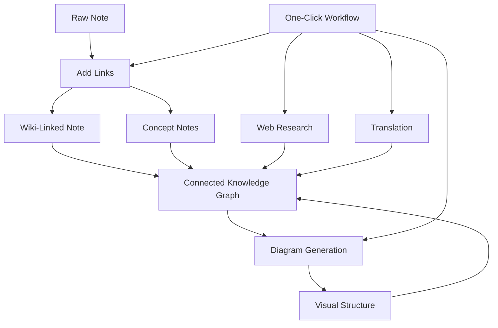

import TLDR from '@site/src/components/TLDR';

# Obsidian מדריך לניהול ידע באמצעות AI

<TLDR>
**Notemd הופך קריאה המונעת על ידי LLM לידע קבוע: קישורי wiki מחברים רעיונות, רשימות רעיונות יוצרות גרף שניתן לחיפוש, מחקר מביא את האינטרנט למאגר שלך, תרגום מסיר מחסומי שפה, דיאגרמות הופכות את המבנה לגלוי, ותהליכי עבודה מחברים את כל זה בלחיצה אחת.** מדריך זה מכסה את כל המסלול — מרשימות גולמיות לבסיס ידע מחובר, ויזואלי ורב‑לשוני.
</TLDR>

## מדוע ניהול ידע באמצעות AI?

רישום רגיל של הערות יוצר קבצים שטוחים. אפילו עם קישורי wiki ידניים, רוב ההערות נשארות לא מחוברות. Notemd משתמש ב‑LLM כדי לאוטומציה את שכבת החיבור:

- **LLMs קוראים את התוכן שלך** ומזהים מה חשוב — מושגים, שיטות, אנשים, תיאוריות
- **קישורים מוכנסים אוטומטית** בכל הופעה של רעיון, ולא נקברים ב‑"ראו גם"
- **רשימות רעיונות נוצרות** כקבצים עצמאיים שניתן לחיפוש
- **מחקר מעשיר את ההערות** בהקשרים מהאינטרנט
- **דיאגרמות הופכות את המבנה לגלוי** — מפות מחשבה, תרשימי זרימה, גרפים של נתונים מאותו תוכן

התוצאה: גרף ידע שגדל עם כל הערה שאתה מעבד, ולא רק כשאתה זוכר להוסיף קישורים.

## המסלול המלא



כל שלב הוא עצמאי. ניתן להשתמש באחד או בכולם. הרצף המשפיע ביותר: **הוספת קישורים → רשימות רעיונות → דיאגרמות**.

---

## 1. קישורי Wiki: הפיכת החיבורים לברורים

קישורי wiki הם עמוד השדרה של גרף ידע. Notemd משתמש ב‑LLM כדי ל:

1. קראו את תוכן ההערה שלכם (חלקו לחלקים עבור מסמכים ארוכים)
2. זהו את המושגים המרכזיים — תנו עדיפות למונחים טכניים ספציפיים על פני שמות עצם כלליים
3. הכניסו `[[wiki-links]]` בכל הופעה
4. דכאו מילים נרדפות כך ש‑"ML" ו‑"Machine Learning" לא ייצרו קשרים נפרדים

### מתי להשתמש בזה

- **כל הערה >100 מילים** — הערות קצרות מניבות מעט מושגים
- **מאמרי מחקר, מסמכים טכניים, פרוטוקולי ישיבות** — עשירים במונחים ספציפיים לתחום
- **לאחר שהתוכן יציב** — אל תעבדו שוב ושוב טיוטות

### הגדרות מפתח

| ערך | מומלץ | מדוע |
|---------|-----------|-----|
| `addLinksProvider` | DeepSeek או GPT-4o-mini | דיוק טוב בעלות נמוכה |
| דכאת מילים נרדפות | כן | מונע קשרים חוזרים |
| חלון ההקשר | פסקה | איזון בין דיוק לעלות |

→ [Wiki-Links deep dive](/docs/features/wiki-links)

---

## 2. רשימות רעיונות: צמתי ידע שניתן לשלוף

הקישורים בוויקי מחברים רעיונות באופן אינליין, אך רשימות הרעיונות מאפשרות לשלוף כל רעיון בנפרד. לכל רעיון יש קובץ `.md` משלו:

```markdown
# Machine Learning

## Linked From
- [[My Research Notes]]
- [[Neural Networks Explained]]
```

### תהליך השליפה

הפרומפט של LLM מאורגן בצורה מאוד מובנית:
- להביא לצורה יחידה
- להעדיף רעיונות רב-מילתיים על פני מילים בודדות ("Dielectric Relaxation" ולא "Relaxation")
- לדלג על חלקי ההפניות/ביבליוגרפיה
- להציג את התוצאה כשורות `CONCEPT:` לצורך פענוח דטרמיניסטי

הרעיונות מנוקים מדופליקטים בין החלקים באמצעות `Set<string>`. שגיאות LLM בחלקים בודדים אינן עוצרות את הפעולה.

### הפניות חוזרות

כאשר הן מופעלות, כל רשימת רעיונות מתעדת אילו רשימות מקור מזכירות אותה. לוח ההפניות החוזרות המובנה של Obsidian מציג גם את הקשרים ההפוכים.

### דה-דופליקציה

מנוע הניקוי מ-4 שלבים של Notemd תופס:
1. **התאמות מדויקות** — השוואת שמות קבצים ללא התחשבות בגודל האותיות
2. **צורות רבים** — "Models.md" לעומת "Model.md"
3. **נורמליזציה של סימנים** — "A-B.md" לעומת "A B.md"
4. **הכללה של מילה בודדת** — "ML.md" מסומן כאשר קיים "Machine Learning.md"

### הגדרות מפתח

| ערך | מומלץ | מדוע |
|---------|-----------|-----|
| `conceptNoteFolder` | `concepts/` או `🧠 concepts/` | שומר על ארגון הכספת |
| `extractConceptsAddBacklink` | כן | מאפשר חיפוש הפוך |
| `extractConceptsMinimalTemplate` | לא | תבנית מלאה עם Linked From |
| מודל למשימה | DeepSeek | חילוץ רעיונות אינו דורש מודלים יקרים |
| דיכוי נרדפים | כן | אותה הגדרה משפיעה על קישורים ועל חילוץ |

→ [Concept Notes deep dive](/docs/features/concept-notes)

---

## 3. מחקר: הכנסת האינטרנט לתהליך רישום ההערות

Notemd משלב חיפוש באינטרנט לתהליך רישום ההערות שלך:

1. **בניית שאילתה** — כותרת ההערה או הבחירה שלך הופכת לשאילתת חיפוש
2. **חיפוש באינטרנט** — Tavily (מומלץ, נדרש מפתח API) או DuckDuckGo (בחינם, ללא מפתח)
3. ****LLM סיכום** — תוצאות החיפוש מסוכמות לסיכום רלוונטי
4. **הוספה להערה** — הסיכום מוסף במיקום הסמן או כפרק חדש

### מתי להשתמש בזה

- לפני עיבוד נושא חדש — קבלו קודם רקע מהאינטרנט
- כאשר יש צורך להעשיר הערת רעיון — בצעו מחקר ולאחר מכן הוסיפו קישורים
- לסקירות ספרות — בצעו מחקר המוני על תיקייה של הערות

### הגדרות מפתח

| ערך | מומלץ | מדוע |
|---------|-----------|-----|
| `researchProvider` | GPT-4o או Claude | המחקר דורש סיכום באיכות גבוהה יותר |
| שירות חיפוש | Tavily | רלוונטיות טובה יותר, עומק ניתן לכיול |
| `maxResearchContentTokens` | 4000 | איזון בין עומק לעלות |

→ [Research deep dive](/docs/features/research)

---

## 4. תרגום: שבירת מחסומי השפה

Notemd מתרגם הערות באמצעות LLM שנקבע על ידכם — לא באמצעות API מיוחד לתרגום. זה אומר:

- **תרגומים המבינים את ההקשר** — LLM מבין את כל המסמך, ולא רק משפט אחר משפט
- **טיפול במושגים טכניים** — "gradient descent" נשאר כ‑"梯度下降" ולא כ‑"坡度向下"
- **תמיכה בבקצעות** — ניתן לתרגם תיקייה שלמה של הערות בפעולה אחת
- **מודל לכל משימה** — ניתן להשתמש ב‑Gemini Flash לתרגום (מהיר, זול, רב‑לשוני)

### תמיכה בשפות

Notemd עצמו תומך ב‑21 שפות UI. שפת היעד לתרגום ניתנת לכיול לפי משימה. זוגות נפוצים: EN↔ZH, EN↔JA, EN↔KO, EN↔DE, EN↔FR, EN↔ES.

→ [Translation deep dive](/docs/features/translation)

---

## 5. תרשימים: הפיכת המבנה לגלוי

מערכת התרשימים של Notemd מתבססת קודם כל על המפרט: LLM מייצר `DiagramSpec` JSON ממוקד מבנה, ואז ממירים מתרגמים אותו לפורמט היעד. זה מניב תוצאות אמינות יותר מאשר לבקש מ‑LLM תחביר Mermaid בלתי מעובד.

### זיהוי כוונה

Notemd מסיק את סוג התרשים הטוב ביותר מהתוכן:

- **טבלאות עם מספרים** → גרף נתונים (Vega-Lite)
- **אוצר מילים של לקוח/שרת** → תרשים סדרה (Mermaid)
- **עצם/מפתח ראשי** → תרשים ER (Mermaid)
- **שלב/זרימת תהליך** → תרשים זרימה (Mermaid)
- **מילות מפתח של מפה קונצפטואלית** → JSON Canvas (Obsidian native)
- **ברירת מחדל** → מפת מחשבה (Mermaid)

### שרשרת עיבוד

יעד ראשי → חלופה → חלופה → HTML. אם התחביר של Mermaid כושל, הוא מנסה שוב פעם אחת עם הקשר השגיאה ל‑LLM, ואז עובר לתרשים מינימלי.

### הגדרות מפתח

| ערך | מומלץ | מדוע |
|---------|-----------|-----|
| `enableExperimentalDiagramPipeline` | כן | איכות טובה יותר באמצעות ספקיפיקציה ראשונה |
| `experimentalDiagramCompatibilityMode` | `best-fit` | יעד native לפי כוונה |
| `summarizeToMermaidProvider` | GPT-4o או Claude | לתרשימי ספקיפיקציה נדרש חשיבה מרחבית |
| `autoMermaidFixAfterGenerate` | כן | תופס שגיאות תחביר של LLM באופן אוטומטי |
| הרחבת ידע מקומי | פעיל לתחומים ספציפיים | משפר את הדיוק עם הקשר של ה‑vault |

→ [Diagrams deep dive](/docs/features/diagrams)

---

## 6. תהליכי עבודה: אוטומציה בלחיצה אחת

תהליכי עבודה מחברים מספר משימות לכפתור בסמן הצד. פורמט ה‑DSL הוא:

```
task1 | task2 | task3
```

דוגמה: `addLinks | extractConcepts | generateDiagram` — לעבד הערה מטקסט גולמי לצומת ידע ויזואלי מחובר בלחיצה אחת.

### תהליכי עבודה מומלצים

| תהליך עבודה | שרשרת | מקרי שימוש |
|----------|-------|----------|
| תהליך מלא | `addLinks \| extractConcepts \| generateDiagram` | הערות חדשות |
| מחקר ראשוני | `research \| addLinks` | נושאים לא מוכרים |
| Polyglot | `translate \| addLinks` | הערות רב‑לשוניות |
| רק דיאגרמה | `generateDiagram` | ויזואליזציה מהירה |

→ [Workflows deep dive](/docs/features/workflows)

---

## 7. LLM ספקים: 36 אפשרויות מענן למקומי

Notemd תומך ב‑36 ספקים ב‑4 סוגי העברה. קבוצות מפתח:

- **ענן בינלאומי**: OpenAI, Anthropic, Google, Mistral, xAI
- **ענן סין**: DeepSeek, Qwen, Doubao, Moonshot, GLM, Baidu, SiliconFlow
- **שערים**: OpenRouter, GitHub Models, Hugging Face, Vercel
- **מקומי**: Ollama, LMStudio, OVMS — אין מפתח API, אין נתונים יוצאים מהמכשיר שלך

### אסטרטגיית מודל לכל משימה

ההגדרה החסכונית ביותר משתמשת במודלים זולים למשימות פשוטות ובמודלים חזקים למשימות מורכבות:

```
extractConcepts  → DeepSeek (fast, cheap, accurate enough)
addLinks          → DeepSeek or GPT-4o-mini
research          → GPT-4o or Claude (needs quality)
generateDiagram   → GPT-4o or Claude (needs spatial reasoning)
translate         → Gemini Flash (fast, multilingual)
```

→ [LLM Providers overview](/docs/providers/overview)

---

## רשימת בדיקה להתחלה

1. **התקנת Notemd** — [Community Plugins](/docs/getting-started/installation) (מומלץ) או באופן ידני
2. **הגדרת ספק** — DeepSeek (הקל ביותר), OpenAI, או Ollama (בחינם)
3. **עיבוד ההערה הראשונה שלך** — לחיצה ימנית → "Process file (add links)"
4. **הגדרת תיקיית הרעיונות** — הגדרות → Notemd → פלט → תיקיית רעיונות
5. **שליפת רעיונות** — הרץ את "שליפת רעיונות" על אותה רשימה
6. **יצירת דיאגרמה** — הרץ את "יצירת דיאגרמה" כדי להציג את הקשרים
7. **יצירת תהליך עבודה** — חבר את הפעולות הנ"ל לכפתור לחיצה אחת

## תצורות מומלצות

### Student (Budget)

```
Provider: DeepSeek (free tier available)
Concept extraction: DeepSeek
Research: DuckDuckGo (free) + DeepSeek
Diagrams: Off (or legacy Mermaid)
Workflows: addLinks | extractConcepts
```

### Researcher (Quality)

```
Provider: GPT-4o (primary)
Concept extraction: DeepSeek (cost savings)
Research: GPT-4o + Tavily
Diagrams: best-fit mode, GPT-4o
Workflows: research | addLinks | extractConcepts | generateDiagram
```

### Privacy-First (Local Only)

```
Provider: Ollama (llama3 or qwen2.5:7b)
All tasks: Ollama
Research: DuckDuckGo (free, no API key)
Diagrams: legacy Mermaid mode
```

### Bilingual (ZH + EN)

```
Primary: DeepSeek (Chinese queries)
Translation: Google Gemini Flash
Research: Tavily + DeepSeek (Chinese search context)
Language output: per-task (extractConceptsLanguage: zh-CN)
```

---

## Common Patterns

### Pattern: Process a Research Paper

1. Import PDF content (or paste)
2. **Research** — קבל הקשרים מהאינטרנט לנושא
3. **Add Links** — זהה וחבר רעיונות מרכזיים
4. **Extract Concepts** — יצור רשימות נפרדות
5. **Generate Diagram** — הצג את מבנה המאמר

### Pattern: Daily Note Enrichment

1. לכתוב רשימת יומן
2. **הוספת לינקים** — מחברת את הרעיונות של היום למושגים קיימים
3. רשימות המושגים מתעדכנות אוטומטית עם לינקים חוזרים

### תבנית: סקירת ספרות

1. ליצור תיקייה עם מאמרים/רשימות
2. **הוספת לינקים בקבוצה** — לעבד את כל התיקייה
3. **הסרת רשימות דומות** — לנקות רשימות דומות מאוד
4. **יצירת דיאגרמה** — מפת מחשבות של כל הספרות

---

*Notemd הוא קוד פתוח (MIT) ועובד עם Obsidian 0.15.0+ בכל הפלטפורמות. [התקינו עכשיו](/docs/getting-started/installation) או [צפו ב‑GitHub](https://github.com/Jacobinwwey/obsidian-NotEMD).*
