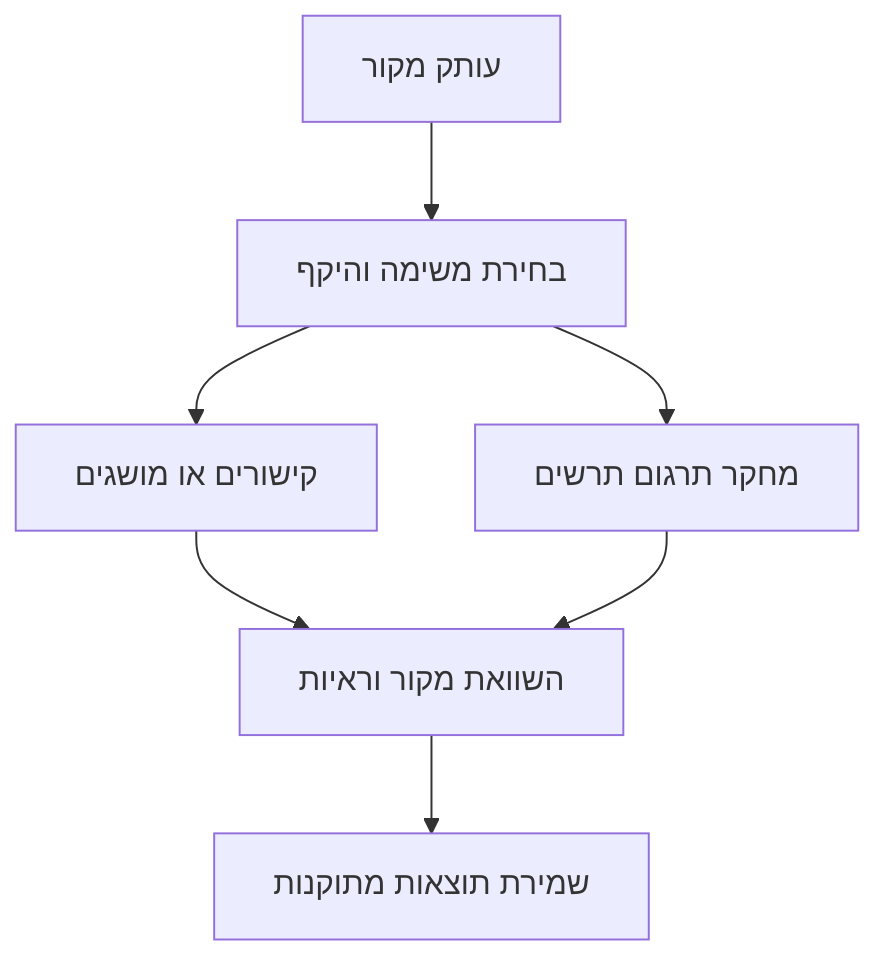

import TLDR from '@site/src/components/TLDR';

# ניהול ידע עם AI ב־Obsidian

<TLDR>שיטת עבודה מועילה מפרידה מקורות, תשובות מודל ותיקונים שלכם. Notemd יוצר קישורים, מושגים, מחקר, תרגומים ותרשימים כמסמכים שניתנים לבדיקה. התחילו במקור אחד, בדקו ואז הפעילו אוטומציה על תיקייה מוגבלת.</TLDR>

## בחירת תוצאה

האם נדרשת הערה מקושרת, מושגים, סיכום מבוסס מקורות, תרגום או תרשים? יותר קבצים וקישורים אינם מבטיחים הבנה או יכולת איתור. קבעו איך תבדקו ותמצאו את התוכן מחדש.

## המסלול המלא


```mermaid
flowchart TD
    A[עותק מקור] --> B[בחירת משימה והיקף]
    B --> C[קישורים או מושגים]
    B --> D[מחקר תרגום תרשים]
    C --> E[השוואת מקור וראיות]
    D --> E
    E --> F[שמירת תוצאות מתוקנות]
```

אלו משימות אפשריות, לא כל השלבים של כפתור ברירת מחדל. שמרו מקור ובדקו תוצאה לפני בניית שרשרת.

## 1. קישורים: הצגת יחסים

הריצו **Process file (add links)** והשוו ב־`_processed.md` מונחים, ציטוטים, קוד ונוסחאות. הוראות תחום/מילים נרדפות אינן אוכפות זהות או סף מספרי. לקישור חוזר לכותרות קיימות ייתכן שהתאמה דטרמיניסטית מתאימה יותר. [קישורים](./features/wiki-links).

## 2. מושגים: הפרידו מונח מהסבר

בחרו תיקייה. חילוץ עצמאי שומר מקור ויוצר כותרות. ל־`Linked From` בקבצים חדשים הפעילו קישורי חזרה וכבו צורה מינימלית. **Batch generate from titles** הוא נפרד ועשוי לעבד הערות מתאימות קודמות. בדקו העברה ל־complete ומשמעויות שונות מאחורי אותו שם. [מושגים](./features/concept-notes).

## 3. מחקר: שמירת ראיות

בחרו נושא/כותרת, Tavily או DuckDuckGo ו־**Research & summarize**. מפתח Tavily ריק לא מחליף שירות. פתחו מקורות ואמתו טענות. אחזור לקסיקלי מקומי אופציונלי שולח קטעים ל־LLM הנבחר; אינדקס מקומי אינו מנתק את המסלול מהרשת. [מחקר](./features/research).

## 4. תרגום: משמעות ומבנה

בחרו שפת יעד ותרגמו קובץ. `_<language>.md` יכול להחליף תוצאה קודמת. לקטע השתמשו בהערה זמנית. בדקו מונחים, מספרים, קוד, קישורים ומתמטיקה; חלוקה עלולה לאבד הקשר. מספר שפות UI/אתר אינו מוכיח איכות לזוג שפות. [תרגום](./features/translation).

## 5. תרשימים: מקור להמשך עריכה

בחרו כמה סוגי תרשימים בהרצה אחת וכמה פורמטים נפרדים לכל סוג. ביטול סימון שומר את הפורמטים של הסוג; ללא בחירה התוכן מנותח אוטומטית. תיבת הסימון כוללת את הסוג ביצירה. לחצו על שמו כדי לבחור בו ולערוך את הפורמטים. ריחוף או מיקוד מקלדת מחליפים את התצוגה המקדימה בלי לשמור הגדרות. Escape סוגר את התפריט ומחזיר את המיקוד.

## 6. תהליכים: אוטומציה לצעדים שנבדקו

שם, `::` ופעולות המופרדות ב־`>` מגדירים שרשרת:

```text
One-Click Extract::process-current-add-links>batch-generate-from-titles>batch-mermaid-fix
```

היא כוללת קישורים, יצירה מכותרות ותיקון Mermaid, לא שלב מחקר או תרשים כללי. דרישות ופלט נשארים לכל פעולה. שגיאה מדווחת עוצרת כברירת מחדל; המשך מתאים רק אם הצעדים הבאים יכולים להתמודד עם הקלט שנשאר. ביטול אינו מוחק תוצרים שהושלמו. [תהליכים](./features/workflows).

## 7. ספקים: משימה ופרוטוקול

36 פרופילים בחמש משפחות. בחרו לפי כתובת, הרשאות, תנאי מידע ותוצאה שנמדדה. השוו זמן/מחיר עם אותו מקור והנחיה. ניתוב משימות כבוי בתחילה; בדקו את כל הנתיבים לפני הנחה שהעבודה מקומית. [ספקים](./providers/overview).

## בדיקות ראשונות

1. התקינו ושמרו עותקי מקור.
2. הגדירו ובדקו מודל מדויק.
3. בחרו תיקיית מושגים ויעדים נפרדים.
4. בדקו על עותק.
5. השוו ושמרו תיקונים.
6. הרחיבו לתיקייה קטנה ובדקו פלט חלקי לפני שרשרת ארוכה.

## מצבים מעשיים

### עיבוד מאמר

המירו חיצונית ל־Markdown ובדקו טבלאות, נוסחאות ותמונות. חלצו מושגים/קטעים, חקרו שאלות מדויקות וציירו רק יחסים שניתנים לבדיקה. שמרו מקור ותיקונים.

### תחזוקת מושגים

השתמשו בתיקייה נפרדת, בדקו מונחים וצרו הסברים לתת־קבוצה נבחרת. גבו לפני ניקוי. מספרים אינם מחליפים הגדרות חדות וניווט שימושי.

### חומר פרטי

הכינו שרת מקומי, מודלים ותלויות. בדקו נתיבים והימנעו ממחקר רשת לפי הצורך. בדקו דוחות לפני שיתוף. ברירת מחדל של loopback אינה מונעת תצורה מרוחקת.

### חידוש אצווה

המתינו לסיום שגיאה/ביטול, עברו על הדוח, התוצרים והשחזור, השוו התנגשויות וחזרו באופן ממוקד. מבוטל אינו ריק; בדקו הפניות לפני מחיקת קבצים נלווים.

## המשך

- [התחלה מהירה](./getting-started/quick-start).
- [אצוות](./advanced/batch-processing).
- [מפתחים](./developers/overview).
- [Agent](./agents/overview).
