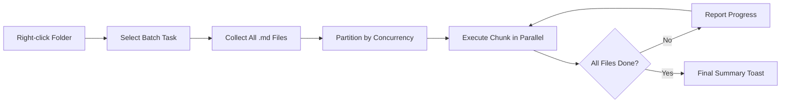

import TLDR from '@site/src/components/TLDR';

# बैच प्रोसेसिंग

<TLDR>
**Notemd एक ही कार्य में समायोज्य समवर्तीता एवं ओवरराइट नियंत्रण के साथ पूरे फ़ोल्डरों को संसाधित करता है।** किसी फ़ोल्डर पर राइट-क्लिक करके विकि-लिंक बैच में जोड़ें, अंदर की सभी नोट्स से अवधारणाएँ निकालें, शोध करें या उनका अनुवाद करें। समवर्तीता सीमाएँ API रेट-लिमिट त्रुटियों को रोकती हैं। प्रत्येक फ़ाइल के लिए प्रगति की रिपोर्ट दी जाती है। ओवरराइट व्यवहार समायोज्य है: मौजूदा फ़ाइलों को छोड़ें, उनके अंत में जोड़ें या प्रतिस्थापित करें। विफल फ़ाइलों को लॉग किया जाता है लेकिन बैच रुकता नहीं है.

यह [Obsidian AI Knowledge Management Guide](/docs/pillar-ai-knowledge) का हिस्सा है.
</TLDR>

## अवलोकन

बैच प्रोसेसिंग नोट्स वाले फ़ोल्डर को एक ही कार्य में बदल देती है। प्रत्येक नोट खोलकर अलग-अलग कमांड चलाने के बजाय, आप फ़ोल्डर पर राइट-क्लिक करके कार्य चुनते हैं। Notemd प्रत्येक `.md` फ़ाइल के माध्यम से चलता है, चुना गया कार्य लागू करता है एवं वास्तविक समय में प्रगति की रिपोर्ट देता है.

यह सुविधा पूरे वॉल्ट में ज्ञान निकालने हेतु आवश्यक है। उदाहरण के लिए, दर्जनों PDFs आयात करने के बाद, बैच-एड-लिंक्स के बाद बैच-एक्सट्रैक्ट-कॉन्सेप्ट्स करने से आपका ज्ञान ग्राफ़ कुछ ही मिनटों में बन जाता है, घंटों में नहीं.

## यह कैसे काम करता है

### बैच निष्पादन मॉडल

1. **फ़ाइल संग्रह** -- Notemd लक्षित फ़ोल्डर को पुनरावर्ती रूप से (या केवल टॉप-लेवल पर, सेटिंग्स के आधार पर) स्कैन करता है एवं सभी `.md` फ़ाइलों को एकत्र करता है.
2. **समवर्तीता विभाजन** -- फ़ाइलों को `batchConcurrency` सेटिंग के आधार पर खंडों में विभाजित किया जाता है। प्रत्येक खंड समानांतर रूप से चलता है; खंड क्रमिक रूप से चलते हैं.
3. **निष्पादन** -- प्रत्येक फ़ाइल को एकल-फ़ाइल कमांड के समान ही तर्क का उपयोग करके संसाधित किया जाता है। प्रत्येक कार्य हेतु प्रदाता एवं मॉडल सेटिंग्स का सम्मान किया जाता है.
4. **प्रगति रिपोर्टिंग** -- प्रत्येक फ़ाइल पूरी होने के बाद एक टोस्ट सूचना अपडेट होती है, जिसमें `N / Total` प्रगति दिखाई देती है.
5. **त्रुटि प्रबंधन** -- यदि कोई फ़ाइल विफल हो जाती है (API त्रुटि, नेटवर्क टाइमआउट आदि), तो त्रुटि लॉग की जाती है एवं बैच जारी रहता है। अंतिम सारांश में सभी विफल फ़ाइलों की सूची दी जाती है.
6. **समाप्ति** -- एक सारांश टोस्ट में कुल प्रोसेस की गई फ़ाइलों, सफलताओं एवं विफलताओं की जानकारी दी जाती है.

### ओवरराइट व्यवहार

जब किसी ऐसी फ़ाइल को संसाधित किया जाता है जिसमें पहले से ही विकि-लिंक, कॉन्सेप्ट नोट्स या अनुवाद मौजूद होते हैं, तो Notemd का व्यवहार ओवरराइट सेटिंग पर निर्भर करता है:

| मोड | व्यवहार |
|------|----------|
| **स्किप** | मौजूदा सामग्री बिना छुए रहती है। केवल अपरिवर्तित फ़ाइलों को ही संसाधित किया जाता है. |
| **एपेंड** (डिफ़ॉल्ट) | नई सामग्री जोड़ी जाती है। मौजूदा विकि-लिंक, कॉन्सेप्ट्स या अनुवाद संरक्षित रहते हैं. |
| **रिप्लेस** | फ़ाइल पूरी तरह से पुनः संसाधित की जाती है। सभी पिछले Notemd संशोधन ओवरराइट हो जाते हैं. |

विशेष रूप से विकि-लिंकिंग के लिए: यदि कोई नोट पहले से ही `[[wiki-links]]` से युक्त है, तो **स्किप** मोड उसे वैसा ही छोड़ देता है, जबकि **रिप्लेस** पूरा नोट LLM को नए लिंक सम्मिलित करने हेतु फिर से भेजता है। धीरे-धीरे संसाधन करने हेतु **स्किप** एवं मॉडल अपग्रेड के बाद पुनः संसाधन करने हेतु **रिप्लेस** का उपयोग करें.

### समवर्तीता नियंत्रण

`batchConcurrency` सेटिंग समानांतर API कॉलों को सीमित करती है। इससे कड़े कोटा वाले प्रदाताओं के साथ बड़ी फ़ोल्डरों को संसाधित करते समय रेट-लिमिट त्रुटियाँ (HTTP 429) नहीं आती हैं.

| समवर्तीता | अनुशंसित उपयोग | सामान्य रेट-लिमिट प्रभाव |
|-------------|----------------|---------------------------|
| `1` | मुफ्त स्तर, कड़े प्रदाता | कोई नहीं (सीरियल) |
| `3` (डिफ़ॉल्ट) | अधिकांश क्लाउड प्रदाता | कम |
| `5` | Ollama (लोकल), उदार स्तर | कोई नहीं / कम |
| `10` | तेज़ इन्फरेंस वाले लोकल मॉडल | कोई नहीं |

यदि बैच प्रोसेसिंग के दौरान आपको 429 त्रुटियाँ मिलती हैं, तो समानांतरता को 1 या 2 तक कम करें.

## कॉन्फ़िगरेशन

| सेटिंग | डिफ़ॉल्ट | प्रभाव |
|---------|---------|--------|
| `batchConcurrency` | `3` | फ़ोल्डर संचालन के दौरान अधिकतम समानांतर API कॉल |
| `batchOverwriteExisting` | `false` | मौजूदा Notemd सामग्री को ओवरराइट करें। `false` = एपेंड मोड है। |
| `batchSkipProcessed` | `false` | उन फ़ाइलों को छोड़ दें जिनमें पहले से ही Notemd मार्कर मौजूद हैं (उदाहरण के लिए, विकि-लिंक्स) |
| `batchRecursive` | `true` | फ़ोल्डर को स्कैन करते समय सब-डायरेक्टरीज़ को शामिल करें |
| `enableStableApiCall` | `false` | बैच के दौरान प्रत्येक फ़ाइल के लिए रिट्राय लॉजिक सक्षम करें (अधिकतम 4 प्रयास) |

### बैच में प्रति-टास्क मॉडल

प्रत्येक बैच ऑपरेशन में संबंधित प्रति-टास्क मॉडल का उपयोग होता है। batch-add-links में `addLinksProvider` का उपयोग होता है, batch-research में `researchProvider` का उपयोग होता है, आदि। इसका मतलब है कि आप बड़े पैमाने पर ऑपरेशनों के लिए सस्ते मॉडल नियुक्त कर सकते हैं और गुणवत्ता-संवेदनशील कार्यों के लिए महंगे मॉडल आरक्षित कर सकते हैं.

## उदाहरण

आपके पास `papers/` नामक एक फ़ोल्डर है जिसमें 40 आयात किए गए शोध नोट्स हैं। आप सभी में विकि-लिंक्स जोड़ना और अवधारणाओं को निकालना चाहते हैं:

1. `papers/` फ़ोल्डर पर राइट-क्लिक करें
2. **"Notemd: Process folder (add links)"** का चयन करें
3. Notemd फ़ोल्डर की स्कैनिंग करता है, 40 `.md` फ़ाइलें पाता है, एवं डिफ़ॉल्ट कनकरेंसी के अनुसार हर बार 3 फ़ाइलों को प्रोसेस करता है
4. एक प्रगति टोस्ट दिखाता है: `12/40 files processed...`
5. लगभग 3 मिनट बाद, एक सारांश टोस्ट रिपोर्ट करता है: `39 succeeded, 1 failed (API timeout on paper-37.md)`
6. सभी 40 फ़ाइलों के लिए कॉन्सेप्ट नोट बनाने हेतु **"Notemd: Process folder (extract concepts)"** का उपयोग करके प्रक्रिया दोहराएं

जो एक फ़ाइल विफल रही है उसका लॉग बन जाता है। आप बाद में केवल उसी फ़ाइल पर पुनः चला सकते हैं.

## सुझाव

- **कम कनकरेंसी से शुरू करें** -- यदि आपको अपने प्रदाता की रेट-लिमिट के बारे में यकीन न हो, तो `1` से शुरू करें एवं धीरे-धीरे इसे बढ़ाएं.
- **इंक्रीमेंटल अपडेट हेतु स्किप मोड का उपयोग करें** -- पहले पूरे बैच के बाद, `batchSkipProcessed: true` पर स्विच करें ताकि बाद के चलानों में केवल नए नोट ही प्रोसेस हों.
- **स्थिर API कॉल सक्षम करें** -- `enableStableApiCall: true` लंबे बैचों के दौरान अस्थायी नेटवर्क त्रुटियों से बचने हेतु रिट्राई लॉजिक जोड़ता है.
- **मॉडल अपग्रेड के बाद पुनः चलाएं** -- यदि आप बेहतर मॉडल पर स्विच करते हैं, तो `batchOverwriteExisting: true` सेट करके पुनः चलाएं ताकि बेहतर लिंक एवं कॉन्सेप्ट प्राप्त हों.

---

## अगले चरण

- [Workflows](/docs/features/workflows) -- बैच टास्कों को वन-क्लिक साइडबार बटनों में श्रृंखलाबद्ध करें
- [Custom Prompts](/docs/advanced/custom-prompts) -- बैच एक्सट्रैक्शन हेतु प्रॉम्प्टों को कस्टमाइज़ करें
- [Troubleshooting](/docs/advanced/troubleshooting) -- बैच चलानों के दौरान रेट-लिमिट त्रुटियों एवं कनेक्शन विफलताओं को ठीक करें
- [LLM प्रदाता](/docs/providers/overview) -- प्रति-कार्य मॉडल कॉन्फ़िगरेशन संदर्भ
