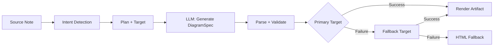
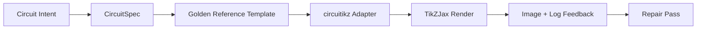

import TLDR from '@site/src/components/TLDR';

# डायग्राम

<TLDR>
**Notemd स्पेक-फर्स्ट पाइपलाइन के माध्यम से आपके नोट्स से डायग्राम बनाता है।** LLM एक रेंडरर-अग्नोस्टिक `DiagramSpec` JSON उत्पन्न करता है, फिर समर्पित एडाप्टर इसे Mermaid, JSON Canvas, Vega-Lite, HTML, या संपादनीय HTML/SVG आउटपुट में बदल देते हैं। 8 इंटेंट प्रकार, स्वचालित फॉलबैक चेन, SVG/PNG निर्यात के साथ लाइव प्रीव्यू, सेमेंटिक सत्यापन, तथा लोकल-नॉलेज-ऑगमेंटेड जनरेशन का समर्थन है.
</TLDR>

यह [Obsidian AI Knowledge Management Guide](/docs/pillar-ai-knowledge) का हिस्सा है.

## आर्किटेक्चर: स्पेक-फर्स्ट पाइपलाइन

Notemd कभी भी LLM से सीधे Mermaid/Vega/Canvas सिंटैक्स उत्पन्न करने को नहीं कहता। इसके बजाय:



**स्पेक-फर्स्ट क्यों?** LLM अक्सर अमान्य रेंडरर सिंटैक्स उत्पन्न करते हैं (विशेष रूप से Mermaid)। एक संरचित `DiagramSpec` को रेंडरिंग से पहले सत्यापित किया जा सकता है, तथा वही स्पेक कई रेंडररों को फॉलबैक के रूप में उपयोग में लाया जा सकता है.

## समर्थित डायग्राम प्रकार

| इंटेंट | प्राथमिक रेंडरर | फॉलबैक्स | उपयोग का मामला |
|--------|-----------------|-----------|----------|
| `mindmap` | Mermaid | HTML | हायरार्किकल विषय विभाजन |
| `flowchart` | Mermaid | HTML | प्रक्रिया प्रवाह, निर्णय वृक्ष |
| `sequence` | Mermaid | HTML | क्लाइंट-सर्वर अंतःक्रियाएँ, प्रोटोकॉल |
| `classDiagram` | Mermaid | HTML | OOP क्लास संबंध |
| `erDiagram` | Mermaid | HTML | डेटाबेस स्कीमाएँ, एंटिटी संबंध |
| `stateDiagram` | Mermaid | HTML | स्टेट मशीनें, लाइफसाइकल मॉडल |
| `canvasMap` | JSON Canvas | Mermaid → HTML | कॉन्सेप्ट मैप, नॉलेज ग्राफ |
| `dataChart` | Vega-Lite | Mermaid → HTML | बार, लाइन, एरिया, स्कैटर, पाई, टेबल्स |

## इंटेंट डिटेक्शन

Notemd वर्डकी स्कोरिंग का उपयोग करके आपके नोट की सामग्री से सबसे अच्छे डायग्राम प्रकार का अनुमान लगाता है:

| इंटेंट | ट्रिगर्स | कॉन्फिडेंस |
|--------|----------|------------|
| `dataChart` | टेबल्स, संख्यात्मक सेल्स, मेट्रिक/ट्रेंड वर्डकी, प्रतिशत | 0.88 |
| `sequence` | रिक्वेस्ट/रिस्पॉन्स वोकैब (4+ मैच) या `->`/`=>` मार्कर्स | 0.82 |
| `erDiagram` | प्राइमरी की, फॉरेन की, एंटिटी, स्कीमा (2+ मैच) | 0.80 |
| `stateDiagram` | स्टेट, ट्रांजिशन, पेंडिंग, रनिंग, फेल्ड (3+ मैच) | 0.76 |
| `flowchart` | नंबर्ड स्टेप्स (2+) या if/then/else/workflow वोकैब | 0.74 |
| `canvasMap` | अवधारणा मानचित्र, ज्ञान ग्राफ, स्थानिक, क्लस्टर | 0.72 |
| `mindmap` | डिफ़ॉल्ट फ़ॉलबैक | 0.55 |

**पसंदीदा आरेख प्रकार** सेटिंग, साइडबार सिलेक्टर, या स्पष्ट कमांड पैलेट विकल्प के साथ ओवरराइड करें.

## रेंडर टारगेट चयन

प्रयोगात्मक spec-पहला पाइपलाइन में अब दो स्वतंत्र नियंत्रण हैं:

| नियंत्रण | सेटिंग | प्रभाव |
|---------|---------|--------|
| पसंदीदा आरेख प्रकार | `preferredDiagramIntent` | जनरेट किए गए `DiagramSpec` के सेमांटिक आकार को मार्गदर्शन देता है |
| पसंदीदा रेंडर टारगेट | `preferredDiagramRenderTarget` | **आरेख जनरेट** और **आरेख प्रीव्यू** के लिए आर्टिफैक्ट रेंडरर चुनता है |

प्लानर डिफ़ॉल्ट के लिए **पसंदीदा रेंडर टारगेट** को **Auto** पर सेट करें, या स्पष्ट रूप से Mermaid, JSON Canvas, Vega-Lite, HTML, या Editable HTML/SVG चुनें। यह ओवरराइड केवल आर्टिफैक्ट और प्रीव्यू कमांडों पर ही लागू होता है। मानक **Summarise as Mermaid diagram** कमांड Mermaid-संगत आउटपुट से जुड़ा रहता है ताकि मौजूदा Markdown वर्कफ्लो में चुपचाप फ़ॉर्मेट न बदले.

यह अलगाव महत्वपूर्ण है क्योंकि अब एक `flowchart` इरादे को Markdown नोट्स के लिए Mermaid, मजबूत फ़ॉलबैक के लिए HTML, या डाउनस्ट्रीम संपादन के लिए Editable HTML/SVG के रूप में रेंडर किया जा सकता है। Draw.io और Drawnix CLI आर्टिफैक्ट एक्सपोर्टर ही बने रहते हैं, प्लग-इन रेंडर टारगेट नहीं.

## उपयोग

### एक आरेख जनरेट करें

1. एक नोट खोलें
2. कमांड पैलेट से **"Notemd: Generate diagram"** चलाएं
3. Notemd इरादे का पता लगाता है, स्पेक जनरेट करता है, रेंडर करता है, और आर्टिफैक्ट सेव करता है

**टारगेट के अनुसार आउटपुट फ़ाइलें:**

| लक्ष्य | एक्सटेंशन | फ़ाइलनाम पैटर्न |
|--------|-----------|------------------|
| Mermaid | `.md` | `{note}_summ.md` |
| JSON Canvas | `.canvas` | `{note}_diagram.canvas` |
| Vega-Lite | `.json` | `{note}_diagram.json` |
| HTML | `.html` | `{note}_diagram.html` |
| संपादनीय HTML/SVG | `.html` | `{note}_diagram.html` |

### डायग्राम का पूर्वावलोकन करें

1. **"Notemd: पूर्वावलोकन डायग्राम"** चलाएं
2. रेंडर किया गया डायग्राम वाला एक मोडल खुलता है
3. टूलबार बटनों का उपयोग करके SVG या PNG के रूप में निर्यात करें

सेटिंग्स में **स्वचालित पूर्वावलोकन खोलना** उपलब्ध है — जनरेशन के बाद, पूर्वावलोकन मोडल स्वचालित रूप से शुरू हो जाता है.

पूर्वावलोकन मोडल में एक आर्टिफैक्ट डायग्नोस्टिक्स पैनल भी है। रेंडरर और स्मोक चेक `RenderArtifact.diagnostics` को जोड़ सकते हैं; मोडल पूर्वावलोकन के बगल में त्रुटि/चेतावनी/सूचना की संख्या, फिर गंभीरता, डायग्नोस्टिक प्रकार, संदेश और मरम्मत सलाह वाला एक सारांश दिखाता है। यही सारांश पूर्वावलोकन इतिहास प्रविष्टियों में भी दिखाया जाता है, इसलिए हर प्रविष्टि खोले बिना दोहरे circuitikz स्मोक प्रयासों की तुलना की जा सकती है। उन आर्टिफैक्ट्स के लिए जिनके पास स्रोत सामग्री है लेकिन उन्हें इनलाइन या HTML आईफ्रेम पथ के माध्यम से रेंडर नहीं किया जा सकता, मोडल अब खाली आईफ्रेम थोपने के बजाय केवल स्रोत-आधारित पूर्वावलोकन पर वापस जाता है। इससे circuitikz कंपाइल/रेंडर स्मोक, SVG टेक्स्ट-टोकन चेक, PNG खाली-स्क्रीनशॉट चेक और भविष्य की ओवरलैप रिपोर्टों को एक दृश्यमान UI सतह मिलती है, बिना TikZJax या LaTeX को कठोर प्लगइन रनटाइम निर्भरता बनाए या स्रोत टेक्स्ट को सत्यापित विजुअल रेंडर माने बिना.

### पुराना Mermaid मोड

जब `enableExperimentalDiagramPipeline` बंद होता है, तो Notemd सीधे Mermaid प्रॉम्प्ट को LLM भेजता है। यह पूरी तरह से स्पेक पाइपलाइन को बायपास करता है। यदि प्रयोगात्मक पाइपलाइन विफल हो जाती है, तो यह मोड उपयोग में आता है.

## रेंडरिंग बैकएंड्स

### Mermaid

6 एडाप्टर (माइंडमैप, फ्लोचार्ट, सीक्वेंस, ER, क्लास, स्टेट) `DiagramSpec` को Mermaid सिंटैक्स में अनुवाद करते हैं। जनरेशन के बाद, `mermaid.parse()` आउटपुट की सत्यापना करता है। यदि सत्यापन विफल हो जाता है:

1. **LLM पुनः प्रयास** — Mermaid की त्रुटि संदेश को संदर्भ के रूप में लेकर एक प्रयास
2. **न्यूनतम फॉलबैक** — स्पेक नोड ID से एक सरल Mermaid डायग्राम

**Legacy Mermaid Fixer** स्वचालित रूप से सामान्य LLM सिंटैक्स त्रुटियों की मरम्मत करता है: नोट डायरेक्टिव का सामान्यीकरण, पाइप-लेबल का एस्केपिंग, सेमीकोलन का पुनर्स्थापन, स्मार्ट कोट्स, डबल-डैश एरो, आकार संबंधी असंगतियाँ, एवं अन्य.

### JSON Canvas

यह Obsidian JSON Canvas प्रारूप के साथ स्थानिक व्यवस्था उत्पन्न करता है:
- नोडों को गहराई (x = गहराई × 420) एवं सूचकांक (y = सूचकांक × 170) के आधार पर स्थित किया जाता है
- चौड़ाई लेबल की लंबाई से अनुमानित की जाती है
- किनारों में `fromSide: 'right'`, `toSide: 'left'`, `toEnd: 'arrow'` होते हैं

### Vega-Lite

यह स्वचालित एन्कोडिंग के साथ पूर्ण Vega-Lite v5 JSON स्पेसिफिकेशन बनाता है:
- **कार्टेशियन चार्ट** (बार/लाइन/एरिया/पॉइंट/स्कैटर): मल्टी-सीरीज़ के लिए x + y चैनल एवं रंग
- **पाई**: थीटा = y (मात्रात्मक), रंग = x (नाममात्र)
- **टेबल**: पंक्ति = x, टेक्स्ट = y + कॉलम = सीरीज़

कंपाइलेशन से पहले डार्क एवं लाइट थीम पैचों को गहराई से मर्ज किया जाता है.

### HTML

यह एक सार्वभौमिक फॉलबैक है। यह स्व-निहित HTML दस्तावेज़ में शामिल है:
- CSP मेटा हेडर्स
- `prefers-color-scheme` के माध्यम से लाइट/डार्क मोड
- 20 स्थानीयकृत भाषाओं के लिए UI लेबल
- खंड: हीरो, संरचना (नोड ट्री), संबंध, कॉलआउट्स, डेटा सीरीज़ टेबल

### संपादनीय HTML/SVG

संपादनीय निर्यात कार्यप्रवाहों के लिए स्पष्ट आकृति लक्ष्य। यह `DiagramSpec` को एक निर्धारित `SemanticFigureModel` में परिवर्तित करता है, फिर इनलाइन SVG समूहों वाला एक स्व-समाविष्ट HTML दस्तावेज़ प्रदर्शित करता है जिसमें Draw.io-शैली की टिप्पणियाँ होती हैं:

- `data-drawio-type`, `data-drawio-id`, एवं `data-drawio-role` सेमेंटिक नोड्स पर
- `data-drawio-source` एवं `data-drawio-target` सेमेंटिक एज़ पर
- स्पेसवाइट नॉर्मलाइज़ेशन एवं कोलिज़न हैंडलिंग के बाद स्थिर नोड/एज़ पहचानकर्ता
- कोई स्क्रिप्ट, कोई बाहरी फ़ॉन्ट, एवं कोई रिमोट एसेट नहीं

यह लक्ष्य जानबूझकर अभी डिफ़ॉल्ट प्लानर मार्ग नहीं है। जब उत्पाद पथ वास्तविक उपकरणों में संपादन व्यवहार साबित कर देता है, तब इसे एक स्पष्ट रेंडर लक्ष्य के रूप में उपलब्ध कराया जाता है.

### Draw.io एवं Drawnix निर्यात सीमाएँ

वर्तमान कार्यान्वयन तृतीय-पक्ष संपादक सहायता को आर्टिफ़ैक्ट सीमा पर ही रखता है:

| लक्ष्य | संधि | रनटाइम निर्भरता |
|--------|----------|--------------------|
| Draw.io | `SemanticFigureModel` से निर्धारित, अनकंप्रेस्ड `mxfile` XML | प्लगइन रनटाइम या CI में कोई नहीं |
| Drawnix | `geometry` एवं `arrow-line` तत्वों का उपयोग करके न्यूनतम `.drawnix` JSON सबसेट | प्लगइन रनटाइम या CI में कोई नहीं |

यह समझौता जानबूझकर किया गया है: Notemd डायग्राम्स.नेट डेस्कटॉप, Drawnix, प्लेट, या केवल ब्राउज़र-आधारित संपादक स्थिति को प्लगइन में शामिल किए बिना ही दृश्यमान लेबल, स्थिर ID, एवं समर्थित प्रिमिटिव कवरेज की जाँच कर सकता है।

### circuitikz / TikZJax दिशा

सर्किट आरेख, सामान्य फ्लोचार्ट की तरह समस्या नहीं होते। विद्युत सर्किटों के लिए सही सिंटैक्स लक्ष्य आमतौर पर **circuitikz** होता है, जिसे Obsidian में TikZJax जैसे प्लगइन्स के माध्यम से प्रस्तुत किया जाता है। TikZJax, `circuitikz`, `pgfplots`, `tikz-cd` एवं `chemfig` जैसे पैकेजों को लोड कर सकता है, जिससे यह भौतिकी, सर्किट, रसायन विज्ञान एवं गणित के नोट्स के लिए आकर्षक बन जाता है.

खतरा यह है कि LLM द्वारा सीधे बनाया गया TikZ नाजुक होता है:

- जटिल सर्किट टोपोलॉजी विद्युत रूप से सही हो सकती है लेकिन दृश्य रूप से पढ़ने योग्य नहीं होती;
- ओवरलैप होने वाले तार एवं लेबल कारण से सही नेटलिस्ट अध्ययन नोट्स के लिए उपयोग में नहीं आ सकता;
- पैकेज प्रीएम्बल का अभाव, गलत एंकर या अमान्य कंपोनेंट नाम प्रस्तुति में बाधा डाल सकते हैं;
- रेंडरर से प्राप्त फीडबैक आमतौर पर छवि-स्तर का होता है, जबकि LLM द्वारा बनाई गई ज्यामिति टेक्स्ट-स्तर की होती है.

बेहतर आर्किटेक्चर यह है कि circuitikz को एक सीमित आरेख लक्ष्य के रूप में माना जाए, न कि एक मुक्त-रूप प्रॉम्प्ट के रूप में:



प्रथम-श्रेणी का मॉडल सर्किट टोपोलॉजी एवं लेआउट का वर्णन अलग-अलग करना चाहिए:

| परत | जिम्मेदारी | उदाहरण |
|-------|----------------|---------|
| टोपोलॉजी | विद्युत नोड्स एवं कंपोनेंट कनेक्शन | `VDD -> RD -> drain(M1)`, `source(M1) -> GND` |
| लेआउट | ग्रिड स्थापना, दिशा, रूटिंग लेन | `M1 at (3,2.2)`, इनपुट बाएँ, आउटपुट दाएँ |
| स्टाइल | पैकेज, वोल्टेज संधि, लेबल, एंकर | `\begin{circuitikz}[american voltages]` |
| वैलिडेशन | कंपाइल लॉग, लुप्त एंकर, ओवरलैप/स्क्रीनशॉट जाँच | TikZJax/LaTeX निदान सहित दृश्य समीक्षा |

### वर्तमान circuitikz प्रोटोटाइप

Notemd में अब इस दिशा के लिए पहला सीमित रिपॉजिटरी प्रोटोटाइप शामिल है। यह जानबूझकर ऑफलाइन एवं टेम्पलेट-आधारित है:

```bash
npm run diagram:export-circuitikz -- --input cmos-inverter.json --output cmos-inverter.tex
```

प्रोटोटाइप छह गोल्डन-रेफरेंस परिवारों के लिए एक अलग `CircuitSpec` सीमा एवं निर्धारित निर्यातक जोड़ता है:

| सर्किट प्रकार | गोल्डन रेफरेंस | वर्तमान गारंटी |
|--------------|------------------|-------------------|
| `common-source-amplifier` | `common-source-nmos-v1` | LaTeX लिखने से पहले `VDD -> R_D -> M1.D`, `vin -> M1.G`, `M1.S -> GND`, एवं `M1.D -> vout` की वैलिडेशन करता है |
| `cmos-inverter` | `cmos-inverter-v1` | LaTeX लिखने से पहले PMOS-over-NMOS टोपोलॉजी, साझा गेट इनपुट, साझा ड्रेन आउटपुट, `VDD -> MP.S`, एवं `MN.S -> GND` की वैलिडेशन करता है |
| `cmos-buffer` | `cmos-buffer-v1` | LaTeX लिखने से पहले दो कैस्केडेड इन्वर्टर स्टेज, मध्यवर्ती नोड `vmid`, पुनर्स्थापित `vout`, एवं साझा VDD/GND रेलों की वैलिडेशन करता है |
| `cmos-transmission-gate` | `cmos-transmission-gate-v1` | LaTeX लिखने से पहले `vin` एवं `vout` के बीच समानांतर PMOS/NMOS पास डिवाइसों की वैलिडेशन करता है, जिसमें पूरक `phib` / `phi` नियंत्रण शामिल हैं |
| `cmos-nand2` | `cmos-nand2-v1` | वह LaTeX लिखने से पहले समानांतर PMOS पुल-अप, श्रृंखला NMOS पुल-डाउन, द्विआधारी इनपुट `va` / `vb`, एवं `vout` की सत्यापन करता है |
| `cmos-nor2` | `cmos-nor2-v1` | वह LaTeX लिखने से पहले श्रृंखला PMOS पुल-अप, समानांतर NMOS पुल-डाउन, द्विआधारी इनपुट `va` / `vb`, एवं `vout` की सत्यापन करता है |

यह अभी तक कोई सामान्य TikZ जनरेटर नहीं है। यह LaTeX को संकलित नहीं करता, TikZJax को नहीं बुलाता, स्क्रीनशॉटों की जाँच नहीं करता, और स्वचालित छवि-प्रतिक्रिया मरम्मत भी नहीं करता। ये सभी कार्य बाद के चरणों में किए जाएँगे.

प्रीव्यू डायग्राम कमांड, जब फ़ाइल एक्सटेंशन `.tex` या `.tikz` हो एवं स्रोत में `\usepackage{circuitikz}` या `\begin{circuitikz}` हो, तो सहेजे गए circuitikz स्रोत आर्टिफैक्ट्स को सीधे पुनः खोल सकता है। यह मार्ग एक circuitikz स्रोत-केवल प्रीव्यू है: मोडल स्रोत, निदान, कॉपी/सेव नियंत्रण एवं इतिहास मेटाडेटा दिखाता है, लेकिन प्लगइन रनटाइम के भीतर LaTeX को संकलित नहीं करता या TikZJax को नहीं बुलाता.

अब वही स्रोत-केवल प्रीव्यू सीमा सहेजे गए Draw.io एवं Drawnix आर्टिफैक्ट्स को भी सम्मिलित करती है। `.drawio` फ़ाइलें तब स्वीकार की जाती हैं जब वे Draw.io XML (`mxfile` या `mxGraphModel`) के समान दिखती हैं, एवं `.drawnix` फ़ाइलें तब स्वीकार की जाती हैं जब वे Drawnix JSON के साथ `type: "drawnix"` एवं एक `elements` सरणी होती हैं। प्लगइन अभी भी diagrams.net या Drawnix व्हाइटबोर्ड होस्ट को शामिल नहीं करता; ये प्रीव्यू स्रोत, निदान एवं आर्टिफैक्ट इतिहास को प्रदर्शित करते हैं, लेकिन प्लगइन के भीतर कोई विज़ुअल एडिटर नहीं देते.

टोपोलॉजी-संरक्षण मरम्मत हेतु, मरम्मत किए गए उम्मीदवार को स्वीकार करने से पहले पूर्व-मरम्मत स्पेक को संदर्भ के रूप में पास करें:

```bash
npm run diagram:export-circuitikz -- --input repaired-cmos-inverter.json --topology-reference cmos-inverter.json --output cmos-inverter.tex
```

मरम्मत गार्ड, आउटपुट से पहले `circuitKind`, `goldenReferenceId`, नेट्स, कंपोनेंट आईडी/टाइप/टर्मिनल्स एवं अनिर्देशित कनेक्शन एंडपॉइंट्स की तुलना करने हेतु `createCircuitTopologySignature` एवं `assertCircuitTopologyUnchanged` का उपयोग करता है। लेबल, शीर्षक पाठ, लेआउट संकेत, कनेक्शन क्रम एवं कनेक्शन लेबलों को जानबूझकर नज़रअंदाज़ किया जाता है। ऐसा उम्मीदवार जो एक छोटा लेबल जोड़ता है या किसी टर्मिनल को पुनः जोड़ता है, `.tex` फ़ाइल लिखे जाने से पहले ही `Circuit topology drift detected` के कारण विफल हो जाता है.

अब CLI, कंपाइलर चलाए बिना मौजूदा LaTeX/TikZJax कंपाइल लॉग को पार्स कर सकता है:

```bash
npm run diagram:export-circuitikz -- --input cmos-inverter.json --output cmos-inverter.tex --compile-log cmos-inverter.log --diagnostics-output cmos-inverter.diagnostics.json
```

यह निदान मार्ग `circuitikz.sty` जैसे गायब पैकेजों, TikZ/circuitikz कुंजियों के अज्ञात होने, सेमीकोलन की कमी जैसी TikZ पथ सिंटैक्स त्रुटियों, असंतुलित क्लॉज़ या अधूरे लेबल से उत्पन्न अतिरिक्त आर्ग्युमेंट्स, अपरिभाषित कंट्रोल सीक्वेंसेज, सामान्य LaTeX त्रुटियों, आपातकालीन रोकों एवं `\hbox` के ओवरफुल होने संबंधी सलाहात्मक चेतावनियों की रिपोर्ट करता है। यह अभी भी लॉग-आधारित है: स्थानीय LaTeX/TikZJax निष्पादन एवं स्क्रीनशॉट-गुणवत्ता संबंधी कार्य अभी भी भविष्य के कार्य हैं.

मेन्टेनर स्मोक चेक हेतु, वही CLI वैकल्पिक रूप से शेल कमांड पार्सिंग के बिना स्पष्ट रूप से कॉन्फ़िगर किए गए रेंडरर को चला सकता है:

```bash
npm run diagram:export-circuitikz -- --input cmos-inverter.json --output cmos-inverter.tex --compile-executable pdflatex --compile-arg -interaction=nonstopmode --compile-arg -halt-on-error --compile-arg -output-directory={outputDir} --compile-arg {tex} --expected-artifact {outputDir}/{jobName}.pdf
```

कंपाइल रनर, `shell: false` का उपयोग करके `{tex}`, `{outputDir}` एवं `{jobName}` प्लेसहोल्डर्स को आर्ग्युमेंट-सरणी मानों में विस्तारित करता है, उत्पन्न `{jobName}.log` को पढ़ता है, एवं CLI JSON आउटपुट में `compileExecution` एवं `compileDiagnostics` के साथ लौटाता है। `--compile-executable` केवल रेंडरर बाइनरी या व्रैपर पथ है; रेंडरर फ्लैग्स दोहराए गए `--compile-arg` मानों में होते हैं। खाली एक्जीक्यूटेबल्स `compile-executable-invalid` के रूप में विफल हो जाते हैं, गायब बाइनरीज़ `compile-executable-not-found` के रूप में विफल हो जाती हैं, एवं शेल-कमांड-आकार की एक्जीक्यूटेबल स्ट्रिंग्स को आर्ग्युमेंट्स को विभाजित करने की सलाह दी जाती है ताकि Windows, Linux एवं macOS समान प्रत्यक्ष-निष्पादन समझौते का पालन कर सकें। `--expected-artifact` के साथ, यह `compileExecution.renderSmoke` की भी रिपोर्ट करता है एवं यदि रेंडरर कोई गैर-खाली आर्टिफैक्ट नहीं बनाता तो CLI में विफल हो जाता है। यह अभी भी LaTeX को शामिल नहीं करता, TikZJax को प्लगइन रनटाइम निर्भरता नहीं बनाता, या स्क्रीनशॉट-स्तरीय विज़ुअल मरम्मत नहीं करता.

यदि अपेक्षित आर्टिफैक्ट `.svg` है, तो स्मोक चेक एक स्तर और गहरा हो जाता है:

```bash
npm run diagram:export-circuitikz -- --input cmos-inverter.json --output cmos-inverter.tex --compile-executable dvisvgm --compile-arg ... --expected-artifact {outputDir}/{jobName}.svg --expected-svg-text v_{in} --expected-svg-text v_{out}
```

SVG स्मोक, `<svg>` रूट, सकारात्मक आयाम या `viewBox`, छिपे/पारदर्शी तत्वों को बाहर रखने के बाद कम से कम एक दृश्यमान ड्रॉइंग तत्व, कोई भी अनुरोधित टेक्स्ट टोकन, `viewBox` के बाहर स्पष्ट तत्व, `<text>` / `<tspan>` लेबलों का स्पष्ट ओवरलैपिंग पोज़िशनिंग, एवं `render-svg-label-overlap` के माध्यम से ड्रॉइंग तत्वों के ऊपर स्पष्ट टेक्स्ट लेबलों की जाँच करता है। अपेक्षित टेक्स्ट की खोज दृश्यमान टेक्स्ट एवं `aria-label`, `<title>`, `<desc>` जैसे एक्सेसिबिलिटी मेटाडेटा को डिकोड करके की जाती है, ताकि वे रेंडरर जो दृश्यमान `<text>` के बाहर सेमांटिक लेबलों को संरक्षित करते हैं, OCR की आवश्यकता के बिना भी टेक्स्ट-टोकन स्मोक को पूरा कर सकें। ज्यामिति पास अब सामान्य समूह एवं तत्व `transform` गुणों हेतु ट्रांसफॉर्म-सचेत ज्यामिति है, इसलिए अनुवादित, स्केल किए गए, घुमाए गए, विकृत या मैट्रिक्स-ट्रांसफॉर्म किए गए SVG बॉक्सों की जाँच ट्रांसफॉर्म संयोजन के बाद की जाती है। यह A/a आर्क एक्स्ट्रीमा के सटीक आर्क सीमाओं, C/S/Q/T वक्र एक्स्ट्रीमा के सटीक बीजियर कर्व सीमाओं, स्ट्रोक-विड्थ-सचेत SVG सीमाओं एवं लेबल ओवरलैप जाँचों, `polyline` / `polygon` ड्रॉइंग ज्यामिति, एवं `<use href="#...">` संदर्भों से पथ-केवल ग्लिफ़ प्लेसमेंट को भी हल करता है, ताकि पुनः उपयोग योग्य ग्लिफ़ पथों में बदले गए लेबल भी बाउंडेड-कैनवास जाँचों में विफल हो सकें जब रखे गए ग्लिफ़ ज्यामिति `viewBox` से बाहर निकल जाती है। एक ही `<text>` पैरेंट के अंतर्गत कई पोज़िशनित `tspan` लेबलों की तुलना अलग-अलग लेबल बॉक्सों के रूप में की जाती है, जिससे LaTeX-शैली का SVG आउटपुट जो अन्यथा अलग-अलग लेबलों को एक ही टेक्स्ट नोड में समाहित कर देता, पकड़ा जा सकता है। पोज़िशनित SVG `text` एवं `tspan` बॉक्स `text-anchor` मान `start`, `middle`, एवं `end` का सम्मान करते हैं, इसलिए केंद्रित एवं दाएँ-संरेखित लेबल टेक्स्ट/टेक्स्ट एवं लेबल-बनाम-ड्रॉइंग ओवरलैप निदान को ट्रिगर कर सकते हैं, बिना ब्राउज़र-स्तरीय टेक्स्ट लेआउट का दावा किए। `<defs>` के भीतर केवल परिभाषा-आधारित ग्लिफ़ पथों को दृश्यमान ड्रॉइंग तत्वों के रूप में गिना नहीं जाता, लेकिन उनके स्वयं के परिभाषा-स्थानीय `transform` गुण `<use>` प्लेसमेंट से पहले ही लागू किए जाते हैं, ताकि स्केल किए गए या दर्पणित ग्लिफ़ परिभाषाओं की गिनती कम न हो। लेबल-बनाम-ड्रॉइंग जाँच में एक छोटा ड्रॉइंग-बॉक्स सहनशीलता एवं घोषित `stroke-width` का उपयोग किया जाता है, इसलिए पतले तार, मोटे तार एवं बहुभुजीय कंपोनेंट आउटलाइन्स सभी लेबल-पठनीयता विफलताओं के रूप में माने जा सकते हैं जब उनका दृश्यमान स्ट्रोक किसी लेबल तक पहुँचता है। `<use href="#...">` से हल किए गए पथ-केवल ग्लिफ़ लेबलों की भी ड्रॉइंग बॉक्सों के साथ तुलना की जाती है एवं यदि पुनः उपयोग योग्य ग्लिफ़ ज्यामिति तारों या कंपोनेंट्स से ओवरलैप होती है तो `render-svg-path-glyph-overlap` के साथ विफल हो जाते हैं। यदि कोई रेंडरर लेबलों को खोजने योग्य `<text>` में बदलकर पुनः उपयोग योग्य पथ ग्लिफ़ बनाता है एवं एक्सेसिबिलिटी मेटाडेटा को संरक्षित नहीं करता, तो स्मोक रिपोर्ट `pathOnlyGlyphUseCount` को दर्ज करती है एवं `render-svg-text-path-only` के माध्यम से अनुरोधित टेक्स्ट टोकन को विफल कर देती है, बजाय इसके कि लेबल को सिर्फ़ अनुपस्थित मान लिया जाए। अन्य विफलताओं की रिपोर्ट `render-svg-invalid`, `render-svg-dimension-missing`, `render-svg-no-visible-elements`, `render-svg-text-missing`, `render-svg-out-of-bounds`, `render-svg-text-overlap`, `render-svg-label-overlap`, या `render-svg-path-glyph-overlap` के माध्यम से की जाती है। टेक्स्ट-टोकन एवं ओवरलैप जाँचों को केवल उन रेंडररों के लिए संरचनात्मक स्मोक माना जाना चाहिए जो लेबलों को खोजने योग्य SVG टेक्स्ट या एक्सेसिबिलिटी मेटाडेटा के रूप में संरक्षित करते हैं; पथ-केवल SVG आउटपुट को अभी भी बाद के स्क्रीनशॉट/OCR गेट की आवश्यकता होती है ताकि विज़ुअल लेबल पठनीयता साबित हो सके, एवं यह स्मोक पास अभी भी पूर्ण SVG पथ कवरेज का दावा नहीं करता।

दृश्यमान तत्वों की गिनती एवं ज्यामिति संग्रह के दौरान छिपे SVG समूह एवं तत्व हमेशा एकसमान रूप से छोड़ दिए जाते हैं। गुण या इनलाइन-स्टाइल `display:none`, `visibility:hidden`, `visibility:collapse`, एवं समग्र `opacity:0` किसी अन्यथा खाली रेंडर आर्टिफैक्ट को दृश्यमान-आउटपुट स्मोक पास करने नहीं दे सकते.

पथ-केवल ग्लिफ़ परिभाषाएँ प्रत्यक्ष पथ हो सकती हैं या `<defs>` के भीतर समूहित/सिम्बल कंटेनर हो सकते हैं। स्मोक पास, `<use>` प्लेसमेंट से पहले `<g id="...">` एवं `<symbol id="...">` से चैल्ड पथ ज्यामिति को हल करता है, इसलिए लपेटे गए ग्लिफ़ आउटपुट फिर भी `pathOnlyGlyphUseCount`, बाउंडेड-कैनवास जाँचों, एवं `render-svg-path-glyph-overlap` को आपूर्ति करता है.

पथ पार्सर, `Z/z` पर उपसर्ग पथों की शुरुआत का ट्रैक रखता है एवं वर्तमान बिंदु को रीसेट करता है, इसलिए बंद उपसर्ग पथ के बाद के सापेक्ष कमांड सही SVG बिंदु से ही जारी रहते हैं, न कि गलत `render-svg-out-of-bounds` निदान बनाते हुए।

डेली ज्यामिति पास, लीडिंग-डॉट दशमलवों एवं स्पष्ट प्लस चिह्नों के लिए SVG संख्या व्याकरण का पालन करता है, इसलिए `.5`, `-.5`, या `+.5` जैसे संकीर्ण dvisvgm निर्देशांक सीमा जाँच के दौरान भिन्नात्मक ही रहते हैं, बजाय इसके कि वे गलत बाउंड्री वाली ज्यामिति बन जाएँ या छोड़ दिए जाएँ.

यदि रेंडरर `.png` उत्पन्न करता है, तो वही अपेक्षित-आर्टिफैक्ट पथ पहले स्क्रीनशॉट स्मोक के रूप में बनता है: Notemd, गैर-इंटरलेस्ड 1/2/4/8-बिट इंडेक्स्ड-कलर PNG फ़ाइलों, 1/2/4/8/16-बिट ग्रेस्केल PNG फ़ाइलों, एवं 8/16-बिट ग्रेस्केल-अल्फा/RGB/RGBA PNG फ़ाइलों को डीकोड करता है। इंडेक्स्ड-कलर एवं सब-बाइट ग्रेस्केल छवियाँ पैक्ड सैंपलों का समर्थन करती हैं; इंडेक्स्ड-कलर छवियाँ PLTE एवं वैकल्पिक tRNS डेटा का भी समर्थन करती हैं; ग्रेस्केल/RGB छवियाँ tRNS पारदर्शी सैंपलों का समर्थन करती हैं। 16-बिट डायरेक्ट सैंपलों को स्मोक चेक द्वारा उपयोग किए जाने वाले ही 8-बिट RGBA तुलना स्पेस में सामान्यीकृत किया जाता है। स्मोक चेक सकारात्मक आयामों की जाँच करता है, फ्रंटग्राउंड की सीमाओं को `foregroundBounds` के रूप में दर्ज करता है, उस बॉक्स के भीतर फ्रंटग्राउंड घनत्व को `foregroundDensity` के रूप में दर्ज करता है, जब प्रत्येक दृश्यमान पिक्सेल ऊपर-बाएँ बैकग्राउंड रंग के समान हो तो `render-png-blank` के साथ विफल होता है, जब फ्रंटग्राउंड सामग्री छवि की सीमा को छूती है तो `render-png-content-clipped` के साथ विफल होता है, जब एक बड़े स्क्रीनशॉट में चार से कम फ्रंटग्राउंड पिक्सेल होते हैं तो `render-png-foreground-too-small` के साथ विफल होता है, एवं जब किसी गैर-साधारण बाउंडिंग बॉक्स के भीतर फ्रंटग्राउंड पिक्सेल असामान्य रूप से घने होते हैं तो `render-png-foreground-dense` के साथ विफल होता है। असमर्थ PNG प्रारूप `render-png-unsupported` के साथ विफल हो जाते हैं, एवं Adam7 इंटरलेस्ड PNG या असमर्थ इंडेक्स्ड-कलर बिट गहराईयों के लिए प्रारूप-विशिष्ट मार्गदर्शन उपलब्ध है। यह खाली स्क्रीनशॉट, स्पष्ट कैनवास क्लिपिंग, अंडर-रेंडर्ड फ्रंटग्राउंड फुटप्रिंट, पहले पिक्सेल-स्तरीय भीड़भाड़ विफलताओं, एवं गलत रेंडरर PNG निर्यात सेटिंगों को पकड़ लेता है, बिना किसी प्लेटफॉर्म-विशिष्ट शेल निर्भरता के। यह अभी तक OCR-स्तरीय लेबल पहचान, सटीक टेक्स्ट-ओवरलैप डिटेक्शन, या टोपोलॉजी-संरक्षण वाली छवि मरम्मत नहीं है.

जब डायग्नोस्टिक्स में कंपाइल या रेंडर-स्मोक चलाने में विफलता दिखाई देती है, तो CLI मरम्मत के लिए टोपोलॉजी-संरक्षण वाला संक्षिप्त विवरण भी लिख सकता है:

```bash
npm run diagram:export-circuitikz -- --input cmos-inverter.json --topology-reference cmos-inverter.json --output cmos-inverter.tex --compile-log cmos-inverter.log --repair-brief-output cmos-inverter.repair-brief.json
```

मरम्मत विवरण में स्कीमा `notemd.circuitikz.repair-brief.v1` का उपयोग होता है एवं इसमें स्रोत `CircuitSpec`, टोपोलॉजी हस्ताक्षर, कंपाइल/रेंडर डायग्नोस्टिक्स, अनुमत संपादन, प्रतिबंधित टोपोलॉजी संपादन, अगले सत्यापन चरण, एवं एक संरचित `repairPrompt` शामिल होता है। प्रॉम्प्ट की भूमिका `topology-preserving-circuitikz-repair` है; इसकी `diagnosticFocus` सूची कंपाइल/रेंडर डायग्नोस्टिक्स से प्राप्त होती है, एवं इसकी `acceptanceCriteria` में उम्मीदवार का सत्यापन, नया कंपाइल एवं रेंडर-स्मोक चेक आवश्यक है। यह बाद के मरम्मत चक्र के लिए हैंडओवर फॉर्मेट है, न कि यह दावा है कि Notemd पहले से ही स्वायत्त दृश्य मरम्मत चला रहा है.

मरम्मत उम्मीदवार तैयार होने के बाद, वही CLI आउटपुट लिखने से पहले उसे विवरण के अनुसार सत्यापित कर सकता है:

```bash
npm run diagram:export-circuitikz -- --input repaired-cmos-inverter.json --repair-brief cmos-inverter.repair-brief.json --output repaired-cmos-inverter.tex
```

`--repair-brief`, विवरण से उम्मीदवार का टोपोलॉजी हस्ताक्षर जाँचता है एवं यह `--topology-reference` के साथ पारस्परिक रूप से अद्वितीय है। इस गेट को पार करना केवल टोपोलॉजी संरक्षण को ही साबित करता है; उम्मीदवार को अभी भी कंपाइल डायग्नोस्टिक्स एवं रेंडर-स्मोक चेक की आवश्यकता है.

`--repair-brief` परिणाम में स्कीमा `notemd.circuitikz.repair-acceptance.v1` के साथ `repairAcceptance` साक्ष्य भी शामिल होते हैं। यह `topology-signature`, `compile-diagnostics`, एवं `render-smoke` गेटों को `passed`, `failed`, या `missing` के रूप में रिपोर्ट करता है; `remainingChecks` को प्रकट करता है; एवं `readyForVisualAcceptance` को तब तक गलत ही रखता है जब तक कि उम्मीदवार चलान में सभी आवश्यक साक्ष्य शामिल न हों.

जब CI या रिलीज़ साक्ष्य को एक टिकाऊ JSON फ़ाइल की आवश्यकता हो, तो `--repair-acceptance-output` का उपयोग `--repair-brief` के साथ करें:

```bash
npm run diagram:export-circuitikz -- --input repaired-cmos-inverter.json --repair-brief cmos-inverter.repair-brief.json --output repaired-cmos-inverter.tex --repair-acceptance-output repaired-cmos-inverter.repair-acceptance.json
```

रिलीज़ या मेन्टेनर साक्ष्य के लिए, प्रत्येक समर्थित गोल्डन फैमिली को एग्रीगेट फिक्सचर रनर के माध्यम से चलाएँ:

```bash
npm run diagram:smoke-circuitikz -- --output-dir docs/export/circuitikz-smoke --compile-executable pdflatex --compile-arg -interaction=nonstopmode --compile-arg -halt-on-error --compile-arg -output-directory={outputDir} --compile-arg {tex} --expected-artifact {outputDir}/{jobName}.pdf
```

रनर `docs/maintainer/fixtures/circuitikz/common-source-nmos-v1.json`, `docs/maintainer/fixtures/circuitikz/cmos-inverter-v1.json`, `docs/maintainer/fixtures/circuitikz/cmos-buffer-v1.json`, `docs/maintainer/fixtures/circuitikz/cmos-transmission-gate-v1.json`, `docs/maintainer/fixtures/circuitikz/cmos-nand2-v1.json`, एवं `docs/maintainer/fixtures/circuitikz/cmos-nor2-v1.json` का उपयोग करता है, प्रत्येक फिक्सचर के लिए वही शेल-रहित एक्सपोर्टर पथ को कॉल करता है, एवं प्रति-फिक्सचर `compileExecution` एवं `compileDiagnostics` के साथ एक एग्रीगेट JSON रिपोर्ट लौटाता है। यह अभी भी मेन्टेनर कमांड है, प्लगइन रनटाइम निर्भरता नहीं है.

जब मेन्टेनर मशीन में अभी तक कोई रेंडरर कॉन्फ़िगर नहीं किया गया है, तो `--compile-executable` के बिना ही वही फिक्सचर कमांड चलाएँ एवं वातावरण गेट को स्पष्ट रूप से संग्रहीत करें:

```bash
npm run diagram:smoke-circuitikz -- --output-dir docs/export/circuitikz-smoke --report-output docs/export/circuitikz-smoke/renderer-availability.json
```

वह पथ फिर भी निर्धारित फिक्सचर `.tex` आर्टिफैक्ट्स को लिखता है, लेकिन `ok: false` के साथ `rendererAvailability.status` को `missing-configuration` पर सेट करके एवं एक `compile-executable-invalid` डायग्नोस्टिक्स के साथ लौटाता है। इसे केवल रेंडरर उपलब्धता साक्ष्य के रूप में ही मानें; यह कंपाइल, रेंडर-स्मोक, या दृश्य स्वीकृति नहीं है.

### गोल्डन रेफरेंस प्रॉम्प्ट आकार

निकट भविष्य में उपयोग के लिए, सर्किट वेरिएंट माँगने से पहले एक रेंडर करने योग्य गोल्डन रेफरेंस प्रदान करें। एक सीमित प्रॉम्प्ट में प्रस्तावना, निर्देशांक पैमाना, एंकर शैली, एवं रूटिंग परंपराओं को बनाए रखना चाहिए:

```latex
\usepackage{circuitikz}
\begin{document}
\begin{circuitikz}[american voltages]
\draw
  (3,5) node[vcc]{$V_{DD}$}
  to [R, l=$R_D$] (3,3)
  to [short, *-o] (5,3) node[right]{$v_{out}$}
  (3,3) to [short] (3,2.2)
  node[nmos, anchor=D] (M1) {$M_1$}
  (M1.S) to [short] (3,0.5)
  node[ground]{}
  (M1.G) to [short, -o] (0.8,2.2)
  node[left]{$v_{in}$};
\draw
  (3,0.5) node[below right]{$S$};
\end{circuitikz}
\end{document}
```

CMOS इन्वर्टर के लिए, प्रॉम्प्ट में केवल “CMOS इन्वर्टर बनाओ” नहीं, बल्कि स्पष्ट टोपोलॉजी एवं लेआउट प्रतिबंधों का अनुरोध होना चाहिए:

- `VDD` को ऊपर रखें, `GND` को नीचे रखें, इनपुट बाईं ओर, आउटपुट दाईं ओर;
- use `pmos` above `nmos`, shared gates एवं shared drains के साथ;
- output node को drain junction पर ही रखें एवं उसे `*-o` से चिह्नित करें;
- दृश्य रूप से अनुमानित निर्देशांकों के बजाय नामित anchors (`PM1.G`, `NM1.G`, `PM1.D`, `NM1.D`) का उपयोग करें;
- जब तक विद्युतीय रूप से आवश्यक न हो, तब तक तिरछे या आपस में क्रॉस होने वाले तारों से बचें.

### वर्तमान प्रगति एवं अगले चरण

| क्षेत्रफल | वर्तमान स्थिति | अगला कदम |
|------|----------------|-----------|
| सामान्य आरेख | Mermaid, JSON Canvas, Vega-Lite, HTML के लिए spec-first pipeline लागू किया गया है | सेमांटिक सत्यापन कवरेज को लगातार बढ़ाते रहें |
| संपादनीय आकृतियाँ | `editable-html-svg`, Draw.io XML, एवं Drawnix JSON artifact सीमाएँ लागू की गई हैं | परीक्षणों में संपादनीयता सिद्ध होने के बाद ही अधिक समृद्ध primitives जोड़ें |
| CLI सहायता | `npm run diagram:export-artifact` एक ही `DiagramSpec` से editable HTML/SVG, Draw.io, एवं Drawnix निर्यात करता है | नए टारगेटों के आने पर लक्ष्य-विशिष्ट स्मोक फिक्सचर जोड़ें |
| circuitikz | `CircuitSpec -> circuitikz` प्रोटोटाइप, कॉमन-सोर्स, CMOS इन्वर्टर, `cmos-buffer` / `cmos-buffer-v1`, `cmos-transmission-gate` / `cmos-transmission-gate-v1`, `cmos-nand2` / `cmos-nand2-v1`, एवं `cmos-nor2` / `cmos-nor2-v1` गोल्डन टेम्पलेट्स, प्रोजेक्ट्स `layoutHints.inputSide` एवं `layoutHints.outputSide` को टोपोलॉजी बदले बिना निर्धारित इनपुट/आउटपुट पोर्ट स्थान देता है, `--topology-reference` के माध्यम से मरम्मत टोपोलॉजी ड्रिफ्ट को अस्वीकार करता है, `--repair-brief-output` एवं स्कीमा `notemd.circuitikz.repair-brief.v1` के माध्यम से टोपोलॉजी-संरक्षित मरम्मत सारांश जारी करता है, `diagnosticFocus`, `acceptanceCriteria`, एवं भूमिका `topology-preserving-circuitikz-repair` के साथ संरचित `repairPrompt` हैंडऑफ़ कंटेंट शामिल करता है, `--repair-brief` के माध्यम से मरम्मत उम्मीदवारों की सत्यापन करता है, स्कीमा `notemd.circuitikz.repair-acceptance.v1` के माध्यम से `readyForVisualAcceptance` एवं `remainingChecks` के साथ `repairAcceptance` गेट साक्ष्य लौटाता है, `--repair-acceptance-output` के माध्यम से उस साक्ष्य को संरक्षित रखता है, कंपाइल लॉग्स को पार्स करता है, स्पष्ट स्थानीय रेंडररों के साथ-साथ `--expected-artifact`, SVG `--expected-svg-text` चला सकता है, `aria-label`, `<title>`, एवं `<desc>` के माध्यम से एक्सेसिबिलिटी मेटाडेटा जाँच करता है, छिपे/पारदर्शी SVG तत्वों को बाहर रखता है, पथ-केवल लेबलों के लिए `render-svg-text-path-only` / `pathOnlyGlyphUseCount` वर्गीकरण, `<use href="#...">` के लिए पथ-केवल ग्लिफ़ स्थान जाँच, `render-svg-path-glyph-overlap` के माध्यम से पथ-केवल ग्लिफ़ ओवरलैप निदान, `Z/z` के लिए क्लोज़-पथ करंट-पॉइंट हैंडलिंग, A/a आर्क एक्सट्रीमा के लिए सटीक आर्क सीमाएँ, C/S/Q/T आर्क एक्सट्रीमा के लिए सटीक बीज़ियर कर्व सीमाएँ, स्ट्रोक-विड्थ-सचेत SVG सीमाएँ एवं लेबल ओवरलैप जाँच, `polyline` / `polygon` ड्रॉइंग ज्यामिति जाँच, स्थित `tspan` लेबल ज्यामिति, `text-anchor`-सचेत स्थित टेक्स्ट ज्यामिति, SVG बाउंडेड-कैनवास/टेक्स्ट-ओवरलैप एवं लेबल-बनाम-ड्रॉइंग स्मोक के लिए ट्रांसफॉर्म-सचेत ज्यामिति, `render-svg-label-overlap` के माध्यम से, एवं PNG नॉनब्लैंक/क्लिप्ड/डेंस-फोरग्राउंड स्क्रीनशॉट स्मोक जाँच, इंडेक्स्ड-कलर पैलेट अल्फा, ग्रेस्केल/RGB tRNS ट्रांसपेरेंट सैंपल, एवं Adam7 इंटरलेस्ड PNG एवं इंडेक्स्ड बिट-डेप्थ विफलताओं के लिए स्वरूप-विशिष्ट `render-png-unsupported` मार्गदर्शन, `foregroundBounds`, `foregroundDensity`, `render-png-content-clipped`, एवं `render-png-foreground-dense` के माध्यम से, शेल पार्सिंग के बिना, समूहीकृत रखरखावकर्ता स्मोक फिक्सचर शामिल करता है, `rendererAvailability.status: "missing-configuration"` एवं `compile-executable-invalid` के माध्यम से गायब रेंडरर कॉन्फ़िगरेशन को रिकॉर्ड करता है, एवं सामान्य प्रीव्यू निदान, निदान सारांश गिनतियाँ, निदान-सचेत इतिहास प्रविष्टियाँ, एवं `RenderArtifact.diagnostics` एवं प्रीव्यू मोडल के माध्यम से केवल स्रोत-आधारित फॉलबैक शामिल करता है | पथ-केवल दृश्य टेक्स्ट के लिए OCR-स्तरीय लेबल पहचान, सटीक पिक्सेल-स्तरीय ओवरलैप जाँच, आवश्यकता पड़ने पर व्यापक SVG पथ कवरेज, केवल तभी स्वचालित रेंडरर इंस्टॉलेशन/खोज जब वह वैकल्पिक रह सके, एवं स्वचालित टोपोलॉजी-संरक्षित मरम्मत निष्पादन |
| TikZJax एकीकरण | Obsidian-साइड डिस्प्ले के लिए उम्मीदवार रेंडर होस्ट | इसे वैकल्पिक रखें; TikZJax को कठोर प्लगइन रनटाइम निर्भरता न बनाएं |

## कॉन्फ़िगरेशन

| सेटिंग | डिफ़ॉल्ट | प्रभाव |
|---------|---------|--------|
| `enableExperimentalDiagramPipeline` | `false` | स्पेसिफिकेशन-पहले एवं पुराने Mermaid के बीच टॉगल करें |
| `experimentalDiagramCompatibilityMode` | `'legacy-mermaid'` | `'legacy-mermaid'` = Mermaid ही; `'best-fit'` = नेटिव टारगेट्स + फॉलबैक्स |
| `preferredDiagramIntent` | `undefined` (ऑटो) | स्वचालित इरादा पहचान को ओवरराइड करें |
| `summarizeToMermaidLanguage` | `'en'` | डायग्राम लेबलों के लिए लक्ष्य भाषा |
| `summarizeToMermaidProvider` / `Model` | DeepSeek | डायग्राम जनरेशन के लिए प्रति-टास्क LLM |
| `autoMermaidFixAfterGenerate` | (कॉन्स्टेंट्स से) | Mermaid आउटपुट पर पुराना फिक्सर स्वचालित रूप से चलाएं |
| `enableLocalKnowledgeForDiagramGeneration` | `false` | स्थानीय वॉल्ट ज्ञान के साथ स्रोत को समृद्ध करें |

### स्थानीय ज्ञान समृद्धीकरण

जब इसे सक्षम किया जाता है, तो Notemd आपके वॉल्ट के स्थानीय ज्ञान आधार (MiniSearch-आधारित) से संबंधित संदर्भ टुकड़े प्राप्त करता है और उन्हें स्रोत मार्कडाउन के आगे जोड़ देता है। वर्धन प्रॉम्प्ट में लिखा है: "केवल सहायक संदर्भ; स्रोत नोट की मूल संरचना को बरकरार रखें।"

### संगतता मोड

- **`legacy-mermaid`**: सभी इंटेंट Mermaid पर भेजे जाते हैं। गैर-Mermaid इंटेंट (canvasMap, dataChart) को मजबूरन `flowchart` या `mindmap` पर भेजा जाता है। कोई फॉलबैक चेन नहीं है।
- **`best-fit`**: प्रत्येक इंटेंट को उसके मूल लक्ष्य पर भेजा जाता है। यदि मूल विधि विफल हो जाती है, तो फॉलबैक चेन का उपयोग किया जाता है (उदाहरण के लिए, Vega-Lite → Mermaid → HTML)।

## प्रीव्यू एवं निर्यात

| क्रिया | विधि |
|--------|--------|
| SVG निर्यात | Canvas के लिए `mermaid.render()` / `vega.View.toSVG()` / SVG बिल्डर |
| PNG निर्यात | SVG → इमेज → Canvas (डिवाइस पिक्सेल अनुपात 1x-3x) → PNG ArrayBuffer |
| स्रोत सहेजें | लक्ष्य-विशिष्ट एक्सटेंशन के साथ कच्ची आर्टिफैक्ट सामग्री सहेजी जाती है |
| केवल स्रोत प्रीव्यू | स्रोत सामग्री वाले गैर-इनलाइन आर्टिफैक्ट को कोड के रूप में दिखाया जाता है साथ ही डायग्नोस्टिक्स भी, iframe रेंडरिंग के बिना |
| सेमेंटिक ऑडिट | Mermaid, JSON Canvas, Vega-Lite, एवं संपादनीय HTML/SVG की जाँच `scripts/diagram-semantic-verification.js` द्वारा की गई है |

**कैशिंग**: RenderCache `{spec, target, theme}` की निर्धारित JSON कुंजी का उपयोग करता है। इन-फ्लाइट डुप्लिकेशन रोकने से डुप्लिकेट रेंडरिंग नहीं होती है.

## सुझाव

- **`best-fit` मोड से शुरू करें** — यह प्रत्येक इंटेंट प्रकार के लिए सबसे अच्छा दृश्य आउटपुट देता है
- **जटिल आरेखों के लिए शक्तिशाली मॉडलों का उपयोग करें** — फ्लोचार्ट एवं ER आरेख GPT-4o या Claude से लाभ प्राप्त करते हैं
- **डोमेन-विशिष्ट आरेखों के लिए स्थानीय ज्ञान सक्षम करें** — प्रासंगिक वॉल्ट संदर्भ सटीकता में सुधार करता है
- **`autoMermaidFixAfterGenerate` सेट करें** — इसके बिना Mermaid सिंटैक्स त्रुटियाँ आम होती हैं
- **लेगेसी फिक्सर व्यापक है** — यदि Mermaid प्रीव्यू विफल हो जाए, तो फिक्सर कमांड को मैन्युअल रूप से चलाने से अक्सर समस्या हल हो जाती है

---

## अगले चरण

- 🔗 [Wiki-Links](./wiki-links) — अवधारणाओं को इनलाइन कैसे जोड़ा जाता है
- 📝 [Concept Notes](./concept-notes) — आरेख स्रोत सामग्री के लिए अवधारणाओं को निकालें
- 🔍 [Research](./research) — वेब-स्रोतित डेटा से आरेखों को समृद्ध बनाएँ
