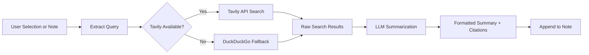

import TLDR from '@site/src/components/TLDR';

# अनुसंधान एवं वेब खोज

<TLDR>
**Notemd वेब की खोज करता है एवं LLM-सारांशित परिणामों को सीधे आपके नोट्स में डाल देता है.** Tavily API मुख्य खोज बैकएंड है; DuckDuckGo शून्य-कॉन्फ़िगरेशन वाला विकल्प के रूप में कार्य करता है. परिणामों को स्रोत संदर्भों के साथ सारांशित किया जाता है एवं `## Research` शीर्षक के नीचे जोड़ा जाता है. यह एकल-नोट अनुसंधान, बैच फ़ोल्डर अनुसंधान, एवं सारांशन चरण के लिए प्रति-कार्य मॉडल चयन का समर्थन करता है.

यह [Obsidian AI Knowledge Management Guide](/docs/pillar-ai-knowledge) का हिस्सा है.
</TLDR>

## अवलोकन

अनुसंधान Notemd के सबसे शक्तिशाली एकीकरणों में से एक है: यह पढ़ने, खोजने एवं लिखने के बीच का चक्र बंद कर देता है. किसी अपरिचित शब्द की जानकारी पाने हेतु ब्राउज़र में जाने के बजाय, आप उसे हाइलाइट करें एवं Notemd को खोज, सारांशन एवं परिणाम जोड़ने का कार्य सौंपें -- यह सब आपके वॉल्ट में ही होता है.

यह प्रक्रिया पूरी तरह से कॉन्फ़िगर की जा सकती है. आप खोज प्रदाता, सारांश लिखने वाला LLM, एवं परिणामों को सक्रिय नोट में जोड़ा जाए या अलग फ़ाइलों में लिखा जाए, यह चुन सकते हैं. बैच मोड आपको एक क्लिक में ही किसी फ़ोल्डर में मौजूद सभी नोट्स का अनुसंधान करने की सुविधा देता है.

## यह कैसे काम करता है

### खोज-फिर-सारांशन पाइपलाइन



1. **क्वेरी निष्कर्षण** -- Notemd आपके चयन या नोट शीर्षक से खोज शब्द निकालता है.
2. **वेब खोज** -- पहले Tavily का उपयोग किया जाता है. यदि कोई API कुंजी कॉन्फ़िगर नहीं की गई है, तो DuckDuckGo स्वचालित रूप से उपयोग में आता है (कोई कुंजी आवश्यक नहीं).
3. **LLM सारांशन** -- कच्चे खोज परिणामों को कॉन्फ़िगर किए गए LLM में भेजा जाता है, जो इनलाइन स्रोत संदर्भों के साथ एक संक्षिप्त सारांश तैयार करता है.
4. **जोड़ना** -- फ़ॉर्मेट किया गया सारांश सक्रिय नोट में `## Research` शीर्षक के नीचे जोड़ दिया जाता है.

### Tavily बनाम DuckDuckGo

| पहलू | Tavily | DuckDuckGo |
|--------|--------|------------|
| API कुंजी | आवश्यक (मुफ्त स्तर उपलब्ध) | आवश्यक नहीं |
| परिणाम की गुणवत्ता | उच्च (एआई के लिए विशेष रूप से बनाया गया) | सामान्य प्रश्नों के लिए पर्याप्त |
| दर सीमाएँ | उदार मुफ्त स्तर | थ्रॉटलिंग के अधीन |
| कॉन्फ़िगरेशन | सेटिंग्स में `tavilyApiKey` | शून्य कॉन्फ़िगरेशन -- स्वचालित फ़ॉलबैक |

### बैच फ़ोल्डर अनुसंधान

एक फ़ोल्डर पर राइट-क्लिक करें और **"Notemd: Research folder"** चुनें। फ़ोल्डर में मौजूद प्रत्येक `.md` फ़ाइल को क्रमशः (या कॉन्फ़िगर की गई समानांतरता तक समानांतर रूप से) संसाधित किया जाता है। प्रत्येक नोट को अपना स्वयं का अनुसंधान सारांश मिलता है.

## कॉन्फ़िगरेशन

| सेटिंग | डिफ़ॉल्ट | प्रभाव |
|---------|---------|--------|
| `tavilyApiKey` | `''` | Tavily API कुंजी। जब यह खाली हो, तो केवल DuckDuckGo ही उपयोग में आता है. |
| `researchProvider` / `researchModel` | DeepSeek | खोज परिणामों को सारांशित करने हेतु प्रति-कार्य LLM |
| `maxResearchContentTokens` | `4000` | LLM में भेजे गए सामग्री के लिए टोकन बजट। अतिरिक्त भाग काट दिया जाता है. |
| `researchAppendToNote` | `true` | स्रोत नोट में सारांश जोड़ें। यदि false हो, तो एक अलग फ़ाइल बनाई जाती है. |
| `researchLanguage` | `'en'` | सारांशित अनुसंधान के लिए आउटपुट भाषा |

### प्रति-कार्य मॉडल सिफ़ारिश

बहुभाषी सामग्री को संभालने वाले एवं अच्छी तरह संरचित गद्य उत्पन्न करने वाले मॉडल से अनुसंधान को लाभ होता है। विचार करें:

- **DeepSeek** -- डिफ़ॉल्ट, किफ़ायती, अच्छी गुणवत्ता
- **GPT-4o** -- बेहतर गुणवत्ता वाला सारांश, अधिक लागत
- **Gemini Flash** -- तेज़ एवं सस्ता, साधारण प्रश्नों के लिए उपयुक्त

## उदाहरण

आप *transformer attention mechanisms* पर एक शोधपत्र पढ़ रहे हैं एवं आपको *relative positional encoding* नामक अपरिचित शब्द मिला है: Obsidian को छोड़ने के बजाय.

1. **"relative positional encoding"** को हाइलाइट करें
2. राइट-क्लिक करें --> **"Notemd: Research and summarize"**
3. Notemd वेब पर खोज करता है, शीर्ष परिणामों का सारांश तैयार करता है एवं निम्नलिखित जोड़ता है:

```markdown
## Research

### Relative Positional Encoding

Relative positional encoding is a method used in transformer models
where positional information is expressed as relative distances between
tokens rather than absolute positions. Introduced by Shaw et al. (2018),
it improves generalization to unseen sequence lengths compared to
absolute encodings (Vaswani et al., 2017).

Sources:
- [Shaw et al., Self-Attention with Relative Position Representations (2018)](https://arxiv.org/abs/1803.02155)
- [Transformer Positional Encoding Overview](https://example.com/transformer-pos-enc)
```

अब यह सारांश आपके वॉल्ट का हिस्सा है, जिसे खोजा जा सकता है, लिंक किया जा सकता है एवं ऑफ़लाइन भी एक्सेस किया जा सकता है.

## सुझाव

- **सर्वोत्तम परिणामों हेतु एक Tavily कुंजी सेट करें** -- मुफ़्त स्तर भी कच्चे DuckDuckGo की तुलना में बेहतर प्रासंगिकता प्रदान करता है.
- **एक सक्षम सारांशन मॉडल का उपयोग करें** -- सस्ते मॉडल बारीक तकनीकी सामग्री को सरल बना सकते हैं.
- **प्रारंभिक पठन के बाद बैच अनुसंधान** करें ताकि एक साथ कई नोट्स में मौजूद खाली जगहें भरी जा सकें.
- **जोड़े गए सारांशों की समीक्षा करें** -- LLM स्रोत विवरणों में गलतियाँ कर सकता है। मुख्य दावों की पुष्टि करें.

---

## अगले चरण

- [Concept Notes](./concept-notes) -- अनुसंधान परिणामों से महत्वपूर्ण शब्दों को निकालकर संग्रहीत करें
- [Wiki-Links](./wiki-links) -- आपके वॉल्ट में अनुसंधान से प्राप्त अवधारणाओं को आपस में जोड़ें
- [Translation](./translation) -- अनुसंधान सारांशों का दूसरी भाषा में अनुवाद करें
- [LLM प्रदाता](/docs/providers/overview) -- सारांशन हेतु उपयोग किए जाने वाले मॉडल को कॉन्फ़िगर करें
