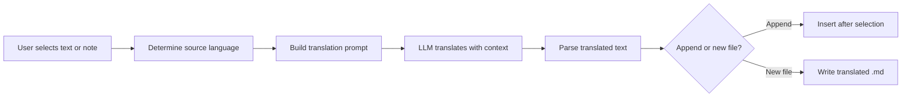

import TLDR from '@site/src/components/TLDR';

# अनुवाद

<TLDR>
**Notemd LLM-संचालित अनुवाद तकनीक का उपयोग करके 21+ भाषाओं के बीच पाठ का अनुवाद करता है।** यह एकल-चयन अनुवाद, पूर्ण-नोट अनुवाद एवं बैच फ़ोल्डर अनुवाद का समर्थन करता है। प्रत्येक अनुवाद कार्य में प्रति-कार्य सेटिंग्स के माध्यम से एक विशेष प्रदाता एवं मॉडल का उपयोग किया जा सकता है। आउटपुट भाषा UI भाषा से स्वतंत्र रूप से कॉन्फ़िगर की जा सकती है। परिणाम आपकी पसंद के अनुसार या तो मूल पाठ के नीचे जोड़े जाते हैं या एक नई फ़ाइल में लिखे जाते हैं.

यह [Obsidian AI Knowledge Management Guide](/docs/pillar-ai-knowledge) का हिस्सा है.
</TLDR>

## अवलोकन

Notemd में अनुवाद कोई शब्दकोश खोज नहीं है -- यह LLM-संचालित, संदर्भ-जागरूक अनुवाद है। मॉडल पूरा पैराग्राफ़ या नोट देखता है, जिससे स्वर, क्षेत्र-विशिष्ट शब्दावली एवं वाक्य-संरचना बरकरार रहती है। इससे वाक्य-दर-वाक्य सेवाओं की तुलना में विशेष रूप से तकनीकी, शैक्षणिक एवं रचनात्मक लेखन हेतु उच्च गुणवत्ता वाले परिणाम प्राप्त होते हैं.

यह सुविधा तीन दायरों का समर्थन करती है: चयन, सक्रिय नोट एवं पूरा फ़ोल्डर। प्रति-कार्य मॉडल चयन के साथ, आप सामान्य अनुवाद हेतु तेज़ मॉडल (Gemini Flash) एवं सूक्ष्मता-संवेदनशील सामग्री हेतु शक्तिशाली मॉडल (Claude Sonnet) का उपयोग कर सकते हैं -- बिना अपने सामान्य प्रदाता को बदले.

## यह कैसे काम करता है

### अनुवाद कमांड



1. **स्रोत पहचान** -- LLM सामग्री से स्रोत भाषा का अनुमान लगाता है। आपको इसे मैन्युअल रूप से निर्दिष्ट करने की आवश्यकता नहीं है.
2. **प्रॉम्प्ट निर्माण** -- Notemd लक्ष्य भाषा, वैकल्पिक क्षेत्र-संकेत एवं अनुवाद करने योग्य सामग्री शामिल करने वाला प्रॉम्प्ट बनाता है.
3. **LLM अनुवाद** -- कॉन्फ़िगर किया गया `translateProvider` / `translateModel` अनुरोध को संसाधित करता है। मॉडल मार्कडाउन फॉर्मेटिंग, विकी-लिंक्स एवं कोड ब्लॉक्स को बरकरार रखता है.
4. **आउटपुट** -- अनुवादित पाठ या तो मूल पाठ के नीचे जोड़ा जाता है या वॉल्ट में एक नई फ़ाइल में लिखा जाता है.

### भाषा जोड़े

Notemd उस LLM द्वारा समर्थित किसी भी भाषा जोड़े का समर्थन करता है। सामान्य जोड़े में शामिल हैं:

| स्रोत | लक्ष्य | सामान्य गुणवत्ता |
|--------|--------|----------------|
| अंग्रेज़ी | चीनी (सरलीकृत) | उत्कृष्ट |
| चीनी | अंग्रेज़ी | उत्कृष्ट |
| अंग्रेज़ी | जापानी | बहुत अच्छा |
| अंग्रेज़ी | जर्मन / फ्रेंच / स्पेनिश | बहुत अच्छा |
| कोई भी समर्थित | कोई भी समर्थित | मॉडल-निर्भर |

The `translateLanguage` setting controls the **output language**. The source language is auto-detected.

### कार्य-वार मॉडल चयन

अनुवाद की गुणवत्ता मॉडल के आधार पर काफी भिन्न होती है. Notemd lets you assign a dedicated model just for translation:

| मॉडल | गति | गुणवत्ता | लागत | सबसे उपयुक्त |
|-------|-------|--------|------|----------|
| `gemini-2.0-flash-exp` | तेज़ | अच्छा | कम | हल्का, उच्च मात्रा में |
| `gpt-4o-mini` | तेज़ | अच्छा | कम | त्वरित खोजें |
| `deepseek-chat` | मध्यम | अच्छा | बहुत कम | बजटीय बहुभाषी |
| `claude-3-5-sonnet` | मध्यम | उत्कृष्ट | मध्यम | तकनीकी / शैक्षणिक |
| `gpt-4o` | मध्यम | उत्कृष्ट | मध्यम | सूक्ष्म भेदों के प्रति संवेदनशील गद्य |

### बैच फ़ोल्डर अनुवाद

किसी फ़ोल्डर पर राइट-क्लिक करें और **"Notemd: Translate folder"** चुनें ताकि उस फ़ोल्डर में मौजूद हर नोट का अनुवाद हो सके। प्रत्येक फ़ाइल को स्वतंत्र रूप से संसाधित किया जाता है। समानांतरता सेटिंग यह निर्धारित करती है कि कितनी फ़ाइलें एक साथ अनुवाद होंगी.

## कॉन्फ़िगरेशन

| सेटिंग | डिफ़ॉल्ट | प्रभाव |
|---------|---------|--------|
| `translateProvider` / `translateModel` | DeepSeek | अनुवाद कार्यों के लिए समर्पित प्रदाता |
| `translateLanguage` | `'en'` | लक्ष्य आउटपुट भाषा |
| `translationAppendToNote` | `true` | मूल पाठ के नीचे अनुवादित पाठ जोड़ें। यदि false हो, तो एक नई फ़ाइल बनाई जाती है. |
| `batchConcurrency` | `3` | बैच अनुवाद के दौरान एक साथ संसाधित होने वाली फ़ाइलों की संख्या |

## उदाहरण

आप एक चीनी भाषा का शोध नोट पढ़ रहे हैं और उसका अंग्रेज़ी संस्करण चाहते हैं:

1. नोट खोलें
2. राइट-क्लिक --> **"Notemd: Translate current file"**
3. Notemd चीनी भाषा का पता लगाता है, आपके कॉन्फ़िगर किए गए लक्ष्य भाषा (अंग्रेज़ी) में अनुवाद करता है, और नीचे जोड़ता है:

```markdown
## Translation (English)

The experimental results show that the proposed method achieves
a 12% improvement in F1 score compared to the baseline, primarily
due to the enhanced feature extraction module described in Section 3.
```

मूल चीनी पाठ अनुवाद के ऊपर बिना बदले रहता है। `## Translation` शीर्षक दोनों संस्करणों को एक ही फ़ाइल में रखता है ताकि आसानी से संदर्भ लिया जा सके.

## सुझाव

- **बड़े फ़ोल्डरों के बैच अनुवाद के लिए Gemini Flash का उपयोग करें** -- यह बड़े फ़ोल्डरों के अनुवाद हेतु सबसे तेज़ और सस्ता विकल्प है.
- **विकि-लिंकों को संरक्षित रखें** -- Notemd का निर्देश LLM को अनुवाद में `[[wiki-links]]` को बिल्कुल वैसा ही रखने के लिए कहता है. अनुवाद के बाद जाँच करें, क्योंकि कुछ मॉडल कभी-कभी उन्हें अनस्वैप कर देते हैं.
- **आउटपुट भाषा को स्पष्ट रूप से सेट करें** -- स्रोत के लिए स्वचालित पहचान काम करती है, लेकिन लक्ष्य के बारे में कोई द्विअर्थता न हो इसलिए हमेशा `translateLanguage` को कॉन्फ़िगर करें.
- **कॉन्सेप्ट नोट्स का बैच-अनुवाद करें** -- यदि आपकी कॉन्सेप्ट फ़ोल्डर एक भाषा में है और आपको उसे दूसरी भाषा में चाहिए, तो फ़ोल्डर-स्तरीय अनुवाद इसे एक ही चरण में संभाल लेता है.

---

## अगले चरण

- [Research](./research) -- किसी भी भाषा में खोज करें और सारांश तैयार करें, फिर परिणामों का अनुवाद करें
- [Workflows](./workflows) -- विकि-लिंकिंग या कॉन्सेप्ट निष्कर्षण के साथ अनुवाद को श्रृंखलाबद्ध करें
- [Batch Processing](/docs/advanced/batch-processing) -- फ़ोल्डर संचालन के लिए समवर्तीता और ओवरराइट व्यवहार
- [LLM Providers](/docs/providers/overview) -- अपनी भाषा-जोड़ी के लिए सबसे अच्छा मॉडल चुनें
