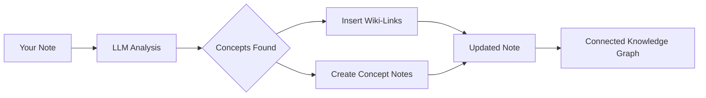

import TLDR from '@site/src/components/TLDR';

# विकि-लिंक्स

<TLDR>
**Notemd स्वचालित रूप से आपके नोट्स में मुख्य अवधारणाओं के पास `[[wiki-links]]` जोड़ देता है।** LLM आपकी सामग्री को पढ़ता है, संदर्भ में महत्वपूर्ण शब्दों की पहचान करता है, और प्रत्येक उपस्थिति पर Obsidian-शैली के विकि-लिंक डालता है। वैकल्पिक रूप से बैकलिंक्स के साथ कॉन्सेप्ट नोट फ़ाइलें भी बनाता है। यह समानार्थी शब्दों को दबाने, पुनःनामकरण/हटाने पर लिंकों की अखंडता बनाए रखने, और शुद्ध निष्कर्षण मोड (फ़ाइल में कोई परिवर्तन नहीं) का समर्थन करता है। Auto Link के विपरीत जो केवल मौजूदा नोट शीर्षकों के साथ मेल खाता है, Notemd AI का उपयोग करके नई अवधारणाओं की पहचान करता है और संबंधित नोट्स बनाता है। यह [Obsidian AI ज्ञान प्रबंधन मार्गदर्शिका](/docs/pillar-ai-knowledge) का हिस्सा है।
</TLDR>

## अवलोकन

विकि-लिंकिंग Notemd की मुख्य सुविधा है। यह साधारण पाठ को एक जुड़े हुए ज्ञान ग्राफ़ में बदलती है निम्नलिखित तरीकों से:

1. **LLM के साथ आपके नोट का विश्लेषण** करना
2. **मुख्य अवधारणाओं** (शब्द, व्यक्ति, विधियाँ, सिद्धांत) की पहचान करना
3. **प्रत्येक उपस्थिति पर `[[wiki-links]]` डालना**
4. **बैकलिंक्स के साथ कॉन्सेप्ट नोट्स** (वैकल्पिक) बनाना

## यह कैसे काम करता है

### प्रक्रिया



### उदाहरण

**पहले:**
```markdown
Machine learning models use neural networks to learn patterns from data.
The transformer architecture revolutionized natural language processing.
```

**बाद में:**
```markdown
[[Machine learning]] models use [[neural networks]] to learn patterns from data.
The [[transformer architecture]] revolutionized [[natural language processing]].
```

## उपयोग

### बुनियादी: वर्तमान नोट में लिंक जोड़ना

1. एक नोट खोलें
2. एडिटर में राइट-क्लिक करें → **"फ़ाइल प्रोसेस करें (लिंक जोड़ें)"**
3. कुछ सेकंड इंतज़ार करें
4. अब अवधारणाएँ लिंक्ड हो गई हैं!

### बैच: कई नोट्स प्रोसेस करें

1. फ़ाइल एक्सप्लोरर में एक फ़ोल्डर पर राइट-क्लिक करें
2. **"Notemd: Process folder (add links)"** का चयन करें
3. कॉन्फ़िगर करें:
   - समवर्तीता (समानांतर में कितनी फ़ाइलें)
   - मौजूदा लिंकों को ओवरराइट करें (हाँ/नहीं)
4. **प्रोसेस** पर क्लिक करें

### चयनात्मक: विशिष्ट टेक्स्ट को लिंक करें

1. प्रोसेस करने हेतु टेक्स्ट को हाइलाइट करें
2. राइट-क्लिक → **"प्रोसेस सिलेक्शन (लिंक जोड़ें)"**
3. केवल हाइलाइट किया गया हिस्सा ही विश्लेषित किया जाता है

## Notemd बनाम ऑटो लिंक

Obsidian में स्वचालित विकि-लिंकिंग हेतु दो तरीके हैं:

| | **ऑटो लिंक** | **Notemd** |
|--|---------------|-------------|
| लिंक स्रोत | वॉल्ट में मौजूदा नोट शीर्षक | कंटेंट में LLM द्वारा पहचाने गए अवधारणाएँ |
| नए अवधारणाओं को लिंक कर सकते हैं | नहीं — शीर्षक पहले से मौजूद होना चाहिए | हाँ — AI अवधारणाओं की पहचान करता है और नोट्स बनाता है |
| समानार्थी शब्दों का प्रबंधन | नहीं | हाँ — समानार्थी शब्दों को दबाया जाता है |
| अवधारणा नोट बनाना | नहीं | हाँ — बैकलिंक्स और डुप्लीकेशन हटाकर |
| बैच प्रोसेसिंग | नहीं (एकल फ़ाइल) | हाँ (फ़ोल्डर-स्तर पर) |
| प्रति-कार्य मॉडल रूटिंग | नहीं | हाँ |

**Auto Link** शीर्षक-मेल करने वाला है: यदि "Machine Learning" नामक नोट मौजूद है, तो यह `[[Machine Learning]]` में उसकी घटनाओं को लपेट देता है। यदि नोट मौजूद नहीं है, तो कुछ नहीं होता।

**Notemd** AI-चालित है: LLM आपकी सामग्री पढ़ता है, संदर्भ को समझता है, ऐसी अवधारणाओं की पहचान करता है जिन्हें *लिंक* किया जाना चाहिए — भले ही अभी तक कोई नोट मौजूद न हो — और लिंक तथा अवधारणा नोट दोनों बनाता है.

## विशेषताएँ

### समानार्थी शब्दों को दबाना

**समस्या:** "transformer", "transformers", "Transformer architecture" → 3 अलग-अलग अवधारणाएँ

**समाधान:** Notemd लगभग समान डुप्लीकेट्स का पता लेता है और मानक रूप का उपयोग करता है.

**कॉन्फ़िगरेशन:**
```
Settings → Advanced → Synonym Suppression
Threshold: 0.8 (0 = off, 1 = aggressive)
```

### लिंक इंटीग्रिटी

**जब आप किसी कॉन्सेप्ट नोट का नाम बदलते हैं:**
- सभी विकि-लिंक स्वचालित रूप से अपडेट हो जाते हैं (Obsidian मुख्य सुविधा)
- बैकलिंक अपरिवर्तित रहते हैं

**जब आप किसी कॉन्सेप्ट नोट को हटाते हैं:**
- लिंक तो रह जाते हैं लेकिन वे "अनलिंक्ड मेंशन्स" के रूप में दिखाई देते हैं
- आप किसी भी उदाहरण से इसे पुनः बना सकते हैं

### प्योर एक्सट्रैक्शन मोड

**मूल को बदले बिना कॉन्सेप्ट निकालें:**

1. राइट-क्लिक → **"कॉन्सेप्ट निकालें (लिंकिंग बिना)"**
2. कॉन्सेप्ट नोट बन जाते हैं
3. मूल फ़ाइल अपरिवर्तित रहती है

उपयोग का मामला: केवल पढ़ने योग्य सामग्री या अंतिम मसौदों को संसाधित करना.

## कॉन्सेप्ट नोट जनरेशन

### स्वचालित रचना

**जब सक्षम हो (डिफ़ॉल्ट), Notemd निम्नलिखित बनाता है:**

```markdown
---
tags: [concept, auto-generated]
created: 2026-06-13
source: [[Original Note Name]]
---

# Machine Learning

A branch of artificial intelligence that enables computers
to learn from data without explicit programming.

## Occurrences in Your Vault

- [[Original Note Name#Section]]
- [[Another Note#Header]]

## Related Concepts

- [[Neural Networks]]
- [[Deep Learning]]
- [[Supervised Learning]]
```

### कॉन्फ़िगरेशन

**आउटपुट फ़ोल्डर:**
```
Settings → Output → Concept Folder
Default: concepts/
```

**हायरार्किकल संरचना:**
```
Settings → Output → Use Hierarchical Folders
If enabled:
  papers/my-paper.md → papers/concepts/Concept.md
If disabled:
  → concepts/Concept.md
```

**टेम्पलेट:**
```
Settings → Output → Concept Template
Customize with variables:
  {{concept}} — Concept name
  {{description}} — LLM-generated description
  {{backlinks}} — List of source notes
  {{date}} — Creation date
```

## उन्नत विकल्प

### कॉन्टेक्स्ट विंडो

**कितना आसपास का टेक्स्ट भेजना है:**

```
Settings → Linking → Context Window
Options: Sentence | Paragraph | Full Note
Default: Paragraph
```

अधिक = बेहतर सटीकता, उच्च लागत.

### न्यूनतम घटनाएँ

**केवल वे ही लिंक कॉन्सेप्ट जो कई बार दिखाई देते हैं:**

```
Settings → Linking → Min Occurrences
Default: 1 (link all)
```

पुनरावर्ती थीमों पर ध्यान केंद्रित करने हेतु 2 या 3 पर सेट करें.

### पैटर्न बाहर करें

**कुछ शब्दों को छोड़ें:**

```
Settings → Linking → Exclude List
Example: note, idea, example, thing
```

सामान्य शब्दों के अतिरिक्त लिंक होने से रोकता है.

### कस्टम प्रॉम्प्ट्स

**डिफ़ॉल्ट LLM निर्देशों को ओवरराइड करें:**

```
Settings → Advanced → Custom Linking Prompt
Default:
  "Identify key concepts, theories, methods, and technical
   terms in the following text. Return as a list..."
```

डोमेन-विशिष्ट आवश्यकताओं हेतु संशोधित करें (उदाहरण के लिए, "चिकित्सा शब्दावली पर ध्यान केंद्रित करें").

## सुझाव एवं सर्वोत्तम प्रथाएँ

### ✅ करें

- **100 शब्दों से अधिक वाले नोट्स को संसाधित करें** — छोटे नोट्स से कम अवधारणाएँ प्राप्त होती हैं
- **बेहतर अवधारणा पहचान हेतु शक्तिशाली मॉडलों का उपयोग करें** (GPT-4o, Claude)
- **स्वीकार करने से पहले समीक्षा करें** — जाँचें कि सुझाए गए लिंक उचित हैं
- **चरणबद्ध रूप से निर्माण करें** — 5-10 नोट्स को संसाधित करें, ग्राफ की समीक्षा करें, सेटिंग्स में संशोधन करें

### ❌ न करें

- **अत्यधिक लिंकिंग** — हर संज्ञा के लिए लिंक आवश्यक नहीं है
- **मसौदों को बार‑बार संसाधित न करें** — अवधारणाएँ बदल सकती हैं, स्थिर होने तक प्रतीक्षा करें
- **पर्यायवाची शब्दों को नजरअंदाज न करें** — "ML" एवं "Machine Learning" जैसे शब्दों से बचने हेतु दमन सक्षम करें

## प्रदर्शन

### गति

| नोट का आकार | GPT-4o-mini | Claude Sonnet | Ollama (स्थानीय) |
|-----------|-------------|---------------|----------------|
| 500 शब्द | 2-3 सेकंड | 3-5 सेकंड | 5-10 सेकंड |
| 2000 शब्द | 5-8 सेकंड | 10-15 सेकंड | 20-40 सेकंड |
| 5000+ शब्द | चंक्ड (कई कॉल) | चंक्ड | चंक्ड |

### लागत अनुमानन

**उदाहरण: GPT-4o-mini के साथ 1000-शब्दों वाला नोट**
- इनपुट: ~1500 टोकन्स
- आउटपुट: ~200 टोकन्स
- लागत: ~

**100 नोट्स का बैच प्रोसेसिंग:** लगभग $0.10

## समस्या निवारण

### कोई लिंक जोड़े नहीं गए।

**जाँच करें:**
1. LLM कॉल सफल रहा (Settings → Diagnostics)
2. नोट में पर्याप्त सामग्री है (>50 शब्द)
3. अवधारणाएँ तकनीकी/विशिष्ट होती हैं (केवल सर्वनाम नहीं)

**आजमाएँ:**
- एक अधिक शक्तिशाली मॉडल का उपयोग करें
- कॉन्टेक्स्ट विंडो को बढ़ाएं
- API कुंजी की वैधता जाँचें

### बहुत सारे लिंक हैं

**समाधान:**
1. न्यूनतम घटनाओं की संख्या बढ़ाएं (2 या 3)
2. बाहर करने वाली सूची में सामान्य शब्द जोड़ें
3. एक कम आक्रामक मॉडल का उपयोग करें

### गलत अवधारणाएँ जुड़ी हुई हैं

**सुधार:**
1. डोमेन विशिष्टता के लिए कस्टम प्रॉम्प्ट का उपयोग करें
2. समानार्थी शब्दों को दबाने की सुविधा सक्षम करें
3. मैन्युअल रूप से समीक्षा करें एवं लिंक हटाएं

### नाम बदलने के बाद लिंक टूट जाते हैं

**यह Obsidian व्यवहार सामान्य है.**

सभी लिंक अपडेट करने हेतु:
1. कॉन्सेप्ट नोट का नाम बदलें
2. Obsidian स्वचालित रूप से `[[old]]` को `[[new]]` में अपडेट कर देगा

---

## अगले चरण

- 📖 [कॉन्सेप्ट नोट्स](./concept-notes) — कॉन्सेप्ट नोट बनाने की गहन जानकारी
- 🔍 [रिसर्च एकीकरण](./research) — लिंकिंग को वेब रिसर्च के साथ जोड़ें
- 🎨 [डायग्राम](./diagrams) — अपने नॉलेज ग्राफ को दृश्यमान बनाएं
