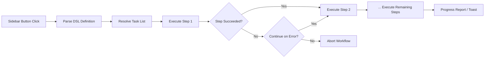

import TLDR from '@site/src/components/TLDR';

# कार्यप्रवाह

<TLDR>
**Notemd कार्यप्रवाह कई कार्यों को एक ही एक-क्लिक क्रिया में श्रृंखलाबद्ध करते हैं.** `add-links > extract-concepts > research > diagram` के समान अनुक्रमों को एक सरल DSL का उपयोग करके परिभाषित किया जाता है. कार्यप्रवाह बार-बटनों के रूप में दिखाई देते हैं जो वर्तमान नोट या फ़ोल्डर पर पूरी श्रृंखला को चलाते हैं. पहले से परिभाषित कार्यप्रवाह शामिल होते हैं; सेटिंग्स में अपने स्वयं के कार्यप्रवाह बनाए जा सकते हैं. प्रत्येक चरण अपनी स्वयं की प्रति-कार्य मॉडल कॉन्फ़िगरेशन का उपयोग करता है.

यह [Obsidian AI Knowledge Management Guide](/docs/pillar-ai-knowledge) का हिस्सा है.
</TLDR>

## अवलोकन

एक कार्यप्रवाह कार्यों को एक-एक करके चलाने से होने वाली परेशानियों को दूर करता है. लिंक जोड़ने, अवधारणाओं को निकालने, अपरिचित शब्दों का अनुसंधान करने और एक आरेख बनाने हेतु चार बार राइट-क्लिक करने के बजाय, आप एक बार बार-बटन दबाते हैं और पूरी श्रृंखला चल जाती है. Notemd अनुक्रमण, त्रुटि प्रसारण और प्रगति रिपोर्टिंग को संभालता है.

कार्यप्रवाह एक हल्के DSL (डोमेन-विशिष्ट भाषा) में परिभाषित किए जाते हैं. वे सेटिंग्स में स्थित होते हैं, Obsidian बार में क्लिक करने योग्य बटनों के रूप में दिखाई देते हैं, और वर्तमान नोट या पूरे फ़ोल्डर पर लागू किए जा सकते हैं.

## यह कैसे काम करता है

### कार्यप्रवाह निष्पादन पाइपलाइन



1. **पार्स** -- DSL स्ट्रिंग को `>` (या `>`) पर विभाजित करके कार्य पहचानकर्ताओं की एक क्रमबद्ध सूची बनाई जाती है.
2. **रिज़ॉल्व** -- प्रत्येक पहचानकर्ता एक आंतरिक कमांड (add-links, extract-concepts, research, translate, diagram आदि) से मेल खाता है.
3. **निष्पादित करें** -- चरण क्रमशः चलते हैं. प्रत्येक चरण अपने कॉन्फ़िगर किए गए प्रति-कार्य प्रदाता और मॉडल का उपयोग करता है.
4. **त्रुटि प्रबंधन** -- यदि कोई चरण विफल हो जाता है, तो कार्यप्रवाह या तो रुक जाता है या आपकी त्रुटि नीति के अनुसार अगले चरण पर जारी रहता है.
5. **समाप्त** -- एक टोस्ट सूचना सफलता की रिपोर्ट करती है या किसी भी विफल चरणों की सूची देती है.

### DSL प्रारूप

कार्यप्रवाह `>` से अलग किए गए कार्य पहचानकर्ताओं के अनुक्रम के रूप में परिभाषित किए जाते हैं:

```
process-current-add-links>extract-concepts-current>research-and-summarize
```

**उपलब्ध कार्य पहचानकर्ता:**

| पहचानकर्ता | क्रिया |
|------------|--------|
| `process-current-add-links` | सक्रिय नोट में विकि-लिंक जोड़ें |
| `extract-concepts-current` | सक्रिय नोट से अवधारणाएँ निकालें |
| `research-and-summarize` | चुने गए पाठ या नोट शीर्षक का अनुसंधान करें |
| `process-current-translate` | सक्रिय नोट का अनुवाद करें |
| `summarize-to-mermaid` | सक्रिय नोट से एक आरेख बनाएँ |
| `generate-from-title` | नोट शीर्षक से सामग्री उत्पन्न करें |
| `extract-original-text` | मूल पाठ निकालें (OCR/स्कैन की गई सामग्री के लिए) |

**फ़ोल्डर-स्तरीय विकल्प** – पहचानकर्ता नाम में `current` को `folder` से बदलें.

### पूर्वनिर्धारित बनाम कस्टम वर्कफ़्लो

Notemd में सामान्य पैटर्नों के लिए पहले से तैयार वर्कफ़्लो शामिल हैं:

| वर्कफ़्लो | चेन | उपयोग का मामला |
|----------|-------|----------|
| **वन-क्लिक एक्सट्रैक्ट** | add-links > extract-concepts > research | एक ही चरण में एक शोध पत्र संसाधित करें |
| **पूर्ण पाइपलाइन** | add-links > extract-concepts > research > diagram | प्रदर्शन के साथ पूर्ण ज्ञान निष्कर्षण |
| **अनुवाद + लिंक** | translate > add-links | लक्ष्य भाषा में अनुवाद करके फिर अवधारणाओं को लिंक करें |

**कस्टम वर्कफ्लो** सेटिंग्स में बनाए जाते हैं:

1. **Settings** खोलें --> **Notemd** --> **Workflows**
2. **"Add Workflow"** पर क्लिक करें
3. DSL श्रृंखला दर्ज करें (उदाहरण के लिए, `process-current-add-links>extract-concepts-current`)
4. इसे एक प्रदर्शन नाम दें (उदाहरण के लिए, "Quick Link + Extract")
5. नया बटन तुरंत साइडबार में दिखाई देगा

## कॉन्फ़िगरेशन

| सेटिंग | डिफ़ॉल्ट | प्रभाव |
|---------|---------|--------|
| `workflows` | पूर्वनिर्धारित सेट | वर्कफ्लो परिभाषाओं की सरणी (नाम + DSL) |
| `workflowContinueOnError` | `true` | यदि वर्तमान चरण विफल हो जाए तो अगले चरण पर जाएँ |
| `workflowShowProgress` | `true` | प्रत्येक चरण पूरा होने के बाद एक प्रगति टोस्ट दिखाएँ |

### वर्कफ्लो में प्रति-टास्क मॉडल

वर्कफ्लो में प्रत्येक चरण अपनी **स्वयं की** प्रति-कार्य मॉडल कॉन्फ़िगरेशन का उपयोग करता है. आपको DSL में सीधे मॉडल निर्दिष्ट करने की आवश्यकता नहीं है. रिज़ॉल्यूशन क्रम इस प्रकार है:

1. यदि `useMultiModelSettings` उपलब्ध हो तो प्रति-कार्य प्रदाता/मॉडल
2. अन्यथा ग्लोबल `activeProvider`

इसका अर्थ है कि `add-links` DeepSeek पर चल सकता है जबकि `research` GPT-4o पर चलता है -- यह सब एक ही वर्कफ्लो क्लिक के भीतर होता है.

## उदाहरण

आपने अपने वॉल्ट में किसी मशीन लर्निंग पेपर का PDF आयात किया है और पूर्ण ज्ञान निष्कर्षण चाहते हैं:

1. आयात की गई नोट खोलें
2. **"पूर्ण पाइपलाइन"** साइडबार बटन पर क्लिक करें
3. Notemd निम्नलिखित कार्य करता है:
   - **चरण 1**: विकि-लिंक जोड़ें -- `[[attention mechanism]]`, `[[transformer]]`, आदि.
   - **चरण 2**: अवधारणाओं को निष्कर्षित करें -- आपके कॉन्सेप्ट फ़ोल्डर में कॉन्सेप्ट नोट बनाएं
   - **चरण 3**: अनुसंधान -- मुख्य शब्दों के लिए वेब स्रोतों का सारांश तैयार करें
   - **चरण 4**: आरेख -- पेपर की संरचना का Mermaid माइंडमैप बनाएं
4. लगभग 30 सेकंड बाद, आपकी नोट में लिंक हो जाते हैं, कॉन्सेप्ट नोट मौजूद होते हैं, अनुसंधान जुड़ जाता है, और एक आरेख फ़ाइल सहेजी जाती है

यह सब एक ही क्लिक से हो जाता है.

## सुझाव

- **पहले पूर्वनिर्धारित वर्कफ्लो से शुरू करें** -- ये सबसे सामान्य पैटर्नों को कवर करते हैं. केवल तभी कस्टमाइज़ करें जब आपको अलग क्रम की आवश्यकता हो.
- **`workflowContinueOnError` को सक्षम करें** -- यदि कोई आरेख चरण विफल हो जाए तो पूरी पाइपलाइन रुकनी नहीं चाहिए.
- **बल्क प्रोसेसिंग के लिए फ़ोल्डर वर्कफ़्लो का उपयोग करें** -- किसी फ़ोल्डर पर राइट-क्लिक करें, एक वर्कफ़्लो चुनें, और हर नोट को संसाधित किया जाएगा.
- **वर्कफ़्लो के नाम स्पष्ट रखें** -- साइडबार की जगह सीमित है. "Quick Extract" या "Translate + Link" जैसे छोटे, क्रिया-उन्मुख नामों का उपयोग करें.

---

## अगले चरण

- [Research](./research) -- वर्कफ़्लो में इसे जोड़ने से पहले यह समझें कि रिसर्च चरण क्या करता है
- [Wiki-Links](./wiki-links) -- अधिकांश वर्कफ़्लो में उपयोग होने वाली मुख्य लिंकिंग सुविधा
- [Concept Notes](./concept-notes) -- वर्कफ़्लो चरण के रूप में कॉन्सेप्ट निष्कर्षण
- [Batch Processing](/docs/advanced/batch-processing) -- फ़ोल्डर वर्कफ़्लो के लिए समानांतरता एवं प्रगति रिपोर्टिंग
