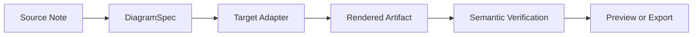
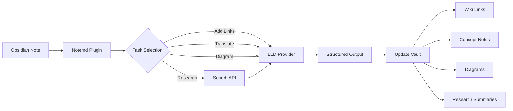

import TLDR from '@site/src/components/TLDR';

# Notemd का परिचय

<TLDR>
**Notemd** (नोट + EMD — एन्हांस्ड मार्कडाउन दस्तावेज़) एक ओपन-सोर्स Obsidian प्लगइन है जो LLM-संचालित पठन को स्थायी ज्ञान में बदल देता है। चैट-आधारित AI के विपरीत जहाँ सत्र के बाद अंतर्दृष्टियाँ गायब हो जाती हैं, Notemd परिणामों को **सीधे आपके वॉल्ट में** विकि-लिंक, अवधारणा नोट्स, अनुसंधान सारांश, अनुवाद, कार्यप्रवाह एवं आरेखों के रूप में लिखता है। यह उन शोधकर्ताओं, छात्रों एवं ज्ञान कार्यकर्ताओं के लिए बनाया गया है जो पठन, अनुसंधान एवं दृश्य स्पष्टीकरणों को एक संरचित, विकसित होते ज्ञान ग्राफ में एकत्र करना चाहते हैं.
</TLDR>

## Notemd क्या है?

Notemd आपके Obsidian कार्यप्रवाह में **30+ बड़े भाषा मॉडल** (OpenAI, Anthropic, Google, DeepSeek, Qwen, Ollama एवं अन्य) को एकीकृत करता है ताकि ज्ञान निष्कर्षण, संगठन, अनुवाद, अनुसंधान एवं आरेख निर्माण स्वचालित हो सके.

### मुख्य अंतर: क्षणिक बनाम स्थायी ज्ञान

| पहलू | चैट-आधारित AI (ChatGPT, आदि) | Notemd |
|--------|-------------------------------|--------|
| **परिणाम कहाँ जाते हैं** | चैट इतिहास (गायब हो जाता है) | आपका Obsidian वॉल्ट (स्थायी रहता है) |
| **प्रारूप** | सादा पाठ उत्तर | संरचित फ़ाइलें: `[[wiki-links]]`, अवधारणा नोट्स, आरेख |
| **दीर्घकालिक मूल्य** | हर बार पुनः पूछना पड़ता है | ज्ञान ग्राफ में एकत्र हो जाता है |
| **ऑफलाइन पहुँच** | इंटरनेट की आवश्यकता है | Ollama के साथ पूरी तरह ऑफलाइन काम करता है |

## मुख्य क्षमताएँ

### 1. **स्वचालित विकि-लिंकिंग**
- LLM आपके नोट्स में महत्वपूर्ण अवधारणाओं की पहचान करता है
- प्रत्येक उपस्थिति पर `[[wiki-links]]` डालता है
- वैकल्पिक रूप से लिंक्ड कॉन्सेप्ट नोट्स बनाता है
- डुप्लिकेट से बचने हेतु समानार्थी शब्दों को दबा देता है

### 2. **कॉन्सेप्ट नोट जनरेशन**
- पेपर, लेखों, नोट्स से मूलभूत अवधारणाओं को निकालता है
- बैकलिंक्स के साथ समर्पित कॉन्सेप्ट फ़ाइलें बनाता है
- आउटपुट पथ एवं टेम्पलेट संशोधित किए जा सकते हैं

### 3. **वेब रिसर्च एकीकरण**
- Obsidian के भीतर से Tavily या DuckDuckGo की खोज करें
- LLM स्रोत संदर्भों के साथ परिणामों का सारांश देता है
- वर्तमान नोट में अनुसंधान परिणाम जोड़ता है

### 4. **बहुभाषी अनुवाद**
- चयनित भागों या पूरे नोट्स का अनुवाद करें
- 21+ UI भाषाओं का समर्थन करता है
- स्वतंत्र आउटपुट भाषा कॉन्फ़िगरेशन
- बैच अनुवाद समर्थन

### 5. **डायग्राम निर्माण**
- **Mermaid**: फ्लोचार्ट, अनुक्रम, क्लास, स्टेट, ER, Gantt
- **JSON Canvas**: Obsidian स्थानीय लेआउट
- **Vega-Lite**: डेटा चार्ट, टाइम सीरीज़, स्कैटर प्लॉट
- **HTML / संपादनीय HTML/SVG**: सेमेंटिक एनोटेशन के साथ स्व-सम्पूर्ण आर्टिफैक्ट्स
- **Draw.io / Drawnix आर्टिफैक्ट सीमाएँ**: उसी सेमेंटिक फिगर मॉडल से मेन्टेनर के लिए निर्यात पथ
- **सर्किट डायग्राम रोडमैप**: circuitikz/TikZJax समर्थन को सीधे अनसंयमित LLM TikZ के बजाय गोल्डन रेफरेंस, प्रतिबंधित प्रॉम्प्ट, रेंडर फीडबैक एवं टोपोलॉजी/लेआउट सत्यापन के आधार पर डिज़ाइन किया जा रहा है
- **प्रीव्यू डायग्नोस्टिक्स**: रेंडर आर्टिफैक्ट्स से कंपाइल/रेंडर स्मोक डायग्नोस्टिक्स प्राप्त हो सकती हैं, एवं नॉन-इनलाइन स्रोतों की जाँच प्लगइन-साइड LaTeX रनटाइम के बिना की जा सकती है
- Mermaid त्रुटियों के लिए सिंटैक्स ऑटो-फिक्स

### 6. **वन-क्लिक वर्कफ्लो**
- साइडबार बटनों में कई क्रियाओं को श्रृंखलाबद्ध करें
- DSL-आधारित वर्कफ्लो परिभाषा
- उदाहरण: `add-links > extract-concepts > research > diagram`

## Notemd का उपयोग कौन करना चाहिए?

✅ **शोधकर्ता** जो पेपर पढ़ते हैं और साहित्य समीक्षाएँ बनाते हैं
✅ **छात्र** जो अध्ययन नोट्स व्यवस्थित करते हैं और अवधारणा मानचित्र बनाते हैं
✅ **ज्ञान कार्यकर्ता** जो पठन संबंधी अंतर्दृष्टियों को स्थायी रखना चाहते हैं
✅ **द्विभाषी पेशेवर** जिन्हें अनुवाद + विकि-लिंकिंग की आवश्यकता है
✅ **गोपनीयता-संवेदनशील उपयोगकर्ता** जो स्थानीय LLM सहायता (Ollama) चाहते हैं
✅ **पावर उपयोगकर्ता** जो प्रॉम्प्ट और वर्कफ्लो को कस्टमाइज़ करते हैं

## Notemd + Obsidian क्यों?

**Obsidian** एक स्थानीय-प्रथम, मार्कडाउन-आधारित ज्ञान आधार है. **Notemd** एआई की शक्तियाँ जोड़ता है:
- आपका डेटा आपके वॉल्ट में ही रहता है (किसी क्लाउड सेवा में नहीं)
- स्थानीय मॉडलों के साथ ऑफलाइन काम करता है
- मुफ्त और ओपन सोर्स (MIT लाइसेंस)
- मौजूदा Obsidian प्लगइन्स के साथ एकीकृत होता है
- हजारों नोट्स तक स्केल करता है

## प्रारंभ करें

1. **इंस्टॉल करें**: सेटिंग्स → कम्युनिटी प्लगइन्स → ब्राउज़ → "Notemd"
2. **कॉन्फ़िगर करें**: अपने LLM प्रोवाइडर API कुंजी को जोड़ें (या स्थानीय Ollama का उपयोग करें)
3. **आजमाएं**: एक नोट खोलें → राइट-क्लिक करें → "फ़ाइल प्रोसेस करें (लिंक जोड़ें)"
4. **अन्वेषण करें**: वन-क्लिक वर्कफ़्लो के लिए साइडबार देखें

👉 [इंस्टॉलेशन गाइड](./getting-started/installation) | [क्विक स्टार्ट ट्यूटोरियल](./getting-started/quick-start)

## डायग्राम क्षमता की दिशा

Notemd का डायग्राम कार्य "मॉडल से एक सिंटैक्स स्ट्रिंग लिखवाने" की दिशा से हटकर एक स्तरीय पाइपलाइन की ओर बढ़ रहा है:

वर्तमान कार्यान्वयन पहले से ही Mermaid, JSON Canvas, Vega-Lite, HTML फॉलबैक, संपादनीय HTML/SVG, Draw.io XML आर्टिफ़ैक्ट्स, न्यूनतम Drawnix JSON सबसेट, प्रीव्यू डायग्नोस्टिक्स/सोर्स-ओनली फॉलबैक, तथा कॉमन-सोर्स एवं CMOS इन्वर्टर गोल्डन टेम्पलेट्स के लिए ऑफ़लाइन `CircuitSpec -> circuitikz` प्रोटोटाइप का समर्थन करता है। सर्किट डायग्राम एक कठिन श्रेणी है: circuitikz सटीक विद्युत टोपोलॉजी को व्यक्त कर सकता है, लेकिन बिना प्रतिबंध के LLM आउटपुट अक्सर अपठनीय राउटिंग या रेंडर न होने वाला LaTeX पैदा करता है। अगली दिशा circuitikz को गोल्डन-रेफरेंस टेम्पलेट्स, नोड-ग्रिड लेआउट नियमों, रेंडर डायग्नोस्टिक्स, एवं स्क्रीनशॉट फीडबैक लूप्स के साथ प्रतिबंधित रखना है.

[डायग्राम्स](./features/diagrams) में विवरण पढ़ें.

## आर्किटेक्चर

## Notemd बनाम अन्य Obsidian AI प्लगइन्स

अधिकांश Obsidian AI प्लगइन्स संवाद-प्रथम होते हैं (आप पूछते हैं, AI जवाब देता है, अंतर्दृष्टियाँ चैट में ही रहती हैं)। Notemd **लिखने-प्रथम** है: AI आपके नोट्स को संसाधित करके सीधे आपके वॉल्ट में संरचित परिणाम लिख देता है.

| क्षमता | Notemd | Copilot | Smart Connections | Text Generator |
|-----------|--------|---------|-------------------|-----------------|
| ऑटो विकि-लिंक सम्मिलन | हाँ | नहीं | नहीं | नहीं |
| कॉन्सेप्ट नोट जनरेशन | हाँ (बैकलिंक्स + डुप्लिकेट हटाने के साथ) | नहीं | नहीं | नहीं |
| डायग्राम जनरेशन | हाँ (Mermaid, Canvas, Vega-Lite, HTML, संपादनीय आर्टिफैक्ट्स) | नहीं | नहीं | नहीं |
| वेब रिसर्च एकीकरण | हाँ (Tavily + DuckDuckGo) | नहीं | नहीं | नहीं |
| बैच फोल्डर प्रोसेसिंग | हाँ | सीमित | नहीं | सीमित |
| प्रति-कार्य मॉडल रूटिंग | हाँ (7 कार्य, स्वतंत्र मॉडल) | नहीं | नहीं | नहीं |
| वन-क्लिक वर्कफ्लो चेन | हाँ (DSL) | नहीं | नहीं | नहीं |
| अनुवाद (बैच) | हाँ | नहीं | नहीं | नहीं |
| वॉल्ट के साथ चैट | नहीं | हाँ | नहीं | नहीं |
| सेमैंटिक सिमिलरिटी सर्च | नहीं | नहीं | हाँ | नहीं |
| टेम्पलेट-आधारित जनरेशन | नहीं | नहीं | नहीं | हाँ |
| LLM प्रदाता | 36 (क्लाउड + गेटवे + लोकल) | 3-5 | 2-3 | 3-5 |
| पूरी तरह ऑफलाइन | हाँ (Ollama) | आंशिक | आंशिक | आंशिक |

**Notemd कब चुनें**: आप चाहते हैं कि AI एक स्थायी ज्ञान ग्राफ बनाए — केवल आपके नोट्स के बारे में चैट न करे.

**Copilot कब चुनें**: आप चाहते हैं कि Obsidian के भीतर एक संवादात्मक AI सहायक हो.

**Smart Connections कब चुनें**: आप चाहते हैं कि सेमेंटिक सर्च के माध्यम से नोट्स के बीच मौजूदा संबंधों की खोज की जाए.

## दर्शन

**Notemd का मानना है कि AI को मानवीय ज्ञान संबंधी कार्यों को पूरक बनाना चाहिए, उनकी जगह नहीं लेनी चाहिए.** प्लगइन:
- आपको नियंत्रण में रखता है (परिवर्तन लागू करने से पहले समीक्षा करें)
- संदर्भ को संरक्षित रखता है (सभी परिणाम स्रोत से जुड़े रहते हैं)
- गोपनीयता का सम्मान करता है (लोकल LLM समर्थन, कोई टेलीमेट्री नहीं)
- यह विस्तारयोग्य रहता है (खुले APIs, कस्टम वर्कफ्लो)

## ओपन सोर्स

- **लाइसेंस**: MIT
- **स्रोत**: [github.com/Jacobinwwey/obsidian-NotEMD](https://github.com/Jacobinwwey/obsidian-NotEMD)
- **कम्युनिटी**: [Discord](https://discord.gg/qnGgsQ9W) | [GitHub Discussions](https://github.com/Jacobinwwey/obsidian-NotEMD/discussions)
- **योगदान दें**: PRs स्वागत हैं, [CONTRIBUTING.md](https://github.com/Jacobinwwey/obsidian-NotEMD/blob/main/CONTRIBUTING.md) देखें

---

**अगला कदम**: [Installation →](./getting-started/installation)
