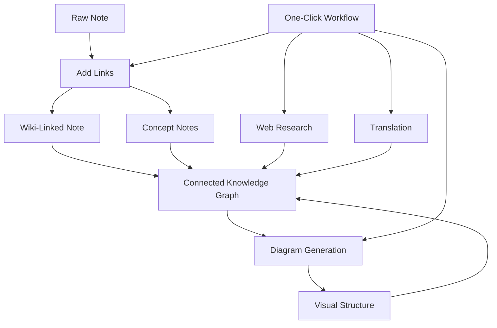

import TLDR from '@site/src/components/TLDR';

# Obsidian एआई ज्ञान प्रबंधन मार्गदर्शिका

<TLDR>
**Notemd LLM-संचालित पठन को स्थायी ज्ञान में बदलता है: विकि-लिंक अवधारणाओं को जोड़ते हैं, अवधारणा नोट्स एक पुनर्प्राप्य ग्राफ बनाते हैं, अनुसंधान वेब को आपके भंडार में लाता है, अनुवाद भाषा की बाधाओं को दूर करता है, आरेख संरचना को दृश्यमान बनाते हैं, एवं वर्कफ्लो इस सबको एक क्लिक में जोड़ देता है.** यह मार्गदर्शिका कच्चे नोट्स से लेकर एक जुड़ी हुई, दृश्यमान, बहुभाषी ज्ञान आधार तक की पूरी प्रक्रिया को कवर करती है.
</TLDR>

## एआई ज्ञान प्रबंधन क्यों?

पारंपरिक नोट-लेने से सपाट फ़ाइलें बनती हैं. मैनुअल विकि-लिंक होने पर भी अधिकांश नोट्स अलग-थलग रहते हैं. Notemd LLM का उपयोग करके कनेक्शन स्तर को स्वचालित किया जाता है:

- **LLMs आपकी सामग्री को पढ़ते हैं** एवं महत्वपूर्ण चीज़ें पहचानते हैं — शब्द, विधियाँ, लोग, सिद्धांत
- **लिंक प्रत्येक अवधारणा की उपस्थिति पर स्वचालित रूप से डाले जाते हैं**, "देखें भी" में छिपे नहीं रहते
- **अवधारणा नोट्स स्वतंत्र, पुनर्प्राप्य फ़ाइलों के रूप में बनाए जाते हैं**
- **अनुसंधान वेब से प्राप्त संदर्भों से नोट्स को समृद्ध बनाता है**
- **आरेख संरचना को दृश्यमान बनाते हैं** — माइंड मैप, फ्लोचार्ट, एक ही सामग्री से डेटा चार्ट

परिणाम: ऐसा ज्ञान ग्राफ जो आपके द्वारा प्रसंस्कृत हर नोट के साथ बढ़ता है, न कि केवल तब जब आप लिंक जोड़ना याद रखते हैं.

## पूरी प्रक्रिया



प्रत्येक चरण स्वतंत्र है. एक या सभी का उपयोग करें. सबसे प्रभावी क्रम: **लिंक जोड़ें → अवधारणा नोट्स → आरेख**.

---

## 1. विकि-लिंक: संबंधों को स्पष्ट बनाना

विकि-लिंक ज्ञान ग्राफ की रीढ़ हैं. Notemd एक LLM का उपयोग करके:

1. अपने नोट की सामग्री पढ़ें (लंबे दस्तावेज़ों के लिए इसे खंडों में विभाजित करें)
2. मुख्य अवधारणाओं की पहचान करें — सामान्य संज्ञाओं के बजाय विशिष्ट, तकनीकी शब्दों को प्राथमिकता दें
3. प्रत्येक उपस्थिति पर `[[wiki-links]]` डालें
4. समानार्थी शब्दों को दबा दें ताकि "ML" और "Machine Learning" अलग-अलग नोड न बनें

### कब उपयोग करें

- **100 शब्दों से अधिक वाले हर नोट** — छोटे नोटों में कम अवधारणाएँ होती हैं
- **शोध पत्र, तकनीकी दस्तावेज़, बैठक के नोट** — क्षेत्र-विशिष्ट शब्दों से भरपूर होते हैं
- **सामग्री स्थिर होने के बाद** — मसौदों पर बार-बार प्रसंस्करण न करें

### मुख्य सेटिंग्स

| सेटिंग | अनुशंसित | कारण |
|---------|-----------|-----|
| `addLinksProvider` | DeepSeek या GPT-4o-mini | कम लागत पर अच्छी सटीकता |
| समानार्थी शब्द दबाना | चालू | डुप्लिकेट नोडों को रोकता है |
| कॉन्टेक्स्ट विंडो | पैराग्राफ | सटीकता एवं लागत का संतुलन |

→ [Wiki-Links deep dive](/docs/features/wiki-links)

---

## 2. अवधारणा नोट्स: पुनर्प्राप्त किए जा सकने वाले ज्ञान नोड्स

Wiki-लिंक्स विचारों को इनलाइन जोड़ते हैं, लेकिन अवधारणा नोट्स प्रत्येक विचार को स्वतंत्र रूप से पुनर्प्राप्त करने योग्य बनाते हैं. प्रत्येक अवधारणा का अपना `.md` फ़ाइल होता है:

```markdown
# Machine Learning

## Linked From
- [[My Research Notes]]
- [[Neural Networks Explained]]
```

### निष्कर्षण प्रक्रिया

LLM प्रॉम्प्ट अत्यधिक संरचित होता है:
- एकवचन रूप में सामान्यीकृत करें
- एकल शब्दों के बजाय बहु-शब्द अवधारणाओं को प्राथमिकता दें ("Dielectric Relaxation" न कि "Relaxation")
- संदर्भ/ग्रंथसूची खंडों को छोड़ दें
- निर्धारित पार्सिंग हेतु `CONCEPT:` पंक्तियों के रूप में आउटपुट दें

चंकों के बीच `Set<string>` के माध्यम से अवधारणाओं को डुप्लिकेट से मुक्त किया जाता है. व्यक्तिगत चंकों पर LLM त्रुटियाँ प्रक्रिया को रोकती नहीं हैं.

### बैकलिंक्स

जब सक्षम किया जाता है, तो प्रत्येक अवधारणा नोट यह ट्रैक करता है कि कौन-से स्रोत नोट्स उसका उल्लेख करते हैं. Obsidian का मूल बैकलिंक पैनल भी विपरीत कनेक्शन दिखाता है.

### डुप्लिकेशन रिमूवल

Notemd का 4-चरणीय डुप्लिकेट मुक्त करने वाला इंजन निम्नलिखित को पकड़ता है:
1. **सटीक मेल** — फ़ाइलनाम की केस-इनसेंसिटिव तुलना
2. **बहुवचन रूप** — “Models.md” बनाम “Model.md”
3. **प्रतीक सामान्यीकरण** — “A-B.md” बनाम “A B.md”
4. **एकल-शब्द संयमन** — जब “Machine Learning.md” मौजूद होता है तो “ML.md” को चिह्नित किया जाता है

### मुख्य सेटिंग्स

| सेटिंग | अनुशंसित | कारण |
|---------|-----------|-----|
| `conceptNoteFolder` | `concepts/` या `🧠 concepts/` | वॉल्ट को व्यवस्थित रखता है |
| `extractConceptsAddBacklink` | चालू | रिवर्स लुकअप को सक्षम करता है |
| `extractConceptsMinimalTemplate` | बंद | Linked From के साथ पूरा टेम्पलेट |
| प्रति-कार्य मॉडल | DeepSeek | कॉन्सेप्ट एक्सट्रैक्शन के लिए महंगे मॉडलों की आवश्यकता नहीं होती। |
| समानार्थी शब्द दबाना | चालू | वही सेटिंग लिंकिंग और एक्सट्रैक्शन दोनों को प्रभावित करती है। |

→ [Concept Notes deep dive](/docs/features/concept-notes)

---

## 3. अनुसंधान: वेब को शामिल करना

Notemd आपके नोट-लेने के कार्यप्रवाह में वेब खोज को एकीकृत करता है:

1. **क्वेरी निर्माण** — आपका नोट का शीर्षक या चयन एक खोज क्वेरी बन जाता है
2. **वेब खोज** — Tavily (अनुशंसित, API कुंजी आवश्यक) या DuckDuckGo (मुफ्त, कोई कुंजी नहीं)
3. **LLM सारांशन** — खोज परिणामों को एक प्रासंगिक सारांश में संक्षिप्त किया जाता है
4. **नोट में जोड़ें** — सारांश कर्सर की स्थिति पर या एक नए खंड के रूप में जोड़ा जाता है

### कब उपयोग करें

- किसी नए विषय को संसाधित करने से पहले — पहले वेब संदर्भ प्राप्त करें
- जब किसी कॉन्सेप्ट नोट में समृद्धि की आवश्यकता हो — पहले अनुसंधान करें फिर लिंक जोड़ें
- साहित्य समीक्षाओं के लिए — नोट्स के एक फोल्डर पर बैच-अनुसंधान करें

### मुख्य सेटिंग्स

| सेटिंग | अनुशंसित | कारण |
|---------|-----------|-----|
| `researchProvider` | GPT-4o या Claude | अनुसंधान के लिए उच्च गुणवत्ता वाला सारांशन आवश्यक है |
| खोज सेवा | Tavily | बेहतर प्रासंगिकता, कॉन्फ़िगर की जा सकने वाली गहराई |
| `maxResearchContentTokens` | 4000 | गहराई एवं लागत के बीच संतुलन |

→ [Research deep dive](/docs/features/research)

---

## 4. अनुवाद: भाषा की बाधाओं को तोड़ना

Notemd आपके कॉन्फ़िगर किए गए LLM का उपयोग करके नोट्स का अनुवाद करता है — यह कोई समर्पित अनुवाद API नहीं है। इसका अर्थ है:

- **संदर्भ-जागरूक अनुवाद** — LLM पूरे दस्तावेज़ को समझता है, न कि वाक्य‑दर‑वाक्य
- **तकनीकी शब्दों का प्रबंधन** — "gradient descent" को "梯度下降" के रूप में ही रखा जाता है, न कि "坡度向下"
- **बैच समर्थन** — एक ही कार्य में नोट्स के पूरे फ़ोल्डर का अनुवाद किया जा सकता है
- **प्रति‑कार्य मॉडल** — अनुवाद के लिए Gemini Flash का उपयोग किया जाता है (तेज़, सस्ता, बहुभाषी)

### भाषा समर्थन

Notemd स्वयं 21 UI भाषाओं का समर्थन करता है। अनुवाद की लक्ष्य भाषा प्रति‑कार्य के आधार पर कॉन्फ़िगर की जा सकती है। आम जोड़ियाँ: EN↔ZH, EN↔JA, EN↔KO, EN↔DE, EN↔FR, EN↔ES.

→ [Translation deep dive](/docs/features/translation)

---

## 5. आरेख: संरचना को दृश्यमान बनाना

Notemd की आरेख पाइपलाइन स्पेसिफ़िकेशन‑पहली है: LLM एक संरचित `DiagramSpec` JSON उत्पन्न करता है, फिर एडाप्टर इसे लक्ष्य प्रारूप में अनुवादित करते हैं। ऐसा करने से LLM से कच्चे Mermaid सिंटैक्स को माँगने की तुलना में अधिक विश्वसनीय आउटपुट प्राप्त होता है.

### इंटेंट डिटेक्शन

Notemd सामग्री से सबसे उपयुक्त आरेख प्रकार का अनुमान लगाता है:

- **संख्याओं वाली तालिकाएँ** → डेटा चार्ट (Vega-Lite)
- **क्लाइंट/सर्वर शब्दावली** → अनुक्रम आरेख (Mermaid)
- **एंटिटी/प्राथमिक कुंजी** → ER आरेख (Mermaid)
- **चरण/प्रक्रिया प्रवाह** → फ्लोचार्ट (Mermaid)
- **कॉन्सेप्ट मैप कीवर्ड** → JSON Canvas (Obsidian स्थानीय)
- **डिफ़ॉल्ट** → माइंड मैप (Mermaid)

### रेंडरिंग चेन

प्राथमिक लक्ष्य → फॉलबैक → फॉलबैक → HTML. यदि Mermaid सिंटैक्स विफल हो जाता है, तो यह त्रुटि संदर्भ के साथ LLM पर एक बार पुनः प्रयास करता है, फिर न्यूनतम आरेख पर जाता है.

### मुख्य सेटिंग्स

| सेटिंग | अनुशंसित | कारण |
|---------|-----------|-----|
| `enableExperimentalDiagramPipeline` | चालू | स्पेक-प्रथम द्वारा बेहतर गुणवत्ता |
| `experimentalDiagramCompatibilityMode` | `best-fit` | प्रत्येक इरादे के लिए स्थानीय लक्ष्य |
| `summarizeToMermaidProvider` | GPT-4o या Claude | आरेख स्पेसिफिकेशन्स को स्थानिक तर्क की आवश्यकता है |
| `autoMermaidFixAfterGenerate` | चालू | LLM सिंटैक्स त्रुटियों को स्वचालित रूप से पकड़ता है |
| स्थानीय ज्ञान का विस्तार | डोमेन-विशिष्ट मोड में सक्रिय | वॉल्ट संदर्भ के साथ सटीकता में सुधार |

→ [Diagrams deep dive](/docs/features/diagrams)

---

## 6. वर्कफ्लो: वन-क्लिक ऑटोमेशन

वर्कफ्लो कई कार्यों को एक ही साइडबार बटन में जोड़ते हैं। DSL प्रारूप है:

```
task1 | task2 | task3
```

उदाहरण: `addLinks | extractConcepts | generateDiagram` — कच्चे टेक्स्ट से एक क्लिक में पूरी तरह जुड़े, दृश्यमान ज्ञान नोड तक प्रसंस्करण करता है.

### अनुशंसित वर्कफ्लो

| वर्कफ़्लो | चेन | उपयोग का मामला |
|----------|-------|----------|
| पूर्ण प्रक्रिया | `addLinks \| extractConcepts \| generateDiagram` | नए नोट्स |
| पहले अनुसंधान करें | `research \| addLinks` | अपरिचित विषय |
| पॉलीग्लॉट | `translate \| addLinks` | बहुभाषी नोट्स |
| केवल आरेख | `generateDiagram` | त्वरित दृश्यीकरण |

→ [Workflows deep dive](/docs/features/workflows)

---

## 7. LLM प्रदाता: क्लाउड से लोकल तक 36 विकल्प

Notemd 4 परिवहन प्रकारों में 36 प्रदाताओं का समर्थन करता है। मुख्य समूह:

- **अंतर्राष्ट्रीय क्लाउड**: OpenAI, Anthropic, Google, Mistral, xAI
- **चीनी क्लाउड**: DeepSeek, Qwen, Doubao, Moonshot, GLM, Baidu, SiliconFlow
- **गेटवे**: OpenRouter, GitHub Models, Hugging Face, Vercel
- **लोकल**: Ollama, LMStudio, OVMS — कोई API कुंजी नहीं, आपका डेटा मशीन से बाहर नहीं जाता

### प्रति-कार्य मॉडल रणनीति

सबसे किफायती सेटअप में सरल कार्यों के लिए सस्ते मॉडल और जटिल कार्यों के लिए शक्तिशाली मॉडल का उपयोग किया जाता है:

```
extractConcepts  → DeepSeek (fast, cheap, accurate enough)
addLinks          → DeepSeek or GPT-4o-mini
research          → GPT-4o or Claude (needs quality)
generateDiagram   → GPT-4o or Claude (needs spatial reasoning)
translate         → Gemini Flash (fast, multilingual)
```

→ [LLM प्रदाताओं का अवलोकन](/docs/providers/overview)

---

## शुरू करने हेतु चेकलिस्ट

1. **Notemd इंस्टॉल करें** — [Community Plugins](/docs/getting-started/installation) (अनुशंसित) या मैन्युअल रूप से
2. **एक प्रदाता कॉन्फ़िगर करें** — DeepSeek (सबसे आसान), OpenAI, या Ollama (मुफ्त)
3. **अपनी पहली नोट को संसाधित करें** — राइट-क्लिक → "Process file (add links)"
4. **संकल्पना फ़ोल्डर सेट करें** — सेटिंग्स → Notemd → आउटपुट → संकल्पना फ़ोल्डर
5. **संकल्पनाओं को निकालें** — उसी नोट पर "संकल्पनाओं को निकालें" चलाएँ
6. **एक आरेख बनाएँ** — कनेक्शनों को दृश्यमान बनाने हेतु "आरेख बनाएँ" चलाएँ
7. **एक वर्कफ़्लो बनाएँ** — ऊपर दिए गए कार्यों को एक क्लिक वाले बटन में जोड़ें

## अनुशंसित कॉन्फ़िगरेशन्स

### स्टूडेंट (बजट)

```
Provider: DeepSeek (free tier available)
Concept extraction: DeepSeek
Research: DuckDuckGo (free) + DeepSeek
Diagrams: Off (or legacy Mermaid)
Workflows: addLinks | extractConcepts
```

### रिसर्चर (गुणवत्ता)

```
Provider: GPT-4o (primary)
Concept extraction: DeepSeek (cost savings)
Research: GPT-4o + Tavily
Diagrams: best-fit mode, GPT-4o
Workflows: research | addLinks | extractConcepts | generateDiagram
```

### प्राइवेसी-फ़र्स्ट (केवल स्थानीय)

```
Provider: Ollama (llama3 or qwen2.5:7b)
All tasks: Ollama
Research: DuckDuckGo (free, no API key)
Diagrams: legacy Mermaid mode
```

### द्विभाषी (ZH + EN)

```
Primary: DeepSeek (Chinese queries)
Translation: Google Gemini Flash
Research: Tavily + DeepSeek (Chinese search context)
Language output: per-task (extractConceptsLanguage: zh-CN)
```

---

## सामान्य पैटर्न

### पैटर्न: एक रिसर्च पेपर को संसाधित करना

1. PDF सामग्री आयात करें (या पेस्ट करें)
2. **अनुसंधान** — विषय पर वेब संदर्भ प्राप्त करें
3. **लिंक जोड़ें** — मुख्य संकल्पनाओं की पहचान करें एवं उन्हें लिंक करें
4. **संकल्पनाओं को निकालें** — स्वतंत्र नोट बनाएँ
5. **आरेख बनाएँ** — पेपर की संरचना को दृश्यमान बनाएँ

### पैटर्न: दैनिक नोट समृद्धीकरण

1. रोज़ाना नोट लिखें
2. **लिंक जोड़ें** — आज के विचारों को मौजूदा अवधारणाओं से जोड़ता है
3. कॉन्सेप्ट नोट्स बैकलिंक्स के साथ स्वचालित रूप से अपडेट हो जाते हैं

### पैटर्न: साहित्य समीक्षा

1. पेपर्स/नोट्स के साथ एक फ़ोल्डर बनाएं
2. **बैच में लिंक जोड़ें** — पूरे फ़ोल्डर को संसाधित करें
3. **डुप्लीकेट कॉन्सेप्ट्स हटाएं** — लगभग समान नोट्स को साफ़ करें
4. **डायग्राम बनाएं** — पूरे साहित्य का माइंड मैप

---

*Notemd ओपन सोर्स (MIT) है और Obsidian 0.15.0+ के साथ सभी प्लेटफ़ॉर्मों पर काम करता है. [अभी इंस्टॉल करें](/docs/getting-started/installation) या [GitHub पर देखें](https://github.com/Jacobinwwey/obsidian-NotEMD).*
