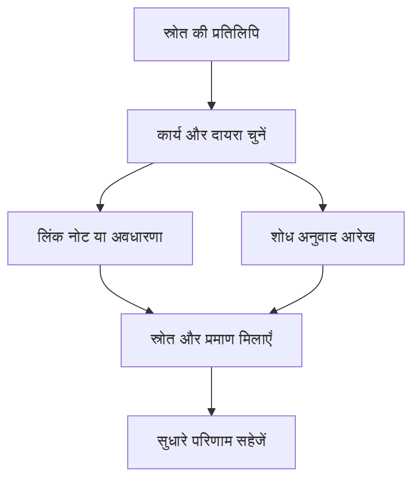

import TLDR from '@site/src/components/TLDR';

# Obsidian में AI के साथ ज्ञान प्रबंधन

<TLDR>उपयोगी workflow स्रोत, model response और अपने सुधार अलग रखता है। Notemd links, extraction, research, translation और diagrams को जाँचने योग्य documents बनाता है। एक स्रोत से शुरू करें, समीक्षा करें और फिर सीमित folder automate करें।</TLDR>

## परिणाम तय करें

Linked note, concept collection, source-backed summary, translation या diagram चुनें। अधिक files/links समझ या retrieval की गारंटी नहीं। पहले तय करें कि सामग्री कैसे सत्यापित और फिर खोजेंगे।

## पूरा रास्ता


```mermaid
flowchart TD
    A[स्रोत की प्रतिलिपि] --> B[कार्य और दायरा चुनें]
    B --> C[लिंक नोट या अवधारणा]
    B --> D[शोध अनुवाद आरेख]
    C --> E[स्रोत और प्रमाण मिलाएँ]
    D --> E
    E --> F[सुधारे परिणाम सहेजें]
```

ये उपलब्ध काम हैं, किसी default button के सभी steps नहीं। Chain बनाने से पहले स्रोत और output paths बचाएँ।

## 1. लिंक से संबंध स्पष्ट करें

**Process file (add links)** के बाद `_processed.md` में उपयोगी शब्द, उद्धरण, code और formulas मिलाएँ। Domain या synonym instructions identity/संख्यात्मक threshold लागू नहीं करतीं। Existing titles पर repeatability प्राथमिक हो तो deterministic matching देखें। [लिंक](./features/wiki-links)।

## 2. शब्द और व्याख्या अलग करें

Concept folder चुनें। स्वतंत्र extraction मूल बचाकर titles बनाता है। नए `Linked From` के लिए backlinks चालू तथा minimal form बंद करें। **Batch generate from titles** अलग है और पहले की पात्र notes भी ले सकता है। Complete move और समान नाम के अर्थभेद जाँचें। [अवधारणाएँ](./features/concept-notes)।

## 3. शोध का प्रमाण रखें

विषय/title तथा Tavily या DuckDuckGo चुनकर **Research & summarize** करें। खाली Tavily key engine नहीं बदलती। स्रोत खोलें। Optional local lexical retrieval excerpts चुने model को भेजती है; local indexing offline route सिद्ध नहीं करती। [शोध](./features/research)।

## 4. अनुवाद में अर्थ और रूप

भाषा चुनकर document translate करें। Default `_<language>.md` मौजूद output बदल सकता है; passage के लिए temporary note बनाएँ। Terms, numbers, code, links और mathematics मिलाएँ। Chunking context खो सकती है। UI/site भाषा संख्या pair quality का प्रमाण नहीं। [अनुवाद](./features/translation)।

## 5. संपादन योग्य आरेख स्रोत

एक बार में कई आरेख प्रकार चुनें और हर प्रकार के लिए अलग-अलग कई आउटपुट प्रारूप तय करें। प्रकार का चयन हटाने पर उसके प्रारूप सुरक्षित रहते हैं; कोई प्रकार न चुना हो तो सामग्री का अपने-आप विश्लेषण होता है। चेकबॉक्स प्रकार को निर्माण में शामिल करता है। नाम पर क्लिक करके प्रकार चुनें और उसके प्रारूप बदलें। माउस ले जाने या कीबोर्ड फ़ोकस से सेटिंग सहेजे बिना पूर्वावलोकन बदलता है। Escape मेनू बंद करके फ़ोकस लौटाता है।

## 6. जाँचे चरण automate करें

Name, `::` तथा `>` से actions जोड़ें:

```text
One-Click Extract::process-current-add-links>batch-generate-from-titles>batch-mermaid-fix
```

इसमें links, titles और Mermaid repair हैं, सामान्य research/diagram step नहीं। प्रत्येक action की requirements कायम हैं। डिफ़ॉल्ट reported error पर रुकता है। तभी जारी रखें जब अगले steps बाकी input संभाल सकें। Cancel पूरा output undo नहीं करता। [वर्कफ़्लो](./features/workflows)।

## 7. काम और protocol के अनुसार मॉडल

36 presets पाँच परिवारों को cover करते हैं। Endpoint, access, data policy और मापे results से चुनें। समान source/prompt पर time/cost तुलना करें। Per-task routing शुरुआत में बंद है; local workflow मानने से पहले सभी routes जाँचें। [प्रदाता](./providers/overview)।

## शुरुआती जाँच

1. Install करके sources की copies बचाएँ।
2. Exact model टेस्ट करें।
3. Concept folder और अलग destinations चुनें।
4. Copy पर काम चलाएँ।
5. तुलना और corrections बचाएँ।
6. Small folder तक बढ़ाएँ और लंबी chain से पहले partial results देखें।

## उपयोग के मामले

### Paper पर काम

बाहरी tool से Markdown बदलकर tables, formulas और images जाँचें। Concepts/passages निकालें, विशिष्ट सवाल शोधें और केवल verified relations का diagram बनाएँ। Paper और corrections रखें।

### Concept collection बनाए रखना

अलग folder रखें, terms देखें और चुनी subset में explanation generate करें। Cleanup से पहले backup लें। मात्रा सही definitions और उपयोगी navigation का विकल्प नहीं।

### निजी सामग्री

Local server, models और dependencies तैयार करें। Task routing देखें और आवश्यकता पर network research न करें। Diagnostics साझा करने से पहले साफ़ करें। Initial loopback remote configuration नहीं रोकता।

### Batch फिर शुरू करना

Cancellation या failure settle होने दें। Report, outputs और recovery देखें; conflicts मिलाकर आवश्यक काम दोहराएँ। Cancelled का मतलब empty नहीं। Companion files हटाने से पहले references देखें।

## आगे

- [त्वरित शुरुआत](./getting-started/quick-start)।
- [बैच](./advanced/batch-processing)।
- [डेवलपर](./developers/overview)।
- [Agent](./agents/overview)।
