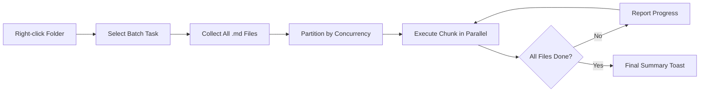

import TLDR from '@site/src/components/TLDR';

# Hromados feldolgozás

<TLDR>
**Notemd egyetlen lépésben feldolgozza az összes mappát, és lehetővé teszi a konfigurálható egyidejű munkavégzést és az átírás kezelését.** Kattintson hajtókattintással egy mappára, hogy hromadilag hozzáadjon wiki-hivatkozásokat, kivegye a koncepteket, végezzen kutatást vagy fordítsa át az összes feljegyzést benne. A egyidejű munkavégzés korlátai megakadályozzák a API szintű határozati hibákat. A folyamat állapota az egyes fájlok alapján jelölik meg. Az átírás viselkedése konfigurálható: elhagyja a már létező fájlokat, csatlakoztatja őket vagy helyettesíti őket. A hibás fájlok bejegyezésre kerülnek, de a hromados feldolgozás nem leáll.

Ez része a [Obsidian AI tudományos kezelési útmutatójának](/docs/pillar-ai-knowledge).
</TLDR>

## Áttekintés

A hromados feldolgozás egy mappában lévő feljegyzéseket egyetlen operációként átváltja. Nem kell az egyes feljegyzést nyitni és külön-külön parancsokat futtatni – kattintson hajtókattintással a mappára és válassza ki a munkát. Notemd átfogja minden `.md` fájlt, alkalmazza a kiválasztott műveletet és azonnal jelenti meg a folyamat állapotát.

Ez a funkció fontos a teljes tároló szintű tudományos adatok kihozásához. Például, miután importálta többek között több PDF-t, a hromadilag hivatkozások hozzáadása után következően a konceptek hromadilag kivegtetése csak néhány perc alatt építi fel a tudományos grafikonát, nem órák alatt.

## Hogyan működik

### Hromados futtatási modell

1. **Fájlok gyűjtése** – Notemd rekurszívül keresi át a célmappát (vagy csak a felső szintű fájlokat, attól függően a beállításoktól) és gyűjtözi össze az összes `.md` fájlt.
2. **Egyidejű munkavégzés osztása** – A fájlok oszlokká válnak a `batchConcurrency` beállítás alapján. Minden oszlok egyidejűen fut; az oszlokok pedig sorrendben futnak.
3. **Feldolgozás** – Az egyes fájlok feldolgozása azonos logikával történik, mint a egyetlen fájlra vonatkozó parancs esetében. A munka alapú fornincsok és a modell beállításai figyelembe vennék.
4. **Folyamat jelentése** – Minden fájl lefuttatása után frissül egy üzenet, amely az `N / Total` folyamat állapotát mutatja be.
5. **Hibák kezelése** – Ha egy fájl hibásul (API hiba, hálózati időkötés stb.), a hiba bejegyezésre kerül és a hromados feldolgozás továbbra is folytatódik. A végleges összefoglalásban listázhatók az összes hibás fájl.
6. **Lezárás** – Egy összefoglaló üzenet jelenti meg a teljesen feldolgozott fájlok számát, a sikereket és a hibákat.

### Üleírás elvényszerűlete

Amikor folyamatozunk egy fájljal, amely már tartalmaz wiki-hivatkozásokat, konceptjelzéseket vagy fordításokat, Notemd elvényszerűlete attól függ, milyen üleírás beállítása van:

| Módszer | Elvényszerűlet |
|------|----------|
| **Elhagyás** | A meglévő tartalom megmarad. Csak az nem módosított fájlok folyamatoznak. |
| **Hozzáadás** (alapértelmezett) | Új tartalom hozzáadódik. A meglévő wiki-hivatkozások, konceptek vagy fordítások megőriződnek. |
| **Cserélés** | A fájl teljesen újra folyamatozik. Minden korábbi Notemd módosítása üleírásra kerül. |

Wiki-hivatkozások esetében: ha egy jelzés már tartalmaz `[[wiki-links]]`-t, az **elhagyás** módszer nem érinti meg azt, míg a **cserélés** módszer újra küldi az összes jelzést a LLM-hez, hogy új hivatkozások kerüljenek be. Inkrementális folyamatozásra használjuk az **elhagyás**-t, míg a modellek frissítése utáni újrafolyamatozásra az **cserélés**-t.

### Konkurenccsi kezelés

A `batchConcurrency` beállítása korlátozza a paralel API kéréseket. Ez megakadályozza a sebességi korlát hibáit (HTTP 429) nagy mappák folyamatozásákor olyan szolgáltatókkal, akikkél szigorúak a korlátozásuk.

| Konkurenccsi kezelés | Tajékoztatás | Tipikus sebességi korlát hatása |
|-------------|----------------|---------------------------|
| `1` | Inklúzív szintek, szigorú fornalmazók | Nincs (soros) |
| `3` (alapértelmezett) | A legtöbb felhőforrás | Kisebb |
| `5` | Ollama (lokal), nagyosztályú szintek | Nincs / Kisebb |
| `10` | Hagyományos modellek gyors értékelésével | Nincs |

Ha batch feldolgozás során 429 hibák jelentek meg, csökkentsd a koncurrentitást 1 vagy 2-re.

## Konfiguráció

| Beállítás | Alapértelmezett | Hatás |
|---------|---------|--------|
| `batchConcurrency` | `3` | Maksimális paralel API kérések mappafeldolgozások során |
| `batchOverwriteExisting` | `false` | Másolja le a meglévő Notemd tartalmat. `false` = csatlakoztatási módban. |
| `batchSkipProcessed` | `false` | Elhagyja azokat a fájlokat, amelyek már tartalmaznak Notemd jelölőket (pl. wiki-hivatkozásokat) |
| `batchRecursive` | `true` | Beolvasza a mappát ellenőrizetté váltva a alamappákat is. |
| `enableStableApiCall` | `false` | Engedélyezze a újrapróbálási logikát (legfeljebb 4 körrel) az egyes fájlok esetén a batch művelet során |

### Batch-ben lévő munkavégzési modellek

Az egyes batch műveletek az igényes munkavégzési modellt használják. A batch-add-links `addLinksProvider`-t, a batch-research `researchProvider`-t stb. használ; ez azt jelenti, hogy lehetősége van használni olcsó modelleket nagy mennyiségű műveletekhez, és drágább modelleket pedig minőségre fontos munkáknak.

## példa

Olyan mappát tartozik, amely `papers/` néven van, és benne 40 importált kutatási jelentés van. Szüksége van wiki-hivatkozások hozzáadására és az összesükben lévő konceptek kihozására:

1. Jobb kattintson a `papers/` mappára
2. Válassza ki **"Notemd: Process folder (add links)"**-t
3. Notemd ellenőrzi a mappát, talál 40 `.md` fájlt, és kezel 3-at egyre (alapértelmezett konvergencia)
4. Egy fejlépési üzenet mutatja meg: `12/40 files processed...`
5. Körülbelül 3 perc után egy összefoglaló üzenet jelenti meg: `39 succeeded, 1 failed (API timeout on paper-37.md)`
6. Ugyanazt tegye **"Notemd: Process folder (extract concepts)"**-vel, hogy az 40 fájlnak is konceptjelöltetése történjen

A nem sikerült fájl bejegyzésre kerül. Ezt a fájlt később újra lehet kezelni.

## Tippek

- **Kezdje alacsony konvergenciával** -- Ha nem biztos abban, milyen határok vannak a szolgáltatójaé, kezdje `1`-vel és növelje gradually.
- **Használja a skip módot inkrementális frissítésekhez** -- A first teljes batch után váltson meg `batchSkipProcessed: true`-ra, így csak a új jelöltetések kezelődnek a következő futásokban.
- **Engedélyezze a stabil API kéréseket** -- `enableStableApiCall: true` hozzáad egy újra próbálkozó logikát, amely helyreállítja a hosszú batchok során jelentkező áthajtó hibákat.
- **Újra futtasson az újabb modell frissítésektől után** -- Ha egy jobb modellt használ, állítsa be `batchOverwriteExisting: true`-t és újra futtasson, hogy jobb hivatkozások és konceptek kapjon.

---

## További lépések

- [Workflows](/docs/features/workflows) -- Összekötje a batch munkákat egy kattintással elérhető sávoldali gombokká
- [Custom Prompts](/docs/advanced/custom-prompts) -- Szabályozza a batch extrakcióhoz szükséges promptokat
- [Troubleshooting](/docs/advanced/troubleshooting) -- Elszolgálja a rate-limit hibákat és a kapcsolati problémákat a batch futások során
- [LLM Társadalmak](/docs/providers/overview) -- Munkaalapú modell konfigurációs referencia
