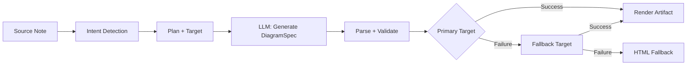
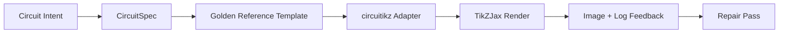

import TLDR from '@site/src/components/TLDR';

# Diagramok

<TLDR>
**Notemd egy spec-first folyamat útján készít ki diagramokat a jegyzékeidből.** Az LLM egy renderer-agnostikus `DiagramSpec` JSON-fájlt készít, majd speciális adapterek átváltják ezt Mermaid, JSON Canvas, Vega-Lite, HTML, módosítható HTML/SVG, Draw.io, Drawnix vagy korlátozott circuitikz formátumba. Támogatja 9 kívánt típusot, automatikus lehetséges változások sorrendjét, közvetlen előnézetet SVG/PNG/PDF kiszállítással, semantikai ellenőrzést, illetve helyi tudnivalókkal bővített készítést.
</TLDR>

Ez része a [Obsidian AI tudományos kezelési útmutatójának](/docs/pillar-ai-knowledge).

## Architektúra: Spec-First folyamat

A Notemd soha nem kér a LLM-ttól, hogy közvetlenül Mermaid/Vega/Canvas szintaxisát készítse ki. Inkább:



**Miért spec-first?** A LLM-ek gyakran nélkülözhetetlen renderer szintaxist készítenek ki (Mermaid különösen). Egy struktúráltott `DiagramSpec` előtt a renderelés előtt ellenőrizhető, és ugyanaz a spec több rendererhez is fallbackként használható.

## Támogatott diagramtípusok

| Intenzit | Primáris renderer | Fallbackok | Használati esetek |
|--------|-----------------|-----------|----------|
| `mindmap` | Mermaid | HTML | Hierarchikus témák szegésének leírása |
| `flowchart` | Mermaid | HTML | Folyamatok, döntésfátok |
| `sequence` | Mermaid | HTML | Kliens-szerver interakciók, protokollok |
| `classDiagram` | Mermaid | HTML | OOP osztályok közötti kapcsolatok |
| `erDiagram` | Mermaid | HTML | Adatbázis szkémái, entitások közötti kapcsolatok |
| `stateDiagram` | Mermaid | HTML | Állapotmásházak, életciklusmodellek |
| `canvasMap` | JSON Canvas | Mermaid → HTML | Koncepciókártyák, tudományos grafikonok |
| `dataChart` | Vega-Lite | Mermaid → HTML | Sárga, linia, terület, szórás, kör, táblák |
| `circuit` | circuitikz | none | Validerált `CircuitSpec` adatokból készült korlátozott circuitikz diagramok |

## Intenciós felismerés

Notemd az összefoglaló tartalmából kulcszavak értékelésével az optimalabb diagramtípust kiszámol:

| Intenció | Triggerek | Biztonságosság |
|--------|----------|------------|
| `dataChart` | Táblák, számítási célok, mérték/trend kulcszavak, százalékok | 0.88 |
| `sequence` | Kérés/felelés szókincse (4+ megfelelés) vagy `->`/`=>` jelölők | 0.82 |
| `erDiagram` | Primáris kulcs, külső kulcs, entitás, szkémá (2+ megfelelés) | 0.80 |
| `stateDiagram` | Állapot, átmenet, felfüggesztve, futtatásban, sérült (3+ megfelelés) | 0.76 |
| `flowchart` | Numérozott lépések (2+) vagy if/then/else/workflow szókincse | 0.74 |
| `canvasMap` | Konceptusrajz, tudományos graf, térképes, csoport | 0.72 |
| `circuit` | circuitikz, TikZJax, circuit, schematic, CMOS, NMOS, PMOS, MOSFET, VDD/GND, `vin`/`vout` | 0.78 |
| `mindmap` | Alapértelmezett lehetséges választék | 0.55 |

Átírjuk a **Előnyös diagramtípus** beállításával, a sárú selektortól vagy egy kifejezett parancssorpaletái opciójával.

## Renderelési célpont választása

A kísérleti specifikációk alapú folyamat most két külön kontrollt tartalmaz:

| Kontroll | Beállítás | Hatás |
|---------|---------|--------|
| Előnyös diagramtípus | `preferredDiagramIntent` | Irányítja a készült `DiagramSpec` semántikai formátumát |
| Előnyös renderelési célpont | `preferredDiagramRenderTarget` | Válaszol a **Diagram készítése** és **Diagram előnézetéhez** szükséges artefakt rendererét |

A plánoló alapértelmezettének megadásához állítson be a **Preferred render target**-ot **Auto**-ra, vagy kifejezetten válassza ki Mermaid, JSON Canvas, Vega-Lite, HTML, Editable HTML/SVG, Draw.io, Drawnix vagy Circuitikz-t. Ez a változtatás csak az artefektumok és az előnézet parancsokra vonatkozik. A standard **Summarise as Mermaid diagram** parancs továbbra is Mermaid-kompatibilis kiszállításra van kötve, így a meglévő Markdown munkafolyamok nem változnak titkosan formátumukat.

Ez a különbség fontos, mert egy `flowchart` kívánt típus most Mermaid formátumban lehet renderelni Markdown jegyzékekhez, HTML formátumban erős lehetséges változásokhoz, Editable HTML/SVG formátumban további módosításokhoz, vagy Draw.io/Drawnix forrásartefektumokkával SVG ellenőrzési fájlokkal. Az `circuit` kívánt típus a Circuitikz-re irányul és egy validerált `CircuitSpec`-t igényel; ez nem egy bármilyen TikZ szöveg kérése.
## Használat

### Diagram készítése

1. Nyitja meg egy feljegyzést
2. Hajtsa el a parancssorpaletából **"Notemd: Diagram készítése"** parancsot
3. Notemd az intenciót érzékeli, készíti elő a specifikációt, rendereli és menti az artefaktot

**Célpontok szerinti kimenetfájlok:**

| Cél | Bővítés | Fájlnev módellje |
|--------|-----------|------------------|
| Mermaid | `.md` | `{note}_summ.md` |
| JSON Canvas | `.canvas` | `{note}_diagram.canvas` |
| Vega-Lite | `.json` | `{note}_diagram.json` |
| HTML | `.html` | `{note}_diagram.html` |
| Írható HTML/SVG | `.html` | `{note}_diagram.html` |
| Draw.io | `.drawio` + `.drawio.svg` + `.drawio.md` | `{note}_diagram.drawio` plusz ellenőrzési fájlok |
| Drawnix | `.drawnix` + `.drawnix.svg` + `.drawnix.md` | `{note}_diagram.drawnix` plusz ellenőrzési fájlok |
| Circuitikz | `.tex` + `.tex.svg` + `.tex.md` | `{note}_diagram.tex` plusz ellenőrzési fájlok |

### Diagram előnézetének megtekintése

1. Indítson **"Notemd: Diagram előnézetének megtekintése"**
2. Egy modál ablak nyílik meg a renderelt diagrammal
3. Használja a szolgáltatási sor parancsait, hogy SVG, PNG vagy PDF formátumban kiszállítsa a képet.

**Autó-előnézet** beállításokban elérhető – készítés után az előnézet modál ablaka automatikusan nyílik.

A PNG és PDF előnézet kiszállítása az konfigurált előnézet PPI-jét használja. A alapértelmezett 300 PPI, és a 600 PPI-nél magasabb értékek 600-re korlátozódnak. Az SVG továbbra is vektortípusú marad. A `.drawio`, `.drawnix` és `.tex` szintű forrásartefektumok egy `previewSvg` ellenőrzési fájlt is adhatnak, így a Obsidian képes megjeleníteni és kiszállítani ellenőrizhető képeket, anélkül hogy a plugin működése során diagram.net, Drawnix, LaTeX vagy TikZJax-t beillesztené.

A előnyölt nézet ablakában is létezik egy hibadiagnózis panel. A renderelők és a „smoke check”-ek hozzá tudják tartani a `RenderArtifact.diagnostics`-ot; az ablak az előnyölt kép mellett mutatja be egy összefoglalót a hiba, figyelmeztetés és információ számairól, majd a súlyosság, a diagnostikai típus, a üzenet és a reparációs tanácsokat. Ugyanaz az összefoglalat jelenik meg a diagnostikákat támogató históriai bejegyzésekben is, így a többszörre ismétlődő circuitikz „smoke”-próbákat lehet egymással összevetni, anélkül hogy minden bejegyzést kellene nyitni. Azok az artefektek esetében, amelyeknek van forrásíneke, de nem lehet őket inline formában vagy az HTML iframe útja melaljánk renderelni, az ablak most helyett egy teljesen forrásínekre épülő előnyölt nézetet használ, így nincs szükség üres iframe-t használni. Ez lehetővé teszi a circuitikz kompilálási/renderelési „smoke”-próbákat, az SVG szöveg-token ellenőrzéseit, a PNG tömött képernyőképek ellenőrzéseit, a csak útinformációkra épülő glifák összeütközési jelentésekét, valamint a jövőbeli összeütközési jelentésekét egy látható felületen mutatni, anélkül hogy a TikZJax vagy LaTeX legyenek szigorú plugin futtatási függőségeknek, vagy pedig az forrásínekeknek kellene mintha ellenőrzött visuális renderelésnek tűnnie.

### Örökségű Mermaid módszer

Amikor a `enableExperimentalDiagramPipeline` kikapcsolva van, a Notemd direktálisan egy Mermaid kérdést küld a LLM-hez. Ez teljesen elkerülje a specifikációs folyamatot. Ha a kísérleti folyamat megszűnik, az ezt a módot használ.

## Renderelési alapkövek

### Mermaid

6 adapter (mindmap, flowchart, sequence, ER, class, state) átváltja a `DiagramSpec`-t a Mermaid szintaxisába. Készítés után a `mermaid.parse()` ellenőrizzi a kimenetet. Ha az ellenőrzés megszűnik:

1. **LLM újra próbálkozás** – egy kísérlet a Mermaid hibajelzésével tartalmazva
2. **Minimalis helyettesítés** – egy egyszerű Mermaid diagram a specifikációs nodus ID-jeikből

**Öröklődési Mermaid Repairer** automatikusan helyreállítja a népszerű LLM szintaxis hibáit: a note irányelvek normalizálását, a pipe-label elkerülését, a semicolon helyezésének módosítását, a smart quotes használatát, a kettős törő箭头okat, a formák nem megfelelését és többet.

### JSON Canvas

Készít ki Obsidian JSON Canvas formátumot területi elrendezéssel:
- A nodok helyezése a mérték alapján (x = mérték × 420) és az index alapján (y = index × 170)
- A szélesség az irányelvek hosszából kiszámításra kerül
- A csatok `fromSide: 'right'`, `toSide: 'left'`, `toEnd: 'arrow'` jellegűek

### Vega-Lite

Készít ki teljes Vega-Lite v5 JSON specifikációkat automatikus kódolással:
- **Kartézsi diagramok** (sütő/liniás/térség/pont/terhelt): x + y csatornák + szín több sorra
- **Kör**: theta = y (kvantitív), szín = x (nominal)
- **Táblázat**: sor = x, tekst = y + oszlop = sorozat

A sötét és fényes temák összevonódnak elő a kompilálás előtt.

### HTML

Üldösi megoldás. Magában tartó HTML dokumentum, amelyben vannak:
- CSP meta fejletek
- Fényes/sötét módszer `prefers-color-scheme` segítségével
- 20 nyelvhez szóló helyi UI irányelvek
- Részek: hero, struktúra (nodok ág), kapcsolatok, figyelmeztetések, adat sorozatok táblái

### Személyre szabható HTML/SVG

Kifejezetten megadott figyelmeztetési célpont az szerkeszthető export munkafolyamokhoz. Ez projekciezi a `DiagramSpec` egy deterministikus `SemanticFigureModel`-ba, majd készít ki egy sajtalmatlan HTML dokumentumot, amelyben inline SVG csoportok vannak, amelyek tartalmaznak Draw.io-stílusú figyelmeztetéseket:

- `data-drawio-type`, `data-drawio-id` és `data-drawio-role` a semantikus nodoknál
- `data-drawio-source` és `data-drawio-target` a semantikus szélképekön
- Stabil nod/szélkép azonosítók a térképezők normalizálásával és összeütközések kezelésével után
- Nem vannak skriptek, külső típusok, sem távoli fájlok

Ez a célpont intenzíven nem a helyettesítő tervezési útja még. Ez elérhető kifejezetten megadott render célpontként, amíg a termék útra való teszi biztosítva a szerkesztési viselkedést valós eszközökben.

### Draw.io és Drawnix Export határai

A jelenlegi implementáció a harmadik fél szerkesztők támogatását az artefakt határában tartja, ugyanakkor viszont elérhetőek maradnak a kifejezetten megadott renderelési célok:

| Célpont | Kontraktus | Működési időkéntes függőség |
|--------|----------|--------------------|
| Draw.io | `SemanticFigureModel` által generált determiniszmusos, komprimálás nélküli `mxfile` XML-ö, továbbá SVG/PNG/PDF formátumban lévő ellenőrzési fájlok | a plugin futtatása vagy CI-ben semmi nincs |
| Drawnix | `geometry` és `arrow-line` elemeket használó minimális `.drawnix` JSON-komponensek, továbbá SVG/PNG/PDF formátumban lévő ellenőrzési fájlok | a plugin futtatása vagy CI-ben semmi nincs |

A kiegyensúlyozás intenzíven választott: a Notemd lehetővé teszi a látólagos címkek, stabil azonosítók és támogatott primitívek összefoglalásának ellenőrzését, anélkül hogy beépítené a diagrams.net Desktop, Drawnix, Plait vagy csak böngészőben működő editor állapotot a pluginbe.

### circuitikz / TikZJax irány

A szemlényrajzok nem ugyanaz a probléma, mint a generikus folyamatszámlák. A elektrikai szemlényeknek a helyes szintaxis célja általában **circuitikz**, amit Obsidianben olyan pluginek köszönhetően renderelnek, mint például TikZJax. TikZJax képes betölteni olyan paketeket, mint `circuitikz`, `pgfplots`, `tikz-cd` és `chemfig`, ami azt érdemesnek teszi fizika, szemlények, chemia és matematika felvételeihez.

A kockázat az, hogy a szintén LLM által készített TikZ összetörékeny.

- A komplexes szemköri topológiák elektrikailag helyesek lehetnek, de kézi olvasásra nehézek.
- Összeeső káblok és jelzők az elemzési jegyzékekhez használható helyes netlistet használatra nem alkalmasnak tesznek.
- Hiányzó paket előírások, hibás ankerpek vagy nem változó komponensek nevei megakadályozhatják a renderelést;
- A renderelőtől származó visszajelzések általában kép-szintűek, míg a LLM készített géoméria szöveg-szintű.

A jobb architektúra az, hogy a circuitikz-t kezeljük korlátozott diagram cézként, nem szabadságos formátumban létrehozott kérésként.



A felső osztályú modellnek kell külön-külön leírni a szemköri topológiát és a tervezést:

| réteg | Felelősség | példa |
|-------|----------------|---------|
| Topológiá | elektrikai üzlekpontok és komponensek összekötései | `VDD -> RD -> drain(M1)`, `source(M1) -> GND` |
| Layout | réteg elhelyezése, orientáció, útvonalozási sorsok | `M1 at (3,2.2)`, bevitel bal oldalán, kijelzés jobb oldalán |
| Stílus | paket, voltágrendszertartás, jelzők, ankrók | `\begin{circuitikz}[american voltages]` |
| Valósítási ellenőrzés | kötelezési protokoll, hiányzó ankrók, összeütközés/képernyőkép ellenőrzések | TikZJax/LaTeX diagnostikák plusz vizuális elemzés |

### Jelenlegi circuitikz prototípus

Notemd tartalmaz now a felszólított tárgykör számára első korlátozott repozitóriumi prototípust. Ez intenzíven offline áll és szabványos szabályok alatt működik:

```bash
npm run diagram:export-circuitikz -- --input cmos-inverter.json --output cmos-inverter.tex
```

A prototípus egy korlátozott `CircuitSpec` határat ad, illetve determiniszmusos exportálót biztosít számos klasszikus referenciációs családhoz:

A kísérleti diagrammállományú folyamatban ezt most is elérhetővé teszi a `intent: "circuit"` és a renderelési cél `circuitikz`. A generált `DiagramSpec` csak a circuit céllal használhatja a `circuitSpec`-t. A `CircuitikzRenderer` ugyanazt a determiniszmusos `.tex` forráskódot ír le, és olyan SVG előnézetfájlt csatlakoztat, amely az ellenőrzött circuit topológiából készül; ez lehetővé teszi az Obsidian előnézetét, valamint a SVG/PNG/PDF exportálást. Ez a fájl nem egy LaTeX/TikZJax kompilációs eredmény; a valós renderer részletek továbbra is az alábbi kifejezetten megadott parancsokban vannak.

A támogatott klasszikus szablónképek esetén a `layoutHints.inputSide` és a `layoutHints.outputSide` továbbra is csak bemutatási céllal használt kontrollok maradnak. Ezek lehetővé teszik a determiniszmusos be-/kimeneti port helyezését, de nem változtatják a topológiái jellegzetét, és nem engedélyezik egy reparációs lépést, amely átrendelne a circuitot.

| Környezet típu | Aranyreferencia | Folyamennyelv garancia |
|--------------|------------------|-------------------|
| `common-source-amplifier` | `common-source-nmos-v1` | ellenőrizi `VDD -> R_D -> M1.D`, `vin -> M1.G`, `M1.S -> GND` és `M1.D -> vout`-t, mielőtt LaTeX-ként írjon le |
| `cmos-inverter` | `cmos-inverter-v1` | ellenőrizi PMOS-over-NMOS topológiát, összefüggő kapu bevitelt, összefüggő kiszállítást, `VDD -> MP.S`-t és `MN.S -> GND`-t, mielőtt LaTeX-ként írjon le |
| `cmos-buffer` | `cmos-buffer-v1` | ellenőrizi két sorozatos inverter szintjét, közép pontot `vmid`-t, visszaállított `vout`-t és összefüggő VDD/GND folyamatosokat, mielőtt LaTeX-ként írjon le |
| `cmos-transmission-gate` | `cmos-transmission-gate-v1` | ellenőrizi paralel PMOS/NMOS áramköri eszközeket `vin` és `vout` között, komplementáris `phib` / `phi` vezérlésekkel, mielőtt LaTeX-ként írjon le |
| `cmos-nand2` | `cmos-nand2-v1` | Ellenőrizi a paralel PMOS pull-up, soros NMOS pull-down, két bevezetés `va` / `vb` és `vout` működését, mielőtt LaTeX-ot írjon le |
| `cmos-nor2` | `cmos-nor2-v1` | Ellenőrizi a soros PMOS pull-up, paralel NMOS pull-down, két bevezetés `va` / `vb` és `vout` működését, mielőtt LaTeX-ot írjon le |

Ez nem egy általános TikZ generátor. Ez nem fogadja el bármilyen TikZ kódot, nem kompilálja LaTeX-kódot, nem hívja fel a TikZJax-t, nem ellenőrzi képeket a plugin futtatása során, és nem futtat automatikus kép-alapú reparációs folyamatokat. Ezek továbbra is későbbi lépéseknek tartoznak.

A Preview diagram parancsa lehetővé teszi az összeállított circuitikz forrásfájlok újra megnyitását közvetlenül, ha a fájl extenzíja `.tex` vagy `.tikz`, és a forrásban vannak `\usepackage{circuitikz}` vagy `\begin{circuitikz}`. Ez egy circuitikz forráskörű előnézet: a modális ablak mutatja be a forrásot, a diagnostikákat, a kopiálás/megőrzés kezelőket és a históriai adatokat, de nem kompilálja a LaTeX-ot vagy nem hívja fel TikZJax a plug-in működési időszakában.

A sama forráskörű előnézet now összefogja az összeállított Draw.io és Drawnix fájlokat. `.drawio` fájlok elfogadók, ha azok Draw.io XML (`mxfile` vagy `mxGraphModel`) képességűek, és `.drawnix` fájlok elfogadók, ha azok Drawnix JSON formátumban vannak, valamint `type: "drawnix"` és egy `elements` array-t tartalmaznak. A plug-in még mindig nem bevonja a diagrams.net-et vagy a Drawnix whiteboard hostot; ezek az előnézetek mutatják be a forrásot, a diagnostikákat és a fájl históriáját, de nem biztosítják plug-in belül való vizuális szerkesztést.

Topológiákatől függő működési javításokhoz, az előjavítási specifikációt kell referenciaként megadni, mielőtt egy javított kandidátumot elfogadjuk:

```bash
npm run diagram:export-circuitikz -- --input repaired-cmos-inverter.json --topology-reference cmos-inverter.json --output cmos-inverter.tex
```

A javítási ellenőrző használja `createCircuitTopologySignature` és `assertCircuitTopologyUnchanged`-t, hogy összevetje `circuitKind`, `goldenReferenceId`, hálózatokat, komponensek azonosítóit/típusait/termináljait és iránytalan kapcsolati végpontokat, mielőtt kijelentse a eredményt. A címkeek, a titkoszöveg, a layout sugárzatai, a kapcsolási sorrend és a kapcsolási címkeek intenzíven elhagyódnak. Egy kandidátum, amely hosszabb rendszeret hozzáad vagy egy terminálot újra köt, nem sikerül, mert `Circuit topology drift detected` jelenik meg, mielőtt a `.tex` fájl íródjon le.

A CLI now lehetővé teszi az már létező LaTeX/TikZJax kompilációs logot olvasását, anélkül hogy egy kompilátor futtatásra kerülne:

```bash
npm run diagram:export-circuitikz -- --input cmos-inverter.json --output cmos-inverter.tex --compile-log cmos-inverter.log --diagnostics-output cmos-inverter.diagnostics.json
```

Ez a diagnostikai út jelentkezik a hiányzó paketekről, pl. `circuitikz.sty`, ismeretlen TikZ/circuitikz kulcsokról, TikZ út-szintaxisi hibákról, pl. hiányzó készecskék, egyenletlen zárók vagy nem záró címkek következtében jönnek létre az argumentok, nem definiált kontroll sorokról, általános LaTeX hibákról, hagyományos leállításokról és javaslati overfull `\hbox` figyelmeztetésekről. Ez továbbra is log-bázisú: a helyi LaTeX/TikZJax futtatása és a képminőségű ellenőrzések még mindig későbbi munkákat jelentenek.

A karbantartók számára létrehozott ellenőrzésekhez, az sama CLI lehetővé teszi egy kifejezetten konfigurált renderer futtatását, anélkül hogy shell parancsok olvasódjanak:

```bash
npm run diagram:export-circuitikz -- --input cmos-inverter.json --output cmos-inverter.tex --compile-executable pdflatex --compile-arg -interaction=nonstopmode --compile-arg -halt-on-error --compile-arg -output-directory={outputDir} --compile-arg {tex} --expected-artifact {outputDir}/{jobName}.pdf
```

A kompilációs futó használja `shell: false`, kiterjeszti `{tex}`, `{outputDir}` és `{jobName}` helyettesítőket argumentum-arrázsi értékként, olvasja a készült `{jobName}.log`-t, és adja vissza `compileExecution` plusz `compileDiagnostics` a CLI JSON formátumban. `--compile-executable` csak a renderer bináris fájla vagy wrapper útja; a renderer flagjei tartoznak a repetált `--compile-arg` értékekre. Az üres executable-k nem sikerülnek, mert `compile-executable-invalid`, a hiányzó binárok nem sikerülnek, mert `compile-executable-not-found`, és shell-parancs-formátumban lévő executable szövegeknek javaslat adódik, hogy az argumentumokat oszdják, így a Windows, Linux és macOS egyaránt követi a közvetlen futtatási feltételeket. `--expected-artifact`-vel együtt jelentkezik az `compileExecution.renderSmoke` is, és a CLI nem sikerül, ha a renderer nem létrehoz egy nem üres fájlt. A plug-in még mindig nem bevonja a LaTeX-t, nem teszi TikZJax plug-in működési időszakának függvényének, és nem végzi le képminőségű vizuális javítást.

Ha az eredeti fájl `.svg` formátumban van, a ellenőrzés egy szint mélyebbre menek:

```bash
npm run diagram:export-circuitikz -- --input cmos-inverter.json --output cmos-inverter.tex --compile-executable dvisvgm --compile-arg ... --expected-artifact {outputDir}/{jobName}.svg --expected-svg-text v_{in} --expected-svg-text v_{out}
```

SVG ellenőrzés ellenőrizi a `<svg>` kököt, a pozitív dimenziókat vagy `viewBox`-t, legalább egy látható rajz elemet az elrejtett/tönképes elemek kivételével, bármilyen kérésre szóló szöveg tokenokat, az `viewBox` körüli nyílt elemeket, az óvatosan helyezett `<text>` / `<tspan>` címkeket, és az óvatosan helyezett szöveg címkeket, amelyek összeülnek a rajz elemekkel az `render-svg-label-overlap` keresztül. A kívánt szöveg keressége történik a látható szövegben és a decodált hozzáférhetőség adatokban, pl. `aria-label`, `<title>` és `<desc>`, így azek a rendererek, amelyek a semántikai címkeket a látható `<text>` körül is megőrizik, továbbra is teljesíthetik a szöveg-token ellenőrzést, anélkül hogy OCR-re van szükségük. A geometriai ellenőrzés now transform-aware geometriát használ a gyakori csoport- és elem `transform` attribútumainak érdekében, így a vertelt, skálált, szörlött, torzított vagy matrix-transformált SVG boxok ellenőrzése történik a transform kompozíció után. Ez az ellenőrzés tartalmazza az A/a arc extrema pontos arc határait, a C/S/Q/T kurva extrema pontos Bezier kurva határait, a stroke-width-aware SVG határait és a címke összeülnés ellenőrzéseit, a `polyline` / `polygon` rajz geometriáját, illetve megoldja a path-only glyph helyezését a `<use href="#...">` referenciák alapján, így azok a címkek, amelyek újrahasználható glyph útokká konvertálódnak, továbbra is lehetnek nem teljesíti a bounded-canvas ellenőrzést, ha a helyezett glyph geometriája elmenekül a `viewBox`-tól. Kétszörű helyezett `tspan` címkek egy `<text>` parent alatt összevetése külön címke boxokként történik, ami elkapja a LaTeX-stílusú SVG kimenetet, amely otherwise egyes címkeket egyetlen szöveg node-ba csökkentné. A helyezett SVG `text` és `tspan` boxok megfelelnek a `text-anchor` értékekre `start`, `middle` és `end`, így a központosított és jobbra szabályozott címkek lehetővé teszik a szöveg/szöveg és címke-rajz összeülnés diagnostikáját, anélkül hogy browser-grade szöveg layoutot igényeljenek. A definíciókban lévő glyph útok a `<defs>` belül nem számítanak látható rajz elemeknek, de azok saját definíció-körüli `transform` attribútumai alkalmazódnak előtt a `<use>` helyezés előtt, így a skálált vagy mirrókolt glyph definíciók nem kerülnek elszámolásba. A címke-rajz összeülnés ellenőrzése használ egy kis drawing-box toleranciát és a jelölt `stroke-width`-t, így a finom vezetékek, a mély vezetékek és a poligonális komponensek határai is lehetnek címke-légibilitás hibákaként, ha azok látható stroke-ja éri egy címket. A path-only glyph címkek, amelyek `<use href="#...">` alapján megoldódnak, is összevetődnek a drawing boxokkal, és nem sikerülnek, mert `render-svg-path-glyph-overlap`, ha az újrahasználható glyph geometriája összeülni a vezetékekkel vagy komponensekkel. Ha egy renderer konvertálja a címkeket újrahasználható path glyphekké, helyett hogy kereshető `<text>`-ként legyenek, és nem megőrizi a hozzáférhetőség adatokat, a ellenőrzés bejegyezi a `pathOnlyGlyphUseCount`-t, és nem sikerül a kérésre szóló szöveg token, az `render-svg-text-path-only` keresztül, helyett hogy azt ígérelje, mintha a címke egyszerűen nincs. Az other hibák jelentkezik az `render-svg-invalid`, `render-svg-dimension-missing`, `render-svg-no-visible-elements`, `render-svg-text-missing`, `render-svg-out-of-bounds`, `render-svg-text-overlap`, `render-svg-label-overlap` vagy `render-svg-path-glyph-overlap` keresztül. A szöveg-token és összeülnés ellenőrzések csak struktúrálló ellenőrzéseknek kellene tekinteni őket azok a rendererek esetén, amelyek a címkeket kereshető SVG szöveg vagy hozzáférhetőség adatokké megőrizik; a path-only SVG kimeneteknek továbbra is szüksége van a későbbi screenshot/OCR ellenőrzésre, hogy bizonyítja a vizuális címke légibilitását, és ez a ellenőrzés továbbra is nem igényeli teljes SVG út-követését.

A elrejtett SVG csoportok és elemek egyértelműen elhagyódnak a látható elemek számítása és a geometriai gyűjtés során. Az attribútumok vagy inline-style `display:none`, `visibility:hidden`, `visibility:collapse` és az összes `opacity:0` nem lehetővé teszi, hogy egy másen üres render fájl el tudja teljesíteni a látható kimenet ellenőrzést.

A path-only glyph definíciók lehetnek közvetlen útként vagy csoportos/symbol konténerekként a `<defs>` belül. A ellenőrzés megoldja a gyermek út geometriáját a `<g id="...">` és `<symbol id="...">` alapján, mielőtt a `<use>` helyezése történjen, így a wrapped glyph kimenet továbbra is fedezi az `pathOnlyGlyphUseCount`, bounded-canvas ellenőrzéseket és a `render-svg-path-glyph-overlap`-t.

A út parser azonban követi a subpath kezdéseket és reseteli a current point-et a `Z/z`-on, így a zárott subpath után lévő relatív parancsok továbbra is kezdődnek a helyes SVG ponttól, helyett hogy hibás `render-svg-out-of-bounds` diagnostikákat létrehozzanak.

A sama geometriai folyamat követi a SVG számrendszert az előszörű pontos számok és kifejezett pluszjelek esetében, így a kompaktes dvisvgm koordináták, például `.5`, `-.5` vagy `+.5`, határok elleni ellenőrzések során maradnak százalékként, helyett hogy géomériai hibák legyenek vagy elhagyva maradjanak.

Ha a renderelő kiadja a `.png`-t, az ugyanaz a várt működési eredmény útváza első képernyőképnek válik: a Notemd dekódolja a nemi-interlaced 1/2/4/8-bit indexelt színű PNG fájlokat, a 1/2/4/8/16-bit szürke-tonságú PNG fájlokat, valamint a 8/16-bit szürke-tonságú-alpha/RGB/RGBA PNG fájlokat. Indexelt színű és sub-byte szürke-tonságú képek támogatják a pakolt próbákat; indexelt színű képek továbbá támogatják a PLTE-t és valamint opcionális tRNS adatokat; szürke-tonságú/RGB képek támogatják a tRNS transzparent próbákat. A 16-bit közvetlen próbák normalizálódnak azonos 8-bit RGBA összevetési területbe, amit használják a „smoke check”-ek. A „smoke check” ellenőrizi a pozitív dimenziókat, rögzíti a háttér határait az `foregroundBounds`-ként, rögzíti az általános sűrűséget ebben a körben az `foregroundDensity`-ként; ha minden látható pixel megfelel a felső-belső háttér színének, hibává válik az `render-png-blank`-vel, ha a háttér tartalma érinti a kép határait, hibává válik az `render-png-content-clipped`-vel, ha egy nagy képernyőképben kevesebb, mint négy háttér pixel van, és hibává válik az `render-png-foreground-dense`-vel, ha a háttér pixelek anélkül, hogy platformspecifikus függőségek legyenek, kiválóan sűrűek egy nem egyszerű határközben. Nem támogatott PNG formátumok esetén hibává válik az `render-png-unsupported`-vel, és adnak létre formátumból függő tanácsok Adam7 interlaced PNG-knél vagy nem támogatott indexelt színű bitméreteknél. Ez felismeri a tömeges képernyőképeket, az évidens canvas kivágásokat, alacsonyabb minőségű háttér elemeket, első pixel-szintű sűrűségi hibákat, valamint hibás renderelő PNG export beállításokat, anélkül, hogy platformspecifikus shell függőségeket hozna létre. Ez még nem OCR-szintű jel felismerés, precíz szöveg összeütközés detekció, vagy topológiát megőrző kép reparáció.

Ha a diagnostika jelzi, hogy a kompilálás vagy a render-smoke futás nem sikerült, az CLI is lehetőséges, hogy írjon egy topológiátőrőző reparációs leírást:

```bash
npm run diagram:export-circuitikz -- --input cmos-inverter.json --topology-reference cmos-inverter.json --output cmos-inverter.tex --compile-log cmos-inverter.log --repair-brief-output cmos-inverter.repair-brief.json
```

A reparációs leírás használja a szkémát `notemd.circuitikz.repair-brief.v1` és tartalmazza a forrást `CircuitSpec`, a topológiai aláírást, a kompilálási/rendelkezésre bocsátási diagnostikákat, engedélyezett módosításokat, tiltott topológiai módosításokat, a következő ellenőrzési lépéseket, valamint egy struktúrált `repairPrompt`. A parancs szerepe `topology-preserving-circuitikz-repair`; annak `diagnosticFocus` lista a kompilálási/rendelkezésre bocsátási diagnostikák alapján készül, és annak `acceptanceCriteria` esetén szükséges a kandidátum ellenőrzése, illetve új kompilálás és rendelkezésre bocsátási ellenőrzések. Ez az alapanyag későbbi reparációs folyamatokhoz szolgál, nem azt jelenti, hogy Notemd már autonóman viszonylagos reparációt végez.

Amikor készül egy reparációs ajánlat, az ugyanazik a CLI lehetővé teszi, hogy előtt a részletes leírással összevetését végezze, majd írja ki a eredményt:

```bash
npm run diagram:export-circuitikz -- --input repaired-cmos-inverter.json --repair-brief cmos-inverter.repair-brief.json --output repaired-cmos-inverter.tex
```

`--repair-brief` ellenőrizzi a részletes leírásból származó kandidát topológiájának jellegzését, és ez összetett helyzetben van `--topology-reference`-vel. Ezen ellenőrzést támogatni csak a topológiával kapcsolatos változatok megőrzését bizonyítja; a kandidátnak továbbra is kompilációs diagnostikák és render-smoke ellenőrzések szüksége van.

A `--repair-brief` eredményben vannak is a `repairAcceptance` bizonyítékok a `notemd.circuitikz.repair-acceptance.v1` szkémával. Ez jelenteti be a `topology-signature`, `compile-diagnostics` és `render-smoke` zárókat az `passed`, `failed` vagy `missing` formájában; nyílt meg a `remainingChecks`; és az `readyForVisualAcceptance` állapot továbbra is hamis marad, amíg a kandidát futás nem tartalmazza minden szükséges bizonyítékot.

Használj `--repair-acceptance-output`-t az `--repair-brief`-vel, ha a CI vagy kiadási bizonyítékoknak szüksége van egy hosszú távú JSON fájlra:

```bash
npm run diagram:export-circuitikz -- --input repaired-cmos-inverter.json --repair-brief cmos-inverter.repair-brief.json --output repaired-cmos-inverter.tex --repair-acceptance-output repaired-cmos-inverter.repair-acceptance.json
```

Kiadási vagy karbantartói bizonyítékokhoz menj el minden támogatott „golden family”-t az aggregate fixture runner által:

```bash
npm run diagram:smoke-circuitikz -- --output-dir docs/export/circuitikz-smoke --compile-executable pdflatex --compile-arg -interaction=nonstopmode --compile-arg -halt-on-error --compile-arg -output-directory={outputDir} --compile-arg {tex} --expected-artifact {outputDir}/{jobName}.pdf
```

A futó használja `docs/maintainer/fixtures/circuitikz/common-source-nmos-v1.json`, `docs/maintainer/fixtures/circuitikz/cmos-inverter-v1.json`, `docs/maintainer/fixtures/circuitikz/cmos-buffer-v1.json`, `docs/maintainer/fixtures/circuitikz/cmos-transmission-gate-v1.json`, `docs/maintainer/fixtures/circuitikz/cmos-nand2-v1.json` és `docs/maintainer/fixtures/circuitikz/cmos-nor2-v1.json`-t, elköveti azonos shell-nélküli exportáló útot minden fixture számára, és visszatér egy összefoglaló JSON jelentéssel, amelyben található a megfelelő `compileExecution` és `compileDiagnostics` adatok az egyes fixtureeknek. Ez továbbra is egy üzemeltető parancs, nem egy plugin futási idő alatti függőség.

Ha egy karbantartó gépen még nincs konfigurált renderelő, futtasson az összegező parancsot `--compile-executable` nélkül és tárolja el kifejezetten a környezeti őrzetet:

```bash
npm run diagram:smoke-circuitikz -- --output-dir docs/export/circuitikz-smoke --report-output docs/export/circuitikz-smoke/renderer-availability.json
```

Ez a út továbbra is ír le a deterministikus fixture `.tex` artefaktusait, de visszalapozza `ok: false`-t, ahol `rendererAvailability.status` `missing-configuration`-re állítva van, és létrehoz egy `compile-executable-invalid` diagnostikai információt. Kezelje ezt csak a renderelő elérhetőségének bizonyítékaként; ez nem jelent a kompilálást, a render-smoke tesztet vagy a vizuális elfogadást.

### Golden Reference Prompt Forma

Közelben történő használathoz jelentkezés előtt adjon meg egy megjeleníthető, általános referenciát a szkemával kapcsolatban. A korlátozott kérelemben kell megőrizni a bekezdést, koordinátumméretmérnöket, kerékstílust és az útvonalozási szabályokat:

```latex
\usepackage{circuitikz}
\begin{document}
\begin{circuitikz}[american voltages]
\draw
  (3,5) node[vcc]{$V_{DD}$}
  to [R, l=$R_D$] (3,3)
  to [short, *-o] (5,3) node[right]{$v_{out}$}
  (3,3) to [short] (3,2.2)
  node[nmos, anchor=D] (M1) {$M_1$}
  (M1.S) to [short] (3,0.5)
  node[ground]{}
  (M1.G) to [short, -o] (0.8,2.2)
  node[left]{$v_{in}$};
\draw
  (3,0.5) node[below right]{$S$};
\end{circuitikz}
\end{document}
```

Egy CMOS invertér esetében a kérésnek egy konkrét topológiát és tervezési korlátozásokat kell kérni, nem csak „írj le egy CMOS invertért”.

- Tartsd meg a `VDD` felső részben, a `GND` alul, az beolvasást bal oldalon, az kijelzést pedig jobb oldalon;
- Használj `pmos`-t a fenti `nmos` mellett, összefüggő kapuok és összefüggő lebegékekkel;
- Tartd az átfüggetlen pontot a lebegékek összekötésén, és jelöld azt `*-o`-vel;
- Használj nevű ankerpunkteket (`PM1.G`, `NM1.G`, `PM1.D`, `NM1.D`) helyett viszualisan általánosított koordinátákat;
- Képezd el ellenőrizni a diagonal vagy keresztülmenetes vezetékeket, csak ha elektrikailag szükségesek vannak.

### Jelenlegi előrépülés és következő fázisok

| Tér | Jelenlegi állapot | Többéjelzés |
|------|----------------|-----------|
| Általános diagramok | Spec-first pipeline implementálva Mermaid, JSON Canvas, Vega-Lite, HTML számára | Folytatjuk a semantikus ellenőrzés körét bővítését |
| Módosítható képek | `editable-html-svg`, Draw.io XML, és Drawnix JSON artefaktus határai implementálva | Hozz létre több információt tartalmazó primitívumokat csak azután, ha a tesztek bizonyítják a módosíthatóságát |
| CLI támogatás | `npm run diagram:export-artifact` kiszolgálható HTML/SVG, Draw.io, Drawnix, Circuitikz formátumban való fájlokat, illetve SVG/PNG/PDF formátumban lévő ellenőrzési adatokat egy megerősített `DiagramSpec` alapján | Új célok elérhetővé válnak korán a célspecifikus smoke fixtureek hozzáadásával |
| circuitikz | `DiagramSpec(intent: "circuit", circuitSpec) -> CircuitikzRenderer -> circuitikz` kiszolgál egyéb típusú forrásokat, CMOS invertereket, `cmos-buffer` / `cmos-buffer-v1`, `cmos-transmission-gate` / `cmos-transmission-gate-v1`, `cmos-nand2` / `cmos-nand2-v1` és `cmos-nor2` / `cmos-nor2-v1` típusú általános szabványos modelljeket; nyílt a UI célok és renderelési célok beállításához, ír le TeX fájlokat, valamint SVG/PNG/PDF formátumban lévő előnyugrásokat; előnyel kiszolgálja a topológiát, áttekinti a kompilációs logokat, lehetőség van használni specifikus helyi renderereket és a `--expected-artifact` paramétert, továbbá biztosít egy forráskód-alapú lehetséges alternatívát, illetve előnyugrásokhoz kapcsolódó diagnostikai információkat a `RenderArtifact.diagnostics` és a előnyugrás modális ablak keresztül | Hozzáadás OCR-szintű jelképezések azonosításához csak útinformációt tartalmazó kézi szövegeknek, precíz pixel-szintű összeütközés ellenőrzésekre, szükség esetén szélesebb SVG út-követelmények teljesítésére; az automatikus renderer telepítése vagy keresése csak akkor történik, ha ez továbbra is választható lehet, illetve automatikus topológiát megőrző reparációs folyamatok ellátása |
| TikZJax integráció | Obsidian oldalának megjelenítéséhez kandidát render host | Tartsonk ezt lehetőségként; ne tegyük TikZJax szigorú plugin futászási függőséggé |

## Konfiguráció

| Beállítás | Alapértelmezett | Hatás |
|---------|---------|--------|
| `enableExperimentalDiagramPipeline` | `false` | Specifikáció-első és régiódi Mermaid között váltás |
| `experimentalDiagramCompatibilityMode` | `'legacy-mermaid'` | `'legacy-mermaid'` = Mermaid csak; `'best-fit'` = natív célok + fallbackok |
| `preferredDiagramIntent` | `undefined` (auto) | Automatikus célis azonosítás leírásának összeírása |
| `preferredDiagramRenderTarget` | `undefined` (automatikus) | Az artefakt renderelőt módosítja, beleértve a Draw.io, Drawnix és Circuitikz-t |
| `summarizeToMermaidLanguage` | `'en'` | Diagram jelzői számára cél nyelv |
| `summarizeToMermaidProvider` / `Model` | DeepSeek | Munka alapján LLM diagram készítéséhez |
| `autoMermaidFixAfterGenerate` | (konstantákból) | Autómódos régiódi működési elvégzés Mermaid kiindulókön |
| `enableLocalKnowledgeForDiagramGeneration` | `false` | Forrásot helyi vault tudásával bővítés |

### Helyi tudás bővítése

Ha aktiválva van, Notemd keresi el a releváns kontextus részleteket a vault helyi tudásbázisából (MiniSearch alapú) és beilleszi őket a forrás markdown-jához. A bővítési leírásban írva: "Kizárólag támogatási referenciák; a primáris struktúra legyen az eredeti feliratnak megfelelően."

### Összeütközlési módkok

- **`legacy-mermaid`**: Minden cél az Mermaid-ba irányul. A nem-Mermaid célok (canvasMap, dataChart) kötelezően az `flowchart`-ba vagy `mindmap`-ba kerülnek. Nincs lehetséges visszavonási sorozat.
- **`best-fit`**: Minden cél az összefüggő helyi céjába irányul. Ha a primáris cél nem működik, követi a visszavonási sorozatot (pl. Vega-Lite → Mermaid → HTML).

## Előnézet & exportálás

| Ellenőrzés | Métód |
|--------|--------|
| SVG exportálás | `mermaid.render()` / `vega.View.toSVG()` / SVG építő a Canvas számára |
| PNG-k exportálása | SVG → kép → konfigurált PPI-re szabályozott canvas / előnézetes rasterizáló → PNG ArrayBuffer |
| PDF-k exportálása | SVG → konfigurált PPI-re szabályozott rasterkép → egyoldalas PDF |
| Forrás mentése | A gyümölcs összetevői mentésre kerülnek a célspecifikus kiterjesztéssel |
| Kizárólag forrás előnézet | A nem-inline gyümölcsök a forrás tartalmával együtt kódként és diagnostikákkel jelennek meg, nincs iframe renderelése |
| Semantikai ellenőrzés | A Mermaid, JSON Canvas, Vega-Lite, módosítható HTML/SVG, Draw.io, Drawnix és korlátozott Circuitikz összeállítása a `scripts/diagram-semantic-verification.js` segítségével, továbbá a renderelő/CLI tesztekkel |

**Caching**: RenderCache használja `{spec, target, theme}` determiniszmusos JSON kulcsát. Az útban történő duplikácsok elszűrése megakadályozza a duplán készített képeket.

## Tippek

- **Kezdjük `best-fit` módban** – ez adja a legjobb vizuális eredményt minden céltípusnál
- **Használj erős modellt komplex diagramákhoz** – folyamatszámlák és ER-szémaik előnyben élnek GPT-4o vagy Claude használatával
- **Engedélyezz helyi tudást domain-specifikus szémákhoz** – releváns vault kontextusa növeli a pontoságot
- **Írj be `autoMermaidFixAfterGenerate`** – bezületlenül Mermaid sintaxis hibái gyakran jelentek meg
- **A régiósi fixer komplex** – ha Mermaid előnyelépés nem működik, a fixer parancs manuális futtatása gyakran megoldja a problémát

---

## További lépések

- 🔗 [Wiki-Links](./wiki-links) – Hogyan kapcsolódnak össze a konceptek inline-ban
- 📝 [Concept Notes](./concept-notes) – Kiválaszd ki a koncepteket a széma forrásanyagához
- 🔍 [Research](./research) – Bővítsd az szémákat web-forrásokból származó adatokkal
