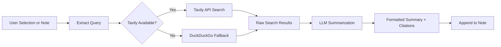

import TLDR from '@site/src/components/TLDR';

# Tudományos kutatás és web keresés

<TLDR>
**Notemd kérdezéseket a weben küld és LLM-összefoglalott eredményeket közvetlenül a jegyeidbe beír.** Tavily API az elsődleges keresési alapközpont; DuckDuckGo egy nulkonfigurációs lehetséges választék. A eredmények forrásokkal együtt összefoglalódnak és egy `## Research` címke alatt kerülnek hozzá. Támogatja a egyetlen jegyben történő kutatást, batch módú mappákban történő kutatást, valamint a összefoglalási lépéshez szóló munkavégzési modellek választását.

Ez része a [Obsidian AI tudományos kezelési útmutatójának](/docs/pillar-ai-knowledge).
</TLDR>

## Áttekintés

A tudományos kutatás az Notemd legerősebb integrációinak egyébé: az összekapcsolja a olvasást, a keresést és az írásot. Neked nem kell más böngészőbe válni, hogy egy ismeretlen termét keresd – eljelöld azt és hagyd, hogy Notemd keresse, összefoglalja és a találatokat hozzáírja – mind az összeállításodban.

A folyamat teljesen konfigurálható. Te válaszolod ki a keresési szolgáltatót, az LLM-t, amely az összefoglalást írja le, és azt is, hogy a eredmények kerülnek hozzá az aktív jegyhez vagy külön fájlokba íródnak. A batch módban egy kattintással lehet mappában lévő minden jegyet kutatni.

## Hogyan működik

### Keresés-után-összefoglalás folyamatára



1. **Kérések kiemelése** – Notemd kiemeli a keresési kifejezéseket a választott elemekből vagy a jegy címéből.
2. **Web keresés** – először próbálja meg Tavily. Ha nincs konfigurált API kulcs, automatikusan használja ki DuckDuckGo-t (kulcs nem szükséges).
3. **LLM összefoglalása** – A gyors keresési eredmények küldődnek a konfigurált LLM-ba, amely egy összefoglaló formátumú részletet készít ki, beleértve az inline forrásokat.
4. **Hozzáírás** – A formázott összefoglalás kerül hozzá egy `## Research` címke alatt az aktív jegyhez.

### Tavily vs. DuckDuckGo

| Aspektus | Tavily | DuckDuckGo |
|--------|--------|------------|
| API kulcs | Előnyeléges (ingyenes szint is létezik) | Nem elvárható |
| Eredmény minősége | Magasabb (kifejezetten AI-hez készült) | Elég a számos kérdés esetén |
| Háromlás korlátok | Nagyszerű ingyenes szint | Korlátozások vonatkoznak |
| Konfiguráció | `tavilyApiKey` beállításokban | Nulles beállítás – automatikus visszaállás |

### Halmazmappák kutatása

Kattints a mappára és válasszd **"Notemd: Kutatási mappa"**. A mappában lévő minden `.md` fájl sorrendben (vagy konfigurált egyidejűségig paralelně) feldolgozódik. Minden jegynek kapcsolódik hozzá saját kutatási összefoglalata.

## Konfiguráció

| Beállítás | Alapértelmezett | Hatás |
|---------|---------|--------|
| `tavilyApiKey` | `''` | Tavily API kulcs. Ha üres, kizárólag DuckDuckGo használódik. |
| `researchProvider` / `researchModel` | DeepSeek | Munkaalkalmazásos LLM a keresési eredmények összefoglalásához |
| `maxResearchContentTokens` | `4000` | Token-összege az LLM-ba küldett tartalomhoz. A túlterhelés keveredik le. |
| `researchAppendToNote` | `true` | Összefoglalást adjuk hozzá a forrásjegyhez. Ha false, készül el külön fájl. |
| `researchLanguage` | `'en'` | Összefoglalt kutatásnak használt kiinduló nyelv |

### Munkaalkalmazásos modellelési ajánlat

A kutatás előnyeinek eléréséhez szükség van olyan modellre, amely kezelheti a több nyelvű tartalmat és készíthet ki jó struktúrájú beszédből álló részleteket. Figyelembe vételével:

- **DeepSeek** -- alapértelmezett, olcsó, magas minőségű
- **GPT-4o** -- magasabb minőségű összefoglalások, magasabb ár
- **Gemini Flash** -- gyors és olcsó, jó választás egyszerű kérésekre

## példa

Egy tanulmányt olvasol, amely *transformer attention mechanisms* témáját 다룹니다, és egy ismeretlen termést találsz: *relative positional encoding*. Obsidian helyett nem hagyj meg a helyet:

1. **"relative positional encoding"**-ot jelöld ki
2. Kattints jobb gombbal --> **"Notemd: Kutatás és összefoglalás"**
3. Notemd weben keres, a legjobb eredményeket összefoglalja, és hozzáadja:

```markdown
## Research

### Relative Positional Encoding

Relative positional encoding is a method used in transformer models
where positional information is expressed as relative distances between
tokens rather than absolute positions. Introduced by Shaw et al. (2018),
it improves generalization to unseen sequence lengths compared to
absolute encodings (Vaswani et al., 2017).

Sources:
- [Shaw et al., Self-Attention with Relative Position Representations (2018)](https://arxiv.org/abs/1803.02155)
- [Transformer Positional Encoding Overview](https://example.com/transformer-pos-enc)
```

A összefoglalás most része a te tárgyaidadnak, kereshető, kötethető össze és offline is elérhető.

## Tippek

- **Legjobb eredményekhez állítj be egy Tavily kulcsot** -- még az ingyenes szint is jobb relevanciát nyújt, mint a szabad DuckDuckGo.
- **Használj egy hatékony összefoglalási modellt** -- olcsó modellek lehetővé teszik, hogy a finomhangos technikai tartalmak elmosolódjanak.
- **Bárkiutatás** tenni kell az első olvasás után, hogy egyaránt több feljegyzésben lévő hiányokat teljesíthessük.
- **Ellenőrizd a hozzáadott összefoglalásokat** -- LLM-ek lehet, hogy kitalálják a forrásinformációkat. ellenőrizd a fontos állításokat.

---

## További lépések

- [Concept Notes](./concept-notes) -- A kutatási eredményekből a kulcsfontosságú termékeket kivonj és tárolj
- [Wiki-Links](./wiki-links) -- A kutatásból származó koncepteket összekötj a te tárgyaidadban
- [Translation](./translation) -- A kutatási összefoglalásokat más nyelvre fordítsd
- [LLM Társadalmi szolgáltatók](/docs/providers/overview) -- Konfigurálja a összefoglaláshoz használt modellt
