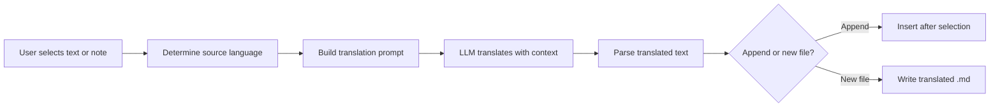

import TLDR from '@site/src/components/TLDR';

# Übersetzung

<TLDR>
**Notemd a tekstet 21+ nyelv között LLM-al működő fordítási technológiával fordít.** Támogatja a egyes részek fordítását, a teljes jegy fordítását és a batch mappák fordítását. Minden fordítási munkahoz lehet a munkahoz szóló beállítások segítségével speciális fornalmat és modellt használni. A kijelölt nyelv különlegesen beállítható a UI nyelvtől. A eredmények az igényre attól függően hozzáadódnak vagy új fájlba íródnak.

Ez része a [Obsidian AI tudományos kezelési útmutatójának](/docs/pillar-ai-knowledge).
</TLDR>

## Áttekintés

A Notemd-ban történő fordítás nem egy szótárkeresés – ez LLM-al működő, kontextusértékelési fordítás. A modell látja a teljes paragrafot vagy jegyet, így megőrzi a hangulatot, a területi terminológiait és a szavak sorrendjét. Ez lehetővé teszi magasabb minőségű eredményeket, mint a szóképernyőkénti szolgáltatásoknál, különösen technikai, akadémiai és kreatív írásoknál.

A funkció három területet támogat: választott rész, aktív jegy és teljes mappá. A munkahoz szóló modellválasztásval együtt használható egy gyors modell (Gemini Flash) az egyszerű fordításokhoz, és egy erős modell (Claude Sonnet) a finomhangulatú tartalmakhoz – azonban nincs szükség változtatni a globális fornalmat.

## Hogyan működik

### A Fordítási parancs



1. **Forrás megtalálása** – A LLM az anyag alapján általában megállapítja a forrásnyelvet. Nincs szükség manuálisan megadni azt.
2. **Leírás kialakítása** – A Notemd kialakít egy leírást, amelybe beleért a célnyelvet, valamint opcionális területi információt és a fordítandó tartalmat.
3. **LLM fordítás** – A beállított `translateProvider` / `translateModel` feldolgozza a kérést. A modell megőrzi a markdown formátumot, a wiki-hivatkozásokat és a kódblokkokat.
4. **Kijelentés** – A fordított tekst az eredeti tartalom alá hozzáadódnak vagy új fájlba íródnak a tárolóba.

### Nyelvparcelek

A Notemd támogat bármely olyan nyelvparcst, amit a belső LLM támogat. Gyakori parcelek közé tartoznak:

| Forrásnyelv | Célpont | Tipikus minőség |
|--------|--------|----------------|
| Angol | Kínai (simplifikált) | Kiváló |
| kínai | angol | kiváló |
| angol | japánzi | teljesen jó |
| angol | német / francia / spanyol | teljesen jó |
| bármely támogatott nyelv | bármely támogatott nyelv | modelltől függően |

A `translateLanguage` beállítás kontrollálja a **kijelölt nyelvet**. A forrásnyelv automatikusan azonosítódik.

### Munkaalapú modell választása

A fordítási minőség erősen függ a modelltől. A Notemd lehetővé teszi, hogy speciális modellt csak a fordításra használhasson az ember.

| Modell | Hajtássebesség | Minőség | Ár | Legjobb használati esetek |
|-------|-------|--------|------|----------|
| `gemini-2.0-flash-exp` | Sok sebességű | Jó | Kisebb | Kézi, nagy mennyiségű munka |
| `gpt-4o-mini` | Sok sebességű | Jó | Kisebb | Rákérdezések gyors megválaszolása |
| `deepseek-chat` | Közepes | Jó | Kivéleg alacsony | Összefoglaló több nyelvű verzió |
| `claude-3-5-sonnet` | Közepes | Kiváló | Közepes | Technikai / akadémiai |
| `gpt-4o` | Közepes | Kiváló | Közepes | Nüanszokra érzékes írásstílus |

### Halmazmappák übersetése

A mappára jobb kattintson és válassza ki **"Notemd: Mappát übersetni"**, hogy überszóljön minden jegyet abban a mappában. Minden fájl függetlenül kezelődik. A konvergenci beállítás határozza meg, hány fájl überszolódik egyaránt.

## Konfiguráció

| Beállítás | Alapértelmezett | Hatás |
|---------|---------|--------|
| `translateProvider` / `translateModel` | DeepSeek | Übersetési munkákokhoz kifejezetten tervezett szolgáltató |
| `translateLanguage` | `'en'` | Célképző nyelv |
| `translationAppendToNote` | `true` | A überszolt szöveget a létrehozott szöveg alá adjon. Ha false, új fájl keletkezik. |
| `batchConcurrency` | `3` | Halmazübersetés során egyaránt kezelődő fájlok száma |

## példa

Kínai nyelvű kutatási jegyet olvas, és angol változatot szeretnél kapni:

1. Jegyet nyitson
2. Jobb kattintás --> **"Notemd: Jelenlegi fájlt übersetni"**
3. Notemd azonosítja a kínai nyelvet, überszólja a beállított célnyelvbe (angolba), és adjon hozzá:

```markdown
## Translation (English)

The experimental results show that the proposed method achieves
a 12% improvement in F1 score compared to the baseline, primarily
due to the enhanced feature extraction module described in Section 3.
```

A valódi kínai szöveg a überszölés felett megmarad. A `## Translation` címzés mindkét verziót egyben tartja a fájlban, hogy könnyen lehetne hivatkozni rá.

## Tippek

- **Használja a Gemini Flash-t nagy mennyiségű übersetéshez** -- ez a leggyorsabb és legolcsóbb opció nagy mappák halmazübersetéséhez.
- **A wikilinkek megőrzése** -- Notemd kérelése szerint a LLMnek kell `[[wiki-links]]`-t a fordítás során teljesen megőriznie. Fordítás után ellenőrizze, mert néhány modelle esetleg elszabadítja őket.
- **A kiinduló nyelv beállítása** -- az automatikus azonosítás működik a forrásnyelven, de mindig kell konfigurálni a `translateLanguage`-t, hogy nincs összetevés a célnyelvben.
- **A koncepcióleírások batch-fordítása** -- ha a koncepciómappa egy nyelven van, de más nyelven kellene lennie, a mappaszintű fordítás ezt egy lépésben kezelheti.

---

## További lépések

- [Research](./research) -- Bármilyen nyelven keresés és összefoglalás, majd a eredmények fordítása
- [Workflows](./workflows) -- Wikilinkelés vagy koncepciók kiemelésevel szereplő fordítási sorozatok
- [Batch Processing](/docs/advanced/batch-processing) -- Mappafolyamatokhoz vonatkozó egybenműködés és felelősségi elhatározások
- [LLM Providers](/docs/providers/overview) -- Válassza ki a legjobb modellet a nyelvpárja számára
