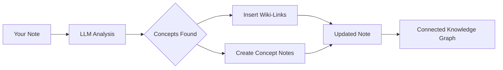

import TLDR from '@site/src/components/TLDR';

# Wiki-Linkek

<TLDR>
**Notemd automatikusan hozzáadja `[[wiki-links]]` a feljegyzésekétekben lévő kluczfontosságú konceptekhez.** A LLM olvasja a tartalmat, azonosítja a kontextusban lévő fontos kifejezéseket, és minden esetben beilleszi Obsidian-stílusú Wiki-Linkeket. Választhatóan készít meg konceptfeljegyzéseket távolhívásokkal. Támogatja a szinonimák leképezését, a nevetsítés/hozzáadáskor a linkek integritását, valamint a teljesen kivonási módot (nem történik fájl módosítása). A Auto Linktől eltérően, amely csak meglévő feljegyzés címeket használ, Notemd az AI-t használ a új konceptek azonosítására és a megfelelő feljegyzések készítésére. Ez része a [Obsidian AI tudományos kezelési útmutatójának](/docs/pillar-ai-knowledge).
</TLDR>

## Áttekintés

Wiki-Linkek hozzáadása az Notemd alapvető funkciója. Egy általános szöveget egy összekött kapcsolatokból álló tudományos grafikonként változtatja meg az alábbi módon:

1. **Az LLM segítségével az feljegyzést analizálja**
2. **Kluczfontosságú koncepteket azonosítja** (kifejezések, személyek, metodák, teoríák)
3. **Minden esetben hozzáadja `[[wiki-links]]`**
4. **Választhatóan készít meg konceptfeljegyzéseket** távolhívásokkal

## Hogyan működik

### Folyamat



### példa

**Előtt:**
```markdown
Machine learning models use neural networks to learn patterns from data.
The transformer architecture revolutionized natural language processing.
```

**Után:**
```markdown
[[Machine learning]] models use [[neural networks]] to learn patterns from data.
The [[transformer architecture]] revolutionized [[natural language processing]].
```

## Használat

### Alap: Hozzáadás linkeket a jelenlegi feljegyzéshez

1. Nyitja meg egy feljegyzést
2. Kattintson kézzel a szerkesztőben → **"Folyamatítja a fájlt (hozzáadja linkeket)"**
3. Várjon néhány másodpercet
4. A konceptek most már összeköttek!

### Bárcs: Kezelj több figyelmet

1. Kattints jobb kattintással egy mappára a fájlkeresőben
2. Válassza ki **"Notemd: Process folder (add links)"**-t
3. Konfigurálás:
   - Konkurenccs (mennyi fájl paralellegben)
   - Átírja a meglévő hivatkozásokat (igen/nem)
4. Kattints **Kezelés**-re

### Selektív: Hivatkozz specifikus szökekre

1. Hajtas ki a kezelendő szöveget
2. Kattints jobb kattintással → **"Kezelje a választott részt (hivatkozások hozzáadása)"**
3. Csak a felhajtott rész kerül analízishez

## Notemd vs Auto Link

Obsidian két módot biztosít az automatikus wiki-hivatkozásokhoz:

| | **Auto Link** | **Notemd** |
|--|---------------|-------------|
| Hivatkozás forrása | A tárolóban lévő meglévő figyelmetek címek | A LLM által az anyagban azonosított konceptek |
| Új konceptekkel kötés lehet létrehozni | Nem – a cím már létezni kell | Igen – a AI azonosítja a koncepteket és készít meg a figyelemeket |
| Synonym handling | Nem | Igen – a synonym suppression funkció használata |
| Konceptfigyelemek készítése | Nem | Igen – visszalinkekkel és duplikátok elszűrésével |
| Halmagkezelés | Nem (egy fájl), | Igen (mappatasemén) |
| Munkaalkalmazásokhoz szóló modellek irányítása | Nem | Igen |

**Auto Link** címekkel összeillik: ha „Machine Learning” nevű egy figyelem létezik, az `[[Machine Learning]]`-ba összefogja a megjelenéseket. Ha a figyelem nincs, semmi nem történik.

**Notemd** az AI vezeti: a LLM olvasja a tartalmadat, megérti a kontextust, azonosítja a koncepteket, amelyeknek *kötésük* kell lennie – még ha még nincs ilyen figyelem is – és készít meg az összefüggést és a konceptfigyelemet.

## Funkciók

### Synonym Suppression

**Probléma:** „transformer“, „transformers“, „Transformer architecture” → 3 különböző koncept

**Löszer:** Notemd az egymáshoz hasonló elemeket azonosítja és a kanonikus formát használja.

**Konfiguráció:**
```
Settings → Advanced → Synonym Suppression
Threshold: 0.8 (0 = off, 1 = aggressive)
```

### Link integritása

**Amikor nevezészi át egy konceptnote-t:**
- Az összes wiki-hivatkozás automatikusan frissül (Obsidian alapfunkció)
- A visszahivatkozások megmaradnak

**Amikor törljük egy konceptnote-t:**
- A hivatkozások maradnak, de „nem kapcsolódó menetekként” jelennek meg
- Bármilyen helyről lehet újra létrehozni

### Tisztas kihasználási módszer

**Kihagyja a koncepteket, anélkül hogy módosítaná az eredeti fájlt:**

1. Jobb kattintás → **„Kihagyja a koncepteket (nem kapcsolódóként)”**
2. A konceptnote-k létrejönnek
3. Az eredeti fájl megmarad

Használati eset: Olvasói jogú tartalom vagy végleges verziók kezelése.

## Konceptnote kialakítása

### Automatikus kialakítás

**Ha aktiválva van (alapértelmezett), Notemd készít ki:**

```markdown
---
tags: [concept, auto-generated]
created: 2026-06-13
source: [[Original Note Name]]
---

# Machine Learning

A branch of artificial intelligence that enables computers
to learn from data without explicit programming.

## Occurrences in Your Vault

- [[Original Note Name#Section]]
- [[Another Note#Header]]

## Related Concepts

- [[Neural Networks]]
- [[Deep Learning]]
- [[Supervised Learning]]
```

### Konfiguráció

**Kimenet mappája:**
```
Settings → Output → Concept Folder
Default: concepts/
```

**Hierarchikus struktúra:**
```
Settings → Output → Use Hierarchical Folders
If enabled:
  papers/my-paper.md → papers/concepts/Concept.md
If disabled:
  → concepts/Concept.md
```

**Szabvány:**
```
Settings → Output → Concept Template
Customize with variables:
  {{concept}} — Concept name
  {{description}} — LLM-generated description
  {{backlinks}} — List of source notes
  {{date}} — Creation date
```

## Előre tervezett opciók

### Kontextus ablaka

**Mennyi környezeti szöveget küldni:**

```
Settings → Linking → Context Window
Options: Sentence | Paragraph | Full Note
Default: Paragraph
```

Nagyobb érték = jobb pontosítás, magasabb költség.

### Minimum jelentésesség száma

**Csak azokat a koncepteket kötjük össze, amelyek többször jelennek meg:**

```
Settings → Linking → Min Occurrences
Default: 1 (link all)
```

2 vagy 3-re állítva lehet fókuszolni a gyakori tématákra.

### Kizárási módulok

**Elhagyjuk bizonyos szavakat:**

```
Settings → Linking → Exclude List
Example: note, idea, example, thing
```

Ez megakadályozza a generikus kifejezések túlzott kötését.

### Szerkeszthető kérdések

**Átírjuk az alapértelmezett LLM instrukciókat:**

```
Settings → Advanced → Custom Linking Prompt
Default:
  "Identify key concepts, theories, methods, and technical
   terms in the following text. Return as a list..."
```

Módosítsuk a doménai specifikus igényekhez (pl. "Fókuszoljunk a médicai terminológiara").

## Tippek és a legjobb praktikák

### ✅ CSELEKEDJ

- **Kezelj az értékeléseket 100 szóval több** — Rövid értékelések kevés konceptet adnak létre
- **Használj erős modellt** a jobb konceptidentifikációhoz (GPT-4o, Claude)
- **Ellenőrizd előtt fogadod** — ellenőrizd, hogy a javasolt hivatkozások logikusak legyenek
- **Alakítsd iteratívul** — kezelj 5-10 értékelést, ellenőrizd a grafikonot, módosítsd a beállításokat

### ❌ NE CSELEKEDJ

- **Túl sok hivatkozást adj** — nem minden névnek hivatkozás van szüksége
- **Kezelj újra az előszörírást** — a konceptek változhatnak, várj, amíg stabilak lesznek
- **Ignorálj a szinonimákat** — aktiváld a leképezést, hogy elkerüljed a "ML" és a "Machine Learning" különbségét

## Teljesítmény

### Hajtássebesség

| Értékelés mérete | GPT-4o-mini | Claude Sonnet | Ollama (lokal) |
|-----------|-------------|---------------|----------------|
| 500 szó | 2-3 másodpercek | 3-5 másodpercek | 5-10 másodpercek |
| 2000 szó | 5-8 másodpercek | 10-15 másodpercek | 20-40 másodpercek |
| 5000+ szó | Kisebb blokkokban (másik kérések) | Részletes | Részletes |

### Árértékelés

**Példa: 1000 szóból álló jegyzet a GPT-4o-minivel**
- Bevétel: ~1500 token
- Kimenet: ~200 token
- Ár: ~

**100 jegyzet összekeverésének feldolgozása:** körülbelül $0.10

## Hibaelhárítás

### Nincs hivatkozás megadva

**Ellenőrzés:**
1. LLM kérések sikerültek (Beállítások → Diagnozis)
2. A figyelemnek elég tartalma van (>50 szó).
3. A koncepciók technikai/specifikusak (nem csak névmutatók).

**Próbáljuk:**
- Használj egy erősebb modellt
- Növelje a kontextus ablakot
- Ellenőrizz a API kulcs valóságságát

### Túl sok hivatkozás

**Lösések:**
1. Növelje a minimális előfordulások számát (2 vagy 3)
2. Hozzáadja a népszerű szavakat az kizárás listaához
3. Használj egy kevésbé agresszív modellt

### Hibás konceptek kötődtek össze

**Elrendezések:**
1. Használj személyre szabott kérést a domén specifikusításához
2. Hajtson lépélyezési leképezés be
3. Ellátogasson manuálisan és távolítsa el a kötéseket

### A hivatkozások megváltoztatás után rosszul működnek

**Ez normál Obsidian viselkedés.**

Minden hivatkozást frissítéshez:
1. Nevezz át a konceptleírást
2. Obsidian automatikusan frissíti `[[old]]` → `[[new]]`

---

## További lépések

- 📖 [Konceptleírások](./concept-notes) — Befejezettséges információk a konceptleírás kialakításáról
- 🔍 [Tudományos integráció](./research) — Összekapcsolja a hivatkozásokat a web-tudományi kutatásokkal
- 🎨 [Diagramok](./diagrams) — Visualizálja a tudományos grafikonját
