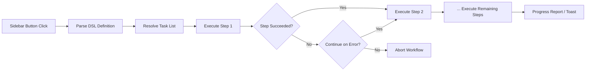

import TLDR from '@site/src/components/TLDR';

# Munkafolyamok

<TLDR>
**Notemd A munkafolyamok több munkát egyetlen kattintással elvégzhető műveletként összeköti.** `add-links > extract-concepts > research > diagram` használatával egyszerű DSL-vel definiálhatóak a sorrendek. A munkafolyamok táblázatoldal gombokként jelennek meg, amelyek az aktuális feljegyzésen vagy mappában az összes műveletet elvégeznek. Előre beállított munkafolyamok is vannak; a beállításokban lehet személyre szabottakat is készíteni. Minden lépés használja saját, munkánkénti konfigurációs modellét.

Ez része a [Obsidian AI tudományos kezelési útmutatójának](/docs/pillar-ai-knowledge).
</TLDR>

## Áttekintés

Egy munkafolyam elszabadítja a munkákat egy-egyre elvégezési fájdalmat. Helyett abban, hogy négy alkalommal jobb-kattintson az összekötés hozzáadására, a konceptek kihozására, ismeretlen kifejezések kutatására és egy diagram készítésére, csak egy táblázatoldal gombot kell nyomni, és az összes művelet elvégeződik. Notemd kezelje a sorrendet, a hibák terjedését és a fejlépési jelentéseket.

A munkafolyamok egy légképes DSL-ben (területspecifikus nyelvben) definiálódnak. Ezek a beállításokban találhatók, Obsidian táblázatoldal gombokként jelennek meg, és őket az aktuális feljegyzésre vagy egy teljes mappára is alkalmazhatók.

## Hogyan működik

### Munkafolyamok elvégezési folyamatútja



1. **Átalakítás** -- A DSL szövege `>` (vagy `>`) alapján az ordinaльis munkaidentifikátorok listájába oszlik.
2. **Megoldás** -- Minden identifikátor egy belső parancshoz kapcsolódik (add-links, extract-concepts, research, translate, diagram stb.).
3. **Elvégezés** -- A lépések sorrendben elvégződnek. Minden lépés használja a konfigurált, munkánkénti fornítót és modellét.
4. **Hibák kezelése** -- Ha egy lépés nem sikerül, a munkafolyam vagy leáll, vagy továbbra is az utóbbi lépésre halad, attól függően, milyen hibavédelemi stratégiát használ.
5. **Befejezés** -- Egy üzenetjelző tájékoztatja a sikerről vagy listázza az érvénytelen lépéseket.

### DSL formátuma

A munkafolyamok `>`-kel elválasztott munkaidentifikátorok sorrende olarak definiálódnak:

```
process-current-add-links>extract-concepts-current>research-and-summarize
```

**Létrehozható munkaidentifikátorok:**

| Identifikátor | Ellenőrzés |
|------------|--------|
| `process-current-add-links` | Hozz létre wiki-hivatkozásokat a aktív felirathoz |
| `extract-concepts-current` | Kivegyj a koncepteket a aktív feliratból |
| `research-and-summarize` | Keress információt a kiválasztott szöveg vagy felirat címéről |
| `process-current-translate` | Ügyelj át a aktív feliratot |
| `summarize-to-mermaid` | Készíts el egy diagramot a aktív feliratból |
| `generate-from-title` | Készíts el tartalmat a felirat címéről |
| `extract-original-text` | Kivegyj a eredeti szöveget (OCR/skannált tartalomhoz) |

**Mappataseménki variánsok**: helyettesítsd `current`-t `folder`-vel az azonosító nevben.

### Elődefinált és kiszolgált munkafolyamatok

Notemd rendelkezik előkészült munkafolyamatokkal a gyakori szabályzatokhoz:

| Munkafolyamat | Hálózat | Használati esetek |
|----------|-------|----------|
| **Egy kattintással kivégzés** | add-links > extract-concepts > research | Kezelj egy kutatási tanulmányt egyetlen lépéssel |
| **Teljes folyamatköri rendszer** | add-links > extract-conceptek > kutatás > diagram | Teljes tudalmi extrakció vizualizációs segítségével |
| **Übersetzen + Verlinken** | übersetzen > add-links | A koncepteket az ülendszínbeli nyelven übersetjük és verlinkeljük |

**Szerkesztési folyamatok** beállításokban készülnek ki:

1. Nyitja meg a **Beállításokat** --> **Notemd** --> **Folyamatok**
2. Kattintson a **"Folyamat hozzáadása"** gombra
3. Írja be a DSL sorozatot (pl. `process-current-add-links>extract-concepts-current`)
4. Adja nevet a megjelenítési nevekhez (pl. "Szybú verlink + Extrakció")
5. A új gomb azonnal jelentkezik a sávoldalon

## Konfiguráció

| Beállítás | Alapértelmezett | Hatás |
|---------|---------|--------|
| `workflows` | Előre meghatározott készlet | Folyamatok definiciói arraya (nev + DSL) |
| `workflowContinueOnError` | `true` | Ha a jelen lépés nem sikerül, folytassa a következő lépésre |
| `workflowShowProgress` | `true` | Mindent megfelelően végezett lépés után jelenik meg egy fejlépési üzenet |

### Folyamatokban lévő feladatspecifikus modellek

Egy munkafolyam minden lépése használ saját, szempontos modellkonfigurációját. Néhány modellt nem kell specifikálni a DSL benne. A megoldás sorrende az alábbiak:

1. Ha `useMultiModelSettings` van, akkor a szempontos fornalmazó/modell használódik
2. Azonkívül globális `activeProvider` használódik

Ez azt jelenti, hogy `add-links` lehet működni DeepSeek-on, miközben `research` működik a GPT-4o-n – mind azok a folyamatok azonos munkafolyam kattintásával történnek.

## példa

Most importáltátok egy PDF-t, amely egy masinlernévelési tanulmányt tartalmaz, és szeretnél teljes tudalmi extrakciót:

1. Nyitj meg az importált figyelmet
2. Kattints a **"Full Pipeline"** oldalsávon lévő gombra
3. Notemd elindítja a következőket:
   - **1. lépés**: Hozz létre wiki-hivatkozásokat – `[[attention mechanism]]`, `[[transformer]]` stb.
   - **2. lépés**: Kiválaszd a koncepteket – készít meg konceptfigyelmeteket a konceptmappádban
   - **3. lépés**: Kutatás – összefoglalja a webforrásokat a kulcskifejezésekhez
   - **4. lépés**: Diagram – készít meg egy Mermaid-os gondolatterületet a tanulmány struktúrájára
4. Körülbelül 30 másodperc után a figyelmeted hivatkozásokkal rendelkezik, konceptfigyelmetek vannak, a kutatás tárgyaként van beleírva, és egy diagramfájl is mentésre kerül

Mind ezek egyetlen kattintással történnek.

## Tippek

- **Kezdj el előredefinált munkafolyamokkal** – ők lefedik a leggyakoribb szabályzatokat. Csak akkor kialakítsd újra, ha egy másik sorrendet szeretnéd.
- **Engedélyezd az `workflowContinueOnError`-t** – egy nem sikerült diagramlépés nem szabad leállítani a teljes folyamatot.
- **Használj mappavéleti munkafolyamatokat** a masszív feldolgozáshoz – kattints jobb billentyűvel egy mappára, válasszd egy munkafolyamot, és minden jegy feldolgozódik.
- **Nevezd a munkafolyamatokat klarán** – a sávszél területe korlátozott. Használj rövid, cselekvésirányú neveket, például "Rágrazás" vagy "Übersetzen + Linken".

---

## További lépések

- [Research](./research) – Megértsd, mire szolgál a kutatási lépés, mielőtt hozzáadod azt a munkafolyamokhoz
- [Wiki-Links](./wiki-links) – A legtöbb munkafolyamban használt alapvető kötési funkció
- [Concept Notes](./concept-notes) – Konceptek kiemelése mint munkafolyamlépés
- [Batch Processing](/docs/advanced/batch-processing) – Mappavéleti munkafolyamatokhoz szóló egybenműködés és fejlépés jelentése
