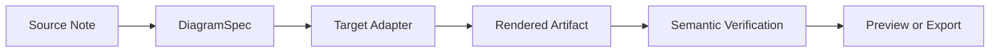
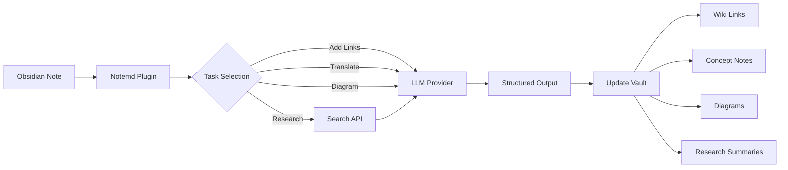

import TLDR from '@site/src/components/TLDR';

# Útmutató a Notemd-ra

<TLDR>
**Notemd** (Note + EMD — Enhanced Markdown Documents) egy nyílt forráskódú Obsidian plugín, amely LLM-támogatott olvasást biztonságos tudalmába transformál. A chat-bázisú AI-khoz képest, ahol az információk a szession lezárás után eltűnnek, Notemd a eredményeket **direktan a váltódba** ír be wikilinkként, koncept jegyeiként, kutatási összefoglalásokként, fordításokként, munkafolyamatokként és diagramokként. Ez a megoldás azoknak a kutatóknak, tanulóknak és tudalmi munkavégzőknak szól, akik szeretnék, hogy az olvasásuk, kutatásuk és visuális magyarázataik egy struktúrállt, fejlődő tudalmi grafikonba gyűljönek össze.
</TLDR>

## Mi a Notemd?

Notemd **30+ nagy nyelvtan modellét** (OpenAI, Anthropic, Google, DeepSeek, Qwen, Ollama és többet) az Obsidian munkafolyamodba integrálja, hogy automatikusan tudalmi extrakciót, organizációt, fordítást, kutatást és diagram készítést végezze el.

### Fő különbség: áthajtó vs. biztonságos tudalom

| Aspektus | Chat-bázisú AI (ChatGPT stb.) | Notemd |
|--------|-------------------------------|--------|
| **Ahol kerülnek el a eredmények** | Chat-történet (eltűnik) | A Obsidian váltód (marad meg) |
| **Formátum** | Szerkeszthető szövegbeni válaszok | Struktúrállt fájlok: `[[wiki-links]]`, koncept jegyeik, diagramok |
| **Hosszú távú értéke** | Mindenkor újra kell kérni | Gyűjül össze egy tudalmi grafikonba |
| **Offline hozzáférés** | Internet elvégződése szükséges | Teljesen offline működik Ollama-val |

## Alapvető képességek

### 1. **Autómatikus Wiki-kötelés**
- LLM az összefoglalóaidban lévő kulcskoncepteket azonosítja
- Ír be `[[wiki-links]]` minden jelentkezésnél
- Választhatóan készíti ki kötött konceptösszefoglalókat
- Központi kifejezések elrejtése duplikátok elkerüléséhez

### 2. **Konceptösszefoglaló kialakítása**
- Kivágtatja a mértékelések, cikkek és összefoglalókából a kulcskoncepteket
- Készíti ki speciális konceptfájlokat távolszággal kapcsolódó hivatkozásokkal
- Megszabható kijelzőutak és szablontok

### 3. **Web-recherche integráció**
- Kérdezhető Tavily vagy DuckDuckGo belül a Obsidian-ból
- LLM összefoglalja a eredményeket forrásokkal együtt
- A kutatási eredményeket a jelen lépécbe hozzáadja

### 4. **Köznyelvi fordítás**
- Választott részeket vagy az összes lépécet fordítsa le
- 21-től több UI nyelvet támogat
- Külön fejleszthető kiinduló nyelv beállítása
- Halmagos fordítás támogatása

### 5. **Diagramok készítése**
- **Mermaid**: Flussdiagramok, sorrend-, osztály-, állapot-, ER-, Gantt-diagramok
- **JSON Canvas**: Obsidian helyi layoutok
- **Vega-Lite**: Adatdiagramok, időszakos diagramok, szóródiagramok
- **HTML / Redigeálható HTML/SVG**: Semantikus figyelmeztetésekkel rendelkező, sajtalmatlan képalkotások
- **Draw.io / Drawnix alkotás határai**: A karbantarthatóság fenntartóinak számára készült export útjai a sama semantikus képmodellből
- **Circuit diagrams roadmap**: circuitikz/TikZJax támogatása fejlesztése az arany referenciák, korlátozott leírások, renderelési visszajelzések és topológiá/jellegzés ellenőrzése alapján történik, nem a szablonmentes LLM TikZ alapján
- **Előnézeti diagnostika**: A renderelt alkotások lehetővé teszik a kompilálási/renderelési hibák diagnostikáját, és a nélkülöli források ellenőrzésehez nem szükséges plugin-alapú LaTeX futtatása
- Mermaid hibáknak szintaxis automatikus kihirdése

### 6. **Egy kattintással működő munkafolyamatok**
- Kétszörös műveleteket sorozhatók össze sávoldal gombokká
- DSL-alapú munkafolyam definiálása
- Példa: `add-links > extract-concepts > research > diagram`

## Ki használja kell Notemd?

✅ **Tudományosok**, akik olvasnak tanulmányokat és készítik ki irodalmi áttekintéseket
✅ **Összefoglalók**, akik szerveznek tanulási figyelemkönyveket és létrehoznak konceptmapokat
✅ **Igazságos munkások**, akik szeretnék, hogy a olvasási értékeléseik maradjanak
✅ **Kétnyelvű profiok**, akiknek szüksége van fordításra + wiki-hivatkozásokra
✅ **Privátiságot szerető felhasználók**, akik kívánják a helyi LLM támogatást (Ollama)
✅ **Erős felhasználók**, akik szabályozzák a parancsokat és munkafolyamokat

## Miért Notemd + Obsidian?

**Obsidian** egy helyi prioritású, markdown-alapú tudományos bázis. **Notemd** hozzáad meg AI-es kiválóságokat:
- A adatokat a saját tárolódban tartja (nem egy felhőszolgáltatásban)
- Helyi modellekkel működik offline
- Inkább és nyílt forráskódú (MIT licenc)
- Összekapcsolható a meglévő Obsidian pluginekkel
- Ezheti a tömegét dzieszközezre ezerek számára jelölt nékerekre

## Elkezdés

1. **Írás**: Beállítások → Közösségi plug-inek → Keresés → "Notemd"
2. **Konfigurálás**: Hozzáadja a saját LLM fornalmazó API kulcsát (vagy használja a helyi Ollama-t)
3. **Próbálja ki**: Nyitja egy néket → Kattintson a jobb gombbal → "Fájl feldolgozása (hivatkozások hozzáadása)"
4. **Keresés**: Ellenőrizze a oldalságot egy kattintással elvégzhető munkafolyamatokhoz

👉 [Írásirányító útmutató](./getting-started/installation) | [Rápid kezdési tanulmány](./getting-started/quick-start)

## Diagrammok képességei irányája

Notemd diagrammok kezelése elhagyja a "modellt kérdezve egy szintaxis stringot írására" módot, és érdemelkedik egy szintezett folyamatrendszer felé:

A jelenlegi implementáció már támogatja Mermaid, JSON Canvas, Vega-Lite, HTML lehetséges alternatívákat, módosítható HTML/SVG-t, Draw.io XML artefaktumokat, egy minimális Drawnix JSON almenyét, előnyugrásdi diagnostikát/közel-kód alapú lehetséges alternatívákat, valamint egy offline `CircuitSpec -> circuitikz` prototípust az általános forráskód és CMOS invertzor gyümölcsmóduláinak számára. A szolgáltatások diagrammai egy kevesebb elérhető kategória: circuitikz képes pontos elektrikai topológiát kifejezni, de korlátlan LLM kimenet gyakran nem olvasható útvonalokat vagy nem renderelhető LaTeX-ket hozhat létre. A következő irány az, hogy circuitikz-t korlátozzuk gyümölcsmódulákkal rendelkező szabványos szablonok, üggetekrényes layout szabályok, renderelési diagnostika és képernyőkép-visszajelzési körzetek segítségével.

További részleteket olvasson meg a [Diagrammok](./features/diagrams) című dokumentumban.

## Architektúra

## Notemd vs más Obsidian AI plug-inek

A legtöbb Obsidian AI plug-in konverzációs alapú (átkérdezés, AI válaszol, a tudnivalók maradnak a chatben). Notemd pedig **írás-alapú**: az AI feldolgozza a nékereit és írja a struktúrált eredményeket közvetlenül a tárolóba.

| Képességek | Notemd | Copilot | Smart Connections | Text Generator |
|-----------|--------|---------|-------------------|-----------------|
| Autó wiki-hivatkozás beállítása | Igen | Nem | Nem | Nem |
| Konceptleírás készítése | Igen (hivatkozásokkal + duplikátok elszűrésével) | Nem | Nem | Nem |
| Diagramm készítése | Igen (Mermaid, Canvas, Vega-Lite, HTML, szerkeszthető artefektek) | Nem | Nem | Nem |
| Webes kutatás integrációja | Igen (Tavily + DuckDuckGo) | Nem | Nem | Nem |
| Halmazos mappák feldolgozása | Igen | Korlátozott | Nem | Korlátozott |
| Munkaalkalmazásokhoz szóló modellek irányítása | Igen (7 munka, független modellek) | Nem | Nem | Nem |
| Egy kattintással működő munkafolyamok | Igen (DSL) | Nem | Nem | Nem |
| Übersetzung (halmazos) | Igen | Nem | Nem | Nem |
| Chatt a tárolóval | Nem | Igen | Nem | Nem |
| Semantikus hasonlóság keresése | Nem | Nem | Igen | Nem |
| Őrvezeték alapú készítés | Nem | Nem | Nem | Igen |
| LLM biztosítók | 36 (mégköri + átjáró + helyi) | 3-5 | 2-3 | 3-5 |
| Teljesen offline | Igen (Ollama) | Árnyékos | Árnyékos | Árnyékos |

**Mikor válaszd el Notemd**: Ha szeretnéd, hogy a számítógépintézett intelligencia létrehozza egy tartós tudományos grafot – nem csak beszéljen a te figyelemzedről.

**Mikor válaszd az Copilot-t**: Ha szeretnéd egy konverzációs AI-asszistentet a Obsidian belül.

**Mikor válaszd az Smart Connections-t**: Ha szeretnéd semantikus keresés segítségével megtudni a jegyek közötti már létező kapcsolatokat.

## Filozófia

**Notemd szerint a számítástechnika az emberi tudományos munkát fejleszteni kell, nem helyettesíteni.** A plug-in:
- Megőrzi a kontrollot az Ön kezében (ellenőrizze előtt, hogy változásokat alkalmazza).
- A kontextust tárolja (minden eredmény visszahívódik a forrásra)
- Tiszteletben tartja a privátosságot (lokális LLM támogatás, nincs telemetria)
- További fejlesztésre alkalmas (nyitott APIs, személyre szabott munkafolyamok)

<!-- notemd-acknowledgments -->
## Köszönetnyilvánítás és referenciaprojektek

A Notemd karbantartása függetlenül történik. Köszönjük azoknak a nyílt forráskódú projekteknek és közösségeknek a munkáját, amelyek dokumentált tervezési döntéseket inspiráltak vagy integrációs alapokat biztosítanak. A felsorolás csak a hatást vagy az interoperabilitást ismeri el; nem jelent jóváhagyást, kapcsolatot, mellékelt kódot vagy kódújrahasználati állítást.

- **Referenciaprojektek:** [cloudy-tech-diagrams-skill](https://github.com/cloudy-liu/cloudy-tech-diagrams-skill), [Drawnix](https://github.com/plait-board/drawnix), [diagrams.net / draw.io](https://www.diagrams.net/), [repo-saga](https://github.com/teee32/repo-saga).
- **Nyílt forráskódú alapok:** [Mermaid](https://github.com/mermaid-js/mermaid), [Vega-Lite](https://vega.github.io/vega-lite/), [Slidev](https://github.com/slidevjs/slidev), [CircuitikZ](https://github.com/circuitikz/circuitikz), [Tectonic](https://github.com/tectonic-typesetting/tectonic), [Docusaurus](https://docusaurus.io).
- Minden projekt megtartja saját licencét és feltételeit; a Notemd [MIT licenc](https://github.com/Jacobinwwey/obsidian-NotEMD/blob/main/LICENSE) alatt érhető el.

## Nyílt forráskód

- **Licenc**: MIT
- **Forrás**: [github.com/Jacobinwwey/obsidian-NotEMD](https://github.com/Jacobinwwey/obsidian-NotEMD)
- **Közösség**: [Discord](https://discord.gg/qnGgsQ9W) | [GitHub Discussions](https://github.com/Jacobinwwey/obsidian-NotEMD/discussions)
- **Társulás**: PR-k kiválóan fogadók, nézzük meg a [CONTRIBUTING.md](https://github.com/Jacobinwwey/obsidian-NotEMD/blob/main/CONTRIBUTING.md)-t

---

**További lépés**: [Installation →](./getting-started/installation)
