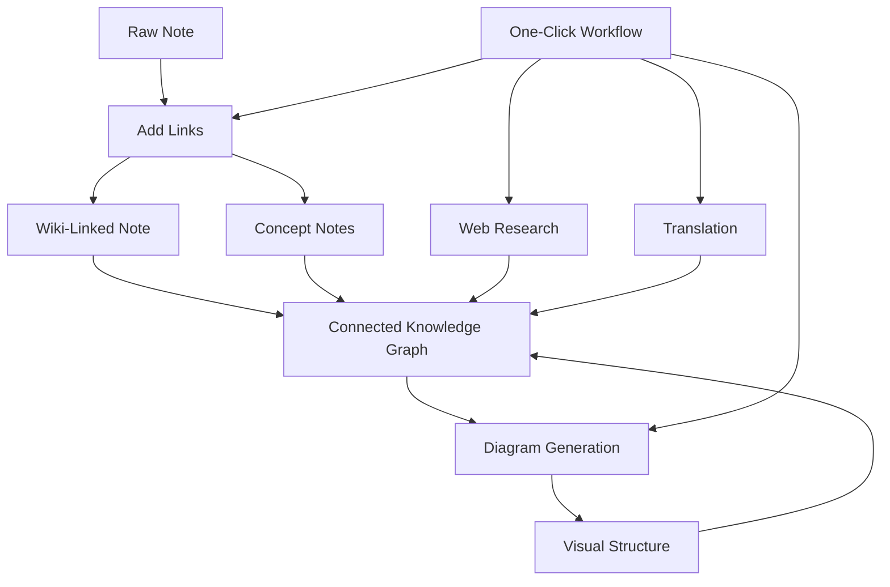

import TLDR from '@site/src/components/TLDR';

# Obsidian AI tudományos kezelési útmutató

<TLDR>
**Notemd az LLM-al működő olvasást örökkévaló tudományos információkba változtat: wiki-hivatkozások összekapcsolják a koncepteket, a konceptleírások egy elérhető grafikonot létrehoznak, a kutatás bevonja a web tartalmát a bázisba, a fordítás megszűrje a nyelvi korlátokat, a diagramok megjelenítenek a struktúrat, és a munkafolyamatok összekötik mindent egy kattintással.** Ez a útmutató leírja az összes lépést – a szöveges leírásoktól kezdve egy összekapcsolott, visuális, többnyelvű tudományos bázisig.
</TLDR>

## Miért használni az AI-t a tudományos kezelésben?

A hagyományos feljegyzészárás csak egyszerű fájlokat hoz létre. Even with manual wiki-links, most notes stay disconnected. Notemd uses LLMs to automate the connection layer:

- **LLMs olvasják a tartalmadat** és kiderítsék, mikor fontos – termékek, módszerek, személyek, teorikák
- **A hivatkozások automatikusan kerülnek be** minden koncept jelentkezésén, nem maradnak „lásd még” részében
- **A konceptleírások készülnek** kifejezetten elérhető fájlokká
- **A kutatás bővíti a feljegyzéseket** webből származó kontextussal
- **A diagramok megjelenítenek a struktúrat** – gondolatkönyvek, folyamatszémlák, adatdiagramok a sama tartalomból

A eredmény: egy tudományos grafikon, amely növekszik azon belül, amikor elkészíted egy új feljegyzést, nem csak akkor, ha emlékszel hivatkozások hozzáadására.

## A teljes folyamat



Minden lépés független. Használhatsz egyet vagy mindent. A leghatékonyabb sorrend: **Hivatkozások hozzáadása → Konceptleírások → Diagramok**.

---

## 1. Wiki-hivatkozások: A kapcsolatok nyilvánosítása

A wiki-hivatkozások a tudományos grafikon alapja. Notemd uses an LLM to:

1. Olvasd meg a jegyzeted tartalmát (hosszú dokumentumok esetén részekként oszd ki)
2. Az alapvető konceptek meghatározása – specifikus, technikai kifejezések prioritásba állnak a generikus névmek felett
3. Írd be az `[[wiki-links]]`-t minden esetben
4. Az egyenlők leírásának elrejtése, így a "ML" és a "Machine Learning" külön szövegcsomagokat nem létrehoznak

### Használati helyzetek

- **Minden 100 szótól több szót tartó jegyzet** – rövidebb jegyzeteknél kevés koncept van
- **Tudományos tanulmányok, technikai dokumentációk, tárgyalási jegyzetek** – több domén-specifikus kifejezést tartalmaznak
- **Amikor a tartalom stabil lett** – ne folyamatosan feldolgozd a tervezéseket

### Kluczös beállítások

| Beállítás | Tajározott választás | Miért |
|---------|-----------|-----|
| `addLinksProvider` | DeepSeek vagy GPT-4o-mini | Alacsony költség mellett jó pontosság |
| Egyenlők leírásának elrejtése | Igen | Külön szövegcsomagok létrehozását megakadályozza |
| Kontextus ablaka | Paragraf | Pontosság és költség arányára |

→ [Wiki-Linkek részletes elemzése](/docs/features/wiki-links)

---

## 2. Konceptleírások: Elérhető tudományos ütközések

Wiki-linkek összekapcsolják a gondolatokat az oldalon belül, de a konceptleírások lehetővé teszik, hogy minden gondolat különként elérhető legyen. Minden konceptnek van saját `.md` fája:

```markdown
# Machine Learning

## Linked From
- [[My Research Notes]]
- [[Neural Networks Explained]]
```

### Kivonási folyamat

A LLM parancs nagyon struktúrázott:
- Normalizáljuk a szöveget egyedüli formába
- Kérdjük elő a több szóból álló koncepteket az egy szóból állók helyett ("Dielectric Relaxation", nem "Relaxation")
- Hagyjuk el a referenciák/íráslisták részeit
- Adjuk ki az eredményt `CONCEPT:` sorokként, hogy biztosítva legyen a deterministikus feldolgozás

A konceptek egyes részek között `Set<string>` segítségével egyértelműsítődnek. Egyik részben lévő LLM hibák nem leállítják a folyamatot.

### Visszalinkek

Ha aktiválva van, minden konceptleírás követeli, mely forrásleírások említik azt. A Obsidian natív visszalink panelje is mutatja a kéretlen kapcsolatakat.

### Duplikátok eltávolítása

A Notemd 4 lépésű egyértelműsítő motorja felismeri:
1. **Teljesen egyezőek** — betűtípus-mentes fájlnevek összevetése
2. **Nagyszerűsített formák** — "Models.md" és "Model.md"
3. **Symbol normalizálás** — "A-B.md" és "A B.md"
4. **Egy szó tartalmazása** — ha létezik "Machine Learning.md", az "ML.md" jelölik az összetételt

### Kluczok beállítása

| Beállítás | Tajározott | Miért |
|---------|-----------|-----|
| `conceptNoteFolder` | `concepts/` vagy `🧠 concepts/` | Megőrzi a tárgyrazdót rendben |
| `extractConceptsAddBacklink` | Igen | Hozzáférhetőségi visszalapulás aktiválása |
| `extractConceptsMinimalTemplate` | Nem | Teljes szabvány, amelyben van a "Linked From"-t |
| Munkaalkalmazásos modell | DeepSeek | A konceptek kivágtatása nem igényel drágak modellt |
| Színonimák leképezése | Igen | Ugyanaz a beállítás hatású a kötésre és a kivágtatásra is |

→ [Concept Notes mélyebb megismerése](/docs/features/concept-notes)

---

## 3. Kutatás: A Web használata

Notemd összevonja a web keresést a jegyzetkezelési munkafolyamába:

1. **Kérés kialakítása** — a jegyzet címé vagy választása keresési kérésnek válik
2. **Web keresés** — Tavily (tanácsolt, API kulcs szükséges) vagy DuckDuckGo (ingyenes, nincs kulcs)
3. **LLM összefoglalás** — a keresési eredmények összevonódnak releváns összefoglalásokká
4. **Jegyzethez hozzáadás** — az összefoglalás a kursor helyén vagy új részeként kerül hozzá

### Kikorlátlan használata

- Előtt egy új témának kezeléséhez — először kapja meg a web kontextust
- Amikor egy koncept jelzésnek bővítése szükséges — kutatás után hozza létre hivatkozásokat
- Irodalmi áttekintésekhez — egyszerre kutatja egy jegyzetek mappáját

### Fontos beállítások

| Beállítás | Tanácsolt | Miért |
|---------|-----------|-----|
| `researchProvider` | GPT-4o vagy Claude | A kutatásnak magasabb minőségű összefoglalások szükségesek |
| Keresési szolgáltatás | Tavily | Bemutatási relevancia, beállítható mérték |
| `maxResearchContentTokens` | 4000 | Mérték és költség közötti egyenlet |

→ [Research deep dive](/docs/features/research)

---

## 4. Übersetzung: Sprachbarrieren überwinden

Notemd übersetzt Notizen működésére beállított LLM használatával — nem egy külön übersetőszolgáltatás API. Ez azt jelenti:

- **Kontextusvezérelt übersetzések** — a LLM megérti a teljes dokumentumot, nem csak szövegvetően
- **Technikai kifejezések kezelése** — „gradient descent” marad „梯度下降”ként, nem „坡度向下”ként
- **Halmogatási támogatás** — egyetlen műveletben összegezett notízkönyvtár überszólható
- **Munkaalapú modell** — a übersetéshez Gemini Flash használható (gyors, olcsó, több nyelvben)

### Nyelvtámogatás

A Notemd maga 21 UI nyelvet támogat. A célnyelv azonban munkaalkalmazásból függően beállítható. Gyakori párok: EN↔ZH, EN↔JA, EN↔KO, EN↔DE, EN↔FR, EN↔ES.

→ [Translation deep dive](/docs/features/translation)

---

## 5. Diagramok: Struktúrák nyílt vizuális megjelenítése

Notemd diagramm-kezelési folyamata specifikációk alapján működik: a LLM készít ki egy struktúrált `DiagramSpec` JSON-t, majd az adapterek átvitták ezt a célformátumba. Ez biztonságosabb eredményt ad, mint ha a LLMt kérnénk a szöveges Mermaid szintaxisát.

### Intenciós felismerés

A Notemd a tartalmiból az optimalabb diagrammtípust azonosítja:

- **Számokkal rendelkező táblák** → adatdiagramm (Vega-Lite)
- **Kliens/szerver szókincse** → sorrenddiagramm (Mermaid)
- **Entitás/primáris kulcs** → ER-diagramm (Mermaid)
- **Passzus/procesfolyam** → folyamatszámla (Mermaid)
- **Konceptmapa kifejezései** → JSON Canvas (Obsidian helyi)
- **Alapértelmezett** → gondolatmapa (Mermaid)

### Renderelési sorozat

Primáris cél → lehetséges megoldás → lehetséges megoldás → HTML. Ha Mermaid szintaxisz hibás, egyszor újra próbálja a hiba kontextust az LLM-hez küldve, majd válik vissza minimalis diagrammra.

### Kluczös beállítások

| Beállítás | Tajározott | Miért |
|---------|-----------|-----|
| `enableExperimentalDiagramPipeline` | Be | Jobb minőség specifikációk alapján |
| `experimentalDiagramCompatibilityMode` | `best-fit` | Helyi cél az érzelmetől függően |
| `summarizeToMermaidProvider` | GPT-4o vagy Claude | A diagramm specifikációknak térképességi gondolkodásra van szüksége |
| `autoMermaidFixAfterGenerate` | Be | Automatikusan felismeri a LLM szintaxisz hibáit |
| Helyi tudás bővítése | Domain-specifikus módban bekapcsolva | A védelmi tároló kontextusaival növeli a pontoságot |

→ [Diagramák részletes megközelítése](/docs/features/diagrams)

---

## 6. Munkafolyamok: Egyszeri kattintással automatizálás

A munkafolyamok több feladatot egyetlen oldalsávon lévő gombba összeköti. A DSL formátuma az alábbiakban található:

```
task1 | task2 | task3
```

Példa: `addLinks | extractConcepts | generateDiagram` — egyszeri kattintással kezelje egy jegyet a szövegből egy teljesen kapcsolódó, visuális tudású knókba.

### Tajározott munkafolyamok

| Munkafolyamat | Hálózat | Használati esetek |
|----------|-------|----------|
| Teljes folyamat | `addLinks \| extractConcepts \| generateDiagram` | Új jegyek |
| Először kutatás | `research \| addLinks` | Nem ismert témák |
| Köznyelvi | `translate \| addLinks` | Köznyelvű jegyek |
| Kép csak | `generateDiagram` | Rápid vizuális megjelenítés |

→ [Munkafolyamok részletes elemzése](/docs/features/workflows)

---

## 7. LLM Társítók: 36 választék a felhőtől a helyi rendszerig

Notemd támogatja 36 társítót 4 transzporttípusban. Fő csoportok:

- **Internacionális felhő**: OpenAI, Anthropic, Google, Mistral, xAI
- **Kínai felhő**: DeepSeek, Qwen, Doubao, Moonshot, GLM, Baidu, SiliconFlow
- **Gateways**: OpenRouter, GitHub Models, Hugging Face, Vercel
- **Helyi rendszer**: Ollama, LMStudio, OVMS — nincs API kulcs, a adatok nem kerülnek el a gépedtől

### Munkaalkalmazás alapú stratégiája

A legolcsóbb beállításban használják olcsó modellt egyszerű munkáknak és erős modellt komplexeknek:

```
extractConcepts  → DeepSeek (fast, cheap, accurate enough)
addLinks          → DeepSeek or GPT-4o-mini
research          → GPT-4o or Claude (needs quality)
generateDiagram   → GPT-4o or Claude (needs spatial reasoning)
translate         → Gemini Flash (fast, multilingual)
```

→ [LLM Társítók áttekintése](/docs/providers/overview)

---

## Elkezdéshez szükséges lépések

1. **Írd le a Notemd** — [Community Plugins](/docs/getting-started/installation) (ajánlott) vagy manuálisan
2. **Konfigurálj egy társítót** — DeepSeek (legegyszerűbb), OpenAI, vagy Ollama (ingyenes)
3. **Kezeld a első jegyet** — kattints a jobb gombbal → "Kezeld a fájlt (hozz lépéseket)"
4. **Konceptmappának beállítása** — Beállítások → Notemd → Kielégítés → Konceptmappa
5. **Koncepciók kivonása** — futtassuk el a „Koncepciók kivonása” parancsot a sama emlékezettel
6. **Diagramm készítése** — futtassuk el a „Diagramm készítése” parancsot a kapcsolatok vizualizálásához
7. **Munkafolyam létrehozása** — összekötjük a fentieket egy egyszer kattintással működő gombba

## Tanácsolt konfigurációk

### Student (Budget)

```
Provider: DeepSeek (free tier available)
Concept extraction: DeepSeek
Research: DuckDuckGo (free) + DeepSeek
Diagrams: Off (or legacy Mermaid)
Workflows: addLinks | extractConcepts
```

### Researcher (Quality)

```
Provider: GPT-4o (primary)
Concept extraction: DeepSeek (cost savings)
Research: GPT-4o + Tavily
Diagrams: best-fit mode, GPT-4o
Workflows: research | addLinks | extractConcepts | generateDiagram
```

### Privacy-First (Local Only)

```
Provider: Ollama (llama3 or qwen2.5:7b)
All tasks: Ollama
Research: DuckDuckGo (free, no API key)
Diagrams: legacy Mermaid mode
```

### Bilingual (ZH + EN)

```
Primary: DeepSeek (Chinese queries)
Translation: Google Gemini Flash
Research: Tavily + DeepSeek (Chinese search context)
Language output: per-task (extractConceptsLanguage: zh-CN)
```

---

## Common Patterns

### Muster: Research Paper kezelése

1. Import PDF tartalmat (vagy beillesztsük)
2. **Feltételek kutatása** — számláljuk ki a témáról a webből az információkat
3. **Hivatkozások hozzáadása** — az összefüggő koncepciók megtalálata és hivatalása
4. **Koncepciók kivonása** — készítjük létre független emlékezeteket
5. **Diagramm készítése** — vizualizáljuk a tanulmány struktúráját

### Muster: Naponta történő emlékezetek bővítése

1. Napi feljegyzést írás
2. **Hivatkozások hozzáadása** — összekapcsolja ma napjú gondolatait a már létező konceptekkel
3. A konceptfeljegyzések automatikusan frissülnek hivatkozásokkal

### Módszer: Irodalmi áttekintés

1. Fájlok/feljegyzésekkel egy mappát létrehozás
2. **Hivatkozások batch-módosítása** — feldolgozza az összes mappát
3. **Közel egyező feljegyzések egyesítése** — tisztíti el a közel egyező feljegyzéseket
4. **Diagramm készítése** — az összes irodalmi anyag mindmapja

---

*Notemd nyílt forráskódú (MIT) és működik Obsidian 0.15.0+ verzióval minden platformon. [Most telepítsenek](/docs/getting-started/installation) vagy [GitHub-on nézzék meg](https://github.com/Jacobinwwey/obsidian-NotEMD).*
