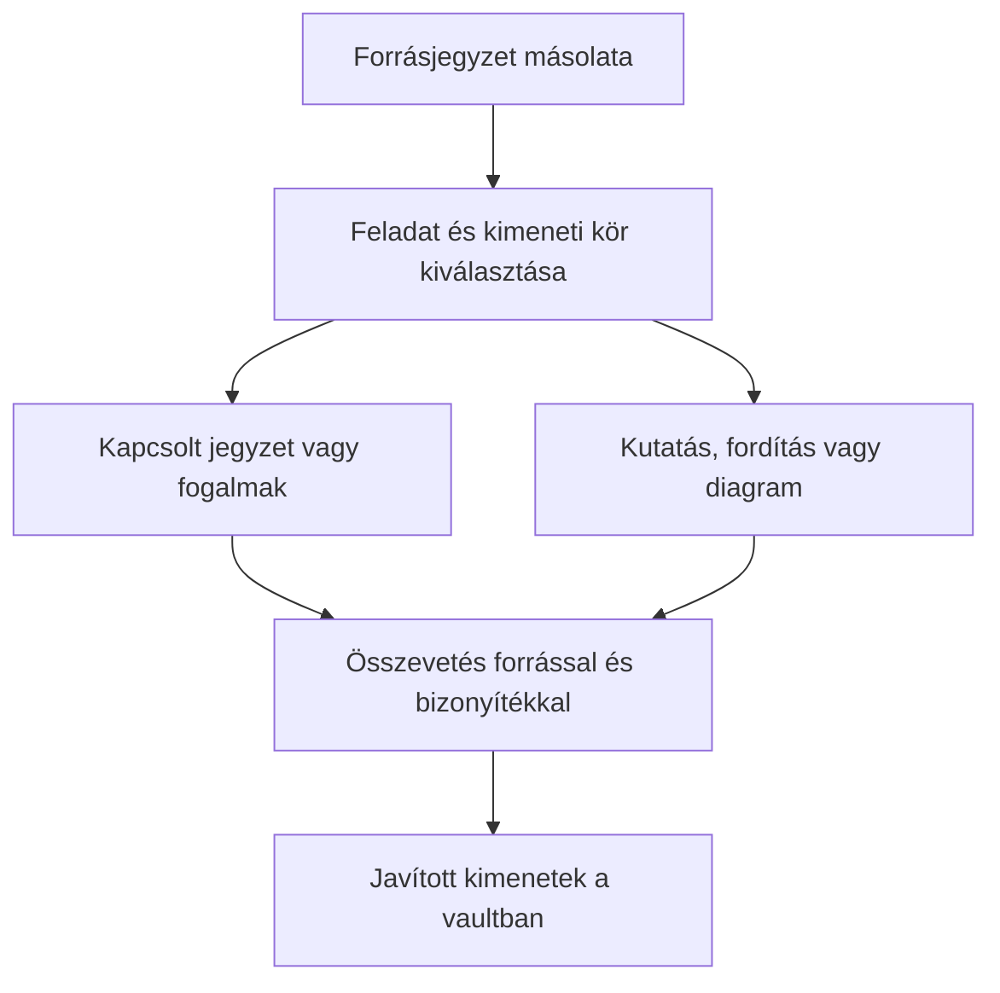

import TLDR from '@site/src/components/TLDR';

# AI-alapú tudáskezelés Obsidianban

<TLDR>Hasznos tudásfolyamatban megkülönböztethető a forrás, modellkimenet és saját javítás. A Notemd hivatkozást, kinyerést, kutatást, fordítást és diagramot ad ellenőrizhető fájlokban. Egy forrással kezdjen, majd igazolt eredmény után korlátozott mappát automatizáljon.</TLDR>

## Határozza meg a célt

Kapcsolt olvasójegyzet, fogalomgyűjtemény, forrásolt kutatási összefoglaló, fordítás vagy diagram közül válasszon. Több fájl és hivatkozás nem javítja automatikusan a megértést és kereshetőséget. Döntse el, hogyan ellenőrzi és találja meg később az anyagot.

## Teljes folyamat


```mermaid
flowchart TD
    A[Forrásjegyzet másolata] --> B[Feladat és kimeneti kör kiválasztása]
    B --> C[Kapcsolt jegyzet vagy fogalmak]
    B --> D[Kutatás, fordítás vagy diagram]
    C --> E[Összevetés forrással és bizonyítékkal]
    D --> E
    E --> F[Javított kimenetek a vaultban]
```

Ezek elérhető feladatok, nem egyetlen alapgomb minden lépése. Forrást őrizzen meg, és összeállítás előtt minden feladat célját ellenőrizze.

## 1. Wiki-hivatkozások: látható kapcsolatok

Próbajegyzeten indítsa a **Process file (add links)** műveletet. Nézze meg a szomszédos `_processed.md` fájlt, a fogalmak hasznosságát, idézetek, kód és egyenletek hűségét.

Témakör- és szinonimautasítás irányít, de nem kényszerít jelentésazonosságot vagy számszerű hasonlósági küszöböt. Meglévő címek reprodukálható egyeztetéséhez determinisztikus megoldást válasszon.

[Hivatkozások](./features/wiki-links)

## 2. Fogalmak: külön kifejezés és magyarázat

Kinyerés előtt válasszon fogalommappát. Önálló kinyerés csak címeket hoz létre, a forrást nem változtatja. Új jegyzet `Linked From` részéhez engedélyezzen visszahivatkozást, tiltsa le a minimális sablont.

Kinyerés és magyarázatgenerálás külön művelet. A **Batch generate from titles** a mappa meglévő alkalmas jegyzeteit is kitöltheti. Külön mappán próbáljon, és vizsgálja a jelentett complete áthelyezéseket. A duplikátumvizsgálat névheurisztika; hasonló név eltérő műszaki fogalmat is jelenthet.

[Fogalomjegyzetek](./features/concept-notes)

## 3. Kutatás: követhető források

Válasszon témát vagy címet, állítson Tavilyt/DuckDuckGót, futtassa a **Research & summarize** műveletet. Üres Tavily-kulcs nem vált szolgáltatást. Nyissa meg a forrásokat, ellenőrizze a hozzáfűzött összefoglaló fő állításait.

Opcionális helyi visszakeresés behatárolt részleteket ad. Az index szóalapú, a részlet a kiválasztott LLM-hez jut. Helyi index nem jelent teljesen offline vagy eszközön belüli kutatást.

[Kutatás](./features/research)

## 4. Fordítás: jelentés és szerkezet

Válasszon célnyelvet, fordítsa a fájlt. Alaputótag `_<language>.md`; létező cél felülírható. Kijelölt részhez előbb ideiglenes jegyzetet készítsen.

Ellenőrizze a terminológiát, számot, kódot, hivatkozást és matematikát. Hosszú szöveg darabolásakor kontextus veszhet el. A 21 UI-nyelv és 34 webes út nem igazolja egy nyelvpár minőségét.

[Fordítás](./features/translation)

## 5. Diagramok: szerkeszthető artefaktum

Válasszon típust és kompatibilis forrást. Nézze meg az előnézetet, mentse a forrást és szükséges SVG/PNG/PDF kimenetet. Egy kép nem bizonyítja, hogy más szerkesztő megőrzi az összes kapcsolatot.

Használja a támogatott katalógust. CircuitikZ korlátozott, natív fordítása külön környezetellenőrzés. Drawnix statikus ágközi nyilai átrendezés után nem garantálnak csatlakozást. PowerPoint-táblajavítás mellett Mermaid/SVG továbbra is képként exportálható.

[Diagramok](./features/diagrams)

## 6. Munkafolyamat: igazolt lépések automatizálása

A név után `::`, majd `>` jelekkel elválasztott művelet-ID-k állnak. Alapérték:

```text
One-Click Extract::process-current-add-links>batch-generate-from-titles>batch-mermaid-fix
```

Hivatkozásokat, mappás címgenerálást és Mermaid-javítást végez. Általános kutatást vagy diagramgenerálást nem ad hozzá. Minden lépés megtartja előfeltételét és kimenetét; ez nem tetszőleges szöveges csővezeték.

Alapból jelentett hibánál leáll. Folytatás csak megmaradt bemenettel működő következő lépéshez megfelelő. Megszakítás megtartja a kész fájlokat, nem visszagörgetés.

[Munkafolyamatok](./features/workflows)

## 7. Szolgáltatók: protokoll és terhelés

36 profil öt protokollcsaládot fed le. Végpont, modelljog, adatpolitika és mért feladateredmény alapján válasszon. Sebességet/költséget azonos forrással és prompttal hasonlítson.

Feladatonkénti útválasztás alapból kikapcsolt. Tudatosan engedélyezze, és helyinek minősítés előtt minden aktív útvonalat ellenőrizzen.

[Szolgáltatók](./providers/overview)

## Kezdési ellenőrzőlista

1. Telepítsen, és mentse a forrásanyagot.
2. Állítsa be és tesztelje a pontos szolgáltatót/modellt.
3. Válasszon fogalommappát és külön célokat.
4. Másolaton futtasson egy feladatot.
5. Hasonlítsa az eredményt, tartsa meg a javításokat.
6. Hosszú lánc előtt kis mappát és részleges teljesítést vizsgáljon.

## Gyakori minták

### Kutatási cikk feldolgozása

Külső eszközzel alakítsa Markdownná, és előbb ellenőrizze a képletek, ábrák és táblázatok konverzióját. Nyerjen ki fogalmat vagy eredeti részletet, kutasson konkrét kérdést; diagramot igazolható kapcsolat tisztázásához készítsen. Őrizze meg az eredeti cikket és javításait.

### Fogalomgyűjtemény

Külön mappával, terminológiai ellenőrzéssel és tudatos részhalmazhoz generált magyarázattal dolgozzon. Duplikátumtörlés előtt mentse. Több fogalom nem helyettesít pontos definíciót és jó navigációt.

### Magánanyag

Készítse elő a helyi szervert, modelleket és függőségeket, nézze át a feladatútválasztást, offline igénynél kerülje a webkutatást. Megosztás előtt vizsgálja a diagnosztikát. Loopback alapcím mellett is állítható távoli szerver a profilban.

### Megszakított köteg

Várja meg a leállás vagy hiba lezárását. Olvassa a jelentést, vizsgálja a kész/helyreállítási fájlokat és konfliktusokat, majd csak a kívánt munkát ismételje. Megszakadt állapot nem üres eredmény. Kísérőfájlt csak referenciáinak ellenőrzése után töröljön.

## Tovább

- [Gyors kezdés](./getting-started/quick-start).
- [Kötegek](./advanced/batch-processing).
- [Fejlesztők](./developers/overview).
- [Agent](./agents/overview).
