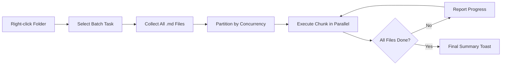

import TLDR from '@site/src/components/TLDR';

# Pemrosesan Batch

<TLDR>
**Notemd memproses seluruh folder dalam satu tindakan dengan tingkat konkurensi yang dapat dikonfigurasi dan kontrol penggantian.** Klik kanan pada sebuah folder untuk menambahkan tautan wiki secara batch, mengekstrak konsep, melakukan penelitian, atau menerjemahkan semua catatan di dalamnya. Batasan konkurensi mencegah kesalahan batas kecepatan API. Kemajuan dipantau per file. Perilaku penggantian dapat dikonfigurasi: melewatkan yang sudah ada, menambahkan, atau menggantikan. File yang gagal dicatat tanpa menghentikan pemrosesan batch.

Ini merupakan bagian dari [Obsidian Panduan Manajemen Pengetahuan AI](/docs/pillar-ai-knowledge).
</TLDR>

## Gambaran Umum

Pemrosesan batch mengubah folder berisi catatan menjadi satu operasi tunggal. Alih-alih membuka setiap catatan dan menjalankan perintah secara terpisah, Anda cukup klik kanan pada folder dan pilih tugasnya. Notemd akan menelusuri setiap file `.md`, menerapkan tindakan yang dipilih, dan melaporkan kemajuan secara real time.

Fitur ini sangat penting untuk ekstraksi pengetahuan di seluruh vault. Setelah mengimpor puluhan file PDF, misalnya, dengan menambahkan tautan secara batch lalu mengekstrak konsep secara batch, grafik pengetahuan Anda dapat dibangun dalam hitungan menit bukan jam.

## Cara Kerjanya

### Model Eksekusi Batch

1. **Pengumpulan file** -- Notemd memindai folder target secara rekursif (atau hanya tingkat atas, tergantung pengaturan) dan mengumpulkan semua file `.md`.
2. **Pembagian konkurensi** -- File dibagi menjadi beberapa bagian berdasarkan pengaturan `batchConcurrency`. Setiap bagian dijalankan secara paralel; bagian lain dijalankan secara berurutan.
3. **Eksekusi** -- Setiap file diproses menggunakan logika yang sama seperti perintah untuk file tunggal. Pengaturan penyedia dan model per tugas tetap dihormati.
4. **Laporan kemajuan** -- Pemberitahuan toast diperbarui setelah setiap file selesai, menunjukkan persentase kemajuan `N / Total`.
5. **Penanganan kesalahan** -- Jika suatu file gagal (kesalahan API, waktu tunggu jaringan, dll.), kesalahannya dicatat dan pemrosesan batch tetap berlanjut. Ringkasan akhir mencantumkan file yang gagal.
6. **Penyelesaian** -- Pemberitahuan toast ringkasan melaporkan total file yang diproses, yang berhasil, dan yang gagal.

### Perilaku Menggantikan

Saat memproses file yang sudah memiliki tautan wiki, catatan konsep, atau terjemahan, perilaku Notemd bergantung pada pengaturan menggantikan:

| Mode | Perilaku |
|------|----------|
| **Skip** | Konten yang ada tidak diubah. Hanya file yang belum dimodifikasi yang diproses. |
| **Append** (default) | Konten baru ditambahkan. Tautan wiki, konsep, atau terjemahan yang sudah ada tetap dipertahankan. |
| **Replace** | File diproses ulang sepenuhnya. Semua modifikasi Notemd sebelumnya akan digantikan. |

Untuk tautan wiki khususnya: jika sebuah catatan sudah berisi `[[wiki-links]]`, mode **skip** akan membiarkannya begitu saja, sementara mode **replace** akan mengirim ulang seluruh catatan ke LLM untuk penyisipan tautan yang baru. Gunakan **skip** untuk pemrosesan bertahap dan **replace** untuk pemrosesan ulang setelah pembaruan model.

### Kontrol Konkurensi

Pengaturan `batchConcurrency` membatasi panggilan paralel API. Hal ini mencegah kesalahan batas kecepatan (HTTP 429) saat memproses folder besar pada penyedia dengan kuota yang ketat.

| Konkurensi | Disarankan Untuk | Dampak Batas Kecepatan yang Umum |
|-------------|----------------|---------------------------|
| `1` | Tingkatan gratis, penyedia yang ketat | Tidak ada (serial) |
| `3` (default) | Sebagian besar penyedia cloud | Rendah |
| `5` | Ollama (local), tingkatan yang murah | Tidak ada / Rendah |
| `10` | Model lokal dengan inferensi cepat | Tidak ada |

Jika Anda mengalami kesalahan 429 saat pemrosesan batch, kurangi konkurensi menjadi 1 atau 2.

## Konfigurasi

| Pengaturan | Default | Efek |
|---------|---------|--------|
| `batchConcurrency` | `3` | Maksimum panggilan API paralel selama operasi folder |
| `batchOverwriteExisting` | `false` | Menulisi ulang konten Notemd yang sudah ada. `false` berarti mode tambahan. |
| `batchSkipProcessed` | `false` | Melewatkan file yang sudah mengandung penanda Notemd (misalnya, tautan wiki) |
| `batchRecursive` | `true` | Memasukkan subdirektori saat memindai folder |
| `enableStableApiCall` | `false` | Mengaktifkan logika percobaan ulang (hingga 4 kali percobaan) per file selama proses batch |

### Model Per-Tugas dalam Batch

Setiap operasi batch menggunakan model per-tugas yang sesuai. batch-add-links menggunakan `addLinksProvider`, batch-research menggunakan `researchProvider`, dan seterusnya. Hal ini berarti Anda dapat menugaskan model murah untuk operasi volume besar dan menyisihkan model mahal untuk tugas yang membutuhkan kualitas tinggi.

## Contoh

Anda memiliki sebuah folder `papers/` yang berisi 40 catatan penelitian yang diimpor. Anda ingin menambahkan tautan wiki dan mengekstrak konsep dari semuanya:

1. Klik kanan pada folder `papers/`
2. Pilih **"Notemd: Process folder (add links)"**
3. Notemd memindai folder tersebut, menemukan 40 file `.md`, dan memprosesnya sebanyak 3 file sekaligus (konkurensi default)
4. Tampilan toast progres menunjukkan: `12/40 files processed...`
5. Setelah sekitar 3 menit, toast ringkasan melaporkan: `39 succeeded, 1 failed (API timeout on paper-37.md)`
6. Ulangi dengan **"Notemd: Process folder (extract concepts)"** untuk membuat catatan konsep untuk seluruh 40 file tersebut

File yang gagal akan dicatat. Anda dapat menjalankannya kembali hanya pada file tersebut nantinya.

## Tips

- **Mulailah dengan konkurensi rendah** -- Jika Anda tidak yakin dengan batas kecepatan penyedia layanan, mulailah dengan `1` dan tingkatkan secara bertahap.
- **Gunakan mode skip untuk pembaruan bertahap** -- Setelah batch pertama selesai, beralihlah ke `batchSkipProcessed: true` agar hanya catatan baru yang diproses pada eksekusi berikutnya.
- **Aktifkan panggilan API yang stabil** -- `enableStableApiCall: true` menambahkan logika percobaan ulang yang memulihkan diri dari kesalahan jaringan sementara selama batch yang panjang.
- **Jalankan kembali setelah pembaruan model** -- Jika Anda beralih ke model yang lebih baik, atur `batchOverwriteExisting: true` dan jalankan kembali untuk mendapatkan tautan dan konsep yang lebih baik.

---

## Langkah Selanjutnya

- [Workflows](/docs/features/workflows) -- Menggabungkan tugas batch menjadi tombol samping satu klik
- [Custom Prompts](/docs/advanced/custom-prompts) -- Menyesuaikan prompt untuk ekstraksi batch
- [Troubleshooting](/docs/advanced/troubleshooting) -- Memperbaiki kesalahan batas kecepatan dan kegagalan koneksi selama eksekusi batch
- [LLM Penyedia](/docs/providers/overview) -- Referensi konfigurasi model per tugas
