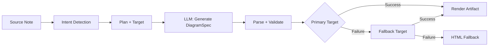
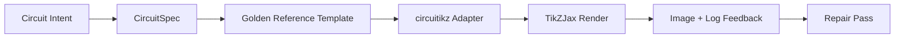

import TLDR from '@site/src/components/TLDR';

# Diagram

<TLDR>
**Notemd membuat diagram dari catatan Anda melalui pipeline berbasis spesifikasi terlebih dahulu.** LLM menghasilkan `DiagramSpec` JSON yang tidak bergantung pada renderer, lalu adapter khusus menerjemahkannya menjadi Mermaid, JSON Canvas, Vega-Lite, HTML, atau output HTML/SVG yang dapat diedit. Dukungan untuk 8 tipe intent, rantai fallback otomatis, pratinjau langsung dengan ekspor SVG/PNG, verifikasi semantik, dan generasi yang diperkuat pengetahuan lokal.
</TLDR>

Ini merupakan bagian dari [Obsidian Panduan Manajemen Pengetahuan AI](/docs/pillar-ai-knowledge).

## Arsitektur: Pipeline Berbasis Spesifikasi Terlebih Dahulu

Notemd tidak pernah meminta LLM untuk menghasilkan sintaks Mermaid/Vega/Canvas secara langsung. Sebaliknya:



**Mengapa berbasis spesifikasi terlebih dahulu?** LLM sering menghasilkan sintaks renderer yang tidak valid (terutama Mermaid). `DiagramSpec` yang terstruktur dapat diverifikasi sebelum rendering, dan spesifikasi yang sama dapat digunakan untuk beberapa renderer sebagai fallback.

## Tipe Diagram yang Didukung

| Intent | Renderer Utama | Fallbacks | Kasus Penggunaan |
|--------|-----------------|-----------|----------|
| `mindmap` | Mermaid | HTML | Pembagian topik hierarkis |
| `flowchart` | Mermaid | HTML | Alur proses, pohon keputusan |
| `sequence` | Mermaid | HTML | Interaksi klien-server, protokol |
| `classDiagram` | Mermaid | HTML | Hubungan kelas OOP |
| `erDiagram` | Mermaid | HTML | Skema basis data, hubungan entitas |
| `stateDiagram` | Mermaid | HTML | Mesin keadaan, model siklus hidup |
| `canvasMap` | JSON Canvas | Mermaid → HTML | Peta konsep, graf pengetahuan |
| `dataChart` | Vega-Lite | Mermaid → HTML | Graf batang, garis, area, scatter, pie, tabel |

## Deteksi niat

Notemd menentukan jenis diagram terbaik dari konten catatan Anda menggunakan skoring kata kunci:

| Niat | Pemicu | Kepercayaan |
|--------|----------|------------|
| `dataChart` | Tabel, sel numerik, kata kunci metrik/tren, persentase | 0.88 |
| `sequence` | Kosakata permintaan/respons (4+ kesesuaian) atau penanda `->`/`=>` | 0.82 |
| `erDiagram` | Kunci utama, kunci asing, entitas, skema (2+ kesesuaian) | 0.80 |
| `stateDiagram` | Keadaan, transisi, dalam proses, sedang berjalan, gagal (3+ kesesuaian) | 0.76 |
| `flowchart` | Langkah bernomor (2+) atau kosakata if/then/else/workflow | 0.74 |
| `canvasMap` | Peta konsep, graf pengetahuan, spasial, kluster | 0.72 |
| `mindmap` | Nilai default sebagai pengganti | 0.55 |

Atur ulang menggunakan pengaturan **Tipe diagram yang diinginkan**, pilihan di sidebar, atau opsi panel perintah yang eksplisit.

## Pemilihan Target Render

Pipeline berbasis spesifikasi eksperimental kini memiliki dua kontrol terpisah:

| Kontrol | Pengaturan | Efek |
|---------|---------|--------|
| Tipe diagram yang diinginkan | `preferredDiagramIntent` | Membimbing bentuk semantik dari `DiagramSpec` yang dihasilkan |
| Target render yang diinginkan | `preferredDiagramRenderTarget` | Memilih renderer artefak untuk **Menghasilkan diagram** dan **Pratinjau diagram** |

Atur **Target render yang diinginkan** menjadi **Auto** sebagai default untuk perencana, atau pilih secara eksplisit Mermaid, JSON Canvas, Vega-Lite, HTML, atau Editable HTML/SVG. Pengaturan ulang hanya berlaku untuk perintah artefak dan pratinjau. Perintah standar **Merangkum sebagai diagram Mermaid** tetap menggunakan output yang kompatibel dengan Mermaid sehingga alur kerja Markdown yang ada tidak secara diam-diam mengubah formatnya.

Pemisahan ini penting karena niat `flowchart` kini dapat dirender sebagai Mermaid untuk catatan Markdown, HTML sebagai pengganti yang andal, atau Editable HTML/SVG untuk penyuntingan selanjutnya. Draw.io dan Drawnix tetap merupakan ekspor artefak jenis CLI, bukan target render di dalam plugin.

## Penggunaan

### Menghasilkan Diagram

1. Buka sebuah catatan
2. Jalankan **"Notemd: Menghasilkan diagram"** dari panel perintah
3. Notemd mendeteksi niat, menghasilkan spesifikasi, merender, dan menyimpan artefaknya

**File output berdasarkan target:**

| Target | Ekstensi | Pola Nama Berkas |
|--------|-----------|------------------|
| Mermaid | `.md` | `{note}_summ.md` |
| JSON Canvas | `.canvas` | `{note}_diagram.canvas` |
| Vega-Lite | `.json` | `{note}_diagram.json` |
| HTML | `.html` | `{note}_diagram.html` |
| Dapat Diubah HTML/SVG | `.html` | `{note}_diagram.html` |

### Pratinjau Diagram

1. Jalankan **"Notemd: Pratinjau diagram"**
2. Sebuah modal terbuka dengan diagram yang telah dirender
3. Ekspor sebagai SVG atau PNG menggunakan tombol toolbar

**Buka pratinjau otomatis** tersedia di pengaturan — setelah generasi, modal pratinjau akan dibuka secara otomatis.

Modal pratinjau juga memiliki panel diagnosis artefak. Renderer dan pemeriksaan smoke dapat menambahkan `RenderArtifact.diagnostics`; modal tersebut menampilkan ringkasan diagnosis dengan jumlah kesalahan/peringatan/informasi, lalu tingkat keparahan, jenis diagnosis, pesan, dan saran perbaikan di samping pratinjau. Ringkasan yang sama ditampilkan dalam entri sejarah pratinjau, sehingga percobaan smoke circuitikz yang berulang dapat dibandingkan tanpa membuka setiap entri. Untuk artefak yang memiliki konten sumber tetapi tidak dapat dirender secara inline atau melalui jalur iframe HTML, modal kini beralih ke pratinjau hanya berbasis sumber alih-alih memaksakan iframe kosong. Hal ini memberikan permukaan visual UI yang jelas untuk pemeriksaan compile/render smoke circuitikz, pemeriksaan token teks SVG, pemeriksaan screenshot PNG kosong, dan laporan tumpang tindih di masa depan, tanpa menjadikan TikZJax atau LaTeX sebagai ketergantungan runtime plugin yang wajib atau berpura-pura bahwa teks sumber merupakan render visual yang telah diverifikasi.

### Mode Mermaid Lama

Ketika `enableExperimentalDiagramPipeline` dimatikan, Notemd mengirimkan permintaan langsung Mermaid ke LLM. Hal ini mengabaikan seluruh pipeline spesifikasi. Jika pipeline eksperimental gagal, sistem akan beralih ke mode ini.

## Backend Rendering

### Mermaid

6 adapter (mindmap, flowchart, sequence, ER, class, state) menerjemahkan `DiagramSpec` menjadi sintaks Mermaid. Setelah generasi, `mermaid.parse()` memvalidasi hasilnya. Jika validasi gagal:

1. **Coba lagi LLM** — satu percobaan dengan pesan kesalahan Mermaid sebagai konteks
2. **Fallback minimal** — diagram Mermaid yang sederhana berdasarkan ID node spesifikasi

**Legacy Mermaid Fixer** secara otomatis memperbaiki kesalahan sintaks LLM yang umum: normalisasi direktif note, eksploitasi label pipa, reposisi tanda koma, kutipan cerdas, panah ganda tanda hubung, ketidaksesuaian bentuk, dan lainnya.

### JSON Canvas

Menghasilkan format Obsidian JSON Canvas dengan tata letak spasial:
- Node ditempatkan berdasarkan kedalaman (x = kedalaman × 420) dan indeks (y = indeks × 170)
- Lebar diperkirakan dari panjang label
- Ekor dengan `fromSide: 'right'`, `toSide: 'left'`, `toEnd: 'arrow'`

### Vega-Lite

Membuat spesifikasi Vega-Lite v5 JSON yang lengkap dengan enkoding otomatis:
- **Grafik Kartesian** (batang/garis/area/titik/scatter): saluran x + y ditambah warna untuk beberapa seri
- **Pie**: theta = y (kuantitatif), warna = x (nominal)
- **Tabel**: baris = x, teks = y + kolom = seri

Patch tema gelap dan terang digabungkan secara mendalam sebelum kompilasi.

### HTML

Solusi cadangan universal. Dokumen HTML yang mandiri dengan:
- Header meta CSP
- Mode terang/gelap melalui `prefers-color-scheme`
- Label UI yang diterjemahkan untuk 20 lokasi
- Bagian: hero, struktur (pohon node), hubungan, penjelasan tambahan, tabel seri data

### HTML/SVG yang dapat diedit

Target angka eksplisit untuk alur kerja ekspor yang dapat diedit. Alat ini memproyeksikan `DiagramSpec` ke dalam `SemanticFigureModel` yang deterministik, lalu menghasilkan dokumen HTML yang mandiri dengan kelompok SVG inline yang membawa anotasi bergaya Draw.io:

- `data-drawio-type`, `data-drawio-id`, dan `data-drawio-role` pada node semantik
- `data-drawio-source` dan `data-drawio-target` pada edge semantik
- identifikasi node/edge yang stabil setelah normalisasi spasi putih dan penanganan tabrakan
- tanpa skrip, tanpa font eksternal, dan tanpa aset jarak jauh

Target ini sengaja belum menjadi rute perencanaan default. Target ini tersedia sebagai target render eksplisit selama jalur produk membuktikan perilaku editing di berbagai alat nyata.

### Draw.io dan Drawnix Batas Ekspor

Implementasi saat ini mempertahankan dukungan editor pihak ketiga di batas artefak:

| Target | Kontrak | Ketergantungan Runtime |
|--------|----------|--------------------|
| Draw.io | `mxfile` XML yang tidak dikompresi secara deterministik dari `SemanticFigureModel` | tidak ada di runtime plugin atau CI |
| Drawnix | subset minimal `.drawnix` JSON menggunakan elemen `geometry` dan `arrow-line` | tidak ada di runtime plugin atau CI |

Kompromi ini disengaja: Notemd dapat memverifikasi label yang terlihat, ID yang stabil, dan cakupan primitif yang didukung tanpa memasukkan diagram.net Desktop, Drawnix, Plait, atau keadaan editor khusus browser ke dalam plugin.

### circuitikz / TikZJax Arah

Diagram sirkuit bukanlah masalah yang sama dengan flowchart umum. Sintaks target yang tepat untuk sirkuit listrik biasanya adalah **circuitikz**, yang ditampilkan dalam Obsidian melalui plugin seperti TikZJax. TikZJax dapat memuat paket seperti `circuitikz`, `pgfplots`, `tikz-cd`, dan `chemfig`, sehingga cocok untuk catatan fisika, sirkuit, kimia, dan matematika.

Risikonya adalah TikZ yang dihasilkan langsung dari LLM bersifat rapuh:

- topologi sirkuit yang kompleks bisa benar secara listrik tetapi sulit dibaca secara visual;
- kabel dan label yang tumpang tindih dapat membuat netlist yang benar tidak dapat digunakan untuk catatan studi;
- kurangnya bagian pembuka paket, titik jepit yang salah, atau nama komponen yang tidak valid dapat menghambat proses rendering;
- umpan balik dari alat rendering biasanya berupa gambar, sedangkan LLM menghasilkan geometri tingkat teks.

Arsitektur yang lebih baik adalah memperlakukan circuitikz sebagai target diagram yang terbatas, bukan sebagai prompt bebas bentuk:



Model kelas satu seharusnya mendeskripsikan topologi dan tata letak sirkuit secara terpisah:

| Lapisan | Tanggung jawab | Contoh |
|-------|----------------|---------|
| Topologi | node listrik dan koneksi komponen | `VDD -> RD -> drain(M1)`, `source(M1) -> GND` |
| Tata letak | penempatan grid, orientasi, jalur routing | `M1 at (3,2.2)`, masukan kiri, keluaran kanan |
| Gaya | paket, konvensi tegangan, label, titik jangkar | `\begin{circuitikz}[american voltages]` |
| Validasi | log kompilasi, titik jangkar yang hilang, pemeriksaan tumpang tindih/skrin tangkapan | TikZJax/Diagnostik LaTeX ditambah tinjauan visual |

### Prototipe circuitikz saat ini

Notemd kini mencakup prototipe repositori terbatas pertama untuk arah ini. Prototipe tersebut sengaja berada dalam mode offline dan terikat pada template:

```bash
npm run diagram:export-circuitikz -- --input cmos-inverter.json --output cmos-inverter.tex
```

Prototipe ini menambahkan batas `CircuitSpec` yang terpisah serta ekspor deterministik untuk enam keluarga referensi emas:

| Jenis rangkaian | Referensi emas | Jaminan arus |
|--------------|------------------|-------------------|
| `common-source-amplifier` | `common-source-nmos-v1` | memvalidasi `VDD -> R_D -> M1.D`, `vin -> M1.G`, `M1.S -> GND`, dan `M1.D -> vout` sebelum menulis LaTeX |
| `cmos-inverter` | `cmos-inverter-v1` | memvalidasi topologi PMOS-over-NMOS, masukan gerbang bersama, keluaran drain bersama, `VDD -> MP.S`, dan `MN.S -> GND` sebelum menulis LaTeX |
| `cmos-buffer` | `cmos-buffer-v1` | memvalidasi dua tahap inverter bertingkat, node tengah `vmid`, `vout` yang dipulihkan, serta jalur VDD/GND bersama sebelum menulis LaTeX |
| `cmos-transmission-gate` | `cmos-transmission-gate-v1` | memvalidasi perangkat pas paralel PMOS/NMOS antara `vin` dan `vout` dengan kontrol komplementer `phib` / `phi` sebelum menulis LaTeX |
| `cmos-nand2` | `cmos-nand2-v1` | Memvalidasi pull-up PMOS paralel, pull-down NMOS seri, dua masukan `va` / `vb`, dan `vout` sebelum menulis LaTeX |
| `cmos-nor2` | `cmos-nor2-v1` | Memvalidasi pull-up PMOS seri, pull-down NMOS paralel, dua masukan `va` / `vb`, dan `vout` sebelum menulis LaTeX |

Ini belum merupakan generator TikZ umum. Alat ini tidak mengkompilasi LaTeX, memanggil TikZJax, memeriksa tangkapan layar, atau menjalankan perbaikan otomatis berbasis gambar. Fitur-fitur tersebut masih menjadi bagian tahap selanjutnya.

Perintah Diagram Pratinjau dapat membuka kembali artefak sumber circuitikz yang disimpan langsung bila ekstensi file adalah `.tex` atau `.tikz` dan sumbernya mengandung `\usepackage{circuitikz}` atau `\begin{circuitikz}`. Jalur ini merupakan pratinjau berbasis sumber saja: tampilan modal menampilkan sumber, diagnosis, kontrol salin/simpan, serta metadata sejarah, tetapi tidak mengkompilasi LaTeX atau memanggil TikZJax selama runtime plugin.

Batas pratinjau berbasis sumber yang sama kini mencakup artefak Draw.io dan Drawnix yang disimpan. File `.drawio` diterima bila bentuknya seperti Draw.io XML (`mxfile` atau `mxGraphModel`), sedangkan file `.drawnix` diterima bila berbentuk Drawnix JSON dengan `type: "drawnix"` dan array `elements`. Plugin ini masih belum memasukkan diagram.net atau host papan tulis Drawnix; pratinjau-pratinjau ini menampilkan sumber, diagnosis, dan sejarah artefak tanpa menyertakan editor visual di dalam plugin.

Untuk perbaikan yang mempertahankan topologi, serahkan spesifikasi pra-perbaikan sebagai referensi sebelum menerima kandidat yang telah diperbaiki:

```bash
npm run diagram:export-circuitikz -- --input repaired-cmos-inverter.json --topology-reference cmos-inverter.json --output cmos-inverter.tex
```

Penjaga perbaikan menggunakan `createCircuitTopologySignature` dan `assertCircuitTopologyUnchanged` untuk membandingkan `circuitKind`, `goldenReferenceId`, jaringan, ID/tipe/terminal komponen, serta ujung sambungan tak berarah sebelum menghasilkan output. Label, teks judul, petunjuk tata letak, urutan sambungan, dan label sambungan sengaja diabaikan. Kandidat yang menambahkan terminal pendek atau merombak kabelnya gagal dengan `Circuit topology drift detected` sebelum file `.tex` ditulis.

CLI kini dapat menganalisis log kompilasi LaTeX/TikZJax yang sudah ada tanpa menjalankan kompiler:

```bash
npm run diagram:export-circuitikz -- --input cmos-inverter.json --output cmos-inverter.tex --compile-log cmos-inverter.log --diagnostics-output cmos-inverter.diagnostics.json
```

Rute diagnosis ini melaporkan paket yang hilang seperti `circuitikz.sty`, kunci TikZ/circuitikz yang tidak dikenal, kesalahan sintaks jalur TikZ seperti kurangnya tanda koma, argumen berlebih dari kurung yang tidak seimbang atau label yang tidak ditutup, urutan kontrol yang belum didefinisikan, kesalahan umum LaTeX, penghentian darurat, serta peringatan kelebihan `\hbox`. Metodenya masih berbasis log: eksekusi lokal LaTeX/TikZJax dan mekanisme kualitas tangkapan layar masih merupakan pekerjaan di masa depan.

Untuk pemeriksaan awal oleh pemelihara, CLI yang sama dapat secara opsional menjalankan renderer yang dikonfigurasi secara eksplisit tanpa harus menganalisis perintah shell:

```bash
npm run diagram:export-circuitikz -- --input cmos-inverter.json --output cmos-inverter.tex --compile-executable pdflatex --compile-arg -interaction=nonstopmode --compile-arg -halt-on-error --compile-arg -output-directory={outputDir} --compile-arg {tex} --expected-artifact {outputDir}/{jobName}.pdf
```

Penggerak kompilasi menggunakan `shell: false`, mengembangkan placeholder `{tex}`, `{outputDir}`, dan `{jobName}` menjadi nilai array argumen, membaca hasil `{jobName}.log` yang dihasilkan, lalu mengembalikan `compileExecution` beserta `compileDiagnostics` dalam format CLI JSON. `--compile-executable` hanyalah jalur binary atau wrapper renderer; flag renderer berada dalam nilai `--compile-arg` yang diulang. Eksekusi kosong gagal sebagai `compile-executable-invalid`, binary yang hilang gagal sebagai `compile-executable-not-found`, dan string eksekusi berbentuk perintah shell diberi saran untuk membagi argumen agar Windows, Linux, dan macOS mengikuti kontrak eksekusi langsung yang sama. Dengan `--expected-artifact`, alat ini juga melaporkan `compileExecution.renderSmoke` dan gagal pada CLI bila renderer tidak membuat artefak yang tidak kosong. Plugin ini masih belum memasukkan LaTeX, menjadikan TikZJax sebagai dependensi runtime plugin, atau melakukan perbaikan visual tingkat tangkapan layar.

Jika artefak yang diharapkan adalah `.svg`, pemeriksaan awal ini dilakukan lebih dalam lagi:

```bash
npm run diagram:export-circuitikz -- --input cmos-inverter.json --output cmos-inverter.tex --compile-executable dvisvgm --compile-arg ... --expected-artifact {outputDir}/{jobName}.svg --expected-svg-text v_{in} --expected-svg-text v_{out}
```

Pemeriksaan asap SVG memverifikasi akar `<svg>`, dimensi positif atau `viewBox`, setidaknya satu elemen gambar yang terlihat setelah elemen tersembunyi/transparan dihilangkan, token teks yang diminta, elemen yang jelas berada di luar `viewBox`, label `<text>` / `<tspan>` yang bertumpuk dan jelas, serta label teks yang bertumpuk dengan elemen gambar melalui `render-svg-label-overlap`. Teks yang diharapkan dicari dalam teks yang terlihat dan metadata aksesibilitas yang didekode seperti `aria-label`, `<title>`, dan `<desc>`, sehingga renderer yang mempertahankan label semantik di luar `<text>` tetap dapat memenuhi pemeriksaan token teks tanpa memerlukan OCR. Proses geometri kini menggunakan geometri yang peka terhadap transformasi untuk atribut grup dan elemen umum `transform`, sehingga kotak SVG yang diterjemahkan, diperbesar, diputar, miring, atau diubah dengan matriks diperiksa setelah komposisi transformasi. Proses ini mencakup batas lengkung yang tepat untuk ekstrem A/a, batas lengkung Bezier yang tepat untuk ekstrem C/S/Q/T, batas SVG yang peka terhadap lebar garis dan pemeriksaan tumpang tindih label, geometri gambar `polyline` / `polygon`, serta penyelesaian penempatan glyph hanya berbasis jalur dari referensi `<use href="#...">` sehingga label yang diubah menjadi path glyph yang dapat digunakan kembali tetap dapat gagal dalam pemeriksaan kanvas terbatas bila geometri glyph yang ditempatkan melampaui `viewBox`. Beberapa label `tspan` yang berada di bawah satu induk `<text>` dibandingkan sebagai kotak label terpisah, yang memungkinkan mendeteksi output bergaya LaTeX SVG yang sebaliknya akan menggabungkan label yang berbeda menjadi satu node teks. Kotak SVG `text` dan `tspan` yang ditempatkan mengikuti nilai `start`, `middle`, dan `end`, sehingga label yang terpusat dan sejajar ke kanan dapat memicu diagnosis tumpang tindih teks/label tanpa harus menggunakan tata letak teks tingkat browser. Path glyph yang hanya berupa definisi di dalam `<defs>` tidak dihitung sebagai elemen gambar yang terlihat, tetapi atribut lokal `transform` mereka diterapkan sebelum penempatan `<use>` sehingga definisi glyph yang diperbesar atau dipantulkan tidak kurang dihitung. Pemeriksaan label-vs-gambar menggunakan toleransi kotak gambar yang kecil dan nilai `stroke-width` yang dideklarasikan, sehingga kabel tipis, kabel tebal, dan garis kontur komponen poligon dapat dianggap sebagai potensi kegagalan keterbacaan label bila stroke yang terlihat mencapai label. Label glyph hanya berbasis jalur yang diselesaikan dari `<use href="#...">` juga dibandingkan dengan kotak gambar dan gagal dengan `render-svg-path-glyph-overlap` bila geometri glyph yang dapat digunakan kembali bertumpang tindih dengan kabel atau komponen. Jika renderer mengubah label menjadi path glyph yang dapat digunakan kembali alih-alih `<text>` yang dapat dicari, dan tidak mempertahankan metadata aksesibilitas, laporan asap mencatat `pathOnlyGlyphUseCount` dan gagal pada token teks yang diminta melalui `render-svg-text-path-only` alih-alih menganggap label tersebut benar-benar tidak ada. Kegagalan lain dilaporkan melalui `render-svg-invalid`, `render-svg-dimension-missing`, `render-svg-no-visible-elements`, `render-svg-text-missing`, `render-svg-out-of-bounds`, `render-svg-text-overlap`, `render-svg-label-overlap`, atau `render-svg-path-glyph-overlap`. Pemeriksaan token teks dan tumpang tindih hanya seharusnya dianggap sebagai pemeriksaan struktural untuk renderer yang mempertahankan label sebagai teks SVG yang dapat dicari atau metadata aksesibilitas; output hanya berbasis jalur SVG masih memerlukan tahap tangkapan layar/OCR selanjutnya untuk membuktikan keterbacaan visual label, dan pemeriksaan asap ini masih belum menjamin cakupan jalur yang lengkap SVG.

Kelompok dan elemen tersembunyi SVG secara konsisten diabaikan selama penghitungan elemen terlihat dan pengumpulan geometri. Atribut atau gaya inline `display:none`, `visibility:hidden`, `visibility:collapse`, serta keseluruhan `opacity:0` tidak dapat membuat artefak render yang sebenarnya kosong lulus pemeriksaan output terlihat.

Definisi glyph hanya berbasis jalur dapat berupa jalur langsung atau kontainer grup/simbol di dalam `<defs>`. Pemeriksaan asap menyelesaikan geometri path anak dari `<g id="...">` dan `<symbol id="...">` sebelum penempatan `<use>`, sehingga output glyph yang dibungkus tetap masuk ke dalam `pathOnlyGlyphUseCount`, pemeriksaan kanvas terbatas, dan `render-svg-path-glyph-overlap`.

Parser jalur juga melacak awal subpath dan mengatur ulang titik saat ini di `Z/z`, sehingga perintah relatif setelah subpath tertutup melanjutkan dari titik SVG yang benar alih-alih menciptakan diagnosis `render-svg-out-of-bounds` yang salah.

Proses geometri yang sama mengikuti aturan SVG untuk desimal dengan titik di depan dan tanda plus eksplisit, sehingga koordinat dvisvgm yang kompak seperti `.5`, `-.5`, atau `+.5` tetap berbentuk pecahan selama pemeriksaan batas, alih-alih menjadi geometri yang salah karena keluar batas atau diabaikan.

Jika renderer menghasilkan `.png`, jalur artefak yang diharapkan akan menjadi tangkapan layar pertama: Notemd mendekode file PNG berwarna indeks 1/2/4/8-bit yang tidak interlaced, file PNG abu-abu 1/2/4/8/16-bit, serta file PNG abu-abu-alpha/RGB/RGBA 8/16-bit. Gambar berwarna indeks dan abu-abu sub-byte mendukung sampel terkompresi; gambar berwarna indeks juga mendukung data PLTE dan tRNS opsional; gambar abu-abu/RGB mendukung sampel transparan tRNS. Sampel langsung 16-bit dinormalisasi ke ruang perbandingan RGBA 8-bit yang sama yang digunakan oleh pemeriksaan smoke. Pemeriksaan smoke memverifikasi dimensi positif, mencatat batas latar depan sebagai `foregroundBounds`, mencatat kepadatan latar depan di dalam kotak tersebut sebagai `foregroundDensity`, gagal dengan `render-png-blank` ketika setiap piksel yang terlihat sama dengan warna latar kiri atas, gagal dengan `render-png-content-clipped` ketika konten latar depan menyentuh batas gambar, gagal dengan `render-png-foreground-too-small` ketika tangkapan layar besar memiliki kurang dari empat piksel latar depan, dan gagal dengan `render-png-foreground-dense` ketika piksel latar depan sangat padat di dalam kotak batas yang tidak sederhana. Format PNG yang tidak didukung gagal dengan `render-png-unsupported` beserta petunjuk khusus untuk format Adam7 interlaced PNG atau kedalaman bit warna indeks yang tidak didukung. Hal ini dapat mendeteksi tangkapan layar kosong, pemotongan kanvas yang jelas, jejak latar depan yang kurang render, kegagalan kepadatan pada tingkat piksel pertama, serta pengaturan ekspor PNG renderer yang salah, tanpa memerlukan ketergantungan shell khusus platform. Ini bukan pengenalan label tingkat OCR, deteksi tumpang tindih teks yang presisi, atau perbaikan gambar yang mempertahankan topologi.

Ketika diagnosis menunjukkan kompilasi gagal atau run render-smoke gagal, CLI juga dapat membuat ringkasan perbaikan yang mempertahankan topologi:

```bash
npm run diagram:export-circuitikz -- --input cmos-inverter.json --topology-reference cmos-inverter.json --output cmos-inverter.tex --compile-log cmos-inverter.log --repair-brief-output cmos-inverter.repair-brief.json
```

Ringkasan perbaikan menggunakan skema `notemd.circuitikz.repair-brief.v1` dan membawa sumber `CircuitSpec`, tanda tangan topologi, diagnosis kompilasi/render, edit yang diizinkan, edit topologi yang dilarang, langkah verifikasi berikutnya, serta `repairPrompt` yang terstruktur. Peran prompt adalah `topology-preserving-circuitikz-repair`; daftar `diagnosticFocus`-nya berasal dari diagnosis kompilasi/render, dan `acceptanceCriteria`-nya memerlukan validasi kandidat beserta kompilasi dan pemeriksaan render-smoke yang baru. Ini merupakan format penyerahan untuk siklus perbaikan selanjutnya, bukan klaim bahwa Notemd sudah melakukan perbaikan visual secara otomatis.

Setelah kandidat perbaikan dihasilkan, CLI yang sama dapat memvalidasinya terhadap ringkasan sebelum menulis output:

```bash
npm run diagram:export-circuitikz -- --input repaired-cmos-inverter.json --repair-brief cmos-inverter.repair-brief.json --output repaired-cmos-inverter.tex
```

`--repair-brief` memeriksa tanda tangan topologi kandidat dari ringkasan dan hal ini saling eksklusif dengan `--topology-reference`. Lulusnya gate ini hanya membuktikan pemeliharaan topologi; kandidat masih perlu diagnosis kompilasi dan pemeriksaan render-smoke.

Hasil `--repair-brief` juga mencakup bukti `repairAcceptance` dengan skema `notemd.circuitikz.repair-acceptance.v1`. Hasilnya melaporkan gate `topology-signature`, `compile-diagnostics`, dan `render-smoke` sebagai `passed`, `failed`, atau `missing`; mengungkapkan `remainingChecks`; dan menjaga `readyForVisualAcceptance` tetap false sampai kandidat tersebut memiliki semua bukti yang diperlukan.

Gunakan `--repair-acceptance-output` bersama `--repair-brief` ketika bukti CI atau rilis memerlukan file JSON yang tahan lama:

```bash
npm run diagram:export-circuitikz -- --input repaired-cmos-inverter.json --repair-brief cmos-inverter.repair-brief.json --output repaired-cmos-inverter.tex --repair-acceptance-output repaired-cmos-inverter.repair-acceptance.json
```

Untuk bukti rilis atau pemeliharaan, jalankan setiap keluarga golden yang didukung melalui runner fixture agregat:

```bash
npm run diagram:smoke-circuitikz -- --output-dir docs/export/circuitikz-smoke --compile-executable pdflatex --compile-arg -interaction=nonstopmode --compile-arg -halt-on-error --compile-arg -output-directory={outputDir} --compile-arg {tex} --expected-artifact {outputDir}/{jobName}.pdf
```

Runner tersebut menggunakan `docs/maintainer/fixtures/circuitikz/common-source-nmos-v1.json`, `docs/maintainer/fixtures/circuitikz/cmos-inverter-v1.json`, `docs/maintainer/fixtures/circuitikz/cmos-buffer-v1.json`, `docs/maintainer/fixtures/circuitikz/cmos-transmission-gate-v1.json`, `docs/maintainer/fixtures/circuitikz/cmos-nand2-v1.json`, dan `docs/maintainer/fixtures/circuitikz/cmos-nor2-v1.json`, memanggil jalur ekspor tanpa shell yang sama untuk setiap fixture, dan mengembalikan laporan agregat JSON dengan `compileExecution` dan `compileDiagnostics` per fixture. Ini masih merupakan perintah pemeliharaan, bukan ketergantungan runtime plugin.

Ketika mesin pemeliharaan belum memiliki renderer yang dikonfigurasi, jalankan perintah fixture yang sama tanpa `--compile-executable` dan simpan gate lingkungan secara eksplisit:

```bash
npm run diagram:smoke-circuitikz -- --output-dir docs/export/circuitikz-smoke --report-output docs/export/circuitikz-smoke/renderer-availability.json
```

Jalur tersebut tetap menulis artefak fixture yang deterministik `.tex`, namun mengembalikan `ok: false` dengan `rendererAvailability.status` diatur ke `missing-configuration` dan diagnosis `compile-executable-invalid`. Anggap saja ini hanya bukti ketersediaan renderer; bukan hasil kompilasi, render-smoke, atau penerimaan visual.

### Bentuk Prompt Referensi Golden

Untuk penggunaan jangka pendek, sediakan referensi golden yang dapat dirender sebelum meminta varian sirkuit. Prompt yang terbatas harus mempertahankan bagian pembuka, skala koordinat, gaya anchor, dan konvensi routing:

```latex
\usepackage{circuitikz}
\begin{document}
\begin{circuitikz}[american voltages]
\draw
  (3,5) node[vcc]{$V_{DD}$}
  to [R, l=$R_D$] (3,3)
  to [short, *-o] (5,3) node[right]{$v_{out}$}
  (3,3) to [short] (3,2.2)
  node[nmos, anchor=D] (M1) {$M_1$}
  (M1.S) to [short] (3,0.5)
  node[ground]{}
  (M1.G) to [short, -o] (0.8,2.2)
  node[left]{$v_{in}$};
\draw
  (3,0.5) node[below right]{$S$};
\end{circuitikz}
\end{document}
```

Untuk inverter CMOS, prompt seharusnya meminta topologi eksplisit beserta batasan tata letak, bukan hanya “gambar inverter CMOS”:

- pertahankan `VDD` di bagian atas, `GND` di bagian bawah, input di sebelah kiri, output di sebelah kanan;
- Gunakan `pmos` di atas `nmos`, dengan gerbang bersama dan drain bersama;
- Pertahankan node keluaran di persimpangan drain dan tandai dengan `*-o`;
- Gunakan anchor bernama (`PM1.G`, `NM1.G`, `PM1.D`, `NM1.D`) alih-alih koordinat yang diperkirakan secara visual;
- Hindari kabel diagonal atau saling bersilangan kecuali diperlukan secara listrik.

### Progres Saat Ini dan Tahap Selanjutnya

| Area | Status saat ini | Langkah selanjutnya |
|------|----------------|-----------|
| Diagram umum | Pipeline berbasis spesifikasi telah diimplementasikan untuk Mermaid, JSON Canvas, Vega-Lite, HTML | Terus perluas cakupan verifikasi semantik |
| Gambar yang dapat diedit | Batas artefak `editable-html-svg`, Draw.io XML, dan Drawnix JSON telah diimplementasikan | Tambahkan primitif yang lebih kompleks hanya setelah tes membuktikan kemampuan edisi |
| Dukungan CLI | `npm run diagram:export-artifact` mengekspor HTML/SVG, Draw.io, dan Drawnix yang dapat diedit dari satu `DiagramSpec` | Menambahkan perangkat asap khusus target saat target baru dikirim |
| circuitikz | `CircuitSpec -> circuitikz` prototipe mengekspor sumber umum, inverter CMOS, `cmos-buffer` / `cmos-buffer-v1`, `cmos-transmission-gate` / `cmos-transmission-gate-v1`, `cmos-nand2` / `cmos-nand2-v1`, dan `cmos-nor2` / `cmos-nor2-v1` template emas, proyek `layoutHints.inputSide` dan `layoutHints.outputSide` ke penempatan port input/output yang deterministik tanpa mengubah topologi, menolak penyimpangan topologi perbaikan melalui `--topology-reference`, mengeluarkan ringkasan perbaikan yang mempertahankan topologi melalui `--repair-brief-output` dan skema `notemd.circuitikz.repair-brief.v1`, mencakup konten penyerahan terstruktur `repairPrompt` dengan `diagnosticFocus`, `acceptanceCriteria`, dan peran `topology-preserving-circuitikz-repair`, memvalidasi kandidat perbaikan melalui `--repair-brief`, mengembalikan bukti gerbang `repairAcceptance` melalui skema `notemd.circuitikz.repair-acceptance.v1` dengan `readyForVisualAcceptance` dan `remainingChecks`, menyimpan bukti tersebut melalui `--repair-acceptance-output`, menganalisis log kompilasi, dapat menjalankan renderer lokal eksplisit ditambah `--expected-artifact`, SVG `--expected-svg-text`, pemeriksaan metadata aksesibilitas melalui `aria-label`, `<title>`, dan `<desc>`, pengecualian elemen SVG tersembunyi/transparan, klasifikasi `render-svg-text-path-only` / `pathOnlyGlyphUseCount` untuk label hanya jalur, pemeriksaan penempatan glyph hanya jalur untuk `<use href="#...">`, diagnosis tumpang tindih glyph hanya jalur melalui `render-svg-path-glyph-overlap`, penanganan titik arus jalur tertutup untuk `Z/z`, batas lengkung tepat untuk ekstrem A/a, batas kurva Bezier tepat untuk ekstrem C/S/Q/T, pemeriksaan tumpang tindih label dengan batas lebar garis yang disadari SVG, pemeriksaan geometri gambar `polyline` / `polygon`, geometri label yang diposisikan `tspan`, geometri teks yang diposisikan dengan memperhatikan `text-anchor`, geometri yang memperhatikan transformasi untuk SVG bounded-canvas/text-overlap dan label-vs-drawing asap melalui `render-svg-label-overlap`, serta pemeriksaan screenshot PNG nonblank / terpotong / foreground padat, termasuk palet warna indeks dengan alpha, sampel transparan grayscale/RGB tRNS, dan panduan spesifik format `render-png-unsupported` untuk PNG Adam7 interlaced dan kegagalan kedalaman bit indeks, melalui `foregroundBounds`, `foregroundDensity`, `render-png-content-clipped`, dan `render-png-foreground-dense` tanpa parsing shell, mencakup perangkat asap pemeliharaan agregat melalui `npm run diagram:smoke-circuitikz`, mencatat konfigurasi renderer yang hilang melalui `rendererAvailability.status: "missing-configuration"` dan `compile-executable-invalid`, serta memiliki diagnosis pratinjau umum, hitungan ringkasan diagnosis, entri sejarah yang memperhatikan diagnosis, dan fallback hanya sumber melalui `RenderArtifact.diagnostics` dan modal pratinjau | Menambahkan pengenalan label tingkat OCR untuk teks visual hanya jalur, pemeriksaan tumpang tindih tingkat piksel yang akurat, cakupan jalur SVG yang lebih luas bila diperlukan, instalasi/deteksi renderer otomatis hanya jika tetap opsional, dan eksekusi perbaikan yang mempertahankan topologi secara otomatis |
| Integrasi TikZJax | Host render kandidat untuk tampilan sisi Obsidian | Jadikannya opsional; jangan jadikan TikZJax sebagai ketergantungan runtime plugin yang wajib |

## Konfigurasi

| Pengaturan | Default | Efek |
|---------|---------|--------|
| `enableExperimentalDiagramPipeline` | `false` | Beralih antara versi berbasis spesifikasi dan versi lama Mermaid |
| `experimentalDiagramCompatibilityMode` | `'legacy-mermaid'` | `'legacy-mermaid'` = Mermaid saja; `'best-fit'` = target native + fallback |
| `preferredDiagramIntent` | `undefined` (otomatis) | Mengganti deteksi intent otomatis |
| `summarizeToMermaidLanguage` | `'en'` | Bahasa target untuk label diagram |
| `summarizeToMermaidProvider` / `Model` | DeepSeek | LLM per tugas untuk pembuatan diagram |
| `autoMermaidFixAfterGenerate` | (Dari konstanta) | Menjalankan perbaiki lama secara otomatis pada output Mermaid |
| `enableLocalKnowledgeForDiagramGeneration` | `false` | Memperkaya sumber dengan pengetahuan vault lokal |

### Peningkatan Pengetahuan Lokal

Ketika diaktifkan, Notemd mengambil potongan konteks yang relevan dari basis pengetahuan lokal vault Anda (berbasis MiniSearch) dan menempatkannya di awal markdown sumber. Petunjuk augmentasi menyatakan: "hanya sebagai referensi pendukung; pertahankan struktur utama sesuai dengan catatan sumber."

### Mode Kompatibilitas

- **`legacy-mermaid`**: Semua intent dialihkan ke Mermaid. Intent yang bukan Mermaid (canvasMap, dataChart) dipaksa ke `flowchart` atau `mindmap`. Tidak ada rantai fallback.
- **`best-fit`**: Setiap intent dialihkan ke target aslinya. Jika yang utama gagal, dilakukan traversal rantai fallback (misalnya, Vega-Lite → Mermaid → HTML).

## Pratinjau & Ekspor

| Aksi | Metode |
|--------|--------|
| Ekspor SVG | Pembangun `mermaid.render()` / `vega.View.toSVG()` / SVG untuk Canvas |
| Ekspor PNG | SVG → Image → Canvas (rasio piksel perangkat 1x-3x) → PNG ArrayBuffer |
| Simpan Sumber | Konten artefak mentah disimpan dengan ekstensi khusus target |
| Pratinjau Hanya Sumber | Artefak non-inline dengan konten sumber ditampilkan sebagai kode beserta diagnosis, tanpa rendering iframe |
| Audit Semantik | Mermaid, JSON Canvas, Vega-Lite, dan HTML/SVG yang dapat diedit telah diperiksa oleh `scripts/diagram-semantic-verification.js` |

**Penyimpanan dalam cache**: RenderCache menggunakan kunci JSON yang deterministik dari `{spec, target, theme}`. Proses penghapusan duplikat saat rendering mencegah hasil rendering yang sama berulang.

## Tips

- **Mulai dengan mode `best-fit`** — mode ini menghasilkan tampilan visual terbaik untuk setiap jenis intent
- **Gunakan model yang kuat untuk diagram yang kompleks** — flowchart dan ER diagram mendapat manfaat dari GPT-4o atau Claude
- **Aktifkan pengetahuan lokal** untuk diagram khusus domain — konteks vault yang relevan meningkatkan akurasi
- **Atur `autoMermaidFixAfterGenerate`** — kesalahan sintaks Mermaid sering terjadi jika pengaturan ini tidak ada
- **Alat perbaiki lama sangat komprehensif** — jika pratinjau Mermaid gagal, menjalankan perintah perbaiki secara manual biasanya dapat menyelesaikannya

---

## Langkah Selanjutnya

- 🔗 [Wiki-Links](./wiki-links) — Cara konsep dikaitkan secara inline
- 📝 [Concept Notes](./concept-notes) — Ekstrak konsep untuk bahan sumber diagram
- 🔍 [Research](./research) — Perkaya diagram dengan data dari sumber web
